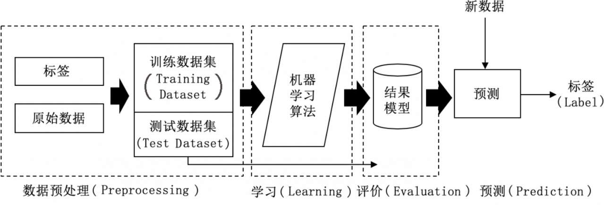
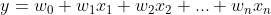

# 机器学习

## 机器学习简介

### 三个分类

- 监督学习

    > 关键点：已经有标注好的已知数据集

    > 应用场景：`预测` 和 `分类`

- 无监督学习

    > 应用场景：`聚类` 和 `降维`

- 增强学习

    > 最大的特点就是需要与环境有某种互动关系

    > 增强学习的实现和应用场景比较特殊，尽管某些大型公司已经在推荐系统、动态定价等场景中尝试应用增强学习，但仍只限于实验性质

### 机器学习应用核心开发流程

1. 数据预处理

    - 特征提取

        绝大部分机器学习算法的输入通常是某种浮点数矩阵形式或者向量形式的, 多样化的原始数据转化为符合算法数据的数据格式的步骤就叫 "特征提取"

        特征的值成为 `特征值`

        特征工程的难点在于如何从大量的特征中选择出最有效的一部分特征用于机器学习

    - 数据清洗

        数据清洗就是清理不规范的特征值， 例如，将不存在的特征设为0或取平均值，对文字形式的特征进行编码，或者对数值区间较大的特征进行归一化（Normalization）等

        数据清洗的目的是让算法训练所用的数据集尽量理想化，不包含不必要的干扰数值，从而提高模型训练的精度。

2. 学习 -- 训练阶段

    模型训练就是求解多元一次方程中的权重常量的近似值，使整体误差最小

   

3. 评价

    我们在学习阶段将误差降到足够小之后，就可以停止训练，将训练好的模型用在数据预处理阶段生成的测试数据集上验证效果

4. 预测

    在评价阶段确认模型达到了预期的准确率和覆盖率（召回率）之后，就可以将模型部署上线。
    
    在小规模研究中，我们可以直接使用训练后的模型；但在真正大流量的产品环境中，我们往往需要使用专门的模型服务框架（如`TensorFlowServing`）将模型转换为专有的格式，并在该框架下进行高效服务