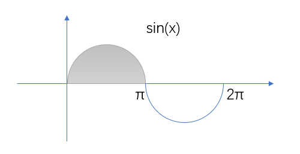
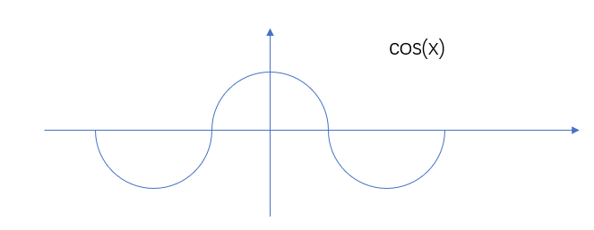

# 微积分

[微积分的本质](https://space.bilibili.com/88461692/lists/1528931?type=series)

## 微积分的本质

微积分(calculus)基本定理：某个图像下方面积函数的导数能够还原出定义这个图像的函数

圆的周长函数2πr下的面积函数就是πr²

导数(derivatives)

```tex
面积A的导数= \frac{dA}{dx} = f(x)
```

衡量的是函数对取值的微小变化有多敏感

积分 integral 

某个图像下的面积函数的导数能够还原出定义这个图像的函数

积分和导数是对互逆的运算 

导数不是测量瞬时变化率，而是其变化率的最佳近似

用几何来求导

导数的本质是看某个量的微小变化以及它和它所导致的另一个量的微小变化有什么关系

!> 微小变化量才是导数的本质

## 函数组合的导数

函数组合的三种关系：加、乘、复合

求两个函数的组合的导数.

加法：
```tex
\frac{d}{dx}(g(x)+h(x))=\frac{dg}{dx}+\frac{dh}{dx}
```

如果你要处理两个东西的乘积，通过面积来理解会有好处

乘法：左乘右导 + 右乘左导
```tex
\frac{d}{dx}(g(x)\cdot h(x))=g(x)\frac{dh}{dx}+h(x)\frac{dg}{dx}
```

复合：几何上可以用多个数轴来表达
```tex
\frac{d}{dx}g(h(x))=\frac{dg}{dh}(h(x))\frac{dh}{dx}(x)
```
链式法则 递归    
Chain rule
```tex
\frac{d}{dx}g(h(x))=\frac{dg}{dh}\frac{dh}{dx}=\frac{dg}{dx}
```

## 指数函数的求导

```tex
\frac{d}{dt}(e^t) = e^t \\
2^t = e^{\ln 2^t} \\
2^t = (e^{\ln 2})^t = e^{\ln 2 \cdot t} \\
\frac{d}{dt}(e^{\ln 2 \cdot t}) = e^{\ln 2 \cdot t} \cdot \ln 2  = \ln 2 \cdot 2^t \\
\frac{d}{dt} a^t = \ln a \cdot a^t \\
\frac{dM}{dt} = (1 + r)M \to M(t) = e^{(1 + r)t} \\
可以通过变化率得到原函数
```

## 隐函数的求导 


> 用梯子来理解

Related rates
相关变化率

x(t)² + y(t)² = 5²

```tex
\frac{d(x(t)^2 + y(t)^2)}{dt} = 0 \\ 
```

```tex
2x(t)\frac{dx}{dt} + 2y(t)\frac{dy}{dt} = 0 \\ 
```

```tex
\frac{dy}{dx} = -\frac{x}{y} \\ 
```

计算等式两边的微小变化量.

```tex
\sin(x)y^2 = x \\
\sin(x)(2ydy) + y^2(\cos(x)dx) = dx
```

> 两边同时求导

多元微积分.

```tex
y = \ln(x) \\
e^y = x \\ 
e^y dy = dx \\ 
\frac{dy}{dx} = e^{-y} = e^{-\ln x} = x^{-1}
```

## 极限

```tex
\frac{df}{dx}(2) = \lim_{h \to 0} \frac{f(2 + h) - f(2)}{h}
```

> 这是导数的正式定义

```tex
\lim_{x \to a} \frac{f(x)}{g(x)} = \frac{\frac{df(a)}{dx} dx}{\frac{dg(a)}{dx} dx}
```

计算某些`0/0`型的极限时，可以对分子分母分别求导，然后再把那个数代入 

!> 这就是洛必达法则

## 积分与微积分基本定理

积分其实是求导的逆运算
 
`v(t)`的积分:

```tex
\int_{0}^{8} v(t) dt \\ 
\int_{0}^{8} t(8 - t) dt = (4t^2 - \frac{1}{3}t^3)\big|_{0}^{8} = (4\times8^2 - \frac{1}{3}\times8^3) - (4\times0^2 - \frac{1}{3}\times0^3) \\ 
```

微积分基本定理

```tex
\frac{dF}{dx}(x) = f(x) \\ 
\int_{a}^{b} f(x) dx = F(b) - F(a)
```

## 面积和斜率有什么联系



```tex
Average\ height = \frac{Area}{Width} = \frac{\int_{0}^{\pi} \sin x dx}{\pi}
```

平均高度=面积/宽度

计算任意函数f(x)的积分，归根结底就是寻找f(x)的原函数，一般用大写的F(x)表示

当你求解连续函数的平均值，转化为求解另一个函数在该区间的平均斜率。你可以仅查看起点和终点，而不用去考虑任何中间点

两点之间的平均斜率就是两点之间的连线

```tex
\sum \leftrightarrow \int
```

有限 无限

## 高阶导数

二阶导数：斜率的斜率（斜率的变化率）

```tex
\frac{d}{dx}\left( \frac{dt}{dx} \right) 
```

简写为 

```tex
\frac{d}{dx}\frac{dt}{dx} \Rightarrow \frac{d^2t}{dx^2}
```

距离→速度→加速度

!> 高阶导数最大的作用就是帮助我们得到函数的近似

## **泰勒级数**

!> 泰勒级数是在函数学中极其强大的函数近似工具。

学习泰勒级数，主要就是为了在某个点附近用多项式函数去近似其他函数

多项式函数很友好,好计算、好求导、好积分。

比如近似`cos(x)`:



用二次多项式近似：

```tex
P(x) = C_0 + C_1 x + C_2 x^2
```

近似`x=0`，`cos(0)=1`，所以

```tex
P(0) = C_0 + C_1 \times 0 + C_2 \times 0^2 = C_0 = 1
```

导数`-sin(0)=0`，所以

```tex
P'(x) = C_1 + 2C_2 \times 0 = C_1 = 0
```

二阶导数`-cos(0)=-1`，所以

```tex
P''(x) = 2C_2 = -1
```

即

```tex
C_2 = -\frac{1}{2}
```

因此

```tex
P(x) = 1 + 0 \times x + (-\frac{1}{2})x^2 = 1 - \frac{1}{2}x^2
```

!> x^n项对应的系数就是对应函数在x=0时的函数的n阶导数的值再除以n!

泰勒多项式的一般形式：

```tex
P(x) = f(0) + \frac{df}{dx}(0)\frac{(x)}{1!} + \frac{d^2f}{dx^2}(0)\frac{(x)^2}{2!} + \dots
```

如果要近似a=0点的概念，例如a=0，就可以用(x-a)来改写，即x。

```tex
P(x) = f(a) + \frac{df}{dx}(a)\frac{(x-a)}{1!} + \frac{d^2f}{dx^2}(a)\frac{(x-a)^2}{2!} + \dots
```


泰勒多项式累加无限多项就叫泰勒级数

无穷级数, 要看能否收敛，不行就是发散的。

用来近似原始函数的那个点周围能够让多项式的和收敛的最大取值范围称作这个泰勒级数的收敛半径

## References

- [微积分的本质](https://www.bilibili.com/video/BV1qW411N7FU)
- [你也能懂的微积分](https://zhuanlan.zhihu.com/p/94592123)
