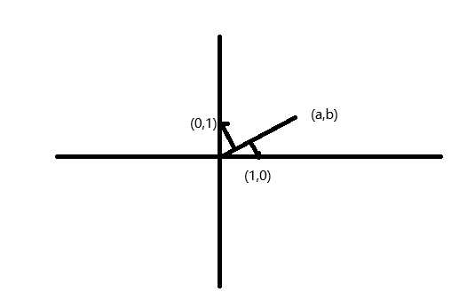
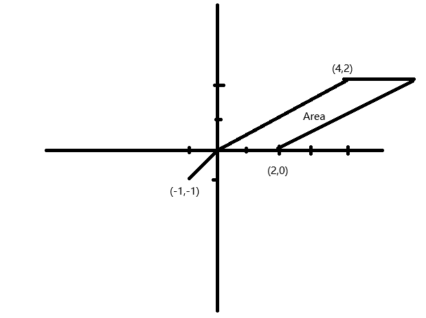

# 线性代数

[线性代数的本质](https://www.bilibili.com/video/BV1ys411472E/)

## 向量

从计算机科学的角度，向量是一个数字的序列

从物理学的角度，向量是一个有方向有长度的量

从数学的角度，要抽象概括上面两种角度，定义了向量要支持有意义的加法和数乘。

通过坐标系建立多种观点之间的联系： 向量是一个起始点在坐标原点，有方向有长度的箭头；也可以用箭头终点的坐标来表示向量。

向量可以分解为在每个 axis 上的移动的组合

向量的基本运算：加法和数乘

向量的加法就是向量移动的组合

向量的数乘可以理解为向量的缩放

线性代数的魅力在于空间箭头与数字序列的转换，例如数据的可视化；空间的变化可以通过转换成数列用计算机来计算。

向量相加就是将被加向量的起点平移到另一个向量的终点，这时被加向量的终点的坐标就是相加得到的向量，从几何意义上，就是按向量的方向和长度移动了两次。

计算：向量(a,b)可以看做是从原点往x轴移动a距离，然后往y轴移动b距离得到；如果加上(c,d)，那就是再往x轴移动c距离，往y轴移动d距离，因此一共往x轴移动了a+c距离，往y轴移动了b+d距离，最后到达的坐标是(a+c,b+d)，这就是向量加法的坐标计算。

> 向量一般习惯书写为列向量

向量的数乘，就是多个相同向量相加，由于方向相同，拼接后就是往同一个方向加长度，计算上也就是把x轴和y轴坐标加上多次，即 `3(a,b) = (3a,3b)`

> 数乘在几何上就是向量的缩放。

## 线性组合、张成的空间与基

核心概念：

单位向量（unit vector）

坐标系（coordinate system）

基向量（basic vector）：在一般的二维坐标系中，(0,1) 和 (1,0) 就是两个基向量

坐标的数字称为标量（scalar），坐标可以看作是标量对 basic vector 进行缩放和组合。

通过 basic vector 可以构建整个坐标系，选择不同的 basic vector 可以得到不同的坐标系

当用数字描述向量时，依赖于正在使用的基。

两个向量的线性组合（Linear combination）：两个向量的数乘相加

> 线性的理解：固定其中一个 scalar，变化另一个，得到一条直线

```tex
\vec{v} 与 \vec{w} 全部线性组合构成的向量集合称为张成的空间（span）
```

vector 与 point，当箭头表达在页面过于繁琐，可以用点表示

线性相关（Linear dependent）：一个向量可以表达为其它向量的线性组合。反之就是线性无关。

空间的基：张成该空间的一个线性无关向量的集合。

## 矩阵与线性变换（Linear transformation）

transformation 本质上就是个 function，input 是一个 vector，output 一个新的 vector

> 使用 transformation 这个词是因为更好地表达出一个 vector move 到新的 vector

线性变换：保持网格线平行且等距分布，并且保持原点不动

线性变换是操纵空间的一种手段。

空间中的向量可以看作是基向量的线性组合，经过线性变换后，仍然是相同的线性组合，因此可以通过变换后基向量的坐标得到所有其它向量的新坐标。

变换后的基向量可以写成矩阵的形式

```tex
\begin{bmatrix} a & c \\ b & d \end{bmatrix} \begin{bmatrix} x \\ y \end{bmatrix}
= x \begin{bmatrix} a \\ b \end{bmatrix} + y \begin{bmatrix} c \\ d \end{bmatrix}
= \begin{bmatrix} ax+cy \\ bx+dy \end{bmatrix}
```

线性变换可以用一组数字表达，这组数字每列就是变换后的基向量。

矩阵向量乘法就是计算线性变换作用于给定向量的一种途径。

看到一个矩阵，都可以解读为对空间的一种特定变换。

## 矩阵乘法与线性变换复合

复合的线性变换：

```tex
\begin{bmatrix} 0 & 2 \\ 1 & 0 \end{bmatrix} ( \begin{bmatrix} 1 & -2 \\ -2 & 0 \end{bmatrix} \begin{bmatrix} x \\ y \end{bmatrix} )
```

等同于单一最终的基向量变换

```tex
\begin{bmatrix} 2 & 0 \\ 1 & -2 \end{bmatrix} \begin{bmatrix} x \\ y \end{bmatrix}
```

也就是

```tex
\begin{bmatrix} 0 & 2 \\ 1 & 0 \end{bmatrix} \begin{bmatrix} 0 & -2 \\ 1 & 0 \end{bmatrix} = \begin{bmatrix} 2 & 0 \\ 1 & -2 \end{bmatrix}
```

可以理解从右到左的基向量的线性变换

通过空间的想象可以知道矩阵乘法不支持交换律，但是支持结合律

矩阵乘法 = 线性变换的复合

## 行列式（determinant）

行列式就是对空间的缩放比例

计算基向量变换后的面积/体积的缩放比例，即可得到转换矩阵的行列式

```tex
det(\begin{bmatrix} 2 & 0 \\ 0 & 3 \end{bmatrix} = 6
```
<br/>

```tex
det(\begin{bmatrix} 1 & 1 \\ 0 & 1 \end{bmatrix} = 1
```
<br/>

```tex
det(\begin{bmatrix} 4 & 2 \\ 2 & 1 \end{bmatrix} = 0   ==> 降维
```

行列式为负数，就是把空间反转了，是否反转可以用基向量的相对方向来判断（右手法则）

行列式为0，代表降维，也表明矩阵的列是线性相关的。

矩阵乘法的行列式：

```tex
det(\mathbf{M_1} \mathbf{M_1}) = det(\mathbf{M_1}) det(\mathbf{M_2})
```

## 逆矩阵、列空间与零空间

线性方程组（Linear system of equations）：在每一个方程中，所有未知量只具有常系数，这些未知量之间只进行加法

```
2x + 5y + 3z = -3   
4x + 0y + 8z = 0  
1x + 3y + 0z = 2
```

可以换成矩阵和向量的写法

```tex
\begin{bmatrix} 2 & 5 & 3 \\ 4 & 0 & 8 \\ 1 & 3 & 0 \end{bmatrix} \begin{bmatrix} x \\ y \\ z \end{bmatrix} = \begin{bmatrix} -3 & 0 & 2 \end{bmatrix}
```

这个矩阵叫做系数矩阵

```tex
\mathbf{A} \vec{x} = \vec{v}
```
<br/>

```tex
求解 \vec{x} 经过\mathbf{A} 变换后和 \vec{v} 重叠
```

```tex
需要考虑 det(\mathbf{A}) 是否等于 0，等于 0 意味着降维，会有无数的解或者无解（\vec{v}不在降维后的空间中）; det(\mathbf{A}) != 0，有且只有一个解
```
<br/>

```tex
从 \vec{v} 反转换为 \vec{x} 的转换被称为 \mathbf{A} 的逆记为\mathbf{A^{-1}}
```

逆矩阵明显有以下特性:

```tex
\mathbf{A^{-1}} \mathbf{A} = \begin{bmatrix} 1 & 0 \\ 0 & 1 \end{bmatrix}
```

<br/>

```tex
\vec{x} = \mathbf{A^{-1}}\vec{v}
```

秩（rank）：线性变换会将空间压缩到几维，这个变换的秩就是几。

由于 det(**A**) = 0，无法区别不同程度的降维，所以引入了秩，表达变换后空间的维数。

矩阵的列空间就是矩阵的列所张成的空间，所以秩就是列空间的维数。

如果秩等于矩阵的列数，称之为满秩。

零空间就是经过变换落在原点的原向量组成的空间，det(**A**) != 0 时只有零向量会落在原点。

## 非方阵

非方阵代表升维或降维的变换

3x2矩阵表示二维的两个基向量变换成三维。但坐标表示的一个平面，本质上还是二维

2x3矩阵表示三维的三个基向量降为二维

1x2矩阵表示二维的两个基向量降成一维

## 点积（Dot product）与对偶性

```tex
\begin{bmatrix} a \\ b \end{bmatrix} \cdot \begin{bmatrix} c \\ d \end{bmatrix} = ac + bd
```

对偶性：两种数学事物之间自然而又出乎意料的对应关系

两个向量的点积：几何上，就是一个向量向另一个向量的投影的长度与另一个向量的长度的乘积，方向相反时为负数。

```tex
\vec{v} \cdot \vec{w} = |v||w|cos\theta
```

> 点积方便检验两个向量的指向是否相同

点积和线性变换存在某种关联：

```tex
\begin{bmatrix} a \\ b \end{bmatrix} \cdot \begin{bmatrix} c \\ d \end{bmatrix} = ac + bd
```

<br/>

```tex
\begin{bmatrix} a & b \end{bmatrix} \cdot \begin{bmatrix} c \\ d \end{bmatrix} = ac + bd
```



```tex
可以理解为基向量向\vec{v}的投影乘以|\vec{v}|的长度作为变换后的坐标，这个变换刚好就是 \vec{v} 的坐标的转置 \begin{bmatrix} a & b \end{bmatrix}
```

根据对偶性，每个向量都对应着一种线性变换，向量就是线性变换

## 叉积（cross product）

两个二维向量的叉积: 两个向量组成的平行四边形的面积。方向主要看两个向量的相对方向是否和基向量一致。

和面积相关可以联想到行列式：线性变换后面积的缩放比例

基向量组成的面积是 1，变换后的面积就是行列式的大小。

所以两个向量组成的面积可以看作是基向量变换到这两个向量的线性变换的行列式。

```tex
\begin{bmatrix} a \\ b \end{bmatrix} x \begin{bmatrix} c \\ d \end{bmatrix} = det(\begin{bmatrix} a & c \\ b & d \end{bmatrix})
```

两个三维向量的叉积：向量组成的平行四边形的面积作为长度，与平行四边形垂直（右手法则）的一个三维向量

```tex
\vec{v} x \vec{w} = \vec{p}
```

<br/>

```tex
\begin{bmatrix} v_1 \\ v_2 \\ v3 \end{bmatrix} x \begin{bmatrix} w_1 \\ w_2 \\ w_3 \end{bmatrix} = det(\begin{bmatrix} \vec{i} & v_1 & w_1 \\ \vec{j} & v_2 & w_2 \\ \vec{k} & v_3 & w_3 \end{bmatrix})
= \vec{i}(v_2 w_3 - v_3 w_2) + \vec{j}(v_3 w_1 - v_1 w_3) + \vec{k}(v_1 w_3 - v_2 w_3)
= \begin{bmatrix} v_2 w_3 - v_3 v_2 \\ v_3 w_1 - v_1 w_3 \\ v_1 w_3 - v_2 w_1 \end{bmatrix}
```

从二维的叉乘推到三维

```tex
\begin{bmatrix} u_1 \\ u_2 \\ u_3 \end{bmatrix} x \begin{bmatrix} v_1 \\ v_2 \\ v_3 \end{bmatrix} x \begin{bmatrix} w_1 \\ w_2 \\ w_3 \end{bmatrix} 
= det(\begin{bmatrix} u_1 & v_1 & w_1 \\ u_2 & v_2 & w_2 \\ u_3 & v_3 & w_3 \end{bmatrix})
```

<br/>

```tex
把 \vec{u} 设为未知数
```

<br/>

```tex
\begin{bmatrix} x_1 \\ x_2 \\ x_3 \end{bmatrix} x \begin{bmatrix} v_1 \\ v_2 \\ v_3 \end{bmatrix} x \begin{bmatrix} w_1 \\ w_2 \\ w_3 \end{bmatrix}
= det(\begin{bmatrix} x_1 & v_1 & w_1 \\ x_2 & v_2 & w_2 \\ x_3 & v_3 & w_3 \end{bmatrix})
```

```tex
把 \vec{v} x \vec{w} 看作一个整体要求解的线性变换，它将 \vec{x} 降到一维，这个线性变换对应某个向量。
```

```tex
\begin{bmatrix} p_1 \\ p_2 \\ p_3 \end{bmatrix} \cdot \begin{bmatrix} x_1 \\ x_2 \\ x_3 \end{bmatrix}
= det(\begin{bmatrix} x_1 & v_1 & w_1 \\ x_2 & v_2 & w_2 \\ x_3 & v_3 & w_3 \end{bmatrix})

p_1 x_1 + p_2 x_2 + p_3 x_3 = x_1(v_2 w_3 - v_3 w_2) + x_2(v_3 w_1 - v_1 w_3) + x_3(v_1 w_2 - v_2 w_1)

p_1 = v_2 w_3 - v_3 w_2

p_2 = v_3 w_1 - v_1 w_3

p_3 = v_1 w_2 - v_2 w_1
```

```tex
从几何上，\vec{p} \cdot \vec{x} 可看作 \vec{x} 在 \vec{p} 上的投影长度乘以 \vec{p} 的长度，而 \vec{x} \vec{v} \vec{w} 的行列式是组成的平行六面体的体积，这个体积以 \vec{v} \vec{w} 组成的平行四边形的面积为底，\vec{x} 到平行四边形的垂直向量的投影为高，推论可得 \vec{p} 的长度等于 \vec{v} \vec{w} 的面积，方向垂直于 \vec{v} \vec{w} 的平面。
```

## 基变换

如何在不同的坐标系之间进行转换

```tex
假设取另一组基向量 \vec{v} 和 \vec{w}，在这个坐标系中的一个向量 \begin{bmatrix} a \\ b \end{bmatrix} , 可以表达为 a \vec{v} + b \vec{w} = a \begin{bmatrix} v_1 \\ v_2 \end{bmatrix} + b \begin{bmatrix} w_1 \\ w_2 \end{bmatrix} = \begin{bmatrix} v_1 & w_1 \\ v_2 & w_2 \end{bmatrix} \begin{bmatrix} a \\ b \end{bmatrix}
```

所以在原坐标系视角中还是同一个坐标经过，基向量的线性变换后得到的新坐标就是原视角下该向量的坐标

相同的原坐标系下的某个向量在新坐标系中的坐标可以通逆转换来得到

```tex
\begin{bmatrix} v_1 & w_1 \\ v_2 & w_2 \end{bmatrix}^{-1} \begin{bmatrix} a \\ b \end{bmatrix}
\\
```

```tex
原坐标系的某个线性变换对应新坐标系的另一个线性变换，新坐标系的某个坐标 
\begin{bmatrix} a \\ b \end{bmatrix}
\\
```

```tex
\begin{bmatrix} v_1 & w_1 \\ v_2 & w_2 \end{bmatrix}^{-1} \begin{bmatrix} i_1 & j_1 \\ i_2 & j_2 \end{bmatrix} \begin{bmatrix} v_1 & w_1 \\ v_2 & w_2 \end{bmatrix} \begin{bmatrix} a \\ b \end{bmatrix}
\\
转换B语言<--A转换<--转换A表述（基变换矩阵）<--B语言
```

总的来说，当看到这样的表达式:

```tex
A^{-1}MA
```

代表于 A 基变换视角下，M 转换的新表达

## 特征向量与特征值

变换前和变换后共线的向量称为该变换的特征向量，拉伸成压缩的比例称为特征值。

```tex
A\vec{v} = \lambda\vec{v} -> 特征向量
```
变换矩阵    特征值

```tex
A\vec{v} = (\lambda I)\vec{v} 
```

<br/>

```tex
(A - \lambda I) \vec{v} = \vec{0}
```

<br/>

```tex
det(A - \lambda I) = 0
\\
求解出 \lambda
\\
\vec{v} = (A - \lambda I)^{-1} \vec{0}
\\
求解出 \vec{v}
```

不是所有的线性变换都有特征向量和特征值。（比如旋转90°）

```tex
对角矩阵 \begin{bmatrix} a & 0 \\ 0 & b \end{bmatrix} 表示所有基向量都是其特征向量，且对角值就是特征值。
```

<br/>

```tex
\begin{bmatrix} a & 0 \\ 0 & b \end{bmatrix} \begin{bmatrix} a & 0 \\ 0 & b \end{bmatrix} \begin{bmatrix} x \\ y \end{bmatrix} = \begin{bmatrix} a^2 x \\ b^2 y \end{bmatrix}
```

这就是矩阵的快速幂

对于不是对角矩阵的情况下可以通过基变换转换成对角矩阵：如果矩阵有两个以上非线性相关的特征向量，将基变换到这两个特征向量，这时候的变换就是

```tex
A^-1 M A = \begin{bmatrix} \lambda_1 & 0 \\ 0 & \lambda_2 \end{bmatrix}
\\
\lambda_1 和 \lambda_2 是特征值
```

这样的特征向量的基称为特征基

## 抽象向量空间

线性变换的严格定义

```tex
L(\vec{v} + \vec{w}) = L(\vec{v}) + L(\vec{w}) --> 可加性
\\
L(c\vec{v}) + cL(\vec{v})  --> 成比例
```

线性变换保持向量加法运算和数乘运算

这也是线性变换可以用基向量变换后的坐标来表示的依据

求导也是线性运算

```tex
\frac{d}{dx}(x^3+x^2) = \frac{d}{dx}x^3 + \frac{d}{dx}x^2
\\
\frac{d}{dx}(4x^3) = 4\frac{d}{dx}x^3
\\
```

可以抽象出基函数（Basic Function）的概念

```tex
\frac{d}{dx}(1x^3+5x^2+4x+5) = 3x^2+2x+4
\\
基函数
\\
b_0(x) = 1 \\
b_1(x) = x \\
b_2(x) = x^2 \\
b_3(x) = x^3 \\

\begin{bmatrix} 0 & 1 & 0 & 0 \\ 0 & 0 & 2 & 0 \\ 0 & 0 & 0 & 3 \\ 0 & 0 & 0 & 0 \end{bmatrix} \begin{bmatrix} 5 \\ 4 \\ 5 \\ 1 \end{bmatrix} = \begin{bmatrix} 1 \cdot 4 \\ 2 \cdot 5 \\ 3 \cdot 1 \\ 0 \end{bmatrix} \\
```

这个矩阵的构建方法：求每个基函数的导数，然后把结果放在对应的列

这样就可以用矩阵来求导了。

线性代数中的概念都能找到函数中对应的概念

```
Linear transformation 线性变换 --> Linear operators 线性算子
Dot product 点积 --> Inner products 内积
Eigenvectors 特征向量 --> Eigenfunctions 特征函数
```

什么是向量？

箭头、一组数、函数等等都无所谓，可以是任何东西，只要支持向量相加和数乘即可。

!> 大道至简

## 克莱姆法则--几何解释

```tex
\begin{bmatrix} 2 & -1 \\ 0 & -1 \end{bmatrix} \begin{bmatrix} x \\ y \end{bmatrix} = \begin{bmatrix} 4 \\ 2 \end{bmatrix}
```



```tex
Area = det(A) y --> 原来向量与x轴基向量的面积
\\
y = \frac{Area}{det(A)} = \frac{det(\begin{bmatrix} 2 & 4 \\ 0 & 2 \end{bmatrix})}{det(\begin{bmatrix} 2 & -1 \\ 0 & -1 \end{bmatrix})}
```

