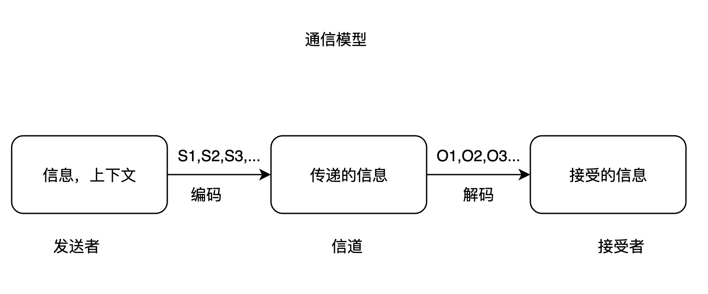
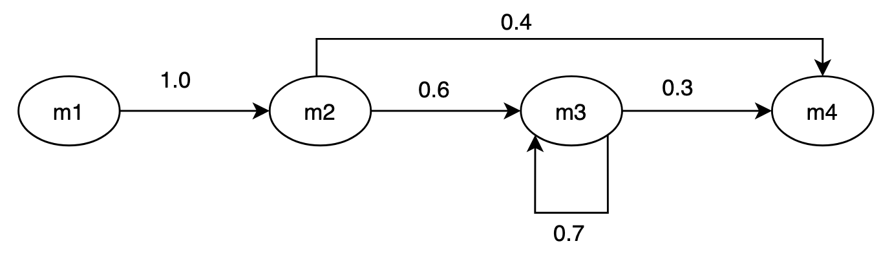
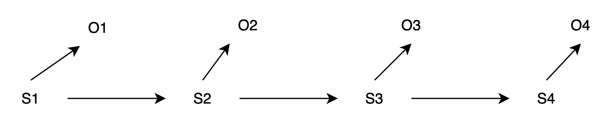

# 数学之美

## 文字和语言 vs 数字和信息

不同的文字系统在记录信息上的能力是等价的

文字只是信息的载体，而非信息的本身

破解无人能懂的语言 依靠于 不同的文字记载同一件事，即双语或多语的对照语料

信息量的增加引起 声音 → 语言 → 文字

财产的增加 → 数字

文字大多会记不住，所以文字的数量是有限的，就出现了多义字，需要根据上下文才能知道正确的含义。

象形文字 → 拼音文字

形状 -编码-> 抽象

常用字短/笔画少, 生僻字长/笔画多 (信息论的最短编码原理)

如何保证抄写的正确性 — 校验位（每个字母映射一个数字，每行或每列字母相加，得到校验位）

语法 — 语言的编码和解码的规则

## 自然语言处理——从规则到统计

字母（笔画）、文字、数字 是信息编码的不同单位

任何一种语言都是一种编码方式

规则：句法分析（Parse Tree）  语义分析

编程语言：上下文无关文法（O(n²)）

自然语言：上下文有关文法（O(n⁶)）

## 统计语言模型

一个句子是否合理，就看它的可能性大小如何

```tex
P(S) = P(w_1, w_2, \dots, w_n)
= P(w_1) \cdot P(w_2|w_1) \cdot P(w_3|w_1,w_2) \cdot \dots \cdot P(w_n|w_1,w_2 \dots w_{n-1}) 
```

马尔可夫（Andrey Markov）假设：任意一个词 `w_i` 出现的概率，只同它前面的词 `w_{i-1}` 有关 

```tex
P(S) = P(w_1) \cdot P(w_2|w_1) \cdot P(w_3|w_2) \dots P(w_i|w_{i-1}) \dots P(w_n|w_{n-1})
```

```tex
P(w_i|w_{i-1}) = \dfrac{P(w_{i-1},w_i)}{P(w_{i-1})}
```

通过统计 `w_{i-1},w_i` 前后相邻出现的次数和 `w_{i-1}` 出现的次数，只要统计量足够，就可以得到接近真实的概率

这称为 Bigram Model（二元模型），也可以假设一个词由前面$N-1$个词决定，称为**N元模型**

N-1 阶马尔可夫假设:

```tex
P(w_i|w_1,w_2,\dots,w_{i-1}) = P(w_i|w_{i-N+1},w_{i-N+2},\dots,w_{i-1})
```

实际中使用的最多是N=3，N元模型的大小是N的指数函数
```tex
O(|V|^N)
```
`|V|`是语言的词汇量，一般是几万到几十万个。
随着`N`的增长，资源耗费增长非常快，目前最大是4元模型

在自然语言中，上下文之间的相关性跨度非常大，甚至可以从一个段落跨到另一个段落。模型的阶数很难提高到这种程度，这就是马尔可夫假设的局限性。

零概率问题：
```tex
\#(w_{i-1},w) = 0
```

古德-图灵估计：对于没有看见的事件，不能认为它发生的概率就是零，要从概率的总量中分配一个很小的概率给这些事件。这样，看得见的和没看见的事件的概率总和就要等于1。

```tex
N = \sum_{r=0}^{\infty} r \cdot N_r（出现 r 次的词有 N_r 个）\\
→ d_r = (r+1) \cdot N_{r+1}/N_r （使用 d_r 取代 r ）\\
\sum d_r \cdot N_r = N \\

Zipf定律：出现次数越少的词的数量更多，即 N_r > N_{r+1}
一般情况下，d_r < r，而d_0>0，这样，未出现的词就赋予了一个很小的非零值。
```

## 分词

中文分词：  
最简单的方法：查字典、最长匹配、最少词数
> 无法解决分词的二义性问题

统计方法：计算每种分词可能的概率，取概率最大的那种
可以通过动态规划解决遍历穷举所有可能的分词方法（维特比算法）

通过统计方法，中文分词已经是被解决了的问题，提高的空间微乎其微

词的颗粒度问题：不同场景采用不同的颗粒度。翻译场景用大颗粒度，搜索场景用小颗粒度

## 隐马尔可夫模型

### 通信模型

通信模型流程：



几乎所有的自然语言处理问题都可以等价成通信的解码问题

```tex
S_1,S_2,S_3 = \underset{all\ s_1s_2s_3...}{ArgMax}\ P(S_1,S_2,S_3,\dots | O_1,O_2,O_3,\dots)
```

贝叶斯公式变换：
```tex
\frac{P(O_1,O_2,O_3,\dots | S_1,S_2,S_3,\dots) \cdot P(S_1,S_2,S_3,\dots)}{P(O_1,O_2,O_3,\dots)}
```

```tex
由于P(O_1,O_2,O_3,\dots)可以约去，则等价于：
P(O_1,O_2,O_3,\dots | S_1,S_2,S_3,\dots) \cdot P(S_1,S_2,S_3,\dots)
```

### 隐马尔可夫模型

对随机变量的时间序列 `S_1, S_2, S_3, ..., S_t, ...` 的概率分布研究。
马尔可夫假设(近似解)：
```tex
(S_t | S_1, S_2, \dots, S_{t-1}) = P(S_t | S_{t-1})
```
符合这个假设的随机过程称为**马尔可夫过程**，也称为**马尔可夫链**：



#### 隐马尔可夫模型（扩展）
无法观测到状态序列 `S_1, S_2, S_3, ..., S_T`，但每个时刻会输出一个符号 `O_t`，且 `O_t` 仅跟当前状态 `S_t` 相关。



联合概率公式：
```tex
P(S_1,S_2,S_3,\dots,O_1,O_2,O_3,\dots) = \prod_{t} P(S_t|S_{t-1}) \cdot P(O_t|S_t) \quad \text{式1}
```

其中：
- 观测概率：
```tex
P(O_1,O_2,O_3,\dots | S_1,S_2,S_3,\dots) = \prod_{t} P(O_t|S_t)
```
- 状态序列概率：
```tex
P(S_1,S_2,S_3,\dots) = \prod_{t} P(S_t|S_{t-1})
```

将上述两部分代入通信模型，即可得到式1，因此**通信的解码问题可以用隐马尔可夫模型来解决**。

如何找到上述式子的最大值 → **维特比算法**。

### 隐马尔可夫模型的训练
如何估计模型的参数：

1.  **公式1（输出概率）**
    ```tex
    P(O_t|S_t) = \dfrac{P(O_t,S_t)}{P(S_t)}
    ```

2.  **公式2（转移概率）**
    ```tex
    P(S_t|S_{t-1}) = \dfrac{P(S_{t-1},S_t)}{P(S_{t-1})}
    ```

```tex
P(O_t|S_t) \approx \dfrac{\#(O_t,S_t)}{\#(S_t)} （需要人工标注，有监督训练） \\
```

```tex
P(S_t|S_{t-1}) \approx \dfrac{\#(S_{t-1},S_t)}{\#(S_{t-1})} （无监督训练）
```

人工标注成本高，更实用的方法是仅通过大量观测到的信号`O_1,O_2,O_3...`就能推算模型参数`P(S_t|S_{t-1})`和`P(O_t|S_t)`，主要使用的是**鲍姆-韦尔奇算法（Baum-Welch Algorithm）**

首先找到一组能够产生序列`O`的模型参数，这个初始模型，记为`M_0`。
计算出这个模型产生`O`的概率`P(O|M_0)`，再找出产出`O`的所有可能的路径及其概率，将这些数据看作是“标准的数对”。
再根据上面的公式1和2，计算出一组新的模型参数`M_1`。
这个过程称为一次迭代，可以证明 `P(O|M_1) > P(O|M_0)`。
不断迭代，直到模型的质量不再有明显的提高。
可以找出一个局部最优解。

## 信息的度量和作用

如何度量信息的多少 → 信息熵（Entropy）

对于任意一个随机变量 `X`（比如得到冠军的球队），熵的定义：
```tex
H(X) = -\sum_{x \in X} P(x) \log P(x)
```
信息量的单位可以用比特（Bit）
信息量 = 不确定性的多少（不确定性）

信息是消除系统不确定性的唯一方法（没有任何信息，系统就是黑盒）

为什么这些相关的信息能够消除不确定性 → 条件熵的概念（Conditional Entropy）

`X,Y` 两个随机变量，`X` 是需要了解的，如果知道 `X` 的随机分布，也就知道 `X` 的熵：
```tex
H(X) = -\sum_{x \in X} P(x) \cdot \log P(x)
```

如果知道 `Y` 的一些情况，包括它和 `X` 一起出现的概率（数学上叫联合概率分布），以及在 `Y` 取不同值时 `X` 的概率分布（数学上叫条件概率分布），定义在 `Y` 的条件下的条件熵为：
```tex
H(X|Y) = -\sum_{x \in X, y \in Y} P(x,y) \log P(x|y)
```

信息的作用在于消除不确定性

互信息（Mutual Information）
定义：度量两个随机事件的相关性

定义：
```tex
I(X;Y) = \sum_{x \in X, y \in Y} P(x,y) \log \frac{P(x,y)}{P(x)P(y)} \\
↓ \\
I(X;Y) = H(X) - H(X|Y)
```

当 `X` 和 `Y` 完全相关时，`I(X;Y)=H(X)`；完全无关时，`I(X;Y)=0`。

可以用于解决机器翻译的二义性问题：
首先从大量文本中找出和要翻译的词的多种含义一起出现互信息最大的一些词，翻译时，看上下文中哪类相关的词多就可以了。

Kullback 和 Leibler 提出
相对熵：衡量两个取值为正数的函数的相关性，定义：
```tex
KL(f(x)||g(x)) = \sum_{x \in X} f(x) \cdot \log \frac{f(x)}{g(x)}
```

1.  对于两个完全相同的函数，相对熵为零。
2.  相对熵越大，差异越大。
3.  对于概率分布或者概率密度函数，如果取值均大于零，相对熵可以度量两个随机分布的差异性。

相对熵是不对称的：
```tex
KL(f(x)||g(x)) \neq KL(g(x)||f(x))
```

对称的新计算方法(由詹森和香农提出)：
```tex
JS(f(x)||g(x)) = \frac{1}{2} \left[ KL(f(x)||g(x)) + KL(g(x)||f(x)) \right]
```

相对熵可以用于衡量两个信息的差异  
自然语言处理里，可以衡量文章词频分布的相似性
→  TF-IDF