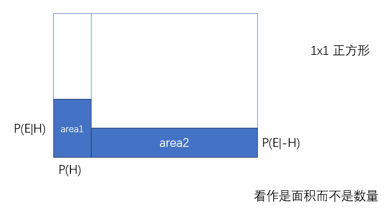
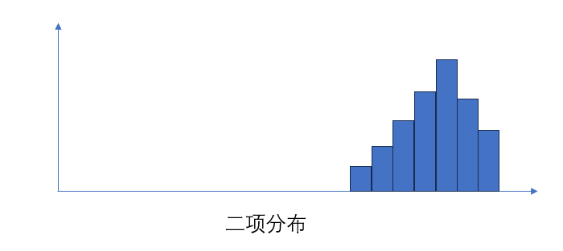
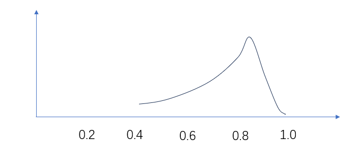

# 概率统计

## 贝叶斯定理（Bayes theorem)

```tex
P(H|E) = \frac{P(H) \cdot P(E|H)}{P(E)}
```

!> 贝叶斯定理最根本的结论：新证据不能直接凭空的决定你的看法，而是应该更新你的先验看法（之前的经验）



任何事件都对应概率空间的一个子集，并且事件发生的概率就是子集的面积

后验概率(posterior)
```tex
P(H|E) = \frac{area1}{area1 + area2}
= \frac{P(H) \cdot P(E|H)}{P(H) \cdot P(E|H) + P(\neg H)P(E|\neg H)}
= \frac{P(H) \cdot P(E|H)}{P(E)} 
```

> P(E|H) 称为似然概率(likelihoods)

把贝叶斯定理看作是一个关于比例的表述

```tex
× P(A \text{ and } B) = P(A)P(B) “独立事件才成立”）\\
\\
√ P(A \text{ and } B) = P(A)P(B|A) 
```

贝叶斯定理只有在非独立事件下才有意义，精准衡量一个变量多大程度依赖另一个变量

## 二项分布 Binomial distributions

概率的概率

已知某个商品的真实好评率是0.95,那么在50个评论中出现48个好评的概率是多少。

可以使用计算机进行随机模拟。

```tex
P(48V,2X|s=0.95)=\binom{50}{48}(0.95)^{48}(1 - 0.95)^2
=\frac{50!}{48!(50 - 48)!}(0.95)^{48}(1 - 0.95)^2
= 0.26110
```



可以得到，在给定了成功率后，看到目前好评率数据的概率

反过来，给定了我们看到的好评率数据之后,如何得到不同成功率的概率

可以修改 s=0.95的值，以0.01的步长进行变化，计算每个s的P(48V,2X|p)概率概率作为y



可得新的分布。这就是真实成功率的分布概率

But we want

p(data|success rate) ——> p(success rate|data)

真实概率和观察数据之间的关系

数据：抛10次硬币，7次正面朝上    
求解：真正的正面朝上的概率，记P(H)

P(P(H)=0.7)  

这就是概率的概率(Probabilities of Probabilities)
