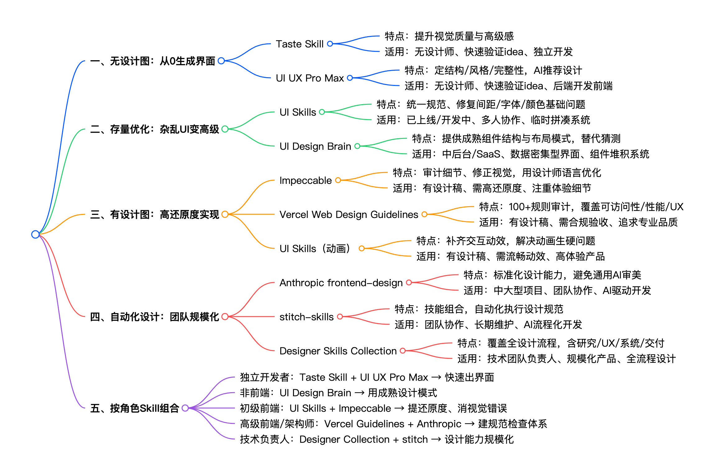

# Skills

## Skill 撰写指南（How to write great skill）

what makes a skill great

### Trigger

Decide if your skill is user-invoked or model-invoked?

Model-invoked 的缺点：
1. Context Load，Description 占用上下文
2. 有概率调用不到

> context pointer：description 就是 skill 在 llm context 中的 pointer

User-invoked 的缺点：
1. 认知负载重。需要深入理解Skill，才能最大限度地使用

### Structure

### Steering

### Pruning

## Design Skills

[程序员必备的 Design Skills](https://mp.weixin.qq.com/s/BkReBmLwipxyYNfU-UmyHw?token=1118830042&lang=zh_CN):

## Coding Skills

### 代码阅读

[codebase-to-course](https://github.com/zarazhangrui/codebase-to-course)

### 文档

[ppt-master](https://github.com/hugohe3/ppt-master): ppt 生成器。需要 image 模型生成配图（可以用 MiniMax 的 image-01)

## References

- [Skills](http://github.com/vercel-labs/skills#readme): Skill 包管理器
