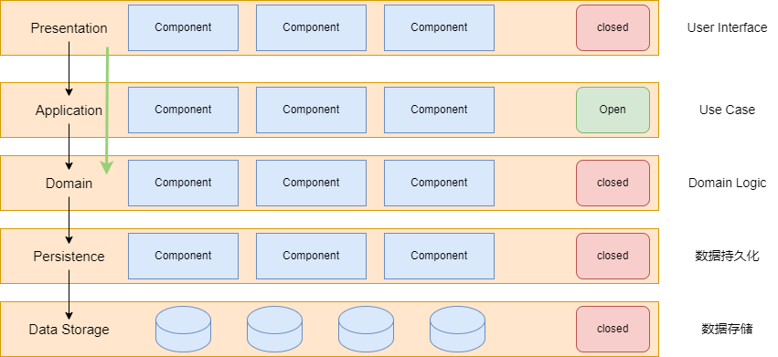

# 架构模式

## 架构模式概念介绍

### 什么是架构

架构是系统的基础组织形式。体现为其`组件`、`组件间的关系`以及`环境`。架构也是知道系统设计和演化的原则。

### 什么是架构模式

架构模式（Architecture Pattern）是软件架构领域中在给定环境下，针对常遇到的问题的、通用且可重用的解决方案。

#### 为什么要学习架构模式

- 学习前人经验和智慧的结晶
- 掌握专业术语，便于同行交流和信息检索
- 提升团队协作效率

#### 相关概念

- 架构模式与设计模式

    设计模式粒度比较细，关注于几个类之间的关系，而架构模式关注的粒度更粗，关注模块与模块之间的关系。

- 架构模式与架构风格

    存在一定差异，但是经常混用，不好区分，一般当成相同概念，建议优先使用架构模式。

### 架构模式分类

- 应用蓝图架构（进程间架构）
- 应用内部结构架构（进程内架构）
- UI 架构

## 典型架构模式详解

### 进程间架构

#### Monolith（单体）

所有应用文件打包在一起，一起部署，一般也是一个进程。

优点：

- 简单、易于理解、实现和测试
- 易于重构
- 易于部署

缺点：

- 紧耦合，容易架构腐化
- 技术绑定
- 不易水平扩展
- 内部依赖复杂，很容易形成反模式：大泥球架构

#### N-tier（N 层架构）

N-tier 架构不同于常说的分层架构，N-tier 架构强制每一层都出于不同的进程中。

优点：

- 每一层都可以独立开发和部署
- 每一层都可以独立水平扩展

缺点：

- 变化总是影响多个层
- 物理分层带来的成本和风险上升

#### Peer-to-Peer（P2P 架构）

特征：

- 无中心服务器
- 不需持续连接
- 可动态发现节点

用于分享：

- 算力
- 数据
- 存储
- 带宽

典型的案例：

- BitTorrent
- Skype
- 比特币

优点：

- 经济
- 没有单点故障
- 易于弹性伸缩
- 难以攻击整体

缺点：
- 节点安全问题
- 信息安全隐患
- 节点耗能问题

#### Microservices（微服务架构）

[9 大特性](https://martinfowler.com/articles/microservices.html)：

- Componentization via Services
- Organized around Business Capabilities
- Products not Projects
- Smart endpoints and dumb pipes
- Decentrlized Governance
- Decentralized Data Management
- Infrastructure Automation
- Design for failure
- Evolutionary Design

微服务的进化： Service Mesh

微服务的退形：基于服务的架构

> 可以利于这种中间态实现微服务的拆分

优点：

- 服务松耦合且易于水平扩展
- 应对变化能力更强
- 可靠性高

缺点：

- 确定边界是个持续的难题
- 开发运维成本高
- 为架构治理带来新的挑战

#### Service-Oriented（面向服务架构/SOA）

SOA 对服务的分类

优点：

- 易于复用
- 服务松耦合且易于水平扩展
- 有一定的应对变化的能力

缺点：

- 中心化管理降低团队的自主性
- 开发运维成本高

#### Serverless（无服务器架构）

最后的10%陷阱：长期来看，用户总会需要 100% 的场景被支持。被抛弃的场景总会以某种形式的需求被加回来。

优点：

- 极易水平扩展
- 维护成本极低

缺点：

- 与特定云服务提供商绑定
- 难以在内存中维持状态

### 进程内架构

#### Layered Arch（分层架构）

#### 微内核架构（插件化架构）

#### Pipeline Arch（管道架构）

