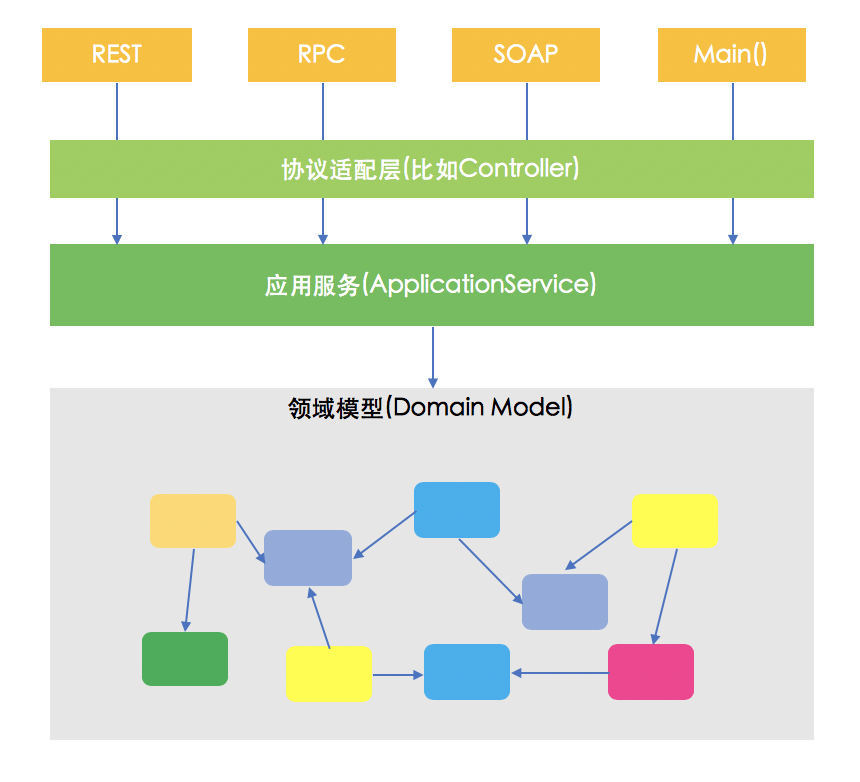
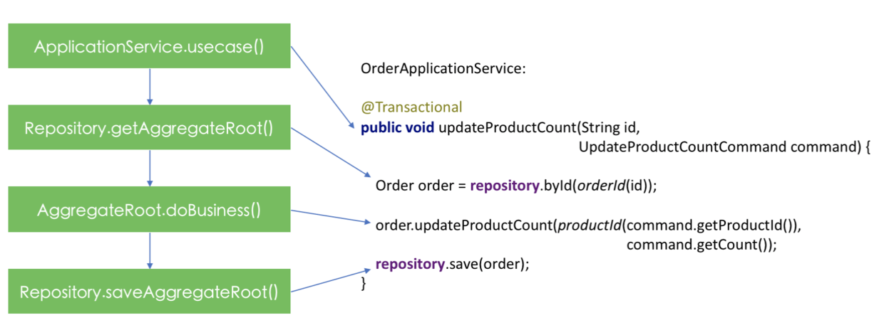

# 领域驱动开发

## 概念

### 何为 “领域驱动设计”

> 软件脱胎于领域，并跟领域密切相关

> 领域专家：该领域的工作者

构建领域知识：和领域专家交谈，问答，构建领域模型

### 通用语言

描述模型的语言

图形和文字

### 模型驱动设计的基本构成要素

> 模型的定义：对现实的有选择性的精简

- 分层架构

- 实体

- 值对象

- 服务

- 模块

    将模型分模块，可减低复杂度  
    模块划分原则：高内聚、低耦合  
    内聚：  
        - 通信性内聚：操作相同的数据
        - 功能性内聚：协同工作完成定义好的任务

- 聚合

- 工厂

- 资源库

## 编码实践

### 实现业务的 3 中常见方式

- 基于 `Service + 贫血模型` 的实现

> 目前业界的主要做法，依然是一种面向过程的编程范式, 领域对象只是数据的容器，逻辑都在 Service 中

- 基于 `事务脚本` 的实现

> 领域对象甚至都不存在，直接使用入参数据，在系统足够简单的情况下可以采用

- 基于 `领域对象` 的实现

> 逻辑写在领域对象中，充血模型

### 基于业务的分包

基于聚合根进行顶层包的划分，然后在各自的顶层包下再根据代码结构的复杂程度划分子包

```
└── product
    ├── CreateProductCommand.java
    ├── Product.java
    ├── ProductApplicationService.java
    ├── ProductController.java
    ├── ProductId.java
    ├── ProductNotFoundException.java
    ├── ProductRepository.java
    └── representation
        ├── ProductRepresentationService.java
        └── ProductSummaryRepresentation.java
```

### 门面 -- ApplicationService

作为领域模型向外提供业务功能的总出入口

在编码实现业务功能时，通常用2种工作流程：

- 自底向上：先设计数据模型，比如关系型数据库的表结构，再实现业务逻辑。我在与不同的程序员结对编程的时候，总会是听到这么一句话：“让我先把数据库表的字段设计出来吧”。这种方式将关注点优先放在了技术性的数据模型上，而不是代表业务的领域模型，是DDD之反。

- 自顶向下：拿到一个业务需求，先与客户方确定好请求数据格式，再实现 Controller 和 ApplicationService，然后实现领域模型(此时的领域模型通常已经被识别出来)，最后实现持久化。

在DDD实践中，自然应该采用自顶向下的实现方式。ApplicationService 的实现遵循一个很简单的原则，即一个业务用例对应 ApplicationService 上的一个业务方法



### 业务的载体 -- 聚合根

聚合根(Aggreate Root, AR)就是软件模型中那些最重要的以名词形式存在的领域对象

近年来流行起来的事件风暴建模活动，究其本意也是通过罗列出领域中发生的所有事件可以让我们全面的了解领域中的业务，进而识别出聚合根。

### 聚合根的家 -- Repository

资源库(Repository)就是用来持久化聚合根的。

从技术上讲，Repository 和 DAO 所扮演的角色相似，不过 DAO 的设计初衷只是对数据库的一层很薄的封装，而 Repository 是更偏向于领域模型。

另外，在所有的领域对象中，只有聚合根才“配得上”拥有 Repository，而 DAO 没有这种约束。

Repository 所扮演的角色只是向领域模型提供聚合根而已，就像一个聚合根的“容器”一样，这个“容器”本身并不关心客户端对聚合根的操作到底是新增还是更新，你给一个聚合根对象，Repository只是负责将其状态从计算机的内存同步到持久化机制中，从这个角度讲，Repository只需要一个类似save()的方法便可完成同步操作。

DDD处理业务需求的最常见最典型的形式：

**应用服务作为总体协调者，先通过资源库获取到聚合根，然后调用聚合根中的业务方法，最后再次调用资源库保存聚合根。**



### 创生之柱 -- 工厂

通常来讲，Factory有两种实现方式：

- 直接在聚合根中实现Factory方法，常用于简单的创建过程
- 独立的Factory类，用于有一定复杂度的创建过程，或者创建逻辑不适合放在聚合根上

### 妥协 -- DomainService

聚合根是业务逻辑的主要载体，也就是说业务逻辑的实现代码应该尽量地放在聚合根或者聚合根的边界之内。

但有时，有些业务逻辑并不适合于放在聚合根，就可以放入 DomainService 中

> DomainService应该越少越好

### 入参 -- Command 对象

在多数情况下我们使用了后缀为 Command 的对象传给 ApplicationService

### 读

- 基于领域模型的读

> 这种方式将读模型和写模型糅合到一起，先通过资源库获取到领域模型，然后将其转换为Representation对象，这也是当前被大量使用的方式

- 基于数据模型的读

> 这种方式将读模型和写模型糅合到一起，先通过资源库获取到领域模型，然后将其转换为Representation对象，这也是当前被大量使用的方式

- 基于 CORS 的读

> CQRS(Command Query Responsibility Segregation)，即命令查询职责分离，这里的命令可以理解为写操作，而查询可以理解为读操作。与“基于数据模型的读操作”不同的是，在CQRS中写操作和读操作使用了不同的数据库，数据从写模型数据库同步到读模型数据库，通常通过领域事件的形式同步变更信息。

## References

- [后端开发实践系列-领域驱动开发](https://insights.thoughtworks.cn/backend-development-ddd/)


