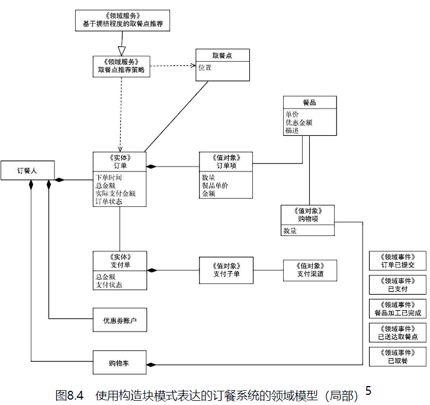
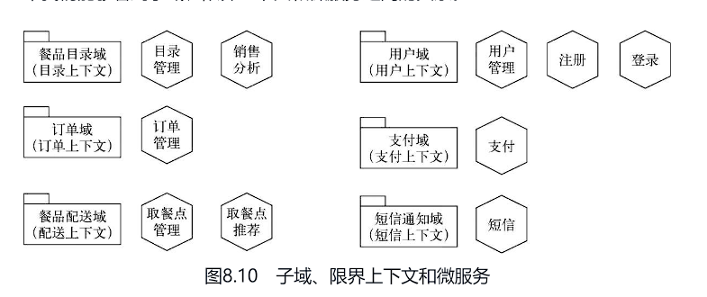

# 软件设计

3个层次：辨别什么是好的设计，提升专业素养，以及掌握卓越开发实践。

一个根本挑战、两大核心价值、三大设计原则和对应的软件设计实践


一个根本挑战指的是软件与生俱来的复杂性，两大核心价值指的是软件开发的当前业务价值（满足业务需求）和长期资产价值（复用和演进），三大设计原则指的是分而治之、持续演进和质量内建。一个根本挑战指的是软件与生俱来的复杂性，两大核心价值指的是软件开发的当前业务价值（满足业务需求）和长期资产价值（复用和演进），三大设计原则指的是分而治之、持续演进和质量内建。

## 识别优秀设计

### 优质代码的外部特征


#### 实现了期望的功能

用户真正需要的和用户描述的往往并不一致，经过层层加工，信息更是进一步失真。

##### 为什么需求问题如此普遍

- 软件解决的是现实世界的复杂问题 

    > 现实世界有多复杂，软件就有可能多复杂。

    要真正产出有价值的软件，需要关注以下两个重要的方面。
    - 加快认知的过程。
    - 增加设计的弹性，在出现问题时能较快调整。
- 高质量沟通是困难的，也是容易被忽略的
    
    > 在现实世界中，每一次信息传递都意味着一次信息损耗。

##### 解决问题的方向

优秀的开发者会关注自己开发的软件的真正价值，而不只是盲目地接收到手的需求。实践表明，开发者的积极投入是高效理解需求、提升设计质量的关键.

- 结构化的探索（需求分析金字塔）

- 注重沟通

- 强调设计契约

    契约的本质是信息明确、以终为始。只有尽可能地强调明确，才可以发现需求的模糊性，提升在早期发现问题的概率

- 做到演进式设计

    > 好的设计应该是柔性的。    

#### 缺陷尽量少

##### 关于软件缺陷的两个事实

- 缺陷不可能完全避免

- 尽量早地发现缺陷

    > 理论基础是缺陷成本递增原理。

##### 解决问题的方向

- 缩短缺陷的发现周期（测试前置）
- 降低缺陷的发现成本和修复成本（全面的自动化测试、更小的迭代）
- 缩小缺陷的影响面

    > 通过把软件划分为更合理的设计单元，定义清楚设计单元之间的依赖、接口和契约，并采取契约式设计等手段

#### 易于理解

代码在其生命周期中被阅读的时间，是编写代码所用时间的10倍

##### 为什么代码难以理解

- 不良代码充斥着细节和意外
- 范式或概念不一致

##### 提升代码可理解性的关键

降低代码的复杂性，是提升代码可理解性的关键

一个程序员在编写代码的时候，是否思考过别人会如何阅读这段代码？又应该如何做，才能尽可能减少别人理解这段代码的成本？

#### 易于演进

> 演进是软件的最本质特征

##### 为演进而设计

- 良好的设计结构

    正交设计是增强代码演进能力最重要的手段，通过 SOLID 原则有助于形成正交设计

    

- 自动化测试
- 简单设计

    今天你所做的任何决定，都是软件未来变化的约束。

#### 易于复用

##### 设计质量决定了复用能力

##### 提升复用能力的手段

- 选择合适的复用粒度

    > 复用粒度越大，复用价值也就越大，不过复用的机会往往更小

    业务模块的复用已经有了更好的理论基础，而且经过了实践的检验。这就是以领域为中心的设计

    > 代码的“复制 - 粘贴”不是复用，它是复用的反面

- 清晰的设计职责和设计契约

    可靠的复用必须满足两个条件。第一，被复用模块的职责必须清晰，这样别人才可以知道该不该复用、能不能复用。第二，被复用模块的实际行为必须和承诺的职责相一致，这样才能被可靠地复用

- 很好地管理依赖

    尽量依赖抽象的接口而不是具体的实现、依赖设计小而聚焦的接口而不是大而全的接口

### 优质代码的内在特征


#### 一致的编码风格

##### 需要一致的编码风格

不一致的编码风格会对代码的可理解性、可维护性产生非常大的影响。此外，从心理角度讲，风格不一致的代码会给人一种“敷衍”的感觉，使他们很难静下心来精心打磨设计。

##### 通过编程规范约束编码风格

要想有效实施编程规范，需要注意如下3个方面。
- 有成文的编程规范。
- 团队成员对编程规范的约定有深刻的理解。
- 编程规范是团队资产的一部分，会被刻意关注并持续演进。

> 编码规范的约定可以参考《阿里巴巴Java开发手册》

编程规范并不是一堆刻板的条文，而是最佳经验的总结。开发者除了要遵循编程规范，更要懂得编程规范背后的逻辑。

##### 编程规范也要持续演进

##### 通过代码评审和结对编程统一编码风格

#### 有意义的命名

##### 命名应该反映业务概念

为命名犯难不应该在编程的时候才发生，它应该被前移到问题分析阶段。命名困难的本质，是没有对业务概念建立正确的理解

##### 避免从开发视角命名业务概念

从业务视角而不是开发视角命名代码，是程序员努力的方向

##### 面向设计意图进行命名优化

#### 简洁的行为实现

##### 代码元素要尽量简短

代码元素包括方法、类等

设定一个代码行数量的警戒值有助于编写更高质量的代码。之所以会有过长的方法，很多时候是因为在一个方法中做了太多事情。有意识地减少代码行（如抽取一个新方法）有助于发现不够内聚的设计，或者抽象层次不足等问

##### 代码的表达要清晰，抽象层次要一致

在编码中做到“一致的抽象层次”并不是太困难，核心是要采用正确的编码顺序，也就是由外而内的设计和实现方法

##### 方法的实现复杂度要尽量低

比如圈复杂度要低

#### 高内聚和低耦合的结构

模块化是提升代码可理解性、可演进性、可复用性的关键。

从设计层面看，模块化分解的最高指导原则是高内聚，模块间协作的最高指导原则是低耦合。

##### 高内聚

高内聚描述了一个代码元素边界内内容的紧密程度。高内聚意味着以下两点。

> 代码元素视划分粒度的不同而不同，如子系统、模块、类、方法等。

- 凡是紧密相关的东西，都应该放在一起。
- 凡是被放在一起的东西，都是紧密相关的。


##### 低耦合

> 内聚反映了设计单元内部的相关性，耦合则是设计单元之间相关性的表征

如果两个设计单元之间存在某种关系，使得当一个设计单元发生变化或者出现故障时，另外一个设计单元也会受到影响，那我们就说这二者之间存在耦合。

内聚和耦合是彼此影响的两个因素。耦合不可避免.过度耦合是软件设计不稳定、不健壮的根源。

> 避免过度耦合的设计

一般来说，管理好了依赖，也就解决了大多数耦合问题。


1. 循环依赖造成紧耦合。循环依赖往往意味着设计不合理，或者依赖粒度过大。（切割依赖）
2. 依赖层级越深，耦合越紧。（通过依赖倒置断开链式依赖，需求方接口）
3. 依赖范围越广，耦合越严重。依赖范围过大，往往也和设计单元承担的职责过多有关。
4. 全局依赖和隐式依赖让耦合难以管理。
    - L 是全局变量。要避免这种耦合
    - L 是外部模块，封装 L
    - L 是隐含的知识（比如重复的代码）
    - L是一个稳定的接口时，J和K之间没有耦合关系
5. 对内部状态和数据的依赖是严重的耦合。内容耦合。在实际项目中常见的设计反模式，如Smart UI 和贫血模型，都是封装不足导致的内容耦合的结果。针对这种问题，最行之有效的做法是：除了纯粹的数据类，都应该尽量少暴露getter/setter方法。

耦合不局限于代码层面，它可以发生在设计的任何粒度上。例如，如果两个系统之间是通过一组API定义进行通信，那这两个系统之间就基于这组API形成了耦合，当你开发的系统使用了某种第三方框架，或者使用了某种消息通信的基础设施时，同时也在你开发的系统和该第三方框架以及消息通信基础设施之间建立了耦合。框架、通信基础设施或者API的变化都会影响依赖这些内容的模块。

#### 没有重复

重复是一种特殊的耦合。

DRY 原则

有句话叫“习惯成自然”，一旦某种编码风格形成习惯，久而久之，也就没人觉得这种重复是一种问题了。

无论重复是否真正有害，关注代码中的重复都能带来有价值的收益。最大的收益就是启发程序员注意关注点分离。

#### 没有多余的设计

##### 避免刻板地遵循某种设计范例

实际项目中常见的是滥用 IoP（面向接口编程）

IoP的本质是定义和实现的分离。定义指的是契约的定义，用接口承载。由于实现更容易变化也更难管。

应用IoP是一种基于投资回报的理性决策。

所有的设计范式，本身都是为了解决某个问题，它的权衡点在于投资回报。如果发现投资回报不合理，这时候就要做到“如无必要，勿增实体”，果断地把不该存在的设计删除。

##### 及时删除已经不再有用的代码

##### 避免为不可预见的未来编写代码

面向不确定的未来，最好的方法是反脆弱。

真正反脆弱的代码，是那些高内聚、低耦合，和业务的本质概念关联紧密、对应良好的代码。当然了，还应该具备良好的自动化测试。

#### 具备自动化测试

##### 保障功能正确

测试的原始目的就是保障功能正确

##### 提升代码可理解性

用测试作为文档的一个特别大的优势是它不会过时。

##### 保障软件系统的持续演进

##### 用契约和资产的观点看待自动化测试

测试的本质绝不仅是“测试”，它更本质的属性是“契约.

## 专业篇 建立扎实功底

### 高质量的需求


实践一再证明：在一个项目中，如果程序员没有积极投入到需求活动中，而只是被动地接收需求进行开发，那么往往会错漏百出，即使产品经理或需求分析师的能力很强，也无法改变这个结果。

> 是程序员的理解，而不是产品经理的设计，成为系统最后的功能。

#### 用结构化的方法分析需求

需求分析的本质是探索和发现。同时，沟通和确认是需求分析活动中的重要环节

##### 需求工程的三大活动

- 需求获取：正确地捕获业务方的诉求，对应达到的结果建立正确的预期。
    > 再小的需求也必然有期望达到的业务目标或者要解决的具体问题。
- 需求分析和定义：把业务方的诉求成功转换为对软件系统的需求，并进行清晰的表述。
    > 需求分析和定义是生成解决方案的过程：为了解决特定的问题，系统应该提供什么功能？这些功能包含哪些操作步骤？有哪些业务规则？
- 需求澄清和确认：让相关涉众（如开发人员和测试人员）都正确地理解需求，并达成一致。
    > 需求澄清和确认的核心挑战是细节。

##### 探索和发现用户的真正需求

需求分析的核心是探索和发现：通过持续探索，发现并确立真正的业务目标，从而设计出真正合理的方案，包括系统需求、操作步骤和业务规则等

##### 需求分析金字塔


- 不断质疑，澄清业务目标

    为什么要做这个功能？如果不做这个功能，又会怎样？

    通过对业务目标进行质疑和确认，业务分析人员经常会发现业务目标中存在未澄清或者不合理的部分

- 探索业务流程，定义系统功能

    这一步的关键是“探索”，而不是“描述”

    系统功能就是业务流程中那些和软件系统有关的功能。

- 设计操作步骤，澄清业务规则

##### 共创、沟通和共识是需求分析活动成功的关键

- 用文档记录结果，不要用文档作为驱动

    尽可能早地引入需求沟通，进行群体性的共创活动

- 在协作空间讨论和完善需求

- 最大化发现能力，不畏惧需求变化

#### 定义业务目标

##### 目标要反映关键利益方的诉求

对同一个系统而言，不同的核心诉求对应的功能设计以及需求优先级可能是完全不同的。

在讨论业务目标的过程中，常常会出现下列问题。
- 为什么要做这个产品（或者功能）？要达到什么样的业务目标？
- 做出了这个产品（或者功能），期望的业务目标能达成吗？不做的话，可以通过其他途径达到业务目标吗？
- 谁将从这个产品（或者功能）中受益？又有谁可能会受到影响？

解决不同的功能需求能够达到相同的业务目标，需求开发仅仅是达到业务目标的手段。这一点在开发活动中务必注意。

#### 探索业务流程，定义系统功能

从业务目标到系统需求并不是一蹴而就的，联系它们的纽带是业务流程。

在开始定义系统功能前，先把业务流程定义清楚

##### 表达业务流程的方法

- 注重实效的UML

    UML就是适用于软件世界的统一表示法。与此相对的是线框图。线框图是随意的，在使用时很难达到精确
    
    把UML作为一种表示法，记录或者表达思考和讨论的过程

    把这种以沟通为目的、仅仅使用UML特征的有限子集来建模的方式，称为注重实效的UML。

- 多绘制草图，仅在必要时使用建模工具

- 用带有泳道的活动图表达业务流程

    有好几种UML图都适用于需求建模，这里列举三种。
    - 用例图：表达系统有哪些功能，执行者会使用系统的哪些功能。
    - 顺序图：表达参与者如何彼此交互，完成一个功能或业务。
    - 活动图：表达一个功能或业务设计的活动或流程。

    > 带有泳道的活动图是顺序图和活动图的结合体，最适合来表达业务流程

- 刻意地省略——抓住主要问题

    建模要注重实效。UML有一个非常好的机制——允许刻意地省略。

    在业务流程阶段，要能充分反映关键的业务节点，不要陷入操作细节

##### 积极地挑战业务流程

##### 使用业务事件推演业务流程

经验表明：正向的思考过程往往容易遗漏关键步骤。

EDBA（事件驱动的业务分析）的核心成功要素是：以业务事件为核心、以终为始、逆向思考。

业务事件指的是应该被关心的、具有业务价值的事件。

和事件相对应的是动作，从确定性上说，事件的确定性比动作的确定性更高，它有助于让我们更加关注业务流程的结果。

基于业务事件进行讨论，可以让需求讨论更聚焦、更清晰

> 16字口诀：事件优先，由后向前，关注例外，整理推演。

##### 从业务流程到系统需求

梳理业务流程的最终目的是软件开发，也就是要确定系统需要实现哪些功能.

系统需求是把“软件系统”作为研究对象，定义软件系统应该做什么，确定清晰的输入和输出

> 用例图最适合于表达系统需求

- 系统边界：明确哪些工作是在软件系统内完成的，哪些是在软件系统外完成的。用例的执行者处在边界外，用例处在边界内。
- 执行者：用例的发起者，经常是业务角色。涉及多系统交互时，执行者也有可能是外部系统。如果涉及定时任务，那么也可以把定时器作为一个特殊的执行者。
- 系统用例：执行者在系统边界上对系统进行的操作。
- 用例图：表达执行者、系统用例、系统边界之间关系的UML图。

业务流程的关注点是业务，系统用例的关注点则要低一个层级，它关注系统

在实际分析系统用例时，往往会对业务流程做进一步优化，还会考虑如何组织用例以体现良好的结构。

#### 完善操作步骤，澄清业务规则

##### 发现细节

一般来说，细节包括两个重要部分。

- 操作步骤
- 业务规则（约束）

##### 建立共识

- 所有参与者都对将要做的事情有一致的理解，没有歧义。
- 所有参与者都知道还有哪些问题尚未澄清。

“刻意地忽略”意味着大家知道哪些事情是暂时被忽略的，这很重要。

##### 表示法

- 用UML顺序图表示操作步骤
    
    UML顺序图擅长表示多个参与者之间存在互动的操作步骤。

- 用UML活动图表示操作步骤

    UML活动图适用于重点不在交互而在执行者所做动作的场景中，用来表示分支等更高效。

##### 用实例化的方式澄清需求

实例化需求

实例优于抽象

如果能想好怎么测试，那需求应该做成什么样也就变得很清晰了。这就是以终为始的思考方法。


实例化需求的本质是沟通.在每个迭代开始之前，都组织实例化需求工作坊，就即将开发的需求进行讨论，并写出需求的关键实例.

#####　实例化需求的步骤

- 澄清目标
- 发现场景
- 澄清细节

Given-When-Then模式

当类似的示例比较多时，Given-When-Then模式也可以采用表格的形式来表达。

恰当地使用界面原型。使用界面原型作为补充工具，或者是在业务流程已经基本确定的情况下，再使用界面原型进行需求探索和设计，千万不要把界面原型作为唯一的需求探索工具。

### 领域建模


对业务的概念、概念间的关系及概念本质的认知，就是领域模型。领域模型是高质量软件开发和持续演进的基础，也是领域驱动设计方法的核心，还是微服务和云原生时代重要的基础概念。

#### 领域模型的概念

不管开发什么系统，不重视对应领域的基本概念和业务知识，都是不行的。

##### 领域模型是什么

领域模型定义了问题空间中的关键概念，以及这些概念之间的关系。

领域模型反映的是认知，认知通过概念以及概念之间的关系表达。

##### 使用 UML 类图表达领域模型

在大多数场景下，UML类图是表达领域模型时的合适选择

UML的类图虽然名字是“类图”，但是这个“类”并不只是软件代码中的“类”，而是“概念”。

- 熟悉常见的概念间关系
    - 关联：关联指两个概念之间存在联系。比如教师和学生
    - 多重性：这是指某个关系对应的两端的概念实体的数量对应关系。比如教师和学生是多对多的关系
    - 聚合和组合：聚合是一种特殊的关联，组合又是一种特殊的聚合。这两者表达的是归属关系或者所有关系。组合关系比聚合关系还要紧密。
    - 泛化：泛化反映了概念的抽象。
    - 依赖：依赖指一个概念和另外一个概念有关。“有关”是一种比“关联”弱得多的关系
- 多视图和刻意忽略
    图、表、文本等都只是一种表达形式，它们提供的是一种视图，而非领域模型本身。因此，既不可能，也不需要使用一个视图面面俱到地反映业务概念。

    在“领域模型”是一种“业务概念”这个上下文中，方法/操作（面向对象）是开发人员的概念，没有必要在业务分析阶段进行建模。它们不是领域模型的一部分

##### 领域模型反映了认知

- 领域模型沉淀认知
- 领域模型在一定时期内保持稳定
- 领域模型并非一成不变，它会持续“生长”甚至跃迁

##### 建立高质量的领域模型

领域模型反映了关键的业务认知，但是认知并不会凭空建立。

要建立好领域模型，关键是要做好“捕获、辨析、演进”。

- 捕获：指的是能从需求分析和业务表述中，及时捕获可能是业务概念的信息。
- 辨析：业务概念往往具有模糊性。要能清晰地分辨出：这个业务概念表达的是什么？它需要被分解吗？它能够被抽象吗？它和其他业务概念之间是什么关系？
- 演进：人对业务概念的认知不是一蹴而就的，是渐进的。要随时留意，新的业务场景产生了哪些新的业务概念？加入了新的业务概念后，原有的领域模型是否需要调整？

##### 捕获业务概念

名词就是业务概念

##### 辨析业务概念

在捕获到业务概念的那一刻，就立即定义这个概念。如果需要分解，就立即进行业务概念的分解；如果需要抽象，就立即进行业务概念的抽象。

- 定义业务概念
- 分解业务概念
    - 警惕模糊的业务概念带来的问题
    - 及时分解看起来相似、事实上不同的业务概念

##### 抽象业务概念

- 如何抽象取决于特定的业务场景
    - 对抽象最直观的理解，就是分类归纳
    - 事物具有多种不同的抽象视角。

在抽象过程中，要始终思考业务概念所处的上下文，能够有效避免过度抽象。分解和抽象业务概念的能力是需要刻意训练的。

##### 子域

把子域当作了一个重要的战略模式，其核心思想就是按问题域进行分解。

根据子域通用程度的不同，我们把子域进一步划分为核心域、通用域和支撑域。

- 核心域: 核心域和产品的核心业务逻辑相关，决定了产品的核心竞争力，产品的差异性和特殊性体现在这种域中。
- 通用域: 通用域是那些包含在大多数不同类型的产品中的子域。这种域往往没有太多个性化的诉求。
- 支撑域: 支撑域的通用水平尚未达到通用域，也不像核心域那样能决定产品的核心竞争力，但确实是一个完整产品所必须的。

#### 持续演进业务概念

持续演进遵循如下基本步骤。
1. 从需求分析和业务表述中捕获业务概念，并对其进行抽象。
2. 把业务概念及时归置到领域模型中，然后利用领域模型中的业务概念，去描述需求。
3. 如此循环往复，在持续探索需求的同时，持续精化领域模型。

#### 用领域模型指导软件开发

##### 领域模型和统一语言

统一语言具有以下几个优点

- 提升沟通效率
- 确保及时更新
- 降低表示差距

任何出现在需求描述中的业务概念，都必须出现在领域模型中

##### 避免领域建模的常见误区

- 避免从开发视角进行领域建模
- 领域模型不是数据库模型。不要站在开发视角定义领域模型。
- 避免建立庞大的领域模型
    - 领域越大，越不利于建立认知和共识。我们应该把大领域划分为小领域，然后逐个建立这些小领域的领域模型。那种“整整一面墙”的领域模型，是非常不可取的
    - 把大领域拆分为小的子域，并为每个子域分别建模。
- 避免只是重视文档，而忽略交流和共识
    - 领域模型的核心在于建立共同的认知，也就是共识。
    - 领域模型一定要显式化

### 设计分解和责任分配


软件设计的本质是设计分解和责任分配，也就是通常所说的模块化。

#### 通过分而治之管理复杂性

> 分而治之是控制复杂性的有效手段。

##### 组织的复杂性类比

在软件设计和一切复杂的场景中，“元素”“责任”和“协作”都是非常有效的思考策略和组织策略。

架构是系统在其环境中的基本概念或属性，体现为元素、关系以及设计和演进的原则。

- 元素：反映了分解
- 责任：反映了职责分配
- 协作：反映了分解后的元素之间的协同

元素、责任和协作是分解的结果，

软件设计的分解结果是软件系统模块化了。

##### 软件设计的自相似性——分形


##### 使用UML表达软件设计的分解结果

- UML类图    
    
    > `<<subsystem>>` 符号，这种符号叫作构造型(sterotype)，也就是对某种具体设计元素的类型修饰。
- UML包图
    - UML包图更加强调设计元素的容器属性，UML类图更加强调设计元素的属性和职责。从这个角度，也可以把UML包图看作UML类图的一种特殊构造型。
- UML交互图
    - UML的顺序图、通信图、带有泳道的活动图

##### 使用代码结构表达软件设计的分解结果

在类层次的设计元素，只有少部分比较困难或创新的需要使用UML图来构思或讨论，大多数时候是可以直接使用代码结构表达的。代码结构是表达设计分解的有效元素。

#### 架构分解的原则与模式

##### 原则1：优先按照问题领域分解

两个基本入手点：横切（按照设计层次分解）和纵切（按照问题领域分解）


对于中大规模的系统来说，如果按照横切方式分解，那么会遇到一些困难，应该优先选择纵切的方式，也就是按照问题领域分解。原因有以下三个
- 高内聚和低耦合。属于同一个问题领域的模块之间的联系更为紧密
- 易于复用
- 避免混乱

##### 原则2：面向质量属性定义架构策略


前6列可以从外部感知，称它们为外部质量属性；后2列仅可以从软件组织内部感知，称它们为内部质量属性。

##### 原则3：选用合适的架构风格和模式

风格和模式是既往设计经验的结晶。

在实践中，没有必要过度区分风格和模式的差异。例如，既可以把分层看作一种架构风格，也可以把分层看作一种常见的架构模式。

#### 正确使用语言特性

##### 封装、继承和多态

软件设计的角度看，那么更重要的策略是“分解”“组合”“委托”“抽象”这样的设计概念，封装、继承和多态是在语言层面上对这些设计思想的实现。

##### 用继承和多态表达抽象

##### 避免误用继承

##### 用里氏替换原则指导继承关系的使用

##### 用委托的方式实现复用

委托是一种非常强大的复用方式。在面向对象的程序设计中，需要复用时应该优先考虑委托，而不是继承。

##### 面向对象的职责视角——抽象、委托和组合

委托和组合是职责分解的两种表达形式。自上而下的职责分解就是委托；自下而上地把若干设计单元联合起来完成一个更大的职责，就是组合。

抽象的本质就是，从职责视角看，若干设计单元可以等价。

#### 关注点分离

##### 用单一职责原则指导关注点分离

要检验关注点分离得是否清晰，最好的方法是用变化来检验。

单一职责原则： 一个类应该只有一个变化的原因。

##### 如何判断关注点分离和过度设计

一般来说，只要能识别出不同的关注点，新代码就不会比原有代码复杂。

设计是否合理的终极评判标准是总体收益是否得到了最大化，要同时考量成本和效率。新增的抽象会增加额外的复杂度

##### 用开放——封闭原则检验关注点分离

开放 - 封闭原则：如果一个设计在每次实现新的需求时都必须打开既有的代码，那它就不是一个好的设计

开放 - 封闭原则是一种检验手段，可以检验产出的设计是否高质量。

#### 设计模式

##### 模式的价值

模式最重要的价值是提升思考的粒度

模式还有助于便捷地交流

##### 用设计模式指导软件设计

许多设计模式是对关注点分离和抽象的应用

- Iterator模式是对“遍历执行”这个活动的抽象，也是“如何遍历”和“遍历后做什么”这两个关注点的分离。
- Strategy模式是对具体操作行为的抽象。
- Composite模式是对整体和部分的分离，也是对事物自相似性的抽象。
- Decorator模式是对核心职责和附加职责的分离。

##### 在重构中涌现模式

避免生搬硬套设计模式的核心要诀是：仅在需要的时候才进行关注点分离和概念的抽象。

重构和设计模式之间存在彼此促进的关系。首先，设计模式为重构过程提供了有效的牵引。其次，重构是应用设计模式的最好时机

### 依赖、接口和契约


#### 依赖的设计原则

- 依赖最小化原则：只依赖必需的设计元素。
- 稳定依赖原则：尽量依赖稳定的、不易变更的设计元素。

使用这两个原则，很容易理解软件设计中一系列设计策略和模式，包括面向接口编程、依赖倒置、接口分离等。

##### 面向接口编程

面向接口的编程方式可以有效阻断依赖传递


##### 依赖倒置

高层模块不应该依赖于低层模块，二者都应该依赖于抽象。

依赖倒置还有一个类似的说法，叫作抽象不应该依赖于细节，细节应该依赖于抽象。


##### 接口分离

接口分离原则是一个关于接口粒度设计的很有效的原则。

接口的设计应该小且内聚。

接口分离原则有两种表述。

(1) 不应该强迫客户依赖于它们不用的方法。
(2) 类之间的依赖应该建立在最小的接口上。

(1) 新增接口能力导致接口膨胀，膨胀的接口又进一步影响了调用方和实现方。
(2) 减少接口能力受到约束：新的设计被过去的方案所影响。

SOLID 原则

- 单一职责原则(Single Responsibility Principle，SRP): 类的职责应该是单一的。
- 开放 - 封闭原则(Open-Closed Principle，OCP): 设计元素应该对修改封闭，对扩展开放。
- 里氏替换原则(Liskov Substitution Principle，LSP): 所有的子类，都应该完整地实现父类所要求的所有行为。
- 接口分离原则(Interface Segregation Principle，ISP): 类之间的依赖应该建立在最小的接口上。不应该强迫客户依赖于它们不用的方法。
- 依赖倒置原则(Dependency Inversion Principle，DIP): 高层模块不应该依赖于低层模块，二者都应该依赖于抽象。

#### 需求方接口

接口是设计元素之间依赖的最普遍表现形式

- 需求方接口
- 提供方接口

##### 不良的依赖结构影响设计的稳定性

需求方接口这一概念非常重要，它是设计稳定性的保证。同时，它也是达成依赖倒置原则的手段。

接口依赖不应该从提供方出发，而应该从需求方出发。这就是需求方接口的重要意义：接口属于需求方。

##### 从需求方视角定义接口

##### 依赖注入

最常见的依赖注入做法是使用构造函数注入，或者使用方法注入

##### 防腐层

防腐层(ACL，Anti-Corruption Layer)是一种架构模式。当一个子系统、模块等的外部依赖不受控，或质量不高，或可能存在多个实现方案等时，就应该定义防腐层了。

防腐层意味着从需求出发定义需求方接口

##### 需求方接口和接口分离原则

#### 提供方接口

需求方接口反映的是某个设计单元“需要什么”，提供方接口反映的则是某个设计单元“能做什么”。

连接需求方接口和提供方接口的适配器模式

##### 围绕核心概念定义接口

路径规划服务不能仅遵循送餐服务定义的请求方接口，而应该定义自己的服务能力，供潜在的使用方使用自己的服务。

如果在一个产品或团队内部，某个模块的存在完全是为了让另一个模块使用，这时候就无须定义提供方接口，把二者合二为一即可。但是，一旦在后续演进过程中，该模块有了更多潜在的客户，而且这些客户使用模块的方式有差异，就应该及时地把它分裂为需求方接口和提供方接口。

##### 适配器模式

##### 六边形架构

另外一个名字叫作“端口 - 适配器模式”。

六边形架构是分层架构加上需求方接口和适配器模式的自然结果。

“六”其实是一个虚指，它的核心是处在设计层次中央的是应用部分，外围的依赖则通过端口和适配器接入应用。

在分层架构中，上层是依赖于下层的。一旦引入这种依赖，后期要替换依赖时就会非常复杂。


六边形架构以“应用逻辑和领域逻辑”为核心来看待分层架构。实现六边形架构的过程分成三步。
1. 把真正重要的、和业务逻辑密切相关的内容放在核心。
2. 从需求方的视角来定义端口，即定义需求方接口。
3. 基于项目的实际依赖实现适配器。

#### 设计契约

在现实中，许多接口的定义是不清晰的，这也往往是产生许多软件问题的根源

##### 用契约规范协作

要让每个软件模块都具备清晰明确的责任，并确保这些责任可以被检验，从而保障最终的软件系统的健壮性和稳定性。

把契约作为中心的设计叫作契约式设计。契约式设计是获得高质量软件的重要手段。

契约式设计意味着下面三点。
1. 定义清晰的契约，并约束服务提供方和服务调用方的权利和义务。
2. 只有调用方履行了义务，提供方才会提供正确的服务。
3. 调用方只有履行了义务，才能享有获得正确服务的权利。

##### 区分命令和查询

要在职责定义中避免命令和查询的混合体。

如何避免误把命令方法用作查询呢？一个较好的编程实践是永远不让命令方法返回任何数据。

清晰职责的第一个要点： 单一职责，并且区分命令和查询。

文档不是描述职责的唯一方式，也可以把自动化测试作为活文档

##### 从设计契约视角解读里氏替换原则

里氏替换原则其实是设计契约在继承场景下的具体运用。

#### 事件机制

耦合度最低的依赖是没有依赖。

##### 基于事件的耦合

发布 - 订阅模式是一种设计单元间的协作机制

面向对象的设计中最常用的观察者模式就是一种常见的实现。


为了实现一个纯粹的事件机制，我们可以在观察者模式的基础上叠加中介者模式


事件机制在架构设计中具有重要的价值，它也是事件驱动架构(EDA，Event-Driven Architecture)的基础。

## 卓越篇 实现高效编码

### 用测试描述需求和契约

软件开发的重要范式：测试先行


#### 将测试作为一个建设性活动

软件测试升级为建设性活动，意味着软件测试不再是单纯的“测试”，而是可以更好地参与到需求分析、软件设计等活动

#### 从 V 模型到 I 模型


V模型本质上是对瀑布模型的精化和改进.

V模型精准展示了“测试活动”和“建设性活动”（如需求分析、架构、设计和编码）之间的验证关系。虽然V模型也说明了测试分析、测试计划等活动可以在需求分析、架构设计等阶段就同步开始，但是它的核心目标仍然是质量保证，与“建设性活动”没有什么关系。也就是说，测试活动对需求分析、架构、设计和编码的影响是后置的。


I模型推导出的实践有如下三个特点。
- 在需求阶段立即验证需求质量，这就是曾在第3章介绍的实例化需求。
- 在设计阶段立即验证设计质量，这就是本章和第11章将会深入探究的测试先行和测试驱动开发。
- 在编码阶段立即验证编码质量，这就是将在第10章介绍的结对编程。

#### 用测试澄清和文档化需求

整合了自动化测试和需求文档的框架称为BDD框架。

Cucumber 是一个常用的 BDD 工具。

BDD工具可以融合需求文档和自动化测试用例，让需求说明更清晰，更容易保持更新，同时又能起到质量保障作用的。

#### 用测试澄清职责和契约

单元测试，TDD

#### 以终为始，聚焦外部行为

测试后置已经不适用于现在的场景。测试要先行

自动化测试关心的是外部行为。测试先行一定是针对接口进行的

单元测试是开发人员的任务。

测试人员的角色和任务都已经发生变化。测试人员不再是质检员，而是质量保证工具和设施的打造者。。设计测试用例的技能固然重要，但编写自动化测试代码是一项基本技能。

### 用领域模型指导实现

领域驱动设计(DDD，Domain-Driven Design)，它包括一组实现模式（一般称为“战术模式”）和一组架构模式（一般称为“战略模式”）。其中，战术模式包括实体、值对象、领域服务、领域事件、聚合、资源库、工厂和分层架构；战略模式包括子域、限界上下文和上下文映射。


#### 用领域模型指导实现

领域模型，成为连接需求分析和软件实现的重要桥梁。

##### 代码应该表达业务概念

领域驱动设计的基本思想：方案空间应该和问题空间保持一致。

- 减小表示差距。提升代码的可理解性。
    - 代码的易理解程度取决于阅读者能否快速辨识代码中的业务概念和意图。
    - 好的代码，其中的业务概念和术语要能传承来自需求分析和领域建模活动的结果。
- 提升演进能力。
    - 在实现中做到从领域模型到代码的直接映射，并且分离易变的业务逻辑和稳定的业务概念，可以带来更好的演进能力。

##### 领域驱动设计

领域驱动设计既是一种设计方法，也是一种指导软件实现的模式集合。

领域驱动设计的方法体系是使用模式进行组织的，它包括两组模式：战术模式和战略模式。其中，战术模式关注具体的软件实现方法，战略模式重点关注大粒度的业务架构和服务划分。


- 领域模型和统一语言
    - 领域模型是战术模式和战略模式的出发点，所有模式都围绕领域模型而展开。
    - 统一语言的精髓，就是尽量缩小问题域和实现域的表示差距，增强可理解性，同时保持领域模型的持续演进
- 战术模式
    - 基本构造块。实体、值对象、领域服务和领域事件。
    - 业务完整性的单元。类和对象的粒度很细。领域驱动设计提出了聚合这个关键概念, 把面向对象设计的粒度从基本构造块提升到了能真正表达业务意义的层次。基于聚合，领域驱动设计还定义了资源库和工厂，这两个模式分别用于管理聚合的存取和创建。
    - 分层架构。提出了四层分层架构，特别突出了领域层。在此基础上，又发展出了一系列变体，包括六边形架构、整洁架构等.
    > 战术模式基于面向对象范式，不过它的思想是通用的。
- 战略模式
    - 领域模型不仅可以指导软件实现，它在企业架构规划和业务架构设计方面也有重要意义。
    - 战略模式的基础是按照问题域把复杂系统划分为子域，把复杂的问题分而治之。在实现层面，子域的划分可以直接对应到实现，如模块、服务、数据库设计等。
    - 定义了限界上下文(Bounded Context)，用来表达架构层次上的边界
    - 既然进行了划分，就需要考虑集成的问题。不同场景下的集成策略有所不同，领域驱动设计总结了一个很全面的集成策略，就是上下文映射。
- 为什么需要领域驱动设计模式
    - 模式的价值在于放大思考的粒度，提升思考的宏观程度。

#### 基本构造块



> UML定义了构造型，这作为一种通用的扩展机制，确实可以对对象进行分类

- 实体
    - 把会随着业务变化发生变化的业务概念叫作实体对象。
    - 实体需要唯一标识
- 值对象
    - 值对象的意义取决于属性
        - 值对象是描述性对象，它们存在的意义就是它们的值本身
        - 值对象是描述性对象，所以只要对象的属性一模一样，那么对象就是相同的。而当实体的属性发生变化后，它仍然是原来的实体。
        - 在领域模型中，值对象的数量要远远多于实体的数量，毕竟任何一个实体都需要不少描述性的信息
    - 尽量把值对象实现为不可变对象
        - 不可变对象不会被无意地修改。
        - 不可变对象天然是线程安全的。
    - 值对象需要重写equals方法。实体也需要重写equals方法，但策略不同。值对象的equals方法的判定依据是数值，实体的equals方法则恰好相反，它是基于ID判定的
- 领域服务
    - 我们试图描述一种商业策略，或某个业务的处理过程时，需要依赖领域服务。
    - 区分领域服务和一般领域对象的责任。只有在确实表达了一个相对独立的业务概念或者业务策略，并且不能简单地把它归结到某个既有的业务对象上时，才是一个真正的领域服务。
    - 领域服务是无状态的。不持有数据
- 领域事件
    - 领域事件指的是业务专家关心的事件，它源自于业务活动的结果。
    - 领域事件对需求分析和架构设计具有重要意义。在需求分析阶段，可以使用领域事件进行业务分析、开展事件风暴活动。在架构设计中，不但可以流畅地继承业务分解阶段关于领域事件的结果，还可以进一步使用领域事件作为核心架构元素对系统进行解耦，和事件驱动架构、事件溯源架构等有效结合。
    - 领域事件是一种特殊的值对象

#### 聚合、资源库和工厂

如果直接使用基础构造块来构造系统，那么可能会丢失某些重要的联系。

聚合的定义：将实体和值对象划分为聚合并围绕着聚合定义边界。选择一个实体作为每个聚合的根，并仅允许外部对象持有对聚合根的引用。作为一个整体来定义聚合的属性和不变性因素，并把其执行责任赋予聚合根或指定的框架机制

聚合从本质上讲是在基础的构造块上增加了一层边界，用边界把那些紧密相关的对象放到了一起。处在同一个边界内的对象就形成了一个聚合

聚合是业务完整性的基本单元。

聚合是一个非常重要的概念，它的核心是封装业务逻辑，保证业务完整性，将实体对象和值对象划分为聚合，并且要围绕聚合去定义边界

划分聚合的启发式规则

- 生命周期一致性。如果聚合根消失，那么聚合内的其他元素也都应该同时消失。可以用反证法来判断。
- 问题域一致性。不属于同一个问题域的对象，不应该出现在同一个聚合中。
- 尽量小的聚合。聚合的本质作用是提升对象系统的粒度，确保一致性、降低复杂度。不过，粒度绝不是越大越好。可以通过值对象断开大的聚合。
    

扩展出的值对象和聚合、聚合根这些概念，以及即将讲到的资源库、工厂，都仅是服务于实现，只要开发人员自己能理解，在实现中能正确使用就可以了。没有必要和业务人员沟通这些概念，仅使用从问题域识别出的实体、值对象、领域服务和领域事件跟业务人员进行沟通即可。

小聚合之间的协作：

- 在应用层进行拼装
- 在对象中存储冗余信息
- 基于消息机制完成数据同步
- 采用最终一致性方案

资源库： 对于查询、创建、修改、删除数据的操作，领域模型使用“资源库(Repository)”这个概念来承载它们。

- 资源库和聚合要一一对应。
- 资源库是聚合的存储机制。
- 把资源库声明为接口
- 命令-查询职责分离(CQRS)。领域驱动设计中的战术模式，能让代码精确地和领域模型对应，这样固然降低了表示差距，也更容易表达业务概念，但对复杂查询是不利的，因为每次都从多个聚合中获取数据，未必能满足性能要求。读写模型分离是一种有效的架构策略，可以大幅改善查询性能。CQRS当然也会带来新的问题。由于存在两套数据（更多情况下是多套数据，每种查询场景都有对应的读模型），所以必然存在数据的同步和延迟问题，还有复杂性问题，实践中需要权衡利弊。
    

工厂：和资源库一样，工厂也是面向聚合定义的。一个聚合往往包含多个对象，这些对象的数据之间又可能存在联系，如果允许分别创建这些对象，就会让聚合是业务完整性的单元这个定义面临失败。领域驱动设计中的工厂和《设计模式》中的工厂本质上是相同的，都是分离了构造和使用，并且封装了对复杂对象的构造过程。

#### 分层架构和代码结构

在软件架构中，我们把领域模型相关的部分放在领域层，把业务功能表达对应的部分放在应用层。除了领域层和应用层，真正的业务系统还需要接口层或用户界面层，以及基础设施层等。


- 接口层负责处理跟边界相关的部分。
- 应用层负责处理业务逻辑，业务逻辑是变化较为频繁的。
- 领域层负责处理领域模型和领域逻辑，领域模型稳定且接近业务本质，是最为重要的一层。
- 基础设施层负责处理数据库、消息等系统运行时所必须的基础设施。

对应的代码结构

```
 ── main
   └── java
      └── example.food
      ├── interfaces
      ├── application
      ├── domain
      │  ├── services
      │  │  └── PickupSiteRecommender // 取餐点推荐策略
      │  ├── order
      │  │  ├── Order                 // 订单聚合根
      │  │  ├── OrderItem             // 订单项值对象
      │  │  ├── OrderFactory          // 工厂
      │  │  ├── OrderRepository       // 资源库
      │  │  ├── OrderStatus           // 值对象
      │  │  └── OrderCreatedEvent     // 领域事件
      │  └── food
      └── infrastructure
```

书推荐的编码方式是由外而内的编码。

#### 限界上下文

在实现软件系统时首先是按照问题域进行切分，而不是直接分层。

限界上下文的最理想边界是子域的边界。

把一切都封装在限界上下文中
- 一个子域的一切资产，包括领域模型、数据库、包、可执行程序、接口声明等，都应该封装在限界上下文中，避免跨越边界。
- 只要遵循这样的原则，一个限界上下文就成为了一个完备的整体，它可以独立演化，可以被随时替换，可以让第三方轻松复用。

尽量建立清晰而一致的边界
- 我们可以采取一些工程上的手段来帮助划分边界。例如，使用不同的代码库或者代码目录、使用不同的数据库或者数据库表等。此外，从部署结构上看，微服务在企业级应用和互联网应用中已经渐成主流。那如何划分微服务呢？一个非常有效的方式是以业务职责为依据。对应到本章的概念，就是限界上下文。
    
- 对于子域划分的认知往往是渐进的，如果在边界还不是那么确定的时候，就贸然划分出边界，那么可能会给后续的系统间交互以及重构造成较大的困扰。一个较为稳妥的策略是考虑认知的渐进特征，不要过早隔离。在已经确定的边界上进行划分，延缓划分那些尚具模糊性的边界，在这些边界逐渐变得清晰时再分离它们。

#### 上下文映射

限界上下文约定了基于领域模型的架构层次的设计分解，而分解必然意味着集成和协作。上下文映射就是对限界上下文之间的协作关系的模式总结

##### 在边界上完成概念映射

不同的限界上下文使用不同的领域模型。这些限界上下文相互协作，就相当于使用不同语种的人在打交道，因此需要在边界上进行概念的映射和转换。

在边界上完成概念映射是一种基本模式。通过在应用层组装或者使用适配器完成概念映射，可以保持领域概念的清晰，避免领域模型遭到不必要的污染。

##### 上下文映射的模式

在限界上下文的边界上使用适配器是一种常见的架构策略。从服务提供方（被依赖方）的角度讲，因为它提供的是标准服务，所以服务具有非常好的通用性，可在多个场景下复用。从服务请求方（依赖方）的角度讲，因为它总是通过适配器和服务提供方相连接，和服务提供方实现了解耦，两者的关系从强依赖变成了弱依赖。


- 防腐层模式
    - 解决依赖其它服务时面临的问题
        - 服务提供方提供的服务、接口质量或者数据质量不好。
        - 不想让服务请求方和服务提供方紧密绑定在一起，未来可能会替换服务提供方。
        - 不想受服务提供方未来变化（如升级、接口变更）的影响。

- 标准开放服务模式。假如你正在工作的领域或者模块有许多不同的客户，那么为每个客户都提供一个专门的服务定义显然不可能。更为有效的办法其实是声明一组接口（或者服务、数据规范等），并把它们以标准的形式发布出来。

- 客户 - 供应商模式
    - 标准化服务往往需要时间的沉淀。在许多场景下，一个子域还不够成熟，由于对这个领域的认知还不够，所以服务的定义很难稳定；或者只有有限的客户，由于这个阶段客户不多，所以服务提供方只是服务于服务请求方，服务提供方的价值也只有通过服务请求方的使用才能体现。在这种情况下，彼此协作的双方可以建立更密切的关系，服务请求方作为客户，服务提供方作为供应商，二者之间的关系也转换为直接依赖。
    - 客户 - 供应商模式下的供应商，也可以进一步发展为标准开放服务。然后通过防腐层和原来的客户对接。

- 追随者模式
    - 服务请求方有时候感到和服务提供方的关系不符合防腐层模式的关键特征。例如，服务提供方的数据质量或者服务标准定义很好，没有在未来会被替换的诉求，自己的变化也不是那么频繁。这时候引入额外的防腐层可能就不太合算，服务请求方可以把自己定义为追随者，即完全服从服务提供方定义的服务标准。
    - 一旦发现服务请求方和服务提供方的关系已经呈现出防腐层模式期望的特征，就应该及时把追随者模式切换成防腐层模式。

#### 领域模型的持续演进

如果在编码阶段忽略了领域模型的演进，那么领域模型基本上会名存实亡，原有的模型无法从新的业务场景中吸收信息，势必走向过时和失效。只有做到模型和代码的同步变化，才是真正的“统一语言”。

- 及时分离领域概念
- 及时抽象领域概念
    - 不必过早抽象领域概念。但是，在需要抽象时，一定要及时抽象，并始终保持所有制品中的概念模型的同步。

### 由外而内的设计

### 设计指令贯穿始终

### 让设计持续演进

### 精益思想和高效编程


