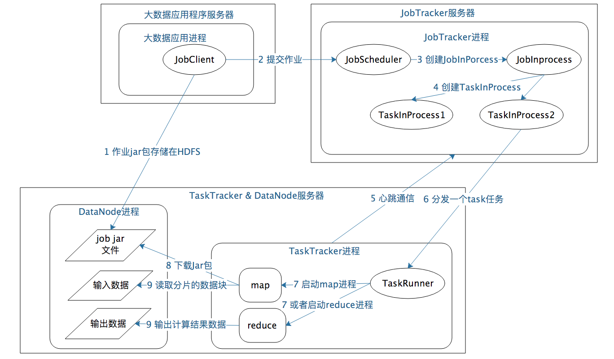

# 大数据

## 大数据发展史


在典型的大数据的业务场景下，数据业务最通用的做法是，采用批处理的技术处理历史全量数据，采用流式计算处理实时新增数据。而像Flink这样的计算引擎，可以同时支持流式计算和批处理计算。

除了大数据批处理和流处理，NoSQL系统处理的主要也是大规模海量数据的存储与访问，所以也被归为大数据技术。 NoSQL曾经在2011年左右非常火爆，涌现出HBase、Cassandra等许多优秀的产品，其中HBase是从Hadoop中分离出来的、基于HDFS的NoSQL系统。

大数据处理的主要应用场景包括数据分析、数据挖掘与机器学习。数据分析主要使用Hive、Spark SQL等SQL引擎完成；数据挖掘与机器学习则有专门的机器学习框架TensorFlow、Mahout以及MLlib等，内置了主要的机器学习和数据挖掘算法。

此外，大数据要存入分布式文件系统（HDFS），要有序调度MapReduce和Spark作业执行，并能把执行结果写入到各个应用系统的数据库中，还需要有一个大数据平台整合所有这些大数据组件和企业应用系统。

> 大数据平台往往就是一个定时调度平台(类似于Crontab），定制化比较强，一般是公司自己构建


大数据的核心思想: 移动计算比移动数据更划算。

这也是为什么大数据计算框架基本都是使用JVM语言实现的，JVM可以热加载网络传输过来的代码，更容易实现移动计算。

## 存储的王者-HDFS

HDFS作为最早的大数据存储系统，存储着宝贵的数据资产，各种新的算法、框架要想得到人们的广泛使用，必须支持HDFS才能获取已经存储在里面的数据。所以大数据技术越发展，新技术越多，HDFS得到的支持越多，我们越离不开HDFS。**HDFS也许不是最好的大数据存储技术，但依然最重要的大数据存储技术**。


DataNode负责文件数据的存储和读写操作，HDFS将文件数据分割成若干数据块（Block），每个DataNode存储一部分数据块，这样文件就分布存储在整个HDFS服务器集群中。

NameNode负责整个分布式文件系统的元数据（MetaData）管理，也就是文件路径名、数据块的ID以及存储位置等信息，相当于操作系统中文件分配表（FAT）的角色。

> NameNode 采用主从热备来提供高可用。依靠 zookeeper 来选主

!> 这个一主多从模式是大数据领域的最主要的架构模式。

HDFS是如何通过大规模分布式服务器集群实现数据的大容量、高速、可靠存储、访问的?

1.文件数据以数据块的方式进行切分，数据块可以存储在集群任意DataNode服务器上，所以HDFS存储的文件可以非常大，一个文件理论上可以占据整个HDFS服务器集群上的所有磁盘，实现了大容量存储。

2.HDFS一般的访问模式是通过MapReduce程序在计算时读取，MapReduce对输入数据进行分片读取，通常一个分片就是一个数据块，每个数据块分配一个计算进程，这样就可以同时启动很多进程对一个HDFS文件的多个数据块进行并发访问，从而实现数据的高速访问。关于MapReduce的具体处理过程，我们会在专栏后面详细讨论。

3.DataNode存储的数据块会进行复制，使每个数据块在集群里有多个备份，保证了数据的可靠性，并通过一系列的故障容错手段实现HDFS系统中主要组件的高可用，进而保证数据和整个系统的高可用。

## MapReduce 编程模型

MapReduce既是一个编程模型，又是一个计算框架

这个模型既简单又强大。简单在于其编程模型只包含Map和Reduce两个过程，map的主要输入是一对值，经过map计算后输出一对值；然后将相同Key合并，形成；再将这个输入reduce，经过计算输出零个或多个对。 同时，MapReduce又是非常强大的，不管是关系代数运算（SQL计算），还是矩阵运算（图计算），大数据领域几乎所有的计算需求都可以通过MapReduce编程来实现。

> 模型是人们对一类事物的概括与抽象，可以帮助我们更好地理解事物的本质，更方便地解决问题。

> 优秀的人有个共同特征：对事物的洞察力。这种洞察力来源于对事物的抽象能力



## 资源调度框架 - YARN

YARN 的目的是将资源调度和MapReduce执行过程分开，分开后，YARN 可以调度其它的执行引擎，比如Spark、Flink等

> Yarn作为一个大数据资源调度框架，调度的是大数据计算引擎本身。


为什么HDFS是系统，而MapReduce和Yarn则是框架？

框架在架构设计上遵循一个重要的设计原则叫“依赖倒转原则”，依赖倒转原则是高层模块不能依赖低层模块，它们应该共同依赖一个抽象，这个抽象由高层模块定义，由低层模块实现。

实现MapReduce编程接口、遵循MapReduce编程规范就可以被MapReduce框架调用，在分布式集群中计算大规模数据；实现了Yarn的接口规范，比如Hadoop 2的MapReduce，就可以被Yarn调度管理，统一安排服务器资源。所以说，MapReduce和Yarn都是框架。相反地，HDFS就不是框架，使用HDFS就是直接调用HDFS提供的API接口，HDFS作为底层模块被直接依赖。

## Hive: 让 MapReduce 实现SQL操作

Hive能够直接处理我们输入的SQL语句（Hive的SQL语法和数据库标准SQL略有不同），调用MapReduce计算框架完成数据分析操作。


在实践中，工程师其实并不需要经常编写MapReduce程序，因为网站最主要的大数据处理就是SQL分析

除了 Hive，又开发了各种大数据SQL引擎

Cloudera开发了Impala，这是一种运行在HDFS上的MPP架构的SQL引擎。在一些统计场景中，Impala可以做到毫秒级的计算速度。

Spark 也有 Spark SQL，各种 NoSQL 也逐渐有了自己的 SQL 引擎。

> 这里是编译原理的应用。

## Spark

事实上，在Spark出现之前，我们并没有对MapReduce的执行速度不满，我们觉得大数据嘛、分布式计算嘛，这样的速度也还可以啦。至于编程复杂度也是一样，一方面Hive、Mahout这些工具将常用的MapReduce编程封装起来了；另一方面，MapReduce已经将分布式编程极大地简化了，当时人们并没有太多不满。

真实的情况是，人们在Spark出现之后，才开始对MapReduce不满。原来大数据计算速度可以快这么多，编程也可以更简单。

> 我们常常意识不到问题的存在，直到有人解决了这些问题。

> 不要直接提出你的问题和方案，直向曲中求，对于复杂的问题，越是直截了当越是得不到答案。迂回曲折地提出问题，一起思考问题背后的规律，才能逐渐发现问题的本质。

Spark有三个主要特性：RDD的编程模型更简单，DAG切分的多阶段计算过程更快速，使用内存存储中间计算结果更高效。

### 计算阶段：

```
rddB = rddA.groupBy(key)
rddD = rddC.map(func)
rddF = rddD.union(rddE)
rddG = rddB.join(rddF)
```


计算阶段划分的依据是shuffle，不是转换函数的类型，

### 作业管理

Spark里面的RDD函数有两种，一种是转换函数，调用以后得到的还是一个RDD，RDD的计算逻辑主要通过转换函数完成。另一种是action函数，调用以后不再返回RDD。比如count()函数，返回RDD中数据的元素个数；saveAsTextFile(path)，将RDD数据存储到path路径下。Spark的DAGScheduler在遇到shuffle的时候，会生成一个计算阶段，在遇到action函数的时候，会生成一个作业（job）。

RDD里面的每个数据分片，Spark都会创建一个计算任务去处理，所以一个计算阶段会包含很多个计算任务（task）。


图中横轴方向是时间，纵轴方向是任务。两条粗黑线之间是一个作业，两条细线之间是一个计算阶段。一个作业至少包含一个计算阶段。水平方向红色的线是任务，每个阶段由很多个任务组成，这些任务组成一个任务集合。

DAGScheduler根据代码生成DAG图以后，Spark的任务调度就以任务为单位进行分配，将任务分配到分布式集群的不同机器上执行。

### 执行过程

Spark支持Standalone、Yarn、Mesos、Kubernetes等多种部署方案，几种部署方案原理也都一样，只是不同组件角色命名不同，但是核心功能和运行流程都差不多。


## BigTable的开源实现：HBase


### 可扩展数据模型

使用支持列族结构的NoSQL数据库，在创建表的时候，只需要指定列族的名字，无需指定字段（Column）。通过这种方式，数据表可以包含数百万的字段，这样就可以随意扩展应用程序的数据结构了。并且这种数据库在查询时也很方便，可以通过指定任意字段名称和值进行查询。HBase这种列族的数据结构设计，实际上是把字段的名称和字段的值，以Key-Value的方式一起存储在HBase中。实际写入的时候，可以随意指定字段名称，即使有几百万个字段也能轻松应对。

### 高性能存储

为了提高数据写入速度，HBase使用了一种叫作LSM树的数据结构进行数据存储。LSM树的全名是Log Structed Merge Tree，翻译过来就是Log结构合并树。数据写入的时候以Log方式连续写入，然后异步对磁盘上的多个LSM树进行合并。


## Reference

- [从0开始学大数据](https://learn.lianglianglee.com/%E4%B8%93%E6%A0%8F/%E4%BB%8E0%E5%BC%80%E5%A7%8B%E5%AD%A6%E5%A4%A7%E6%95%B0%E6%8D%AE)
- [大规模数据处理实战](https://learn.lianglianglee.com/%E4%B8%93%E6%A0%8F/%E5%A4%A7%E8%A7%84%E6%A8%A1%E6%95%B0%E6%8D%AE%E5%A4%84%E7%90%86%E5%AE%9E%E6%88%98)
