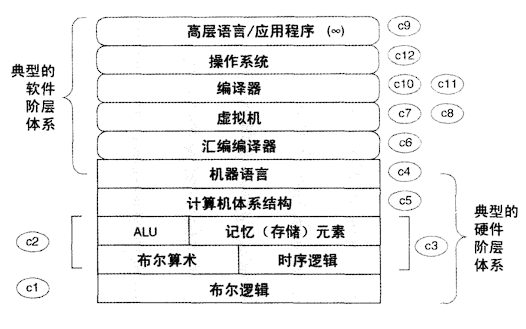

# 从零开始构建现代计算机

> What I hear, I forget; What I see, I remember; What I do, I understand.   
> 耳听为虚；眼见为实；实践出真知。  
> 不闻不若闻之，闻之不若见之，见之不若知之，知之不若行之；学至于行之而止矣。-- 孔子

计算机层级结构

计算机构建过程

## 布尔逻辑

## 布尔运算

## 时序逻辑

## 机器语言

## 计算机体系结构

## 汇编编译器

## 虚拟机I: 堆栈运算

## 虚拟机II: 程序控制

## 高级语言

## 编译器I：语法分析

## 编译器II：代码生成

## 操作系统

## References

- [书籍：计算机系统要素-从零开始构建现代计算机](https://book.douban.com/subject/1998341/)
- [配套网站：From Nand to Tetris](https://www.nand2tetris.org/)
- [实践代码](https://github.com/chaolinye/nand2tetris)