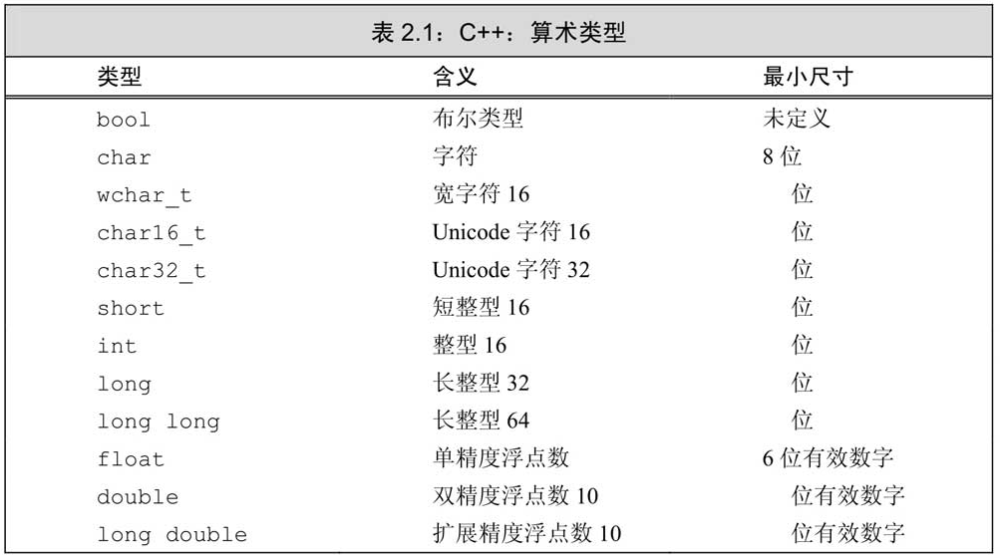
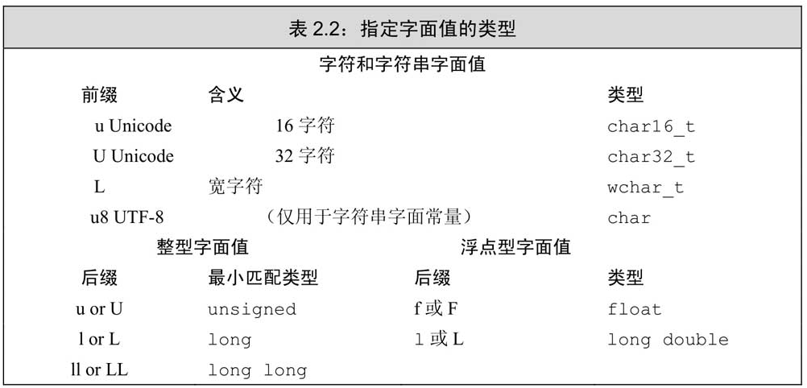
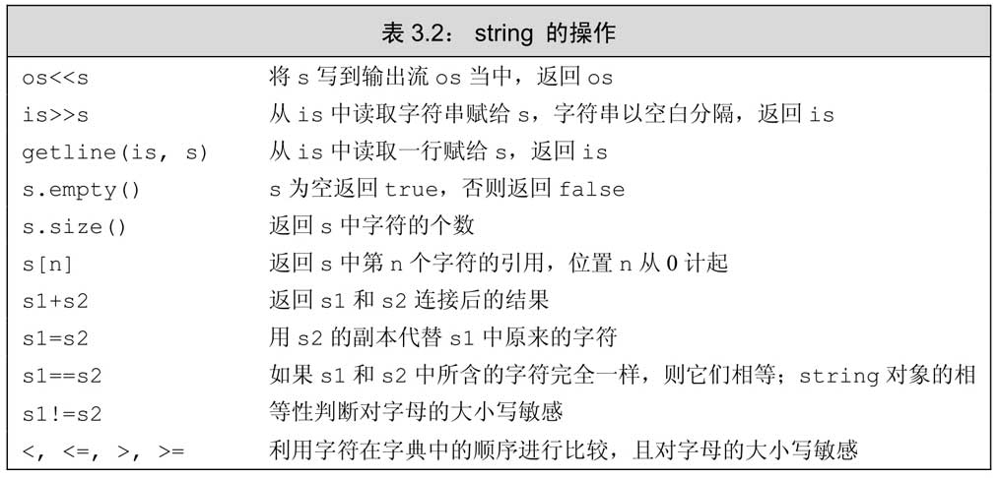
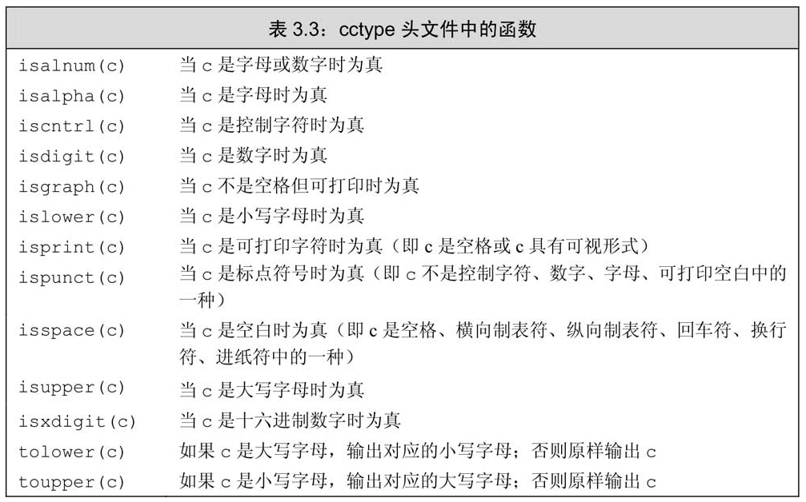
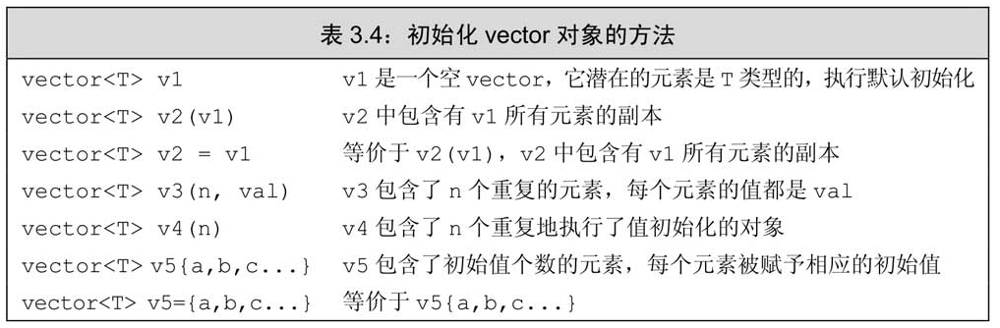
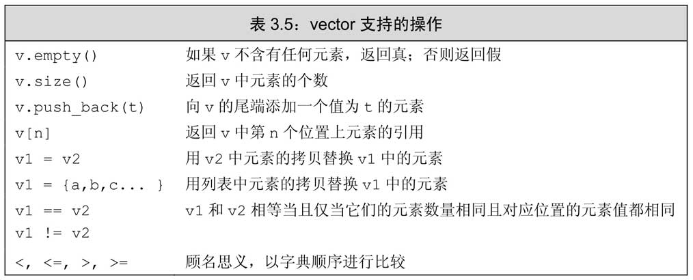

# C++ 语言特性

## 变量

C++ 中的每个变量都有其数据类型，数据类型决定着变量所占内存空间的大小和布局方式、该空间能存储的值的范围，以及变量能参与的运算。

> 对C++程序员来说，“变量（variable）”和“对象（object）”一般可以互换使用。**对象是指一块能存储数据并具有某种类型的内存空间**

变量定义的基本形式是：首先是类型说明符（type specifier），随后紧跟由一个或多个变量名组成的列表，其中变量名以逗号分隔，最后以分号结束

> 初始化不是赋值，初始化的含义是创建变量时赋予其一个初始值，而赋值的含义是把对象的当前值擦除，而以一个新值来替代。

### 变量的初始化

变量四种初始化形式

```cpp
// 初始化
int units_sold(0);
int units_sold = 0;
// 列表初始化，c++ 11 开始支持
int units_sold{0}
int units_sold = {0}
```

> 如果使用列表初始化且初始值存在丢失信息的风险，则编译器将报错；而普通方式可能会丢失精度

如果定义变量时没有指定初值，则变量被`默认初始化（default initialized）`，此时变量被赋予了“默认值”。默认值到底是什么由变量类型决定

> 一种例外情况是，定义在函数体内部的*内置类型*变量将**不被初始化**；但是*类类型*还是会初始化(默认构造函数)。

> 未初始化的变量含有一个不确定的值，使用未初始化变量的值是一种错误的编程行为并且很难调试。

变量初始化方式的区别可参考 [区别使用()和{}创建对象](https://cntransgroup.github.io/EffectiveModernCppChinese/3.MovingToModernCpp/item7.html)

- 括号初始化是最广泛使用的初始化语法，它防止**变窄转换**，并且对于 C++ 最令人头疼的解析有天生的免疫性
- 在构造函数重载决议中，括号初始化尽最大可能与 `std::initializer_list` 参数匹配，即便其他构造函数看起来是更好的选择
- 对于数值类型的 `std::vector` 来说使用花括号初始化和小括号初始化会造成巨大的不同
- 在模板类选择使用小括号初始化或使用花括号初始化创建对象是一个挑战。

### 声明和定义

C++语言支持分离式编译（separate compilation）机制，该机制允许将程序分割为若干个文件，每个文件可被独立编译。

为了支持分离式编译，C++语言将声明和定义区分开来。

声明（declaration）使得名字为程序所知，一个文件如果想使用别处定义的名字则必须包含对那个名字的声明。而定义（definition）负责创建与名字关联的实体。

c++ 中的声明

```cpp
extern int x;                       //对象声明

class Widget;                       //类声明

bool func(const Widget& w);         //函数声明

enum class Color;                   //限域enum声明
```

> 变量能且只能被定义一次，但是可以被多次声明。

> 变量的定义必须出现在且只能出现在一个文件中，而其他用到该变量的文件必须对其进行声明，却绝对不能重复定义。

> 定义在文件第一级的名字（变量、函数、类型）等属于全局作用域，整个进程可见。

## 类型

### 内置类型

内置类型分为

- 算术类型
    - 整型（包括字符和布尔类型）
    - 浮点型
- 空类型（void）

对于算术类型所占的比特会 C++ 标准只是规定了最小值（如下），真实大小会**因机器而异**



> 查看算数类型在本机的大小: `std::cout << sizeof(double) << std::endl;`

除去布尔型和扩展的字符型之外，其他整型可以划分为带符号的 `signed` 和无符号的 `unsigned` 两种

无符号整型用 `unsigned <type>` 表示，其中 `unsigned int` 可以缩写为 `unsigned`

如何选择类型？

- 尽量选用 **无符号类型**
- 使用 int 执行整数运算。如果数值超过了 int 的表示范围，选用 long long。
- 在算数表达式中不要使用 char 或 bool
- 执行浮点运算符选用 dobule。long double 提供的精度在一般情况下是没有必要的，况且它带来的运行时消耗也不容忽视。

#### 类型转换

对象的类型定义了对象能包含的数据和能参与的运算

- 当把一个非布尔类型的算术值赋给布尔类型时，初始值为0则结果为false，否则结果为true
- 当把一个布尔值赋给非布尔类型时，初始值为false则结果为0，初始值为true则结果为1。
- 当把一个浮点数赋给整数类型时，进行了近似处理。结果值将仅保留浮点数中小数点之前的部分
- 当把一个整数值赋给浮点类型时，小数部分记为0。如果该整数所占的空间超过了浮点类型的容量，精度可能有损失。
- 当赋给无符号类型一个超出它表示范围的值时，结果是初始值对无符号类型表示数值总数取模后的余数。
- 当我们赋给带符号类型一个超出它表示范围的值时，结果是未定义的（undefined）

!> 特别注意: 当一个算术表达式中既有无符号数又有int值时，那个int值就会转换成无符号数。把负数转换成无符号数类似于直接给无符号数赋一个负值，结果等于这个负数加上无符号数的模（比如 -42 转成无符号int，则等于 -42 + 2^32 ）。为了避免这种转换，切勿混用带符号类型和无符号类型

#### 字面值常量

一个形如 42 的值被称作`字面值常量（literal）`，这样的值一望而知。每个字面值常量都对应一种数据类型，**字面值常量的形式和值**决定了它的数据类型。

由单引号括起来的一个字符称为 **char 型字面值**，双引号括起来的零个或多个字符则构成**字符串型字面值**

字符串字面值的类型实际上是由常量字符构成的数组（array）, 编译器在每个字符串的结尾处添加一个空字符（`\0`），因此，字符串字面值的实际长度要比它的内容多1。

如果两个字符串字面值位置紧邻且仅由空格、缩进和换行符分隔，则它们实际上是一个整体。即**字符串可以写成多行模式**

```cpp
std::cout << "a really, really long string literal "
            "that spans two lines" << std::endl;
```



`true` 和 `false` 是布尔类型的字面值：`nullptr` 是指针字面值


### 复合类型

复合类型（compound type）是指基于其他类型定义的类型。最常的是 `引用` 和 `指针`。

#### 引用

引用（reference）为对象起了另外一个名字，引用类型引用（refers to）另外一种类型。

通过将声明符写成 &d 的形式来定义引用类型，其中 d 是声明的变量名

```cpp
int ival = 1024;
int &refVal = ival; // refVal 指向 ival（是 ival 的另一个名字）
int &refVal2；  // 报错：引用必须被初始化
```

> 引用即别名，**引用并非对象**，相反的，它只是为一个已经存在的对象所起的另外一个名字。

> 允许在一条语句中定义多个引用，其中每个引用标识符都必须以符号 `&` 开头

#### 指针

与引用类似，指针也实现了对其他对象的间接访问。

然而指针与引用相比又有很多不同点。

其一，指针本身就是一个对象，允许对指针赋值和拷贝，而且在指针的生命周期内它可以先后指向几个不同的对象。

其二，指针无须在定义时赋初值。和其他内置类型一样，在块作用域内定义的指针如果没有被初始化，也将拥有一个不确定的值。

指针存放某个对象的地址，要想获取该地址，需要使用取地址符（操作符 `&`）, 使用解引用符（操作符 `*`）来访问该对象

```cpp
int ival = 42;
int *p = &ival;
cout << *p;
```

`void＊` 是一种特殊的指针类型，可用于存放任意对象的地址。

利用 `void＊` 指针能做的事儿比较有限：拿它和别的指针比较、作为函数的输入或输出，或者赋给另外一个 `void＊` 指针。


#### 理解复合类型的声明

变量的定义包括**一个基本数据类型和一组声明符**。在同一条定义语句中，虽然基本数据类型只有一个，但是声明符的形式却可以不同。也就是说，一条定义语句可能定义出不同类型的变量：

```cpp
// i 是一个 int 型的数，p 是一个 int 型指针，r 是一个 int 型引用
int i = 1024, *p = &i, &r = i;
```

> 很多程序员容易迷惑于基本数据类型和类型修饰符的关系，其实后者不过是声明符的一部分罢了。

> 拼写的时候建议将 ＊（或是&）与变量名连在一起。比如 `int *p = &ival`

阅读声明语句建议从右往左阅读。离变量名最近的符号（下例中是 &r 的符号 &）对变量的类型有最直接的影响，因此r是一个引用。声明符的其余部分用以确定r引用的类型是什么，此例中的符号＊说明r引用的是一个指针

```cpp
int i = 42
int *p = &i;
int *&r = p; // r 是一个对指针 p 引用
```

#### const 限定符

因为const对象一旦创建后其值就不能再改变，所以const对象必须初始化

默认状态下，const对象仅在文件内有效。因为编译器需要将在编译过程中把用到该变量的地方都替换成对应的值。

如果 const 的值并不是常量表达式，然后想在多个文件之间共享 const 对象，必须在变量的声明和定义之前都添加 `extern` 关键字。

```cpp
// file_1.cc
extern const int bufSize = fcn();
// file_1.h
extern const int bufSize;
```

允许为一个常量引用绑定非常量的对象、字面值。

```cpp
const int &r1 = 42;
const int &r2 = r1 * 2;
int &r3 = r1 * 2;           // 错误，r3 是一个普通的非常量引用
```

> 在这种情况下，ri 绑定了一个`临时量`（temporary）对象。所谓临时量对象就是当编译器需要一个空间来暂存表达式的求值结果时临时创建的一个未命名的对象。

常量表达式（const expression）是指值不会改变并且在编译过程就能得到计算结果的表达式。

显然，字面值属于常量表达式，用常量表达式初始化的const对象也是常量表达式。

C++11 新标准规定，允许将变量声明为 constexpr 类型以便由编译器来验证变量的值是否是一个常量表达式。

> 一般来说，如果你认定变量是一个常量表达式，那就把它声明成 `constexpr` 类型。

### 类型别名

```cpp
typedef double wages;   // wages 是 double 的同义词
typedef wages base, *p; // base 是 double 的同义词，p 是 double* 的同义词
```

C++11 新标准规定了一种新的方法，别名声明

```cpp
using wages = double;   // wages 是 double 的同义词
```

使用类型别名+const：

```cpp
typedef char *pstring;
const pstring cstr = 0; // cstr 是指向 char 的常量指针
const char *astr = 0;   // astr 是指向常量 char 的指针
```

### auto

C++11 引入 auto 让编译器通过初始值来推算变量的类型。

auto 的类型推导基本和模板的类型推导一致。[具体规则](https://cntransgroup.github.io/EffectiveModernCppChinese/1.DeducingTypes/item1.html)

情景一：类型说明符是一个指针或引用但不是通用引用

> 这种情况，auto 就是去掉初始值的 `&` 或 `*` 修饰符，保留 `const` 

```cpp
int a = 27;
auto &x = a; // auto 是 int 类型，a 是 int& 类型
const int b = 27;
auto &y = b; // auto 是 const int 类型，b 是 const int& 类型
```

情景二：类型说明符一个通用引用

> 对于左值，添加 `&` 修饰符；对于右值，去掉 `&&` 修饰符

```cpp
auto&& uref1 = x;               //x是int左值，
                                //所以uref1类型为int&
auto&& uref2 = cx;              //cx是const int左值，
                                //所以uref2类型为const int&
auto&& uref3 = 27;              //27是int右值，
                                //所以uref3类型为int&&

```

情景三：类型说明符既不是指针也不是引用

> 就是对初始值的值拷贝，去掉 `const`

```cpp
auto x = 27;        // auto 是 int
const auto y = x;   // auto 是 int
auto z = y;         // auto 是 int
```

### decltype 类型指示符

`decltype` 的作用是选择并返回操作数的数据类型。decltype 的类型推导更加的符合直觉

```cpp
const int i = 0;                //decltype(i)是const int

bool f(const Widget& w);        //decltype(w)是const Widget&
                                //decltype(f)是bool(const Widget&)

struct Point{
    int x,y;                    //decltype(Point::x)是int
};                              //decltype(Point::y)是int

Widget w;                       //decltype(w)是Widget

if (f(w))…                      //decltype(f(w))是bool

template<typename T>            //std::vector的简化版本
class vector{
public:
    …
    T& operator[](std::size_t index);
    …
};

vector<int> v;                  //decltype(v)是vector<int>
…
if (v[0] == 0)…                 //decltype(v[0])是int&
```

在 C++11 中，decltype 最主要的用途就是用于声明函数模板，而这个函数返回类型依赖于形参类型。

```cpp
template<typename Container, typename Index> 
auto authAndAccess(Container& c, Index i)      
    ->decltype(c[i])
{
    authenticateUser();
    return c[i];
}
```

推导规则：

- decltype 总是不加修改的产生变量或者表达式的类型。
- 对于 T 类型的*不是单纯的变量名的左值表达式*，decltype 总是产出T的引用即 T&。 
- C++14 支持 `decltype(auto)`，就像auto一样，推导出类型，但是它**使用 decltype 的规则进行推导**。

!> 尽量不要用 `decltype(auto)` 推导不是单纯变量名的左值表达式

```cpp
decltype(auto) f1()
{
    int x = 0;
    …
    return x;                            //decltype(x）是int，所以f1返回int
}

decltype(auto) f2()
{
    int x = 0;
    return (x);                          //decltype((x))是int&，所以f2返回int&, 临时变量，很危险
}
```

### 类

c++ 可以使用 `struct` 和 class 关键字定义类

> 使用 `struct` 主要的目的是兼容 c 语言

> 两者的唯一区别是 `struct` 的成员默认是 `public`，而 `class` 的成员默认是 `private`

!> 类定义末尾的分号必不可少

## 数据结构

### string

标准库类型 string 表示可变长的字符序列，使用 string 类型必须首先包含 `string` 头文件。

```cpp
#include <string>
using std::string;

string s1;              // 默认初始化，空字符串
string s2 = s1;         // s2 是 s1 的副本
string s3 = "hiya";     // s3 是该字符串字面值的副本
string s4(10, 'c')      // s4 的内容是 cccccccccc
```



> string::size() 返回的是 `string::size_t` 类型，是一个无符号类型，不要用 int 类型替代

字符串拼接(+)：

当把 string 对象和字符字面值及字符串字面值混在一条语句中使用时，必须确保每个加法运算符（+）的两侧的运算对象至少有一个是string：

```cpp
string a, b;
string c = a + b;
string d = "cc" + c;
string e = "cc " + "dd"; // 错误, 字面值是 C 字符串，C 字符串不能用 + 号拼接
string f = "cc " "dd";
```

字符的遍历

```cpp
string str("some string");
// for each
for(auto &c : str) {
    cout << toupper(c) << endl;
}

// for
for (decltype(str.size()) index = 0; index < s.size(); ++index) {
    str[index] = toupper(str[index]);
}
```

!> Java 中的 String 是不可变对象，而 C++ 中的 std::string 并不是

字符的工具库 `cctype`



### vector

标准库类型 vector 表示对象的集合，其中所有对象的类型都相同。在 c++ 中常被成为 **容器**





!> vector对象（以及string对象）的下标运算符可用于访问已存在的元素，而不能用于添加元素。

!> 如果循环体内部包含有向 vector 对象添加元素的语句，则不能使用范围for循环。**范围 for 语句体内不应改变其所遍历序列的大小**

> 对 Java 的 ArrayList 不一样。C++ 中 vector 的最佳实践**不要设置初始容量**，这样性能更优。C++标准要求 vector 应该能在运行时高效快速地添加元素。因此既然vector对象能高效地增长，那么在定义vector对象的时候设定其大小也就没什么必要了，事实上如果这么做性能可能更差

## 控制语句

### 循环

- `while(condition) { statement }`
- `do { statement } while(condition)`
- `for(initial statement;condition;after statement) { statement }`
- `for(declaration : expression) { statement }`

### 判断

- `if (condition) { statement} else if (anoter condition) { statement } else { statement }`

## 表达式

## 注释

- 单行注释: `//`
- 多行注释: `/*   */` 

## 模块化

### 命名空间

C++ 使用命令空间来避免变量污染和冲突。

```cpp
namespace abc {
    int a = 0;
}

// 多层命名空间
namespace abc {
    namespace def {
        int a = 0;
    }
}

// C++17 的多层命名空间新语法
namespace abc::def {
    int a = 0;
}
```

使用命名空间

```cpp
// 直接调用
std::cout << abc::def::a << std::endl;

// 更严谨的写法(避免第一级命名空间和当前命名空间变量冲突)
std::cout << ::abc::def::a << std::endl;

// 使用 using 简化命名空间中某个名称，类似于 java 中的 import
using abc::def::a;
std::cout << a << std::endl;

// 使用 using namespace 简化命名空间中所有命名，容易产生冲突，不建议使用
using namespace abc::def;
std::cout << a << std::endl;
```

### 头文件

> 头文件的后缀没有规定，通常使用 `.h`

> `#include` 标准库的头文件应该用尖括号 `<>` 包围，对于不属于标准库的头文件，则用双引号`" "`包围。

`#include` 工作原理：当预处理器看到 `#include` 标记时就会用指定的头文件的内容代替 `#include`。

为了避免头文件被多次 #include，可以使用预处理功能中头文件保护符 `#ifndef/#endif` + `#define` 来实现。

>  整个程序中的预处理变量包括头文件保护符必须唯一，通常的做法是基于头文件中类的名字来构建保护符的名字，以确保其唯一性。为了避免与程序中的其他实体发生名字冲突，一般把预处理变量的名字全部大写。


```cpp
#ifndef SALES_DATA_H
#define SALES_DATA_H
// 头文件内容
#endif
```

或者使用更简单 `#pragma once` （非 C++ 标准，但是大部分编译器都实现了，属于事实标准）

```cpp
#pragma once
// 头文件内容
```

## IO

C++ 语言并未定义任何输入输出（IO）语句，而是通过标准库(`iostream`)来提供 IO 机制.

- 标准输出: `std:cout`
- 标准输入: `std:cin`
- 错误输出: `std:cerr` 

> Linux 中重定向标准IO： `./executable_file <infile >outfile 2>errfile`

- 输出运算符: `<<`
- 输入运算符: `>>`

> 输入输出运算符的返回值都是**左侧对象**

```cpp
#include <iostream>
int main() {
    std::cout << "Enter two number:" << std::endl;
    int v1 = 0, v2 = 0;
    std::cin >> v1 >> v2;
    std::cout << "The sum of " << v1 << " and " << v2 << "is" << v1 + v2 << std::endl;
    return 0;
}
```

## 模板和泛型


## References

- [Effective Modern C++](https://cntransgroup.github.io/EffectiveModernCppChinese/Introduction)
- [学会查看类型推导结果](https://cntransgroup.github.io/EffectiveModernCppChinese/1.DeducingTypes/item4.html)
- [GCC STL 源码](https://github.com/gcc-mirror/gcc/tree/master/libstdc++-v3/src)