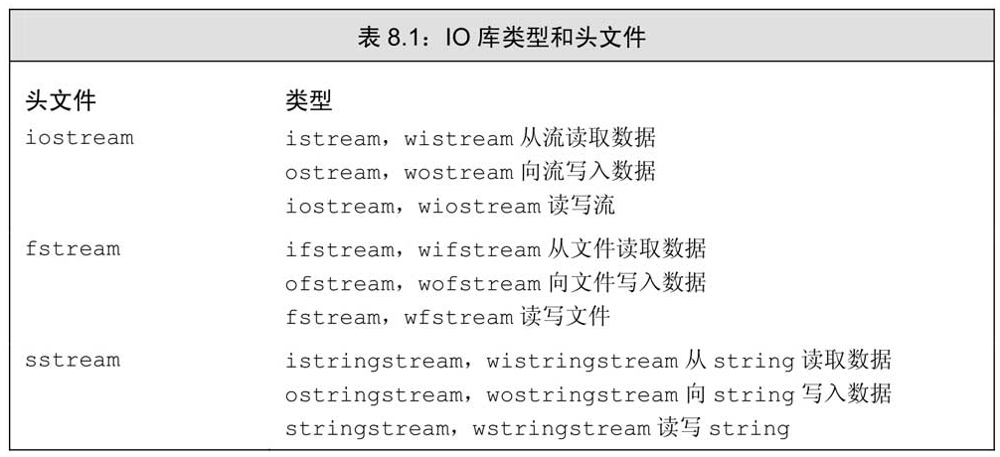
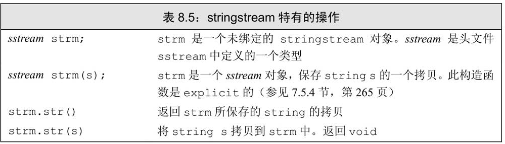
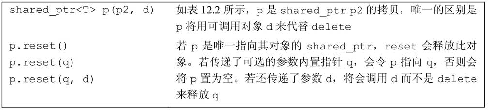
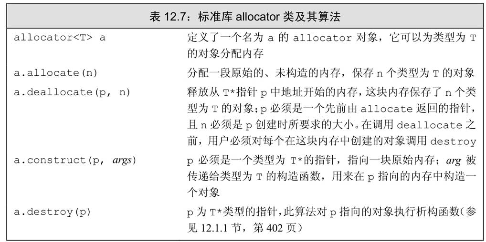
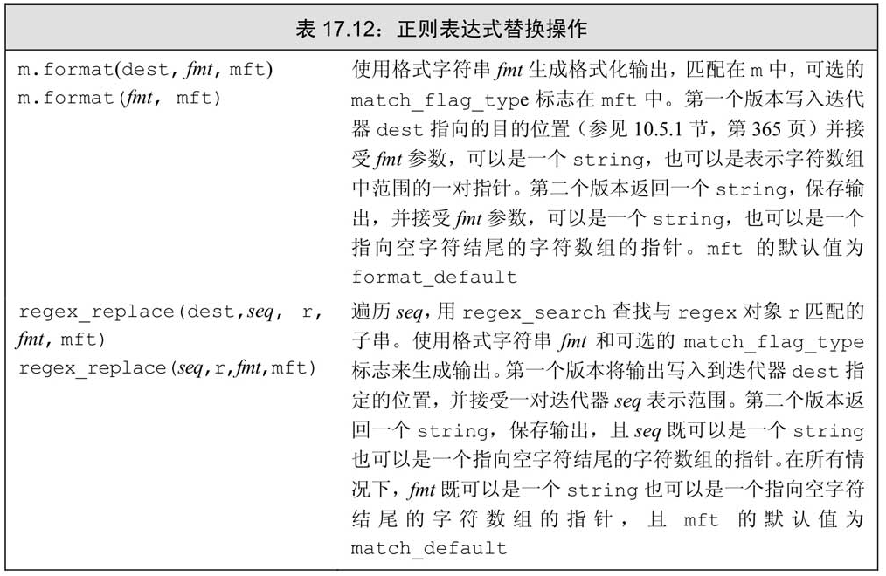

# C++ 语言特性

## 变量

C++ 中的每个变量都有其数据类型，数据类型决定着变量所占内存空间的大小和布局方式、该空间能存储的值的范围，以及变量能参与的运算。

> 对C++程序员来说，“变量（variable）”和“对象（object）”一般可以互换使用。**对象是指一块能存储数据并具有某种类型的内存空间**

变量定义的基本形式是：首先是类型说明符（type specifier），随后紧跟由一个或多个变量名组成的列表，其中变量名以逗号分隔，最后以分号结束

> 初始化不是赋值，初始化的含义是创建变量时赋予其一个初始值，而赋值的含义是把对象的当前值擦除，而以一个新值来替代。

### 变量的初始化

变量四种初始化形式

```cpp
// 初始化
int units_sold(0);
int units_sold = 0;
// 列表初始化，c++ 11 开始支持
int units_sold{0}
int units_sold = {0}
```

> 如果使用列表初始化且初始值存在丢失信息的风险，则编译器将报错；而普通方式可能会丢失精度

如果定义变量时没有指定初值，则变量被`默认初始化（default initialized）`，此时变量被赋予了“默认值”。默认值到底是什么由变量类型决定

!> 定义在块内的*内置类型*和*复合类型*变量将**不被初始化**；但是*类类型*还是会初始化(默认构造函数)。

> 未初始化的变量含有一个不确定的值，使用未初始化变量的值是一种错误的编程行为并且很难调试。

变量初始化方式的区别可参考 [区别使用()和{}创建对象](https://cntransgroup.github.io/EffectiveModernCppChinese/3.MovingToModernCpp/item7.html)

- 括号初始化是最广泛使用的初始化语法，它防止**变窄转换**，并且对于 C++ 最令人头疼的解析有天生的免疫性
- 在构造函数重载决议中，括号初始化尽最大可能与 `std::initializer_list` 参数匹配，即便其他构造函数看起来是更好的选择
- 对于数值类型的 `std::vector` 来说使用花括号初始化和小括号初始化会造成巨大的不同
- 在模板类选择使用小括号初始化或使用花括号初始化创建对象是一个挑战。

### 声明和定义

C++语言支持分离式编译（separate compilation）机制，该机制允许将程序分割为若干个文件，每个文件可被独立编译。

为了支持分离式编译，C++语言将声明和定义区分开来。

声明（declaration）使得名字为程序所知，一个文件如果想使用别处定义的名字则必须包含对那个名字的声明。而定义（definition）负责创建与名字关联的实体。

c++ 中的声明

```cpp
extern int x;                       //变量声明

class Widget;                       //类声明

bool func(const Widget& w);         //函数声明

enum class Color;                   //限域enum声明
```

> 变量能且只能被定义一次，但是可以被多次声明。

> 变量的定义必须出现在且只能出现在一个文件中，而其他用到该变量的文件必须对其进行声明，却绝对不能重复定义。

> 定义在文件第一级的名字（变量、函数、类型）等属于全局作用域，整个进程可见。

## 类型

### 内置类型

内置类型分为

- 算术类型
    - 整型（包括字符和布尔类型）
    - 浮点型
- 空类型（void）

对于算术类型所占的比特会 C++ 标准只是规定了最小值（如下），真实大小会**因机器而异**


> 查看算数类型在本机的大小: `std::cout << sizeof(double) << std::endl;`

除去布尔型和扩展的字符型之外，其他整型可以划分为带符号的 `signed` 和无符号的 `unsigned` 两种

无符号整型用 `unsigned <type>` 表示，其中 `unsigned int` 可以缩写为 `unsigned`

如何选择类型？

- 尽量选用 **无符号类型**
- 使用 int 执行整数运算。如果数值超过了 int 的表示范围，选用 long long。
- 在算数表达式中不要使用 char 或 bool
- 执行浮点运算符选用 dobule。long double 提供的精度在一般情况下是没有必要的，况且它带来的运行时消耗也不容忽视。

#### 类型转换

对象的类型定义了对象能包含的数据和能参与的运算

- 当把一个非布尔类型的算术值赋给布尔类型时，初始值为0则结果为false，否则结果为true
- 当把一个布尔值赋给非布尔类型时，初始值为false则结果为0，初始值为true则结果为1。
- 当把一个浮点数赋给整数类型时，进行了近似处理。结果值将仅保留浮点数中小数点之前的部分
- 当把一个整数值赋给浮点类型时，小数部分记为0。如果该整数所占的空间超过了浮点类型的容量，精度可能有损失。
- 当赋给无符号类型一个超出它表示范围的值时，结果是初始值对无符号类型表示数值总数取模后的余数。
- 当我们赋给带符号类型一个超出它表示范围的值时，结果是未定义的（undefined）

!> 特别注意: 当一个算术表达式中既有无符号数又有int值时，那个int值就会转换成无符号数。把负数转换成无符号数类似于直接给无符号数赋一个负值，结果等于这个负数加上无符号数的模（比如 -42 转成无符号int，则等于 -42 + 2^32 ）。为了避免这种转换，切勿混用带符号类型和无符号类型

#### 字面值常量

一个形如 42 的值被称作`字面值常量（literal）`，这样的值一望而知。每个字面值常量都对应一种数据类型，**字面值常量的形式和值**决定了它的数据类型。

由单引号括起来的一个字符称为 **char 型字面值**，双引号括起来的零个或多个字符则构成**字符串型字面值**

字符串字面值的类型实际上是由常量字符构成的数组（array）, 编译器在每个字符串的结尾处添加一个空字符（`\0`），因此，字符串字面值的实际长度要比它的内容多1。

如果两个字符串字面值位置紧邻且仅由空格、缩进和换行符分隔，则它们实际上是一个整体。即**字符串可以写成多行模式**

```cpp
std::cout << "a really, really long string literal "
            "that spans two lines" << std::endl;
```


`true` 和 `false` 是布尔类型的字面值：`nullptr` 是指针字面值


### 复合类型

复合类型（compound type）是指基于其他类型定义的类型。最常的是 `引用` 和 `指针`。

#### 引用

引用（reference）为对象起了另外一个名字，引用类型引用（refers to）另外一种类型。

通过将声明符写成 &d 的形式来定义引用类型，其中 d 是声明的变量名

```cpp
int ival = 1024;
int &refVal = ival; // refVal 指向 ival（是 ival 的另一个名字）
int &refVal2；  // 报错：引用必须被初始化
```

> 引用即别名，**引用并非对象**，相反的，它只是为一个已经存在的对象所起的另外一个名字。

> 允许在一条语句中定义多个引用，其中每个引用标识符都必须以符号 `&` 开头

#### 指针

与引用类似，指针也实现了对其他对象的间接访问。

然而指针与引用相比又有很多不同点。

其一，指针本身就是一个对象，允许对指针赋值和拷贝，而且在指针的生命周期内它可以先后指向几个不同的对象。

其二，指针无须在定义时赋初值。和其他内置类型一样，在块作用域内定义的指针如果没有被初始化，也将拥有一个不确定的值。

指针存放某个对象的地址，要想获取该地址，需要使用取地址符（操作符 `&`）, 使用解引用符（操作符 `*`）来访问该对象

```cpp
int ival = 42;
int *p = &ival;
cout << *p;
```

`void＊` 是一种特殊的指针类型，可用于存放任意对象的地址。

利用 `void＊` 指针能做的事儿比较有限：拿它和别的指针比较、作为函数的输入或输出，或者赋给另外一个 `void＊` 指针。


#### 理解复合类型的声明

变量的定义包括**一个基本数据类型和一组声明符**。在同一条定义语句中，虽然基本数据类型只有一个，但是声明符的形式却可以不同。也就是说，一条定义语句可能定义出不同类型的变量：

```cpp
// i 是一个 int 型的数，p 是一个 int 型指针，r 是一个 int 型引用
int i = 1024, *p = &i, &r = i;
```

> 很多程序员容易迷惑于基本数据类型和类型修饰符的关系，其实后者不过是声明符的一部分罢了。

> 拼写的时候建议将 ＊（或是&）与变量名连在一起。比如 `int *p = &ival`

阅读声明语句建议从右往左阅读。离变量名最近的符号（下例中是 &r 的符号 &）对变量的类型有最直接的影响，因此r是一个引用。声明符的其余部分用以确定r引用的类型是什么，此例中的符号＊说明r引用的是一个指针

```cpp
int i = 42
int *p = &i;
int *&r = p; // r 是一个对指针 p 引用
```

#### const 限定符

因为const对象一旦创建后其值就不能再改变，所以const对象必须初始化

默认状态下，const对象仅在文件内有效。因为编译器需要将在编译过程中把用到该变量的地方都替换成对应的值。

如果 const 的值并不是常量表达式，然后想在多个文件之间共享 const 对象，必须在变量的声明和定义之前都添加 `extern` 关键字。

```cpp
// file_1.cc
extern const int bufSize = fcn();
// file_1.h
extern const int bufSize;
```

允许为一个常量引用绑定非常量的对象、字面值。

```cpp
const int &r1 = 42;
const int &r2 = r1 * 2;
int &r3 = r1 * 2;           // 错误，r3 是一个普通的非常量引用
```

> 在这种情况下，ri 绑定了一个`临时量`（temporary）对象。所谓临时量对象就是当编译器需要一个空间来暂存表达式的求值结果时临时创建的一个未命名的对象。

常量表达式（const expression）是指值不会改变并且在编译过程就能得到计算结果的表达式。

显然，字面值属于常量表达式，用常量表达式初始化的const对象也是常量表达式。

C++11 新标准规定，允许将变量声明为 constexpr 类型以便由编译器来验证变量的值是否是一个常量表达式。

> 一般来说，如果你认定变量是一个常量表达式，那就把它声明成 `constexpr` 类型。

### 类型别名

```cpp
typedef double wages;   // wages 是 double 的同义词
typedef wages base, *p; // base 是 double 的同义词，p 是 double* 的同义词
```

C++11 新标准规定了一种新的方法，别名声明

```cpp
using wages = double;   // wages 是 double 的同义词
```

使用类型别名+const：

```cpp
typedef char *pstring;
const pstring cstr = 0; // cstr 是指向 char 的常量指针
const char *astr = 0;   // astr 是指向常量 char 的指针
```

### auto

C++11 引入 auto 让编译器通过初始值来推算变量的类型。

auto 的类型推导基本和模板的类型推导一致。[具体规则](https://cntransgroup.github.io/EffectiveModernCppChinese/1.DeducingTypes/item1.html)

情景一：类型说明符是一个指针或引用但不是通用引用

> 这种情况，auto 就是去掉初始值的 `&` 或 `*` 修饰符，保留 `const` 

```cpp
int a = 27;
auto &x = a; // auto 是 int 类型，a 是 int& 类型
const int b = 27;
auto &y = b; // auto 是 const int 类型，b 是 const int& 类型
```

情景二：类型说明符一个通用引用

> 对于左值，添加 `&` 修饰符；对于右值，去掉 `&&` 修饰符

```cpp
auto&& uref1 = x;               //x是int左值，
                                //所以uref1类型为int&
auto&& uref2 = cx;              //cx是const int左值，
                                //所以uref2类型为const int&
auto&& uref3 = 27;              //27是int右值，
                                //所以uref3类型为int&&

```

情景三：类型说明符既不是指针也不是引用

> 就是对初始值的值拷贝，去掉 `const`

```cpp
auto x = 27;        // auto 是 int
const auto y = x;   // auto 是 int
auto z = y;         // auto 是 int
```

### decltype 类型指示符

`decltype` 的作用是选择并返回操作数的数据类型。decltype 的类型推导更加的符合直觉

```cpp
const int i = 0;                //decltype(i)是const int

bool f(const Widget& w);        //decltype(w)是const Widget&
                                //decltype(f)是bool(const Widget&)

struct Point{
    int x,y;                    //decltype(Point::x)是int
};                              //decltype(Point::y)是int

Widget w;                       //decltype(w)是Widget

if (f(w))…                      //decltype(f(w))是bool

template<typename T>            //std::vector的简化版本
class vector{
public:
    …
    T& operator[](std::size_t index);
    …
};

vector<int> v;                  //decltype(v)是vector<int>
…
if (v[0] == 0)…                 //decltype(v[0])是int&
```

在 C++11 中，decltype 最主要的用途就是用于声明函数模板，而这个函数返回类型依赖于形参类型。

```cpp
template<typename Container, typename Index> 
auto authAndAccess(Container& c, Index i)      
    ->decltype(c[i])
{
    authenticateUser();
    return c[i];
}
```

推导规则：

- decltype 总是不加修改的产生变量或者表达式的类型。
- 对于 T 类型的*不是单纯的变量名的左值表达式*，decltype 总是产出T的引用即 T&。 
- C++14 支持 `decltype(auto)`，就像auto一样，推导出类型，但是它**使用 decltype 的规则进行推导**。

!> 尽量不要用 `decltype(auto)` 推导不是单纯变量名的左值表达式

```cpp
decltype(auto) f1()
{
    int x = 0;
    …
    return x;                            //decltype(x）是int，所以f1返回int
}

decltype(auto) f2()
{
    int x = 0;
    return (x);                          //decltype((x))是int&，所以f2返回int&, 临时变量，很危险
}
```

## 表达式

### 算术运算符


### 逻辑运算符


### 位运算符


!> 关于符号位如何处理没有明确的规定，所以强烈建议仅将位运算符用于处理无符号类型。

### 赋值运算符和复合赋值运算符

### 递增和递减运算符

!> 除非必须，否则不用递增递减运算符的后置版本。因为前置版本性能更优

后置递增运算符的优先级高于解引用运算符，因此`＊pbeg++`等价于`＊（pbeg++）`

### 成员访问运算符

包括点运算符和箭头运算符

表达式 `ptr->mem` 等价于 `(*ptr).mem：`

### 条件运算符

`cond ? expr1 : expr2;`

### sizeof 运算符

`sizeof (type)` 或者 `sizeof expr` (返回表达式结果类型的大小)

```cpp
Sales_data data, *p;
sizeof(Sales_data); // 存储 Sales_data 类型的对象所占的空间大小
sizeof data;        // data 的类型的大小，即 sizeof(Sales_data)
sizeof p;           // 指针所占的空间的大小 
sizeof *p;          // p 所指类型的空间大小，即 sizeof(Sales_data)
sizeof data.revenue;    // Sales_data 的 revenues 成员对应类型的大小
sizeof Sales_data::revenue; // 另一种获取 revenue 大小的方式
```

> sizeof 的运算对象中解引用一个无效指针仍然是一种安全的行为，因为指针实际上并没有被真正使用。sizeof 不需要真的解引用指针也能知道它所指对象的类型。

> 注意，sizeof运算不会把数组转换成指针来处理。

> 对 string 对象或 vector 对象执行sizeof运算只返回该类型固定部分的大小，不会计算对象中的元素占用了多少空间。

### 逗号运算符

对于逗号运算符来说，首先对左侧的表达式求值，然后将求值结果丢弃掉。逗号运算符真正的结果是右侧表达式的值

### 类型转换

在下面这些情况下，编译器会自动地转换运算对象的类型：

- 在大多数表达式中，比 int 类型小的整型值首先提升为较大的整数类型。
- 在条件中，非布尔值转换成布尔类型。
- 初始化过程中，初始值转换成变量的类型；
- 在赋值语句中，右侧运算对象转换成左侧运算对象的类型。
- 如果算术运算或关系运算的运算对象有多种类型，需要转换成同一种类型。

显式转换

`cast-name<type>(expression)`

cast-name 是 `static_cast`、`dynamic_cast`、`const_cast` 和 `reinterpret_cast` 中的一种

### 运算符优先级


### lambda 表达式

[文档](https://www.apiref.com/cpp-zh/cpp/language/lambda.html)

c++ 中的可调用对象有四种：函数、函数指针、重载了函数调用运算符的类以及 lambda 表达式

lambda 表达式的形式: `[capture list](parameter list) -> return type { function body }`

可以忽略参数列表和返回类型，但必须永远包含捕获列表和函数体

```cpp
auto f = [] {return 42;};

cout << f() << endl;
```

当定义一个 lambd a时，编译器生成一个与 lambda 对应的新的（未命名的）类类型。

> 如果 lambda 的函数体包含任何单一 return 语句之外的内容，且未指定返回类型，则返回 `void`。有其它语句会导致编译器无法推导出返回类型

> 一个 lambda 只有在其捕获列表中捕获一个它所在函数中的局部变量，才能在函数体中使用该变量。本质上 lambda 是一个类，捕获列表可以理解是构造函数入参

> 捕获列表只用于局部非static变量，lambda 可以直接使用局部 static 变量和在它所在函数之外声明的名字。

> 当以引用方式捕获一个变量时，必须保证在lambda执行时变量是存在的。


使用函数和[标准库bind函数](https://www.apiref.com/cpp-zh/cpp/utility/functional/bind.html)可以替换带有捕获列表的 lambda 表达式

```cpp
using std::placeholders::_1;
// check6 是一个可调用对象，接受一个 string 类型的参数
// 并用此 string 和值 6 来调用 check_size
auto check6 = bind(check_size, _1, 6);
```

对于所有可调用对象可以使用 `std::function` 来存储

```cpp
function<int(int, int)> f1 = add;   // 函数指针
f1 = divide();                      // 函数对象类的对象
f1 = [] (int i, int j ) { return i * j; }   // lambda
```

## 语句

### 条件语句

- `if (condition) { statement} else if (anoter condition) { statement } else { statement }`

- `switch(ch) { case ival: statement; case ival2: statement; break; default: statement;}`

> case标签必须是整型常量表达式

### 迭代语句

- `while(condition) { statement }`
- `do { statement } while(condition)`
- `for(initial statement;condition;after statement) { statement }`
- `for(declaration : expression) { statement }`

> 范围 for 语句中的 `expression` 表示的必须是一个序列，比如用花括号括起来的**初始值列表、数组或者 vector 或 string** 等类型的对象，这些类型的共同特点是拥有能返回迭代器的 begin 和 end 成员。

### 跳转语句

break

continue

goto

> 不要在程序中使用goto语句，因为它使得程序既难理解又难修改。

### try 和 throw 语句

```cpp
try {
    // programe-statements
} catch (exception-declaration) {
    // handler-statements
} catch (exception-declaration) {
    // handler-statements
}
```

> 和 Java 异常不一样，c++ 没有受检异常，都是 Runtime 异常；另外 c++ 可以 throw 任何对象，当前还是推荐使用标准库（`stdexcpt`）的异常类


## 函数

> 尽管实参与形参存在对应关系，但是并没有规定实参的求值顺序

> 大多数类型都能用作函数的返回类型。一种特殊的返回类型是 `void`，它表示函数不返回任何值。**函数的返回类型不能是数组类型或函数类型**，但可以是指向数组或函数的指针。

### 局部静态对象

函数中可以使用 static 定义局部静态对象（local static object），这种对象在程序的执行路径第一次经过对象定义语句时初始化，并且直到程序终止才被销毁，在此期间即使对象所在的函数结束执行也不会对它有影响。

> 内置类型的局部静态变量默认初始化为0。

```cpp
size_t count_calls() {
    static size_t ctr = 0; // 调用结束后，这个值仍然有效
    return ++ctr;
}
int main() {
    for (size_t i = 0; i != 10; ++i) {
        cout << count_calls() << endl;
    }
    return 0;
}
```

### 参数传递

C++ 函数的参数传递有两种形式: `值传递` 和 `引用传递`

> 熟悉 C 的程序员常常使用指针类型的形参访问函数外部的对象。在 C++ 语言中，建议使用引用类型的形参替代指针

> 如果函数无须改变引用形参的值，最好将其声明为常量引用。使用引用而非常量引用也会极大地限制函数所能接受的实参类型

可变形参的两种实现方式: `initializer_list` 形参和省略符形参 

!> 省略符形参应该仅仅用于 C 和 C++ 通用的类型。特别应该注意的是，**大多数类类型的对象在传递给省略符形参时都无法正确拷贝**。

### 函数返回

> 不要返回局部对象的引用或指针

返回数组类型指针的函数声明的方式： 

- `int (*func(int))[10]`

- 尾置返回类型: `auto func(int) -> int (*) [10]`

### 函数重载

> 在 C++ 语言中，名字查找发生在类型检查之前。所以局部一个方法，可以覆盖外部多个重载方法

### 默认实参

> 一旦某个形参被赋予了默认值，它后面的所有形参都必须有默认值。

> 通常，应该在函数声明中指定默认实参，并将该声明放在合适的头文件中。

### 内联函数

> 内联说明只是向编译器发出的一个请求，编译器可以选择忽略这个请求。

### constexpr 函数

constexpr函数是指能用于常量表达式的函数。

> 函数的返回类型及所有形参的类型都得是字面值类型，而且函数体中必须有且只有一条return语句：

> 执行该初始化任务时，编译器把对constexpr函数的调用替换成其结果值。为了能在编译过程中随时展开，constexpr函数被隐式地指定为内联函数。

### 函数指针

```cpp
// pf 指向一个函数
bool (*pf)(const string&, const string&);
```

> 可以直接使用指向函数的指针调用该函数，无须提前解引用指针：

> 当我们把函数名作为一个值使用时，该函数自动地转换成指针

## 类

c++ 可以使用 `struct` 和 `class` 关键字定义类

> 使用 `struct` 主要的目的是兼容 c 语言

> 两者的唯一区别是 `struct` 的成员默认是 `public`，而 `class` 的成员默认是 `private`

!> 类定义末尾的分号必不可少

> 成员函数的声明必须在类的内部，它的定义则既可以在类的内部也可以在类的外部。

> 定义在类内部的函数是隐式的inline函数

> 成员函数通过一个名为 this(指针) 的额外的隐式参数来访问调用它的那个对象。

### const 成员函数

使用 const 的成员函数被称作常量成员函数（const member function）。

```cpp
std:string isbn() const {
    return this->bookNo;
}
```

> 常量对象，以及常量对象的引用或指针都只能调用常量成员函数。不能在一个常量对象上调用普通的成员函数

### 类作用域

编译器分两步处理类：首先编译成员的声明，然后才轮到成员函数体（如果有的话）。因此，成员函数体可以随意使用类中的其他成员而无须在意这些成员出现的次序。

类外部定义的成员的名字必须包含它所属的类名

```cpp
double Sales_data::avg_price() const {
    if (units_sold) {
        return revenuke/units_sold;
    } else {
        return 0;
    }
}
```

### 构造函数

如果我们的类没有显式地定义构造函数，那么编译器就会为我们隐式地定义一个默认构造函数。编译器创建的构造函数又被称为合成的默认构造函数。

调用默认构造函数的正确姿势：

```cpp
Sales_data obj();   // 错误：声明了一个函数而非对象
Sales_data obj2;    // 正确：obj2 是一个对象而非函数
```

这个合成的默认构造函数将按照如下规则初始化类的数据成员：

- 如果存在类内的初始值，用它来初始化成员。
- 否则，默认初始化该成员

> 只有当类没有声明任何构造函数时，编译器才会自动地生成默认构造函数。

如果类包含有内置类型或者复合类型的成员，则只有当这些成员全都被赋予了类内的初始值时，这个类才适合于使用合成的默认构造函数。

> 由于定义在块中的内置类型或复合类型（比如数组和指针）的对象被默认初始化，则它们的值将是未定义的

> 如果类中包含一个其他类类型的成员且这个成员的类型没有默认构造函数，那么编译器将无法初始化该成员。

在 C++11 新标准中，如果我们需要默认的行为，那么可以通过在参数列表后面写上 `= default` 来要求编译器生成构造函数。

```cpp
struct Sales_data {
    Sales_data() = default;
    // 使用构造函数初始值列表
    Sales_data(const std::string &s): bookNo(s) {}
}
```

C++ 使用`构造函数初始值列表`的覆盖类内初始值，没有出现在构造函数初始值列表中的成员将通过相应的类内初始值（如果存在的话）初始化，或者执行默认初始化。

> 初始值列表用于类成员变量的初始化，性能更优；构造函数内也可以给类成员变量赋值，复杂的场景可能需要。

> 如果成员是 const、引用，或者属于某种未提供默认构造函数的类类型，我们必须通过构造函数初始值列表为这些成员提供初值。

委托构造函数


```cpp
class Sales_data {
    public:
        Sales_data(std::string s, unsigned cnt, double price):
            bookNo(s), units_sold(cnt), revenue(cnt * price) {}
        // 其余构造函数全都委托给另一个构造函数
        Sales_data(): Sales_data("", 0, 0) {}
        Sales_data(std::string s): Sales_data(s, 0, 0) {}
}
```

转换构造函数（converting constructor）能通过一个实参调用的构造函数定义了一条从构造函数的参数类型向类类型隐式转换的规则。

> 可以通过将构造函数声明为 `explicit` 阻止隐式替换。`explicit` 只允许出现在类内的构造函数声明处

> 当用 explicit 关键字声明构造函数时，它将只能以直接初始化的形式使用

### 访问控制与封装

访问说明符

```cpp
class Sales_data {
    // 友元声明
    friend Sales_data add (const Sales_data&, const Sales_data&);
    public:         // 添加了访问说明符
        Sales_data() = default;
        std::string isbn const { return bookNo; }
    private:
        double avg_price() const {
            return units_sold ? revenue / units_sold : 0;
        }
}
```

类可以允许其他类或者函数访问它的非公有成员，方法是令其他类或者函数成为它的友元（friend）。如果类想把一个函数作为它的友元，只需要增加一条以`friend` 关键字开始的函数声明语句即可

友元声明只能出现在类定义的内部，但是在类内出现的具体位置不限。友元不是类的成员也不受它所在区域访问控制级别的约束

> 一般来说，最好在类定义开始或结束前的位置集中声明友元。

如果一个类指定了友元类，则友元类的成员函数可以访问此类包括非公有成员在内的所有成员

> 必须要注意的一点是，友元关系不存在传递性。

!> 友元声明的作用是影响访问权限，它本身并非普通意义上的声明。

### 类的特别成员

#### 类内类型别名

除了定义数据和函数成员之外，类还可以自定义某种类型在类中的别名

```cpp
class Screen {
    public:
        // 使用类型别名等价地声明一个类型名字
        using pos = std::string::size_type;

}
```

> 用来定义类型的成员必须先定义后使用，这一点与普通成员有所区别

#### inline 函数

定义在类内部的成员函数是自动 inline 的，定义在类外面需要显示添加 inline

> 和我们在头文件中定义inline函数的原因一样（参见6.5.2节，第214页），inline成员函数也应该与相应的类定义在同一个头文件中

#### 可变数据成员

类的 const 函数可以修改可变数据成员(用 `mutable` 修饰)

> 一个可变数据成员（mutable data member）永远不会是 const，即使它是 const 对象的成员。

```cpp
class Screen {
    public: 
        void some_member() const;
    private:
        mutable size_t access_ctr;   // 可变数据成员
};

void Screen::some_member() const {
    ++access_ctr;                   
}
```

### 类的作用域

每个类都会定义它自己的作用域。在类的作用域之外，普通的数据和函数成员只能由对象、引用或者指针使用成员访问运算符来访问

> 函数的返回类型通常出现在函数名之前。因此当成员函数定义在类的外部时，返回类型中使用的名字都位于类的作用域之外。

```cpp
class Window_mgr {
    public: 
        ScreenIndex addScreen(const Screen&);
}

// 返回类型在作用域之外，需要加作用域访问符
Window_mgr::ScreenIndex Window_mgr::addScreen(const Screen &s) {
    screens.push.back(s);
    return screens.size() - 1;
}
```

一般来说，内层作用域可以重新定义外层作用域中的名字，即使该名字已经在内层作用域中使用过。然而在类中，如果成员使用了外层作用域中的某个名字，而该名字代表一种类型，则类不能在之后重新定义该名字

> 类型名的定义通常出现在类的开始处，这样就能确保所有使用该类型的成员都出现在类名的定义之后。

### 类的静态成员

```cpp
class Screen {
public:
    static const char bkground;
}
```

### 拷贝控制

类如何控制该类型对象拷贝、赋值、移动或销毁时做什么。类通过一些特殊的成员函数控制这些操作，包括：

- 拷贝构造函数
    如果一个构造函数的第一个参数是自身类类型的引用，且任何额外参数都有默认值，则此构造函数是拷贝构造函数。

    ```cpp
    class Foo {
    public:
        Foo();      //默认构造函数
        Foo(const Foo&)； // 拷贝构造函数
    }
    ```

    > 拷贝构造函数在几种情况下都会被隐式地使用。因此，拷贝构造函数通常不应该是 explicit 的

    编译器合成的拷贝构造函数：对类类型的成员，会使用其拷贝构造函数来拷贝；内置类型的成员则直接拷贝。虽然不能直接拷贝一个数组，但合成拷贝构造函数会逐元素地拷贝一个数组类型的成员。如果数组元素是类类型，则使用元素的拷贝构造函数来进行拷贝。

    ```cpp
    string dots(10, '.');               // 直接初始化
    string s(dots);                     // 直接初始化
    string s2 = dots;                   // 拷贝初始化
    string null_book = "9-999-99999-9"; // 拷贝初始化
    string nines = string(100, '9');    // 拷贝初始化
    ```

    拷贝初始化不仅在我们用 = 定义变量时会发生，在下列情况下也会发生
        - 将一个对象作为实参传递给一个非引用类型的形参
        - 从一个返回类型为非引用类型的函数返回一个对象
        - 用花括号列表初始化一个数组中的元素或一个聚合类中的成员

- 拷贝赋值运算符

    ```cpp
    class Foo {
    public:
        Foo& operator=(const Foo&); // 赋值运算符
    }
    ```

    > 赋值运算符通常应该返回一个指向其左侧运算对象的引用。

    > 如果将一个对象赋予它自身，赋值运算符必须能正确工作。一个好的方法是在销毁左侧运算对象资源之前拷贝右侧运算对象。

    > 大多数赋值运算符组合了析构函数和拷贝构造函数的工作。这种情况下，公共的工作应该放在private的工具函数中完成。

- 移动构造函数

    > 类的移动主要是把类对象（一般是临时对象）所持有的资源（指针或 IO 缓冲）转移给另一个类对象管理

    > 标准库容器、string 和 shared_ptr 类既支持移动也支持拷贝。IO 类和 unique_ptr 类可以移动但不能拷贝。

    为了说明哪些对象适用于移动，C++ 引入了左值对象和右值对象的概念

    > 左值有持久的状态，而右值要么是字面常量，要么是在表达式求值过程中创建的临时对象。

    21> 判别方法：可以取地址的、有名字的就是左值，反之不能取地址的、没有名字的就是右值。

    绑定到右值的引用叫做右值引用(`int &&rr1 = 42`)，绑定到左值的引用叫做左值引用（一般的引用）

    > 右值引用指向将要被销毁的对象。因此，我们可以从绑定到右值引用的对象“窃取”状态。    

    **变量都是左值，右值引用变量也是左值**，把左值转化成右值可以使用 `std::move` 函数

    ```cpp
    int &&rr3 = std::move(rr1);
    ```

    移动构造函数：

    ```cpp
    // noexcept 用于提示编译器该函数不会抛异常，可以进行更好的优化
    StrVec::StrVec(StrVec &&s) noexcept
        // 成员初始化器接管 s 中的资源
        : elements(s.elements), first_free(s.first_free), cap(s.cap)
    {
        // 解除原对象对资源的管控
        s.elements = s.first_free = s.cap = nullptr;
    }
    ```

    > 不抛出异常的移动构造函数和移动赋值运算符必须标记为 `noexcept`。因为很多标准库函数都是根据这些函数是否是 `noexcept` 来决定使用移动还是拷贝

    > 只有当一个类没有定义任何自己版本的拷贝控制成员，且它的所有数据成员都能移动构造或移动赋值时，编译器才会为它合成移动构造函数或移动赋值运算符。

    > 定义了一个移动构造函数或移动赋值运算符的类必须也定义自己的拷贝操作。否则，这些成员默认地被定义为删除的。

    > 如果一个类有一个可用的拷贝构造函数而没有移动构造函数，则其对象是通过拷贝构造函数来“移动”的。拷贝赋值运算符和移动赋值运算符的情况类似

    > 通过调用标准库的 `make_move_iterator` 函数将一个普通迭代器转换为一个移动迭代器，移动迭代器优先调用序列中的元素的移动构造函数库来完成算法

    > 如果一个成员函数同时提供拷贝和移动版本，它也能从中受益。一个版本接受一个指向const的左值引用，第二个版本接受一个指向非const的右值引用

    > 区分移动和拷贝的重载函数通常有一个版本接受一个 `const T&`，而另一个版本接受一个 `T&&`。

    > 成员函数重载也可以用 `引用限定符` 来作为重载的维度，引用限定符可以是 `&`或 `&&`，分别指出 this 可以指向一个左值或右值。

    > 如果 const 也存在，引用限定符必须跟随在 const 限定符之后

    > 如果一个成员函数有引用限定符，则具有相同参数列表的所有版本都必须有引用限定符。

- 移动赋值运算符
- 析构函数
    在一个析构函数中，首先执行函数体，然后销毁成员。成员按初始化顺序的逆序销毁。
    
    内置类型没有析构函数，因此销毁内置类型成员什么也不需要做。

    > 隐式销毁一个内置指针类型的成员不会 delete 它所指向的对象

    析构函数执行的时机：
    - 变量在离开其作用域时被销毁。
    - 当一个对象被销毁时，其成员被销毁。
    - 容器（无论是标准库容器还是数组）被销毁时，其元素被销毁。
    - 对于动态分配的对象，当对指向它的指针应用 delete 运算符时被销毁
    - 对于临时对象，当创建它的完整表达式结束时被销毁。

    !> 当指向一个对象的引用或指针离开作用域时，析构函数不会执行。


> 如果一个类需要自定义析构函数，几乎可以肯定它也需要自定义拷贝赋值运算符和拷贝构造函数。

> 如果一个类需要一个拷贝构造函数，几乎可以肯定它也需要一个拷贝赋值运算符

可以使用 `=default` 使用编译器合成的拷贝控制函数

也可以使用 `=delete` 禁止拷贝控制函数

> 析构函数不能是删除的成员

> 希望阻止拷贝的类应该使用=delete来定义它们自己的拷贝构造函数和拷贝赋值运算符，而不应该将它们声明为private的(老的方式)。

### 重载运算符

[文档](https://www.apiref.com/cpp-zh/cpp/language/operators.html)

重载运算符本质上是函数，其名字由 `operator` 关键字后接表示要定义的运算符的符号组成

当一个重载的运算符是成员函数时，this绑定到左侧运算对象。成员运算符函数的（显式）参数数量比运算对象的数量少一个。

> 对于一个运算符函数来说，它或者是类的成员，或者至少含有一个类类型的参数。所以无法重载内置类型之间的运算

> 只能重载已有的运算符，而无权发明新的运算符号


> 通常情况下，不应该重载逗号、取地址、逻辑与和逻辑或运算符

运算符函数也可以直接调用

```cpp
// 一个非成员运算符函数的等价调用
data1 + data2;              // 普通的表达式
operator+(data1, data2);    // 等价的函数调用

// 成员运算符函数的等价调用
data1 += data2;
data1.operator+=(data2);
```

!> 只有当操作的含义对于用户来说清晰明了时才使用运算符

将运算符定义为成员函数还是普通的非成员函数的判断规则：

- 赋值（`=`）、下标（`[ ]`）、调用（`()`）和成员访问箭头（`->`）运算符必须是成员。
- 复合赋值运算符一般来说应该是成员，但并非必须，这一点与赋值运算符略有不同。
- 改变对象状态的运算符或者与给定类型密切相关的运算符，如递增、递减和解引用运算符，通常应该是成员。
- 具有对称性的运算符可能转换任意一端的运算对象，例如算术、相等性、关系和位运算符等，因此它们通常应该是普通的非成员函数。

> 当我们把运算符定义成成员函数时，它的左侧运算对象必须是运算符所属类的一个对象

> 输入输出运算符必须是非成员函数, 因为它的左侧运算符不是类对象

> 输入运算符必须处理输入可能失败的情况，而输出运算符不需要。

> 通常情况下，把算术和关系运算符定义成非成员函数以允许对左侧或右侧的运算对象进行转换

> 赋值运算符必须定义成类的成员，复合赋值运算符通常情况下也应该这样做。这两类运算符都应该返回左侧运算对象的引用

> 如果一个类包含下标运算符，则它通常会定义两个版本：一个返回普通引用，另一个是类的常量成员并且返回常量引用。

> 定义递增和递减运算符的类应该同时定义前置版本和后置版本。这些运算符通常应该被定义成类的成员。两个版本的函数名一样，前置版本返回引用，后置版本返回值

> 箭头运算符必须是类的成员。解引用运算符通常也是类的成员，重载的箭头运算符必须返回类的指针或者自定义了箭头运算符的某个类的对象。

```cpp
class StrBlobPtr {
public:
    std::string &operator*() const {
        auto p = check(curr, "dereference past end");
        return (*p)[curr];
    }
    std::string *operator->() const {
        // 将实际工作委托给解引用运算符
        return &this->operator*();
    }
}
```

> 如果类定义了调用运算符，则该类的对象称作函数对象（function object）。标准库就定义了很多函数对象，可以很方便地用于算法

[](../images/cpp_std_callable.png ":size=50%")

### 类型转换

转换构造函数和类型转换运算符共同定义了类类型转换

类型转换运算符（conversion operator）是类的一种特殊成员函数， 它负责将一个类类型的值转换成其他类型

格式是：`operator type() const;`

> 一个类型转换函数必须是类的成员函数；它不能声明返回类型，形参列表也必须为空。类型转换函数通常应该是const。

!> 避免过度使用类型转换函数

> 在实践中，类很少提供类型转换运算符。有一个例外：对于类来说，定义向bool的类型转换还是比较普遍的现象。

为了避免类型转换运算符被自动执行，C++11引入了`显式的类型转换运算符`

```cpp
class SmallInt {
public:
    // 编译器不会自动执行这一类型转换
    explicit operator int() const {
        return val;
    }
}
```

> 不过，即使是显式的类型转换运算符，如果被用作条件，则编译器会将显式的类型转换自动应用于它。

> 向bool的类型转换通常用在条件部分，因此operator bool一般定义成explicit的。

> 通常情况下，不要为类定义相同的类型转换，也不要在类中定义两个及两个以上转换源或转换目标是算术类型的转换。

### 继承与多态

C++ 中一个成员函数要想能够动态绑定，必须定义成虚函数。

> Java 中无需定义成虚函数，所有成员函数默认都可以进行动态绑定

> 在C++语言中，当我们使用基类的引用（或指针）调用一个虚函数时将发生动态绑定。

任何构造函数之外的非静态函数都可以是虚函数。关键字 `virtual` 只能出现在类内部的声明语句之前而不能用于类外部的函数定义。如果基类把一个函数声明成虚函数，则该函数在派生类中隐式地也是虚函数。

> 基类通常都应该定义一个虚析构函数，即使该函数不执行任何实际操作也是如此

派生类必须通过使用`类派生列表`（class derivation list）明确指出它是从哪个（哪些）基类继承而来的

```cpp
// 使用类派生列表继承
class Bulk_quote: public Quote {
public:
    Bulk_quote() = default;
    // 通过构造函数初始化列表来将实参传递给基类构造函数的
    Bulk_quote(const std::string &book, double p, std::size_t qty, double disc) :
        Quote(book, p), min_qty(qty), discount(disc) {}
    // 覆盖基类函数，override 是 c++11 新标准，用于提示编译器做检查；派生类继承的虚函数可以不写 virtual 修饰符
    double net_price(std::size_t) const override;
}
```

> 首先初始化基类的部分，然后按照声明的顺序依次初始化派生类的成员。

> 基类的静态成员既能通过基类使用它也能通过派生类使用

> 想将某个类用作基类，则该类必须已经定义而非仅仅声明

如果一个类不想被继承，可以使用 `final` 修饰

```cpp
class NoDerived final { /*  */ };   // NoDerived 不能作为基类
```

> 派生类向基类的自动类型转换只对指针或引用类型有效，在派生类类型和基类类型之间不存在这样的转换。**即派生类类型的对象只能赋值于基类类型的引用或者指针，而不能是基类类型变量**, 动态绑定只有当我们通过指针或引用调用虚函数时才会发生。

> 当且仅当对通过指针或引用调用虚函数时，才会在运行时解析该调用，也只有在这种情况下对象的动态类型才有可能与静态类型不同。

> 当我们用一个派生类对象为一个基类对象初始化或赋值时，只有该派生类对象中的基类部分会被拷贝、移动或赋值，它的派生类部分将被忽略掉。

> 我们还能把某个函数指定为final，如果我们已经把函数定义成final了，则之后任何尝试覆盖该函数的操作都将引发错误：

> 如果虚函数使用默认实参，则基类和派生类中定义的默认实参最好一致。

在子类或者友元中可以使用作用域运算符访问基类的虚函数

```cpp
double undisounted = baseP->Quote::net_price(42);
```

`纯虚函数`: 没有定义的虚函数。通过在函数体的位置（即在声明语句的分号之前）书写 `=0` 就可以将一个虚函数说明为纯虚函数。其中，=0只能出现在类内部的虚函数声明语句处

```cpp
class Disc_quote: pubic Quote {
public:
    // 纯虚函数
    double net_price(std::size_t) const = 0;
}
```

含有（或者未经覆盖直接继承）纯虚函数的类是`抽象基类（abstract base class）`。抽象基类负责定义接口，而后续的其他类可以覆盖该接口。我们不能（直接）创建一个抽象基类的对象。

> 不能创建抽象基类的对象。

派生类向基类转换的可访问性，假定 D 继承自 B：

- 只有当 D 公有地继承 B 时，用户代码才能使用派生类向基类的转换
- 不论 D 以什么方式继承 B，D 的成员函数和友元都能使用派生类向基类的转换
- 如果D继承B的方式是公有的或者受保护的，则D的派生类的成员和友元可以使用D向B的类型转换

可以使用 `using 声明` 改变基类个别成员的可访问性：

```cpp
class Base {
public:
    std::size_t size() const { return n; }
protected:
    std::size_t n;
}

class Derived: private Base {   // private 继承
public:
    // 打破 private 继承的默认访问性，保持和基类同样的访问级别
    using Base::size;
protected:
    using Base::n;
}
```

> 派生类的作用域嵌套在其基类的作用域之内

> 如果派生类希望所有的重载版本对于它来说都是可见的，那么它就需要覆盖所有的版本，或者一个也不覆盖。一种好的解决方案是为重载的成员提供一条using声明语句，这样我们就无须覆盖基类中的每一个重载版本了

> 如果基类的析构函数不是虚函数，则delete一个指向派生类对象的基类指针将产生未定义的行为。

> 当派生类对象被赋值给基类对象时，其中的派生类部分将被“切掉”，因此容器和存在继承关系的类型无法兼容。

> 为了能使用多态，一般在容器中放置（智能）指针而非对象

## 数据结构

### string

[文档](https://www.apiref.com/cpp-zh/cpp/string/basic_string.html)

标准库类型 string 表示可变长的字符序列，使用 string 类型必须首先包含 `string` 头文件。

```cpp
#include <string>
using std::string;

string s1;              // 默认初始化，空字符串
string s2 = s1;         // s2 是 s1 的副本
string s3 = "hiya";     // s3 是该字符串字面值的副本
string s4(10, 'c')      // s4 的内容是 cccccccccc
```


> string::size() 返回的是 `string::size_t` 类型，是一个无符号类型，不要用 int 类型替代

字符串拼接(+)：

当把 string 对象和字符字面值及字符串字面值混在一条语句中使用时，必须确保每个加法运算符（+）的两侧的运算对象至少有一个是string：

```cpp
string a, b;
string c = a + b;
string d = "cc" + c;
string e = "cc " + "dd"; // 错误, 字面值是 C 字符串，C 字符串不能用 + 号拼接
string f = "cc " "dd";
```

字符的遍历

```cpp
string str("some string");
// for each
for(auto &c : str) {
    cout << toupper(c) << endl;
}

// for
for (decltype(str.size()) index = 0; index < s.size(); ++index) {
    str[index] = toupper(str[index]);
}
```

!> Java 中的 String 是不可变对象，而 C++ 中的 std::string 并不是

字符的工具库 `cctype`


### vector

标准库类型 vector 表示对象的集合，其中所有对象的类型都相同。在 c++ 中常被成为 **容器**


!> vector对象（以及string对象）的下标运算符可用于访问已存在的元素，而不能用于添加元素。

!> 如果循环体内部包含有向 vector 对象添加元素的语句，则不能使用范围for循环。**范围 for 语句体内不应改变其所遍历序列的大小**

> 对 Java 的 ArrayList 不一样。C++ 中 vector 的最佳实践**不要设置初始容量**，这样性能更优。C++标准要求 vector 应该能在运行时高效快速地添加元素。因此既然vector对象能高效地增长，那么在定义vector对象的时候设定其大小也就没什么必要了，事实上如果这么做性能可能更差


> 每个vector实现都可以选择自己的内存分配策略。但是必须遵守的一条原则是：只有当迫不得已时才可以分配新的内存空间。

### 迭代器

[文档](https://www.apiref.com/cpp-zh/cpp/iterator.html)


```cpp
string s = "abc";
for (auto it = s.begin(); it != s.end(); ++it) {
    *it = toupper(*it);
}
```

!> 凡是使用了迭代器的循环体，都不要向迭代器所属的容器添加元素。

再无须写操作的时候，优先使用 `const_iterator`

```cpp
vector<int> v;
auto it = v.begin(); // 类型是 vector<int>::iterator
auto cit = v.cbegin(); // 类型是 vector<int>::const_iterator
```

> 如果在一个循环中插入/删除 deque、string 或 vector 中的元素，不要缓存 end 返回的迭代器。

除了为每个容器定义的迭代器之外，标准库在头文件 `iterator` 中还定义了额外几种迭代器。这些迭代器包括以下几种。

- 插入迭代器（insert iterator）：这些迭代器被绑定到一个容器上，可用来向容器插入元素。
    - `back_inserter` 创建一个使用 push_back 的迭代器
    - `front_inserter` 创建一个使用 push_front 的迭代器。
    - `inserter` 创建一个使用 insert 的迭代器。此函数接受第二个参数，这个参数必须是一个指向给定容器的迭代器。元素将被插入到给定迭代器所表示的元素之前
    ```cpp
    list<int> lst = {1, 2, 3, 4};
    list<int> lst2, list3;
    
    // 拷贝完成之后， lst2 包含 4 3 2 1
    copy(lst.cbegin(), lst.cend(), front_inserter(lst2))
    // 拷贝完成之后，lst3 包含 1 2 3 4
    copy(lst.cbegin(), lst.cend(), inserter(lst3, lst3.begin()));
    ```
- 流迭代器（stream iterator）：这些迭代器被绑定到输入或输出流上，可用来遍历所关联的IO流。
    > 虽然 iostream 类型不是容器，但标准库定义了可以用于这些 IO 类型对象的迭代器
    ```cpp
    istream_iterator<int> int_it(cin);  // 从 cin 读取 int
    istream_iterator<int> int_eof;      // 尾后迭代器
    ifstream in("afile");
    istream_iteractor<string> str_it(in); // 从 "afile" 读取字符串

    while (in_it != int_eof) {
        vec.push(*in_iter++);
    }
    ```

    
    
    
- 反向迭代器（reverse iterator）：这些迭代器向后而不是向前移动。除了 forward_list 之外的标准库容器都有反向迭代器。

    ```cpp
    vector<int> vec = {0, 1, 2, 3, 4, 5, 6, 7, 8, 9};
    // 从尾元素到首元素的反向迭代器
    for (auto r_iter = vec.crbegin(); r_iter != vec.crend; ++r_iter)  {
        cout << *r_iter << endl;
    }
    ```
- 移动迭代器（move iterator）：这些专用的迭代器不是拷贝其中的元素，而是移动它们。


### 数组

数组的定义要么有维度，要么用花括号初始化

> 维度必须是常量表达式

```cpp
int arr[10];
int a2[] = {0, 1, 2};
// 字符数组
char a3[] = "C++";
```

!> 数组不支持拷贝和赋值

数组的遍历

```cpp
for (auto &i : scores) {
    cout << i << " ";
}
cout << endl;

// 迭代器遍历
for (auto it = std::begin(scores); it != std::end(scores); ++it) {
    cout << *it << " ";
}
cout << endl;
```

数组还有一个特性：在很多用到数组名字的地方，编译器都会自动地将其替换为一个指向数组首元素的指针

要获取数组的类型，最好是用 decltype

```cpp
int ia[] = {0, 1, 2}
auto ia2(ia);   // ia2 是一个整型指针，指向 ia 的第一个元素

decltype(ia) ia3 = {4, 5, 6} // ia3 是含有 3 个整数的数组
```

!> 现代的C++程序应当尽量使用 vector 和迭代器，避免使用内置数组和指针；应该尽量使用 string，避免使用 C 风格的基于数组的字符串。

### 多维数组

```cpp
int ia[3][4]; // 大小为 3 的数组，每个元素是含有 4 个整数的数组

int ia[3][4] = {{0,1,2,3}, {4,5,6,7}, {8,9,10,11}};
```

!> 要使用范围for语句处理多维数组，除了最内层的循环外，其他所有循环的控制变量都应该是引用类型。

### 顺序容器

一般来说，每个容器都定义在一个头文件中，文件名与类型名相同。


> 现代C++程序应该使用标准库容器，而不是更原始的数据结构，如内置数组。

> 通常，使用 vector 是最好的选择，除非你有很好的理由选择其他容器


> 调用一个 `emplace` 成员函数时，则是将参数传递给元素类型的构造函数


### 关联容器

[文档](https://www.apiref.com/cpp-zh/cpp/container.html#.E5.85.B3.E8.81.94.E5.AE.B9.E5.99.A8)


> 

```cpp
map<string, size_t> word_count; // 空容器
// 列表初始化
set<string> exclude = {"the", "but", "and", "or", "an"};

map<string, string> authors = { {"joyce", "james"}, {"Austen", "Jane"}};
```


当从 `map` 中提取一个元素时，会得到一个 `pair` 类型的对象。简单来说，`pair` 是一个模板类型，保存两个名为 `first` 和 `second` 的（公有）数据成员。

!> 一个 map 的 value_type 是一个 pair，可以改变 pair 的值，但不能改变关键字成员的值。


### 容器适配器

[文档](https://www.apiref.com/cpp-zh/cpp/container.html#.E5.AE.B9.E5.99.A8.E9.80.82.E9.85.8D.E5.99.A8)

除了顺序容器外，标准库还定义了三个顺序容器适配器：`stack`、`queue` 和 `priority_queue`

一个容器适配器接受一种已有的容器类型，使其行为看起来像一种不同的类型

### 

## 注释

- 单行注释: `//`
- 多行注释: `/*   */` 

## 模块化

### 命名空间

C++ 使用命令空间来避免变量污染和冲突。

```cpp
namespace abc {
    int a = 0;
}

// 多层命名空间
namespace abc {
    namespace def {
        int a = 0;
    }
}

// C++17 的多层命名空间新语法
namespace abc::def {
    int a = 0;
}
```

使用命名空间

```cpp
// 直接调用
std::cout << abc::def::a << std::endl;

// 更严谨的写法(避免第一级命名空间和当前命名空间变量冲突)
std::cout << ::abc::def::a << std::endl;

// 使用 using 简化命名空间中某个名称，类似于 java 中的 import
using abc::def::a;
std::cout << a << std::endl;

// 使用 using namespace 简化命名空间中所有命名，容易产生冲突，不建议使用
using namespace abc::def;
std::cout << a << std::endl;
```

### 头文件

> 头文件的后缀没有规定，通常使用 `.h`

> `#include` 标准库的头文件应该用尖括号 `<>` 包围，对于不属于标准库的头文件，则用双引号`" "`包围。

`#include` 工作原理：当预处理器看到 `#include` 标记时就会用指定的头文件的内容代替 `#include`。

为了避免头文件被多次 #include，可以使用预处理功能中头文件保护符 `#ifndef/#endif` + `#define` 来实现。

>  整个程序中的预处理变量包括头文件保护符必须唯一，通常的做法是基于头文件中类的名字来构建保护符的名字，以确保其唯一性。为了避免与程序中的其他实体发生名字冲突，一般把预处理变量的名字全部大写。


```cpp
#ifndef SALES_DATA_H
#define SALES_DATA_H
// 头文件内容
#endif
```

或者使用更简单 `#pragma once` （非 C++ 标准，但是大部分编译器都实现了，属于事实标准）

```cpp
#pragma once
// 头文件内容
```

### 编译器预定义变量

- `__func__`: 函数内使用，它是const char的一个静态数组，用于存放函数的名字。
- `__FILE__`: 存放文件名的字符串字面值。
- `__LINE__`: 存放当前行号的整型字面值。
- `__TIME__`: 存放文件编译时间的字符串字面值。
- `__DATE__`: 存放文件编译日期的字符串字面值

## IO

C++ 语言并未定义任何输入输出（IO）语句，而是通过标准库(`iostream`)来提供 IO 机制.

- 标准输出: `std:cout`
- 标准输入: `std:cin`
- 错误输出: `std:cerr` 

> Linux 中重定向标准IO： `./executable_file <infile >outfile 2>errfile`

- 输出运算符: `<<`
- 输入运算符: `>>`

> 输入输出运算符的返回值都是**左侧对象**

```cpp
#include <iostream>
int main() {
    std::cout << "Enter two number:" << std::endl;
    int v1 = 0, v2 = 0;
    std::cin >> v1 >> v2;
    std::cout << "The sum of " << v1 << " and " << v2 << "is" << v1 + v2 << std::endl;
    return 0;
}
```

### IO 类

iostream 定义了用于读写流的基本类型，fstream 定义了读写命名文件的类型，sstream 定义了读写内存 string 对象的类型。



!> IO 对象不支持拷贝或赋值

#### IO 流状态

标准库还定义了一组函数来查询这些标志位的状态。

操作 `good` 在所有错误位均未置位的情况下返回 true，而 `bad`、`fail` 和 `eof` 则在对应错误位被置位时返回 true。此外，在 `badbit` 被置位时，`fail`也会返回 true。

这意味着，**使用 `good` 或 `fail`是确定流的总体状态的正确方法**。实际上，我们将流当作条件使用的代码就等价于`!fail()`。而 eof 和 bad 操作只能表示特定的错误。

while (cin >> word) {
    // ok: 读操作成功
}


> 一个流一旦发生错误，其上后续的 IO 操作都会失败

#### 管理输出缓冲

每个输出流都管理一个缓冲区，用来保存程序读写的数据。

> 有了缓冲机制，操作系统就可以将程序的多个输出操作组合成单一的系统级写操作。由于设备的写操作可能很耗时，允许操作系统将多个输出操作组合为单一的设备写操作可以带来很大的性能提升

!> 如果程序崩溃，输出缓冲区不会被刷新

导致缓冲刷新（即，数据真正写到输出设备或文件）的原因有很多：·

- 程序正常结束，作为 main 函数的 return 操作的一部分，缓冲刷新被执行。
- 缓冲区满时，需要刷新缓冲，而后新的数据才能继续写入缓冲区。
- 可以使用操纵符如 `endl` 来显式刷新缓冲区。
    ```cpp
    cout << "hi!" << endl;  // 加个换行符，并刷新缓冲区
    cout << "hi!" << flush; // 不加任务字符，直接刷新缓冲区
    cout << "hi!" << ends;  // 加个空字符，刷新缓冲区
    ```
- 在每个输出操作之后，我们可以用操纵符 `unitbuf` 设置流的内部状态，来清空缓冲区。
    > 默认情况下，对 cerr 是设置 unitbuf 的，因此写到 cerr 的内容都是立即刷新的。
    ```cpp
    cout << unitbuf;    // 所有输出都立即刷新，无缓冲
    cout << nounitbuf;  // 回到正常的缓冲方式
    ```
- 一个输出流可能被关联到另一个流。在这种情况下，当读写被关联的流时，关联到的流的缓冲区会被刷新。
    > 默认情况下，cin 和 cerr 都关联到 cout。因此，读 cin 或写 cerr 都会导致 cout 的缓冲区被刷新。
    > 交互式系统通常应该关联输入流和输出流。这意味着所有输出，包括用户提示信息，都会在读操作之前被打印出来。
    ```cpp
    cin.tie(&cout);             // 仅仅是用来展示，标准库已经将 cin 和 cout 关联在一起了
    ostream *old_tie = cin.tie(nullptr);    // cin 不再与其它流关联
    cin.tie(&cerr);             // 读取 cin 会刷新 cerr 而不是 cout
    cin.tie(old_tie);           // 重建 cin 和 cout 的正常关联
    ```

### 文件输入输出


> 当一个 fstream 对象被销毁时，close 会自动被调用。

```cpp
string ifile = "/home/somebody/a.txt"
ifstream io(ifile);
ofstream out;
out.open(ifile + ".copy")
// 检查是否 open 成功
if (out) {
    // code
}
// 关闭文件
in.close();
// 打开另一个文件s
in.open(ifile + "2");
```

### 文件模式


指定文件模式有如下限制：

- 只可以对 ofstream 或 fstream 对象设定 out 模式。
- 只可以对 ifstream 或 fstream 对象设定 in 模式。
- 只有当 out 也被设定时才可设定 trunc 模式。
- 只要 trunc 没被设定，就可以设定 app 模式。在 app 模式下，即使没有显式指定 out 模式，文件也总是以输出方式被打开。
- 默认情况下，即使没有指定 trunc ，以 out 模式打开的文件也会被截断。为了保留以 out 模式打开的文件的内容，我们必须同时指定 app 模式，这样只会将数据追加写到文件末尾；或者同时指定 in 模式，即打开文件同时进行读写操作
- ate 和 binary 模式可用于任何类型的文件流对象，且可以与其他任何文件模式组合使用。

> 保留被 ofstream 打开的文件中已有数据的唯一方法是显式指定 app 或 in 模式。

```cpp
ofstream out;
out.open("scratchpad"); // 模式隐含设置为输出和截断
out.close();
out.open("precious", ofstream::app); // 模式为输出和追加
out.close();
```

> 在每次打开文件时，都要设置文件模式，可能是显式地设置，也可能是隐式地设置。当程序未指定模式时，就使用默认值。

### string 流



###

## 算法库

[文档](https://www.apiref.com/cpp-zh/cpp/algorithm.html)

大多数算法都定义在头文件 `algorithm` 中。标准库还在头文件 `numeric` 中定义了一组数值泛型算法。

一般情况下，这些算法并不直接操作容器，而是遍历由两个迭代器指定的一个元素范围来进行操作

> 算法永远不会改变底层容器的大小。算法可能改变容器中保存的元素的值，也可能在容器内移动元素，但永远不会直接添加或删除元素。

> 那些只接受一个单一迭代器来表示第二个序列的算法，都假定第二个序列至少与第一个序列一样长。

算法形参模式

```cpp
alg(beg, end, other args);
alg(beg, end, dest, other args);
alg(beg, end, beg2, other args);
alg(beg, end, beg2, end2, other args);
```

常用算法

- `find`

    ```cpp
    int val = 42;
    auto result = find(vec.cbegin(), vec,cend(), val);
    cout << "The Value " << val << (result == vec.cend() ? " is not present" : " is present") << endl;
    ```

- `fill`

    ```cpp
    fill(vec.begin(), vec.end(), 0);    // 将每个元素重置为 0
    fill(vec.begin(), vec.begin() + vec.size() / 2, 10);    // 将容器的一个子序列设置为 10
    ```

- `accumulate`

    ```cpp
    // 对 vec 中的元素求和，和的初值是 0
    int sum = accumulate(vec.cbegin(), vec.cend(), 0);
    // 连接字符串
    string sum = accumulate(v.cbegin, vec.cend(), string(""));
    ```

- `copy`

    ```cpp
    int a1[] = {0,1,2,3,4};
    int a2[sizeof(a1)/sizeof(*a1)];
    auto ret = copy(begin(a1), end(a1), a2);
    ```

- `replace`

    ```cpp
    // 将所有值为 0 的元素改为 42
    replace(ilst.begin(), ilst.end(), 0, 42);
    ```

- `sort`

    ```cpp
    sort(words.begin(), words.end());
    ```

- `unique`

    ```cpp
    // 排序并去重
    sort(words.begin(), words.end());
    unique(words.begin(), words.end());
    ```

- `for_each`

    ```cpp
    for_each(words.begin(), words.end(), [&os, c](const string&s) { os << s << c;});
    ```

## 动态内存

[文档](https://www.apiref.com/cpp-zh/cpp/memory.html)

程序使用动态内存出于以下三种原因之一：

1. 程序不知道自己需要使用多少对象
2. 程序不知道所需对象的准确类型
3. 程序需要在多个对象间共享数据

> 使用动态内存的一个常见原因是允许多个对象共享相同的状态。

> 静态内存用来保存局部 static 对象、类 static 数据成员以及定义在任何函数之外的变量。static 对象在使用之前分配，在程序结束时销毁。

> 栈内存用来保存定义在函数内的非 static 对象。分配在静态或栈内存中的对象由编译器自动创建和销毁。对于栈对象，仅在其定义的程序块运行时才存在；

堆内存： 存储动态分配的对象(在程序运行时分配的对象)

> 动态对象的生存期由程序来控制，也就是说，当动态对象不再使用时，我们的代码必须显式地销毁它们。

> 正确地管理动态内存是非常棘手的。

### 直接管理内存

在 C++ 中，动态内存的管理是通过一对运算符来完成的：

- `new`: 在动态内存中为对象分配空间并返回一个指向该对象的指针，我们可以选择对对象进行初始化；
- `delete`: 接受一个动态对象的指针，销毁该对象，并释放与之关联的内存。

> 忘记 delete 是内存泄漏的主要原因

> 尽量使用智能指针来管理内存，不要轻易直接管理内存

```cpp
string *ps = new string;
int *pi = new int(1024);

delete ps;
delete pi;

```

> 在delete之后，指针就变成了人们所说的空悬指针（dangling pointer），即，指向一块曾经保存数据对象但现在已经无效的内存的指针

### 智能指针

为了更容易（同时也更安全）地使用动态内存，新的标准库提供了两种智能指针（smart pointer）类型来管理动态对象。智能指针的行为类似常规指针，重要的区别是它负责自动释放所指向的对象。

- `shared_ptr`: 允许多个指针指向同一个对象；
- `unique_ptr`: “独占”所指向的对象
- `weak_ptr`: 弱引用，指向shared_ptr所管理的对象

#### shared_ptr


最安全的分配和使用动态内存的方法是调用一个名为make_shared的标准库函数。此函数在动态内存中分配一个对象并初始化它，返回指向此对象的shared_ptr

```cpp
shared_ptr<int> p = make_shared<int>(42);   // p 指向的对象只有 p 一个引用者
auto q(p);  // p 和 q 指向相同对象，此对象有两个引用者
```

> shared_ptr 的析构函数会递减它所指向的对象的引用计数。如果引用计数变为 0，shared_ptr 的析构函数就会销毁对象，并释放它占用的内存。

把内置指针转换成智能指针

```cpp
shared_ptr<int> p2(new int(1024));
```




智能指针使用规范

- 不使用相同的内置指针值初始化（或reset）多个智能指针。
- 不 delete get（）返回的指针。
- 不使用 get（）初始化或 reset 另一个智能指针。
- 如果你使用 get（）返回的指针，记住当最后一个对应的智能指针销毁后，你的指针就变为无效了。
- 如果你使用智能指针管理的资源不是 new 分配的内存，记住传递给它一个删除器
    ```cpp
    void end_connection(connection *p) {
        disconnect(*p);
    }
    void f(destination &d) {
        connection c = connect(&d);
        shared_ptr<connection> p(&c, end_connection);
        // 当 f 退出时， connection 会被正确关闭
    }
    ```

#### unique_ptr

当我们定义一个 `unique_ptr` 时，需要将其绑定到一个 new 返回的指针上。类似 shared_ptr，初始化 unique_ptr 必须采用直接初始化形式

```cpp
unique_ptr<int> p1(new int(42));
// 所有权移交给 p2
unqiue_ptr<int> p2(p1.release());
// 又移回给 p1
p1.reset(p2.release());
```


> unique_ptr 不支持普通的拷贝或赋值操作

> 不能拷贝 unique_ptr 的规则有一个例外：我们可以拷贝或赋值一个将要被销毁的 unique_ptr。最常见的例子是从函数返回一个 unique_ptr

#### weak_ptr

weak_ptr是一种不控制所指向对象生存期的智能指针，它指向由一个shared_ptr管理的对象。


```cpp
auto p = make_shared<int>(42);
weak_ptr<int> wp(p);
```

### 动态数组

> 大多数应用应该使用标准库容器而不是动态分配的数组。使用容器更为简单、更不容易出现内存管理错误并且可能有更好的性能。

```cpp
// 方括号中的大小必须是整型，但不必是常量
int *pia = new int[get_size()];

delete []pia;
```

> 动态数组返回的指针并不是数组类型，只是元素类型指针，因此不能对动态数组调用begin或end

!> delete 一定要记得带上 []

可以使用 unique_ptr 管理动态数组

```cpp
unique_ptr<int[]> up(new int[10]);
up.release();   // 释放数组
```

与 unique_ptr 不同，shared_ptr 不直接支持管理动态数组。如果希望使用 shared_ptr 管理一个动态数组，必须提供自己定义的删除器：

```cpp
shared_ptr<int> sp(new int[10], [](int *p) { delete [] p;})
sp.reset(); // 释放数组
```

### 内存分配和对象构造分离

new有一些灵活性上的局限，其中一方面表现在它将内存分配和对象构造组合在了一起。类似的，delete将对象析构和内存释放组合在了一起。

标准库allocator类定义在头文件memory中，它帮助我们将内存分配和对象构造分离开来。



> 为了使用allocate返回的内存，我们必须用construct构造对象。使用未构造的内存，其行为是未定义的

## 模板和泛型

> OOP能处理类型在程序运行之前都未知的情况；而在泛型编程中，在编译时就能获知类型了。

> C++ 的泛型是编译型泛型，而 Java 的是擦除式泛型


模板是C++中泛型编程的基础。一个模板就是一个创建类或函数的蓝图或者说公式。

### 函数模板

```cpp
template <typename T>
int compare(const T &v1, const T &v2) {
    if (v1 < v2) return -1;
    if (v2 < v1) return 1;
    return 0;
}
```

> 在模板定义中，模板参数列表不能为空。

> 类型参数前必须使用关键字 `class` 或 `typename`, class 是老语法，更建议使用 `typename`

除了定义类型参数，还可以在模板中定义非类型参数（nontype parameter）。一个非类型参数表示一个值而非一个类型。我们通过一个特定的类型名而非关键字 class 或 typename 来指定非类型参数。

```cpp
template<unsigned N, unsigned M>
int compare(const char (&p1)[N], const char (&p2)[M]) {
    return strcmp(p1, p2);
}
```

> 非类型模板参数的模板实参必须是常量表达式。

> 函数模板可以声明为inline或constexpr的，如同非模板函数一样。inline或constexpr说明符放在模板参数列表之后，返回类型之前

> 模板程序应该尽量减少对实参类型的要求。

> 保证传递给模板的实参支持模板所要求的操作，以及这些操作在模板中能正确工作，是调用者的责任。

> 函数模板和类模板成员函数的定义通常放在头文件中。

### 类模板

类模板（class template）是用来生成类的蓝图的。与函数模板的不同之处是，编译器不能为类模板推断模板参数类型。为了使用类模板，我们必须在模板名后的尖括号中提供额外信息，比如 `vector<int>`

当我们在类外定义一个成员时，必须说明成员属于哪个类。而且，从一个模板生成的类的名字中必须包含其模板实参

> 默认情况下，对于一个实例化了的类模板，其成员只有在使用时才被实例化。

当一个类包含一个友元声明时，类与友元各自是否是模板是相互无关的。如果一个类模板包含一个非模板友元，则友元被授权可以访问所有模板实例。如果友元自身是模板，类可以授权给所有友元模板实例，也可以只授权给特定实例。

当我们希望通知编译器一个名字表示类型时，必须使用关键字 typename，而不能使用 class。

```cpp
template <typename T>
typename T::value_type top(const T& c) {
    if (!c.empty())
        return c.back();
    else
        return typename T::value_type();
}
```

在多个文件中实例化相同模板的额外开销可能非常严重。在新标准中，我们可以通过显式实例化（explicit instantiation）来避免这种开销

```cpp
extern template class Blob<string>;             // 实例化声明
template int compare(const int&, const int&);   // 实例化定义
```

> 对每个实例化声明，在程序中某个位置必须有其显式的实例化定义。

模板实参推断请参考：[理解模板类型推导](https://cntransgroup.github.io/EffectiveModernCppChinese/1.DeducingTypes/item1.html)

## 常用标准库

### tuple 类型

[文档](https://www.apiref.com/cpp-zh/cpp/utility/tuple.html)

`tuple` 是类似 `pair` 的模板。每个 `pair` 的成员类型都不相同，但每个 `pair` 都恰好有两个成员。不同 `tuple` 类型的成员类型也不相同，但一个tuple可以有任意数量的成员。

可以将 tuple 看作一个“快速而随意”的数据结构

> tuple 的一个常见用途是从一个函数返回多个值。

```cpp
std::tuple<double, char, std::string> get_student(int id)
{
    if (id == 0) return std::make_tuple(3.8, 'A', "Lisa Simpson");
    if (id == 1) return std::make_tuple(2.9, 'C', "Milhouse Van Houten");
    if (id == 2) return std::make_tuple(1.7, 'D', "Ralph Wiggum");
    throw std::invalid_argument("id");
}
 
int main()
{
    auto student0 = get_student(0);
    std::cout << "ID: 0, "
              << "GPA: " << std::get<0>(student0) << ", "
              << "grade: " << std::get<1>(student0) << ", "
              << "name: " << std::get<2>(student0) << '\n';
 
    double gpa1;
    char grade1;
    std::string name1;
    std::tie(gpa1, grade1, name1) = get_student(1);
    std::cout << "ID: 1, "
              << "GPA: " << gpa1 << ", "
              << "grade: " << grade1 << ", "
              << "name: " << name1 << '\n';
 
    // C++17 结构化绑定：
    auto [ gpa2, grade2, name2 ] = get_student(2);
    std::cout << "ID: 2, "
              << "GPA: " << gpa2 << ", "
              << "grade: " << grade2 << ", "
              << "name: " << name2 << '\n';
}
```

### bitset 类型

[文档](https://www.apiref.com/cpp-zh/cpp/utility/bitset.html)


```cpp
bitset<32> bitvec(1U);
bool is_set = bitvec.any();
bool is_not_set = bitvec.none();
bool all_set = bitvec.all();
size_t onBits = bitvec.count();
size_t sz = bitvec.size();
bitvec.flip();
bitvec.reset();
bitvec.set();
```

### 正则表达式

[文档](https://www.apiref.com/cpp-zh/cpp/regex.html)


```cpp
// 查找不再字符 c 之后的字符串 ei
string pattern("[^c]ei");
pattern = "[[:alpha:]]*" + pattern + "[[:alpha:]]*";
regex r(pattern， regex::icase);
smatch results;
string test_str = "receipt freind theif receive";
if (regex_search(test_str, results, r)) {
    cout << results.str() << endl;  // 输出 freind
} 

// 使用 sregex_iterator 输出所有匹配
for (sregex_iterator it(test_str.beign(), test_str.end(), r), end_it; it != end_it; ++it) {
    cout << it->str() << endl;
}
```

> 函数regex_search在输入序列中只要找到一个匹配子串就会停止查找




```cpp
string phone = "(\\()?(\\d{3})(\\))?([-. ])?(\\d{3})([-. ]?)(\\d{4}))";
string fmt = "$2.$5.$7"; // 将号码格式改为 ddd.ddd.dddd
regex r(phone);
string number = "(908) 555-1800";
cout << regex_replace(number, r, fmt) << endl;
```


### 随机数

[文档](https://www.apiref.com/cpp-zh/cpp/numeric/random.html)

> C++程序不应该使用库函数rand，而应使用default_random_engine类和恰当的分布类对象

> 当我们说随机数发生器时，是指分布对象和引擎对象的组合。

```cpp
// 生成 0 到 9 之间（包含）均匀分布的随机数
uniform_int_distribution<unsigned> u(0, 9);
default_random_engine e(time(0));    // 生成无符号随机整数
for (size_t i = 0; i < 10; ++i) {
    cout << u(e) << " ";
}
cout << endl;
```

由于引擎返回相同的随机数序列，所以我们必须在循环外声明引擎对象。否则，每步循环都会创建一个新引擎，从而每步循环都会生成相同的值。类似的，分布对象也要保持状态，因此也应该在循环外定义。

### 线程

[文档](https://www.apiref.com/cpp-zh/cpp/thread.html)

## References

- [Effective Modern C++](https://cntransgroup.github.io/EffectiveModernCppChinese/Introduction)
- [学会查看类型推导结果](https://cntransgroup.github.io/EffectiveModernCppChinese/1.DeducingTypes/item4.html)
- [GCC STL 源码](https://github.com/gcc-mirror/gcc/tree/master/libstdc++-v3/src)
- [C++ 参考手册](https://www.apiref.com/cpp-zh/cpp.html)