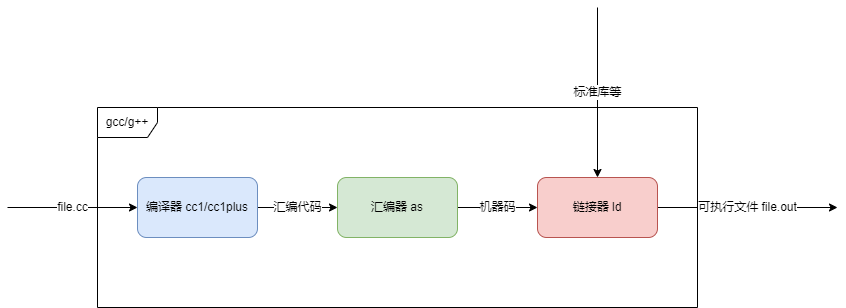
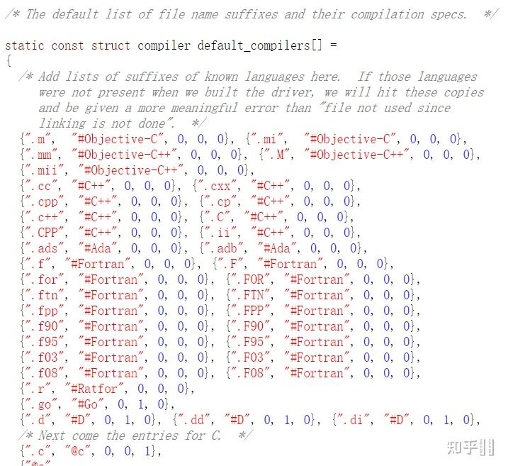

# C++ 的编译和构建

## GCC

### GCC 简介

GCC 是 GNU 编译器集合的意思, 对于用户能用的常用命令, 有 `gcc` 和 `g++`。

无论是 gcc 还是 g++, 他们的定位都是 `compiler driver`, 不负责编译代码，只负责调用真正的编译器。

`driver` 负责调用编译器(狭义), 把源码编译到汇编代码. 比如 C 语言的编译器(狭义)是 `cc1`, 而 C++ 语言的编译器(狭义)是 `cc1plus`。`driver` 再调用汇编器 `as`, 把汇编代码变成二进制代码. 最后调用链接器 `ld`, 负责把二进制代码拼在一起.



gcc 和 g++ 的区别:

- 调用的编译器不同
    - g++ 会把 .c 文件当做是 C++ 语言 (在 .c 文件前后分别加上 `-xc++` 和 `-xnone`, 强行变成 C++), 从而调用 cc1plus 进行编译。g++ 遇到 .cpp 文件也会当做是 C++, 调用 cc1plus 进行编译. 
    - gcc 会把 .c 文件当做是 C 语言. 从而调用 cc1 进行编译.gcc 遇到 .cpp 文件, 会处理成 C++ 语言. 调用 cc1plus 进行编译. 

- 传递给链接器的参数不同
    - g++ 会默认告诉链接器, 让它**链接上 C++ 标准库**(`-lstdc++`).
    - gcc 默认不会链接上 C++ 标准库.

GCC 项目中源码文件后缀与编译器的默认对应关系:



> 所以 c++ 的源文件后缀可以选用 `.cc` `.cpp` `.c++` `.CPP` `.cxx` `.cp` `.C` `.ii` (前两种最常见)

### 下载 GCC 

- Linux

    ```bash
    # Centos
    ## 下载开发包，包括 gcc、g++、make、gdb、perl、python等等
    yum group install "Development Tools"

    ## 或者独立下载 gcc,g++,gdb
    yum install gcc
    yum install gcc-c++
    yum install gdb

    ## 查看版本
    gcc --version
    g++ --version

    # Ubuntu
    ## 下载开发包，包括 gcc、g++、make等等
    apt-get install build-essential
    ```

- Windows

    Windows 上也有 GCC 的移植版本，比如 MinGW 和 Cygwin 等

    [MinGW安装教程](https://cloud.tencent.com/developer/article/1605800)

    > 如果[MinGW 官网](http://www.mingw.org/)进不去，可以去 [OSDN](https://zh.osdn.net/projects/mingw/) 下载


### 使用 GCC 

#### 单文件编译

`hello.cc`

```cpp
#include <iostream>

int main() {
  std::cout << "Hello World" << std::endl;
  return 0;
}
```

```bash
# 编译
g++ hello.cc -o hello
# 执行
./hello
```

#### 多文件编译

`hello.cc`

```cpp
#include <iostream>
#include "hello.h"

namespace custom {
    void sayHello() {
    std::cout << "Hello World" << std::endl;
    }
}
```

`hello.h`

```cpp
// 避免头文件被重复 include
#pragma once

namespace custom {
    void sayHello();
}
```

`main.cc` 

```cpp
#include "hello.h"

int main() {
  custom::sayHello();
  return 0;
}
```

```bash
# 先把源文件转成机器码（使用编译器和汇编器，但不使用链接器）
g++ -c main
g++ -c hello

# 链接成可执行文件
g++ -o main main.o hello.o

# 运行执行文件
./main
```

## LLVM 和 Clang

传统的编译器通常分为三个部分，前端(frontEnd)，优化器(Optimizer)和后端(backEnd)。

在编译过程中，前端主要负责词法和语法分析，将源代码转化为抽象语法树；

优化器则是在前端的基础上，对得到的中间代码进行优化，使代码更加高效；

后端则是将已经优化的中间代码转化为针对各自平台的机器代码。

> 通过解耦成三个部分，降低了编译器的复杂性，可以让三个部分独立发展。

GCC 自身包含完整的编译器三部分，而且打包成了一个执行文件。这也导致了模块化差的原因。

### LLVM

LLVM (Low Level Virtual Machine，底层虚拟机) 提供了与编译器相关的支持，能够进行程序语言的编译期优化、链接优化、在线编译优化、代码生成。简而言之，可以作为多种编译器的后台来使用。

最初的搭配是 GCC（前端部分）+ LLVM

### Clang

Clang 是苹果推出的编译器前端， 结合 LLVM，可以完全替代掉 GCC

Glang 的优势

- 内容占用小
- 诊断信息可读性强
- 兼容性好： Clang 从一开始就被设计为一个API，允许它被源代码分析工具和 IDE 集成。GCC 被构建成一个单一的静态编译器，这使得它非常难以被作为 API 并集成到其他工具中。

GCC 的优势：

- 支持更多平台
- 更流行，广泛使用，支持完备


## make

[make 官方文档](https://www.gnu.org/software/make/manual/make.html)

Make 是 Linux 平台上最常用的构建工具，诞生于 1977 年，主要用于C语言的项目。但是实际上 ，任何只要某个文件有变化，就要重新构建的项目，都可以用 Make 构建。

[Make 命令教程](https://www.ruanyifeng.com/blog/2015/02/make.html)

> Java 中的 Ant 就是模仿 Make 来做的（Ant 解决了 Makefile 格式编写容易出错以及无法跨平台使用的问题）

下载 make 

```bash
# centos
yum install -y make
# ubuntu
apt-get install make
```

一个编译 C 语言的 Makefile

```makefile
edit : main.o kbd.o command.o display.o 
    cc -o edit main.o kbd.o command.o display.o

main.o : main.c defs.h
    cc -c main.c
kbd.o : kbd.c defs.h command.h
    cc -c kbd.c
command.o : command.c defs.h command.h
    cc -c command.c
display.o : display.c defs.h
    cc -c display.c

clean :
     rm edit main.o kbd.o command.o display.o

.PHONY: edit clean
```

## cmake

[cmake 官方文档](https://cmake.org/cmake/help/latest/)

> CMake 是事实上的 C++ 构建工具标准

不同平台 Make 工具的 Makefile 的格式千差万别，得写多份 Makefile 工程性很差

CMake 就是为了解决这个问题而设计的：

允许开发者编写一种平台无关的 `CMakeList.txt` 文件来定制整个编译流程，然后再根据目标用户的平台进一步生成所需的本地化 Makefile 和工程文件.

在 linux 平台下使用 CMake 生成 Makefile 并编译的流程如下：

1. 编写 CMake 配置文件 CMakeLists.txt 。
2. 执行命令 `cmake PATH` 或者 ccmake PATH 生成 Makefile（ccmake 和 cmake 的区别在于前者提供了一个交互式的界面）。其中， PATH 是 CMakeLists.txt 所在的目录。
3. 使用 `make` 命令进行编译。

安装 cmake

```bash
yum install -y cmake
```

[CMake 入门实战](https://www.hahack.com/codes/cmake/)

C++ 编译示例

- 编译单个源文件的 CMakeLists.txt

    ```cmake
    # CMake 最低版本号要求
    cmake_minimum_required (VERSION 2.8)

    # 项目信息
    project (Demo1)

    # 指定生成目标
    add_executable(Demo main.cc)
    ```

- 同一目录，多个源文件

    ```cpp
    # CMake 最低版本号要求
    cmake_minimum_required (VERSION 2.8)

    # 项目信息
    project (Demo2)

    # 查找当前目录下的所有源文件
    # 并将名称保存到 DIR_SRCS 变量
    aux_source_directory(. DIR_SRCS)

    # 指定生成目标
    add_executable(Demo ${DIR_SRCS})
    ```

- 多个目录，多个源文件

    根目录的 CMakeLists.txt

    ```cpp
    # CMake 最低版本号要求
    cmake_minimum_required (VERSION 2.8)

    # 项目信息
    project (Demo3)

    # 查找当前目录下的所有源文件
    # 并将名称保存到 DIR_SRCS 变量
    aux_source_directory(. DIR_SRCS)

    # 添加 math 子目录
    add_subdirectory(math)

    # 指定生成目标 
    add_executable(Demo main.cc)

    # 添加链接库
    target_link_libraries(Demo MathFunctions)
    ```

    子目录的 CMakeLists.txt

    ```cpp
    # 查找当前目录下的所有源文件
    # 并将名称保存到 DIR_LIB_SRCS 变量
    aux_source_directory(. DIR_LIB_SRCS)

    # 生成链接库
    add_library (MathFunctions ${DIR_LIB_SRCS})
    ```

## blade

[官方文档](https://github.com/chen3feng/blade-build/blob/master/doc/zh_CN/README.md)

blade 是腾讯模仿 Google blaze 的构建系统

> Google blaze 的开源版本是 bazel，但功能并不如 blaze 好用

> blade 主要用 python 实现，构建依赖于 [Ninja](https://ninja-build.org/)（make 的替代物）

[安装](https://github.com/chen3feng/blade-build/blob/master/doc/zh_CN/install.md)

```bash
# 安装依赖 python
yum install -y python2
cd /usr/bin && ln -s python2 python && cd -

# 安装 Ninja(https://github.com/ninja-build/ninja/wiki)
git clone --depth 1 -b release https://github.com/ninja-build/ninja.git && cd ninja
./configure.py --bootstrap
cd /usr/bin && ln -s $OLDPWD/ninja ninja && cd -

# 安装 blade
git clone --depth 1 https://github.com/chen3feng/blade-build.git && cd blade-build
./install
blade --version
```

一个 blade 的 BUILD 例子

```python
# 生成库
cc_library(
  name = 'say',
  srcs = 'say.cc',
  hdrs = ['say.h'],
  visibility = ['PUBLIC'],
)

# 生成可执行文件
cc_binary(
  name = 'hello',
  srcs = [
    'hello.cc',
  ],
  deps = [':say']
)
```

## References 

- [gcc和g++是什么关系？](https://www.zhihu.com/question/20940822)
- [详解三大编译器：gcc、llvm 和 clang](https://developer.51cto.com/article/630677.html)
- [Blade——一个腾讯开源的C++工程构建利器](https://juejin.cn/post/6996646512390307870)
- [寻找 Google Blaze](https://zhuanlan.zhihu.com/p/55452964)
