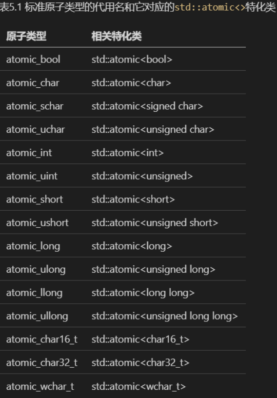

# C++ 并发编程

## C++ 的并发

C++98(1998)标准不承认线程的存在。随着多线程 C API 的普及（比如 POSIX C 标准），这就使得很多 C++ 编译器供应商通过平台的相关扩展来支持多线程。这种编译器支持通常受限于只能使用平台相关的 C 语言 API，并且确保 C++ 运行库能在多线程情况下正常工作。

C++11 标准的一个最重要的新特性就是对多线程的支持。新标准中不仅有线程感知内存模型，C++标准库也扩展了：包含了用于`管理线程`、`保护共享数据`、`线程间同步操作`，以及`底层原子操作`的各种类。

并发可以分为`软件并发`（CPU 时间片）和`硬件并发`（多处理器或者多核单处理器中真正的并发）。

软件并发每次切换任务需要执行`上下文切换`（context switch），这需要时间开销。为了执行上下文切换，操作系统必须为当前运行的任务保存 CPU 的状态和指令指针，然后算出要切换到哪个任务，并为即将切换到的任务重新加载处理器状态。CPU 潜在地需要将将指令和数据从内存加载到缓存中，这会阻止 CPU 执行任何指令，导致进一步的时延。

并发的方法也可以分为`多进程并发`和`多线程并发`。

多进程并发的优点是更容易编写安全的并发代码，隔离性更好；缺点是启动和管理进程的开销比较大，进程间通信也比较复杂、速度也比较慢。


多线性并发的优点是启动和通信的开销比多进程的要小，缺点是通过共享内存的方式来通信很容易出并发问题。

> 多线程是主流语言包括 C++ 更青睐的并发方法


为什么使用并发？

主要原因有两个：`关注点分离`和`性能`

关注点分离的一个例子就是 UI 界面，UI 线程负责响应用户操作，其它线程负责后台工作。

利用并发提高性能的方式有两种：`任务并发` 和 `数据并发`

何时不适用并发？

基本上，不使用并发的唯一原因就是收益比不上成本。

除非潜在的性能增益足够大或关注点分离的足够清晰，能抵消为确保代码逻辑正确所需的额外开发时间以及维护多线程代码相关的额外成本；否则，不要用并发。

即使是线程也是有限的资源，如果每个线程都有一个 1MB 的堆栈(很多系统这么干)，那么 4096 个线程就会占用 4GB 的内存。

可以通过线程池来优化资源占用（大部分的服务器都是使用这种方式）。

另外线程也不是越多越好，运行越多的线程，操作系统就需要越多的上下文切换，每次上下文切换都需要耗费本可以花在有用工作上的时间。往往当线程数量达到某个阈值，再增加，整体性能反而会下降

高性能计算的开发者通常关注 C++的性能，毕竟 C++类包装了底层设施，这种情况在新的标准 C++线程库更甚。如果你追求最好的性能，相比直接使用底层设施，了解高层设施的实现开销就很重要。这个开销就是`抽象惩罚`(abstraction penalty)。

C++ 标准委员会在设置标准库，特别是标准线程库，一个设计目标就是在在实现相同功能的前提下，直接使用底层 API 并不会带来多少收益。因此，
类库在大部分主流平台上都比较高效(带有非常低的抽象惩罚)。

当然，为了达到终极性能，也提供了一个全面原子操作库给程序员进行更底层的控制。

C++多线程程序是什么样？

其实，它看上去和其他 C++程序差不多，通常是变量、类以及函数的组合。唯一真正的区别是某些函数可以并发运行，所以需要确保共享数据在并发访问时是安全的

## 管理线程

### 线程管理基础

#### 启动线程

```cpp
void do_some_work();
std::thread my_thread(do_some_work);
```

std::thread 接受任何可调用类型

线程在构造 std::thread 对象时启动，这个对象指定了要运行的任务

构造 std::thread 需要避免“最令人头痛的语法解析”：

```cpp
// 会被解析成一个函数的声明，这个函数的参数是个函数指针，指向的函数没有参数并返回 background_task 对象
std::thread my_thread(backgroud_task());

// 解决方法 1：多加个括号
std::thread my_thread((background_task()))

// 解决方法 2：使用新的统一初始化语法
std::thread my_thread{background_task()}
```

#### 等待线程完成

一旦启动了线程，你需要明确是要等待线程结束（连接它 `join`）或者让它自主运行(分离它 `detach`)。如果 std::thread 对象销毁之前还没有做出决定，程序就会终止(std::thread 的析构函数会调用 std::terminate())。因此有必要确保线程即使出现异常的情况下也能正确的连接或者分离。

如果需要等待线程完成，可以调用 std::thread 实例的 `join()` 函数。调用 join()的动作，还清理了线程相关的存储，这样 std::thread 对象将不再与已经结束的线程有任何关联。

这意味着，**对一个线程只能调用一次 join()**；一旦已经调用过 join()，std::thread 对象就不能再次连接，同时 joinable()将返回 false。

如果不等待线程结束，你需要确保线程访问的数据直到线程结束之前都是有效的.

常见的情形：当线程函数持有一个指向局部变量的指针或者引用，并且函数退出后线程还没结束。

处理这种情况的通用做法是让线程函数自包含（也就是函数本身什么都有，不需要依赖外部数据），将数据拷贝到线程中，而非共享数据

#### 在异常情况下的等待

为了在异常的情况也能正常 join 或者 detach 线程，最好的方法就是使用 `RAII`（资源获取即初始化）

```cpp
class scoped_thread
{
    std::thread t;
public:
    explicit scoped_thread(std::thread t_): t(std::move(t_))
    {
        if(!t.joinable())
            throw std::logic_error(“No thread”);
    }
    ~scoped_thread()
    {
        t.join();
    }
    scoped_thread(scoped_thread const&)=delete;
    scoped_thread& operator=(scoped_thread const&)=delete;
};
struct func;
void f()s
{
    int some_local_state;
    scoped_thread t(std::thread(func(some_local_state)));
    do_something_in_current_thread();
}
```

> C++20 新增的 `std::jthread` 就是类似的作用，只是更为完善写


#### 在后台运行线程

分离的线程的确在后台运行；所有权和控制会传递给 C++ 运行时库，它会保证和线程相关的资源在线程退出的时候被正确的回收。

分离线程经常叫做守护线程，这是参照 UNIX 中守护进程的概念。

只有当 std::thread 对象 t 执行 `t.joinable()` 返回 true，才可以使用 `t.detach()`。


### 传递参数给线程函数

向可调用对象或函数传递参数很简单，只需要将这些参数作为 std::thread 构造函数的附加参数即可。

但需要注意的是，在默认情况下，这些参数会被拷贝至新线程的内部存储，新创建的执行线程可以访问它们，然后像临时值那样以右值引用传递给调用对象或者函数。就算函数的参数期待一个引用时仍然是这样。

> 即 thread 的构造器的参数都是通过 `T` 来传递的，要么是拷贝要么是移动

```cpp
void f(int i, std::string const& s);
std::thread t(f, 3, "hello");
```

如果要传递引用类型，可以使用 `std:ref()` 来包装:

```cpp
std::thread t(update_data_for_widget,w,std::ref(data));
```

也可以传递一个成员函数指针作为线程函数，只要你提供一个合适的对象指针作为第一个参数

```cpp
class X
{
public:
    void do_lengthy_work();
};
X my_x;
std::thread t(&X::do_lengthy_work, &my_x);
```

### 转移线程所有权

像 std::ifstream, std::unique_ptr 一样，std::thread 也是可移动，但不可拷贝。可以通过移动转移 std::thread 持有的线程资源

```cpp
void some_function();
void some_other_function();
std::thread t1(some_function);
std::thread t2=std::move(t1);
t1=std::thread(some_other_function);
std::thread t3;
t3=std::move(t2);
// 这里会终止程序。t1 已经有线程资源，移动需要销毁原来的线程资源，销毁的逻辑和析构函数一样，原来的线程没有 join 或者 detach，会终止程序
t1=std::move(t3);
```

### 运行时选择线程数量

C++标准库中的 `std::thread::hardware_concurrency()` 可以得到真正可以并发的线程数。

这个函数的返回值也仅仅是个提示，当系统信息无法获取时，也可能返回 0，使用时最好再加个默认值。

并行版的 `std::accumulate`

```cpp
template<typename Iterator,typename T>
struct accumulate_block
{
    void operator()(Iterator first,Iterator last,T& result)
    {
        result=std::accumulate(first,last,result);
    }
};

template<typename Iterator,typename T>
T parallel_accumulate(Iterator first,Iterator last,T init)
{
    unsigned long const length=std::distance(first,last);

    if(!length)
        return init;

    unsigned long const min_per_thread=25;
    unsigned long const max_threads= (length+min_per_thread-1)/min_per_thread;

    unsigned long const hardware_threads= std::thread::hardware_concurrency();
    unsigned long const num_threads= std::min(hardware_threads != 0 ? hardware_threads : 2, max_threads);

    unsigned long const block_size=length/num_threads;

    std::vector<T> results(num_threads);
    std::vector<std::thread> threads(num_threads-1);

    Iterator block_start=first;
    for(unsigned long i=0; i < (num_threads-1); ++i)
    {
        Iterator block_end=block_start;
        std::advance(block_end,block_size);
        threads[i]=std::thread(
            accumulate_block<Iterator,T>(),
            block_start,block_end,std::ref(results[i]));
        block_start=block_end;
    }
    accumulate_block<Iterator,T>()(block_start,last,results[num_threads-1]);

    for (auto& entry : threads)
        entry.join();
    return std::accumulate(results.begin(),results.end(),init);
}
```

> 需要注意的是，启动的线程数要比 num_threads 少 1 个，因为你已经有了一个线程(即主线程)。

### 标识线程

线程标识类型为 `std::thread::id`，有两种获取方式

1. 调用 std::thread 对象的成员函数 `get_id()`
2. `std::this_thread::get_id()` 可以获得当前线程的标识

> 如果 std::thread 对象没有与任何执行线程相关联，get_id() 将返回默认构造的 std::thread::id 对象，表示“没有任何线程”（“not any thread”）

> 标准库也提供 `std::hash<std::thread::id>`，所以 std::thread::id 也可以作为无序关联容器的键。

## 线程间共享数据

### 共享数据面临的问题

如果共享数据是只读的，那就没有问题，读数据互相不会有影响。

修改线程间共享数据最简单的潜在问题是破坏了不变量。

在并发中的竞争条件是指任何结果取决于在两个或多个线程上操作执行的相对顺序；线程竞争去执行它们各自的操作。

“数据竞争”这个术语意指这个特殊的竞争条件是由于并发的去修改一个单一对象，数据竞争会导致可怕的未定义行为。

> 编写并发软件最大的复杂性来自于避免有问题的竞争条件。

C++标准库提供的最基本的保护共享数据的机制是`互斥锁(mutex)`

### 使用互斥锁保护共享数据

C++中通过构建一个 `std::mutex` 实例创建互斥锁，通过成员函数 `lock()` 对互斥锁上锁，`unlock()`进行解锁。

同样，为了在每个出口点都正常 unlock，C++标准库为互斥锁提供了一个 RAII 语法的 `std::lock_guard` 类模板，在构造时锁住提供的互斥锁，并在析构的时候进行解锁，从而保证了一个锁住的互斥锁能被正确解锁。

```cpp
#include <list>
#include <mutex>
#include <algorithm>

std::list<int> some_list; // 1
std::mutex some_mutex; // 2

void add_to_list(int new_value)
{
    std::lock_guard<std::mutex> guard(some_mutex); // 3
    some_list.push_back(new_value);
}

bool list_contains(int value_to_find)
{
    std::lock_guard<std::mutex> guard(some_mutex); // 4
    return std::find(some_list.begin(),some_list.end(),value_to_find) != some_list.end();
}
```

C++17 中添加了一个新特性，称为类模板参数推导，这样 lock_guard 可以简化成:

```cpp
std::lock_guard guard(some_mutex);
```

使用互斥锁来保护数据，并不是仅仅在每一个成员函数中都加入一个 `std::lock_guard` 对象那么简单

当其中一个成员函数返回的是保护数据的指针或引用时，那么成员函数对互斥锁处理的再好也没有用。

把保护数据的指针或者引用传给其它函数也很危险，尤其这些函数不受你控制。

因此用互斥锁保护数据需要谨慎的设计接口：**切勿将指向保护数据的指针或引用传递到互斥锁作用域之外**，无论是从函数返回它们，还是把他们存储在外部可见的内存，亦或是把他们以参数形式传递给用户提供的函数。

另外，保护的接口之间也可能有竞争条件。比如一个 `stack` 类，弹出栈顶元素，一般会先 `empty()` -> `top()` -> `pop()`，在多次调用中间可能数据会被修改。解决的方法主要是把这些接口合成一个。

```cpp
#include <exception>
#include <memory>
#include <mutex>
#include <stack>

struct empty_stack: std::exception
{
    const char* what() const throw() {
        return "empty stack!";
    };
};

template<typename T>
class threadsafe_stack
{
private:
    std::stack<T> data;
    mutable std::mutex m;
public:
    threadsafe_stack(): data(std::stack<T>()){}

    threadsafe_stack(const threadsafe_stack& other)
    {
        std::lock_guard<std::mutex> lock(other.m);
        data = other.data; // 1 在构造函数体中执行拷贝
    }

    threadsafe_stack& operator=(const threadsafe_stack&) = delete;

    void push(T new_value)
    {
        std::lock_guard<std::mutex> lock(m);
        data.push(new_value);
    }

    std::shared_ptr<T> pop()
    {
        std::lock_guard<std::mutex> lock(m);
        if(data.empty()) throw empty_stack(); // 在调用 pop 前，检查栈是否为空
        std::shared_ptr<T> const res(std::make_shared<T>(data.top())); // 在修改栈前，分配出返回值
        data.pop();
        return res;
    }

    void pop(T& value)
    {
        std::lock_guard<std::mutex> lock(m);
        if(data.empty()) throw empty_stack();
        value=data.top();
        data.pop();
    }

    bool empty() const
    {
        std::lock_guard<std::mutex> lock(m);
        return data.empty();
    }
};
```

这样的实现锁的粒度太大，并影响并发能力，性能较差，后续可以通过细粒度锁或者无锁的方式来实现。

但是如果有多个锁，就会存在死锁的问题。

避免死锁的一般建议，就是让两个互斥锁总是以相同的顺序上锁。

C++标准库有医治这个的良方，`std::lock` 函数可以一次性锁住两个或更多的互斥锁，并且没有死锁的风险。

```cpp
class some_big_object;
void swap(some_big_object& lhs,some_big_object& rhs);
class X
{
private:
    some_big_object some_detail;
    std::mutex m;
public:
    X(some_big_object const& sd): some_detail(sd){}
    friend void swap(X& lhs, X& rhs)
    {
        if(&lhs==&rhs)
            return;
        std::lock(lhs.m,rhs.m); // 1
        std::lock_guard<std::mutex> lock_a(lhs.m,std::adopt_lock); // 2
        std::lock_guard<std::mutex> lock_b(rhs.m,std::adopt_lock); // 3
        swap(lhs.some_detail,rhs.some_detail);
    }
};
```

> 额外提供的 `std::adopt_lock` 参数告诉 `std::lock_guard` 互斥锁已经上锁了，接过互斥锁的所有权就可以了， 不用在 std::lock_guard 的构造函数里上锁。

C++17 对这种情况提供了支持，`std::scoped_lock<>` 一种新的 RAII 模板，**除了它是个可变参模板以外，与 std::lock_guard<>的功能等价**，它接受一个互斥锁类型的列表作为模板参数，并且互斥锁列表作为构造函数的参数。

```cpp
void swap(X& lhs, X& rhs)
{
    if(&lhs==&rhs)
        return;
    std::scoped_lock guard(lhs.m,rhs.m); // 1
    swap(lhs.some_detail,rhs.some_detail);
}
```

灵活的 `std::unqiue_lock` 锁：

std::unique_lock 比 std::lock_guard 提供了更多的灵活性；**一个 std::unique_lock 实例并不总是拥有与其关联的互斥锁**。

也可以将 `std::defer_lock` 作为第二个参数传递给构造函数，以表明互斥锁在构造时应该保持解锁状态。然后，可以通过调用 `std::unique_lock` 对象(不是互斥锁)上的 `lock()`或者将std::unique_lock 对象传递给 `std::lock()` 来获取锁。

> 即 std::unqiue_lock 支持 `lock()` 和 `unlock()` 方法，可以手动加解锁。

std::unique_lock 的灵活性同样也允许实例在销毁之前放弃其拥有的锁。可以使用 `unlock()` 成员函数来做这件事，就像互斥锁.

> 可以手动提前解锁，这对于应用程序的性能来说很重要；

!> std::unique_lock 会占用比较多的空间，并且比 std::lock_guard 稍慢一些。所以当 std::lock_guard 已经能够满足你的需求时，还是建议你优先使用它。

std::unique_lock 的常见使用场景: 1. 延迟上锁；2. 锁的所有权需要从一个作用域转移到另一个作用域。

### 保护共享数据的替代设施

除了互斥锁，在保护共享数据方面，还有一些替代方案。

对于一个需要延迟初始化的单例资源对象，首次初始化时需要避免竞争问题

> 单例的延迟初始化一直以来流行一个不太好的模式：`双重检查加锁`，这种模式在指令重排序下会出现使用了未初始化完成的对象。

C++标准库提供了 `std::once_flag` 和 `std::call_once` 来处理这种初始化问题。

```cpp
std::shared_ptr<some_resource> resource_ptr;
std::once_flag resource_flag; // 1

void init_resource()
{
    resource_ptr.reset(new some_resource);
}

void foo()
{
    std::call_once(resource_flag,init_resource); // 初始化只会调用一次
    resource_ptr->do_something();
}
```

此外，C++11 标准规定了静态局部变量的初始化只会在一个线程中发生，且没有其他线程可在初始化完成前继续执行.

因此实现单例模式最简单的方案就是使用静态局部变量：

```cpp
class my_class;

my_class& get_my_class_instance()
{
    static my_class instance; // 初始化保证是线程安全的
    return instance;
}
```

对于读多写少的场景，为了提高并发度，经常会使用`读写锁`。一个“写者”线程独占访问，让多个“读者”线程并发访问。

C++ 17 标准库提供了两个现成的互斥锁 `std::shared_mutex` 和 `std::shared_timed_mutex`。C++14 只提供了 `std::shared_timed_mutex`

> `shared_timed_mutex` 支持更多的操作方式(超时等).如果你不需要额外操作的话，`std::shared_mutex` 可能提供更高的性能优势。

`std::shared_lock<std::shared_mutex>` 获取读锁，`std::lock_guard<std::shared_mutex>` 获得写锁

```cpp
清单 3.13 使用 std::shared_mutex 保护数据结构
#include <map>
#include <string>
#include <mutex>
#include <shared_mutex>

class dns_entry;

class dns_cache
{
    std::map<std::string,dns_entry> entries;
    mutable std::shared_mutex entry_mutex;
public:
    dns_entry find_entry(std::string const& domain) const
    {
        std::shared_lock<std::shared_mutex> lk(entry_mutex); // 1
        std::map<std::string,dns_entry>::const_iterator const it=
        entries.find(domain);
        return (it==entries.end())?dns_entry():it->second;
    }

    void update_or_add_entry(std::string const& domain, dns_entry const& dns_details)
    {
        std::lock_guard<std::shared_mutex> lk(entry_mutex); // 2
        entries[domain]=dns_details;
    }
};
```

递归锁：

对于 std::mutex，一个线程试图锁住它已经拥有的互斥锁是个错误，并且尝试这样做会导致未定义的行为

为此，C++标准库提供了 `std::recursive_mutex`。

递归锁，`lock()` 了多少次就需要 `unlock` 多少次。

!> 需要使用递归锁往往意味着糟糕的设计，通常更好的方法是从两个成员函数中提取一个新的私有成员函数，它不会锁住互斥锁

## 同步并发操作

多线程场景经常不仅需要保护数据，还需要同步不同线程上的操作。例如，一个线程可能需要等待另一个线程完成一个任务，然后第一个线程才能完成自己的任务。

更一般的说法，**线程在等待特定事件发生或一个条件变为真**。

尽管可以通过定期检查共享数据中存储的“任务完成”标志或类似的东西来实现这一点，但这远不够理想。像这样需要在线程之间同步操作的场景是如此的常
见，以至于 C++标准库提供了`条件变量`(condition variables)和`期望`（futures）形式的设施来处理它。另外还有 `锁存器(latches)`和 `屏障(barriers)`。

### 等待一个事件或其他条件

如果一个线程正在等待另一个线程完成一个任务，它有几个选择:

1. 轮询检查共享数据中的标志，并让第二个线程在完成任务时设置该标志。
2. 让等待线程在检查的间隙用 `std::this_thread::sleep_for()` 函数休眠很短的时间
3. 条件变量

C++标准库对条件变量有两套实现：`std::condition_variable` 和 `std::condition_variable_any`。前者仅限于使用 `std::mutex`，而后者可以使用任何满足类似于互斥锁的最低标准的对象。

> 除非需要额外的灵活性，否则应该首选 `std::condition_variable`。

```cpp
std::mutex mut;
std::queue<data_chunk> data_queue; // 1
std::condition_variable data_cond;

void data_preparation_thread()
{
    while(more_data_to_prepare())
    {
        data_chunk const data=prepare_data();
        {
            std::lock_guard<std::mutex> lk(mut);
            data_queue.push(data); // 2
        }
        data_cond.notify_one(); // 3
    }
}

void data_processing_thread()
{
    while(true)
    {
        std::unique_lock<std::mutex> lk(mut); // 4
        data_cond.wait(lk, []{return !data_queue.empty();}); // 5
        data_chunk data=data_queue.front();
        data_queue.pop();
        lk.unlock(); // 6
        process(data);
        if(is_last_chunk(data))
        break;
    }
}
```

线程在 `std::condition_variable` 上调用 `wait()` 成员函数，并传入锁对象和表示等待条件的 lambda 函数

当准备数据的线程调用 `notify_one()` 通知条件变量时，处理数据的线程从睡眠状态中醒来，获取互斥锁上的锁，并且再次检查条件是否
满足。在条件满足的情况下，从 `wait()` 返回并仍然持有锁；**当条件不满足时，线程将对互斥锁解锁，并且重新开始等待**。这就是为什么**用 std::unique_lock 而不使用 std::lock_guard**

线程存在被`伪唤醒`的可能，因此要设置等待条件函数，而且这个函数可能被多次调用，要避免有副作用的函数进行条件检查。

使用队列在多个线程间转移数据是很常见的。如果做得好，同步可以限制在队列本身，这将极大地减少同步问题和竞争条件的可能数量。

使用条件变量可以构建线程安全队列：

> 类似于 Java 中的 `BlockingQueue` 

```cpp
#include <queue>
#include <memory>
#include <mutex>
#include <condition_variable>

template<typename T>
class threadsafe_queue
{
private:
    mutable std::mutex mut; // 1 互斥锁必须是可变的
    std::queue<T> data_queue;
    std::condition_variable data_cond;
public:
threadsafe_queue() {}

threadsafe_queue(threadsafe_queue const& other)
{
    std::lock_guard<std::mutex> lk(other.mut);
    data_queue=other.data_queue;
}

void push(T new_value)
{
    std::lock_guard<std::mutex> lk(mut);
    data_queue.push(new_value);
    data_cond.notify_one();
}

void wait_and_pop(T& value)
{
    std::unique_lock<std::mutex> lk(mut);
    data_cond.wait(lk,[this]{return !data_queue.empty();});
    value=data_queue.front();
    data_queue.pop();
}

std::shared_ptr<T> wait_and_pop()
{
    std::unique_lock<std::mutex> lk(mut);
    data_cond.wait(lk,[this]{return !data_queue.empty();});
    std::shared_ptr<T> res(std::make_shared<T>(data_queue.front()));
    data_queue.pop();
    return res;
}

bool try_pop(T& value)
{
    std::lock_guard<std::mutex> lk(mut);
    if(data_queue.empty())
        return false;
    value=data_queue.front();
    data_queue.pop();
    return true;
}

std::shared_ptr<T> try_pop()
{
    std::lock_guard<std::mutex> lk(mut);
    if(data_queue.empty())
        return std::shared_ptr<T>();
    std::shared_ptr<T> res(std::make_shared<T>(data_queue.front()));
    data_queue.pop();
    return res;
}
bool empty() const
{
    std::lock_guard<std::mutex> lk(mut);
    return data_queue.empty();
}
};
```

如果等待线程只等待一次，因此当条件为真时，它将不再等待该条件变量，那么条件变量可能不是同步机制的最佳选择。如果**等待的条件是某一特定数据的可用性**，则尤其如此。在这种情况下，`期望（future`）可能更合适。

### 使用期望等待一次性事件

C++标准库中，有两种期望，实现为两个类模板，声明在 `<future>` 库头文件中：唯一的期望（unique futures）(`std::future<>)`和共享的期望（shared futures）(`std::shared_future<>`)。

> std::future 的实例是唯一一个引用其关联事件的实例，而多个 std::shared_future 实例可能引用同一事件。

尽管期望用于线程间通信，但是期望对象本身不提供同步访问。如果多个线程需要访问一个期望对象，它们必须通过互斥锁或其他同步机制来保护访问。但是，当然多个线程可以访问它们自己的 std::shared_future<>副本，而无需进一步同步，

由于 std::thread 并没有提供一种简单方法从这样的任务中返回一个值，之前是通过 `std::ref` 封装引用的方式获取结果。

future 可以更加优雅的解决这个问题。

因为 std::thread 没有提供直接的机制来关联 futrue。这就是需要 `std::async` 函数模板( 也声明在`<future>`头文件中)

```cpp
#include <future>
#include <iostream>

int find_the_answer_to_ltuae(int param);
void do_other_stuff();
int main()
{
    std::future<int> the_answer=std::async(find_the_answer_to_ltuae, 3);
    do_other_stuff();
    std::cout<<"The answer is "<<the_answer.get()<<std::endl;
}
```

`std::async` 支持 `std::thread` 的传参方式，另外还提供了一个可选参数来指定使用哪种模式，这个参数的类型是 `std::launch`，它有以下是三个值：

- `std::launch::defered`： 表明函数调用被推迟到 `wait()`或 `get()` 函数调用时才执行，
- `std::launch::async`: 表明函数必须在它自己的线程上运行
- `std::launch::deferred | std::launch::async`: 表明让具体实现来选择哪种方式。(默认选项)

> 如果函数调用是推迟的，它可能永远也不会运行

```cpp
auto f6=std::async(std::launch::async,Y(),1.2); // 在新线程上执行
auto f7=std::async(std::launch::deferred,baz,std::ref(x)); // 在 wait() 或 get()调用时执行
auto f8=std::async(std::launch::deferred | std::launch::async, baz, std::ref(x)); // 实现选择执行方式
auto f9=std::async(baz,std::ref(x));
f7.wait(); // 调用延迟函数
```

除了 `std::async`, 将 std::future 与任务联系起来的方法还有：

- 将任务包装到 `std::packaged_task<>` 类模板的实例中
- 通过编写代码使用 `std::promise<>` 类模板显式地设置值来实现

> std::packaged_task 是一个比 std::promise 更高层次的抽象

`std::packaged_task<>` 将期望绑定到函数或可调用对象。当调用 std::packaged_task<> 对象时，它调用关联的函数或可调用对象，并让期望就绪
（ready），返回值存储为关联的数据。它可以**用作线程池或其他任务管理方案的构建块**

std::packaged_task<> 对象是一个可调用对象,可以封装在 std::function 对象中，传给 std::thread 作为线程函数，或传给需要可调用对象的另一个函数，或直接进行调用。

你可以将任务包装在 std::packaged_task 中，在将std::packaged_task 对象传递到其他地方（以在适当的时候调用它）前检索期望。当你需
要结果时，你可以等待期望变成就绪状态。

```cpp
#include <deque>
#include <mutex>
#include <future>
#include <thread>
#include <utility>

std::mutex m;
std::deque<std::packaged_task<void()> > tasks;

bool gui_shutdown_message_received();
void get_and_process_gui_message();
void gui_thread() // 1
{
    while(!gui_shutdown_message_received()) // 2
    {
        get_and_process_gui_message(); // 3
        std::packaged_task<void()> task;
        {
            std::lock_guard<std::mutex> lk(m);
            if(tasks.empty()) // 4
                continue;
            task=std::move(tasks.front()); // 5
            tasks.pop_front();
        }
        task(); // 6
    }
}

std::thread gui_bg_thread(gui_thread);

template<typename Func>
std::future<void> post_task_for_gui_thread(Func f)
{
    std::packaged_task<void()> task(f); // 7
    std::future<void> res=task.get_future(); // 8
    std::lock_guard<std::mutex> lk(m);
    tasks.push_back(std::move(task)); // 9
    return res; // 10
}
```

对于那些不能表示为简单函数调用的任务，或者那些结果可能来自多个地方的任务，该怎么办呢？这些情况由创建期望的第三种方式来处理：使用 `std::promise` 来显式设置值。

`std::promise<T>` 提供一种方法(`set_value()`)来设定一个值(类型为 T)，这个值可以通过关联(`get_future()`)的 `std::future<T>` 对象读取出来。一对 `std::promise/std::future` 会为这种设施提供一个可行的机制；等待线程可以阻塞在期望上，同时，提供数据的线程可以使用配对中的承诺
（promise）来设置相关的值，并将期望的状态置为就绪（ready）。

```cpp
// 使用承诺处理单线程上的多个连接
#include <future>

void process_connections(connection_set& connections)
{
    while(!done(connections)) // 1
    {
        for(connection_iterator // 2
                connection=connections.begin(),end=connections.end();
            connection!=end;
            ++connection)
        {
            if(connection->has_incoming_data()) // 3
            {
                data_packet data=connection->incoming();
                std::promise<payload_type>& p= connection->get_promise(data.id); // 4
                p.set_value(data.payload);
            }
            if(connection->has_outgoing_data()) // 5
            {
                outgoing_packet data= connection->top_of_outgoing_queue();
                connection->send(data.payload);
                data.promise.set_value(true); // 6
            }
        }
    }
}
```

此外，promise 还可以通过 `set_exception()` 设置 future 抛出的异常

std::future 也有其局限性，其中最重要的是只能有一个线程等待结果。如果需要**等待来自多个线程的相同事件**，则需
要使用 `std::shared_future`。

引用某个异步状态的 `std::shared_future` 实例是**由引用该状态的 std::future 的实例构造的**。由于 std::future 对象不与任何其他对象共享异步状态的所有权，因此必须使用 std::move 将该所有权转移到 std::shared_future。

```cpp
std::promise<int> p;
std::future<int> f(p.get_future());
assert(f.valid()); // 1 期望 f 是有效的
std::shared_future<int> sf(std::move(f));
assert(!f.valid()); // 2 期望 f 不在有效
assert(sf.valid()); // 3 sf 现在是有效的
```

std::future 有一个 `share()` 成员函数，它创建一个新的 std::shared_future 并直接将所有权转移给它

> 可以结合 auto，可以不用写 share_future 变量的类型

```cpp
std::promise< std::map< SomeIndexType, SomeDataType, SomeComparator,
SomeAllocator>::iterator> p;
auto sf=p.get_future().share();
```

### 有事件限制的等待

有时你想限制等待一个事件的时间，比如为了性能，设置超时时间，这也是容错性设计的常见要求。

一般可以指定两种类型的超时：**基于时长（duration-based）的超时**，即等待指定长度的时间(例如，30 毫秒)；或者绝对超时，**等待到指定的时间点**

大多数等待函数都提供了处理这两种超时形式的变体。处理基于时长超时的变体有 `_for 后缀`，处理绝对超时的变体有 `_until 后缀`

#### 时钟

> 线程库使用的所有 C++时间处理设施，都在 `std::chrono` 命名空间中

就 C++标准库而言，**时钟是时间信息的来源**。具体来说，时钟是一个类，它提供四种不同的信息：

- 当前时间（now）
- 值的类型，这个值用于表示从时钟获得的时间
- 时钟计次周期（tick period）
- 时钟是否以相同的速度前进，并以此判断时钟是否稳定（steady）

时钟的当前时间可以通过调用时钟类的静态成员函数 `now()`获取；例如，`std::chrono::system_clock::now()` 将返回系统时钟的当前时间。特定时钟的时间点类型通过 `time_point` 成员类型定义（typedef）来指定，因此 some_clock::now() 的返回类型就是 some_clock::time_point。

时钟的计次周期是**以秒为单位的分数**，由时钟的 `period` 成员类型定义（typedef）给出, 比如一秒计 25 次的时钟，它的 period 为 std::ratio<1, 25>

如果时钟以统一的速度计次（ticks）(无论速度是否与 period 匹配)，并且不可调整，这种时钟就被称为稳定的时钟。C++标准库以
`std::chrono::steady_clock` 的形式提供了一个稳定的时钟


#### 时长

时长由 `std::chrono::duration<>` 类模板负责。第一个模板参数是表示（representation）的类型(比如，int，long 或 double)，第二个模板参数是个分数，它指定了时长表示单位是多少秒。比如把几分钟的时间存在 short 类型中可以表示为 `std::chrono::duration<short, std::ratio<60, 1>>`。

标准库提供一系列预先定义好的时长：`nanoseconds`, `microseconds`, `milliseconds`, `seconds`, `minutes` 和 `hours`。

C++ 14 中引入的 `std::chrono_literals` 命名空间中有许多预定义的用于时长的字面值后缀操作符。这可以简化使用硬编码时长值的代码

```cpp
using namespace std::chrono_literals;
auto one_day=24h;
auto half_an_hour=30min;
auto max_time_between_messages=30ms;
```

在不需要截断值的情况下，时长之间的转换是隐式的(因此将小时转换为秒是可以的，但将秒转换为小时则不行)。显式转换可以用 `std::chrono::duration_cast<>`

```cpp
std::chrono::milliseconds ms(54802);
std::chrono::seconds s = std::chrono::duration_cast<std::chrono::seconds>(ms);
```

时长支持算术运算，因此可以通过加减时长来获得新的时长，或者乘以或除以底层表示类型的常数(第一个模板参数)。因此 5*seconds(1)等同于 seconds(5)或 minutes(1)-seconds(55)。可以通过成员函数 `count()` 获得时长内的单位数量的计数。

基于时长的等待可由 `std::chrono::duration<>` 来完成。

```cpp
std::future<int> f=std::async(some_task);
if(f.wait_for(std::chrono::milliseconds(35))==std::future_status::ready)
    do_something_with(f.get());
```

> 在等待一个期望，如果等待超时的话，函数会返回 `std::future_status::timeout`，如果期望就绪了，就返回 `std::future_status::ready`，如果期望对应的任务推迟了，则返回 `std::future_status::deferred`。库

> 库内部基于时长的等待会使用**稳定的时钟**来度量时间，因此 35 毫秒意味着逝去 35 毫秒的时间，即使等待期间调整了系统时钟（往前或往后调整）。

#### 时间点

时钟的时间点可以用 `std::chrono::time_point<>` 类模板的实例来表示，实例的第一个参数用来指定所要使用的时钟，第二个函数参数用来表示计量单位(一个特化的 std::chrono::duration<>)。比如：`std::chrono::time_point<std::chrono::system_clock, std::chrono::minutes>`

> 一个时间点的值是时钟从称为“纪元”的一个特定时间点以来的时间长度(是已指定时长的倍数)

典型的纪元包括 1970 年 1 月 1 日 00 时以及运行应用程序的计算机启动的瞬间。

可以为给定的 time_point 获取 time_since_epoch()。这个成员函数返回一个时长值，指定了从时钟纪元到该特定时间点的时间长度

你可以给 std::chrono::time_point<> 实例增/减时长，来获得一个新的时间点，所以 std::chrono::hight_resolution_clock::now() + std::chrono::nanoseconds(500)将得到 500 纳秒后的时间。

还可以从共享同一时钟的另一个时间点中减去一个时间点。其结果是一个时长，这对于测定时间的代码块很有用

```cpp
auto start=std::chrono::high_resolution_clock::now();
do_something();
auto stop=std::chrono::high_resolution_clock::now();
std::cout<<”do_something() took “ <<std::chrono::duration<double,std::chrono::seconds>(stop - start).count() <<” seconds”<<std::endl;
```


时间点与等待函数的_until 变体一起使用

```cpp
#include <condition_variable>
#include <mutex>
#include <chrono>

std::condition_variable cv;
bool done;
std::mutex m;

bool wait_loop()
{
    auto const timeout= std::chrono::steady_clock::now()+
    std::chrono::milliseconds(500);
    std::unique_lock<std::mutex> lk(m);
    while(!done)
    {
        if(cv.wait_until(lk,timeout)==std::cv_status::timeout)
            break;
    }
    return done;
}
```

可接受超时的函数


### 使用操作的同步来简化代码

#### 其它的并发编程范式

线程间通信除了共享可变数据的并发编程方式，还有另外两种范式：

- 函数式编程
- 消息传递（通信顺序进程 CSP）

函数式编程(FP，functional programming)指的是一种编程风格，其中**函数调用的结果仅依赖于该函数的参数，而不依赖于任何外部状态**。

C++是一个多范式的语言，也可以写出 FP 风格的程序。这在 C++11 中比 C++98 更容易，因为 C++11 支持 lambda
函数，还合入了 Boost 和 TR1 中的 std::bind，以及引入变量的自动类型推导(详见附录 A，A.7 节)。**期望是使 FP 风格的并发在 C++中可行的最后一块拼图**；一个期望可以在线程之间传递，允许一个计算的结果依赖于另一个计算的结果，而不需要显式地访问共享数据。

真正的消息传递（通信顺序处理）没有共享数据，所有通信都通过消息队列传递，但是由于 C++线 程共享一个地址空间，因此不可能强制执行这一要求。这里就是规则的用武之地：作为应用程序或库的作者，我们有责任确保线程之间不共享数据。当然，为了让线程通信，**必须共享消息队列，但是细节可以包装在库中**。

#### 延续

并发技术规范在 std::experiment 命名空间中提供了新版本的 std::promise 和 std::packaged_task。与 std 命名空间中类型完全不同，其返回实例类型为 `std::experimental::future`，而不是 std::future。这使得用户能够使用 std::experimental::future 中的关键新特性——`延续（continuations）`。

> 类似于 Java 的 `CompletableFuture`

```cpp
std::experimental::future<int> find_the_answer;
std::string find_the_question(std::experimental::future<int> the_answer);
auto fut=find_the_answer();
auto fut2=fut.then(find_the_question);
assert(!fut.valid());
assert(fut2.valid());
```

> promise + 延续可以优化掉 callback 的异步风格

> then 的参数是个可调用对象，包含一个 `std::experimental::future` 的入参，这个对象会**在 future 就绪后被调用**

async 没有延续版本，不过也可以很简单的实现：

```cpp
template<typename Func>
std::experimental::future<decltype(std::declval<Func>()())> spawn_async(Func&& func){
    std::experimental::promise<decltype(std::declval<Func>()())> p;
    auto res=p.get_future();
    std::thread t(
        [p=std::move(p),f=std::decay_t<Func>(func)]()
            mutable{
            try{
                p.set_value_at_thread_exit(f());
            } catch(...) {
                p.set_exception_at_thread_exit(std::current_exception());
            }
    });
    t.detach();
    return res;
}
```


`std::experimental::shared_future` 对象可以有多个延续，并且延续的参数是 std::experimental::shared_future

```cpp
auto fut = spawn_async(some_function).share();
auto fut2 = fut.then([](std::experimental::shared_future<some_data> data){
    do_stuff(data);
});
auto fut3 = fut.then([](std::experimental::shared_future<some_data> data){
    return do_other_stuff(data);
});
```

那么如何等待一堆期望中的任何一个变成就绪，或者等待所有的期望准备就绪。


等待所有的期望准备就绪, 可以直接通过 for 循环 + get() 实现

```cpp
std::future<FinalResult> process_data(std::vector<MyData>& vec)
{
    size_t const chunk_size = whatever;
    std::vector<std::future<ChunkResult>> results;
    for (auto begin=vec.begin(), end=vec.end(); beg!=end;){
        size_t const remaining_size = end - begin;
        size_t const this_chunk_size = std::min(remaining_size, chunk_size);
        results.push_back(
            std::async(process_chunk, begin, begin+this_chunk_size));
        begin += this_chunk_size;
    }
    return std::async([all_results=std::move(results)]() {
        std::vector<ChunkResult> v;
        v.reserve(all_results.size());
        for (auto& f : all_results)
        {
            v.push_back(f.get()); // 1
        }
        return gather_results(v);
    });
}
```

for 循环 + get() 的方式会导致聚合的线程不断休眠、唤醒，有额外的 CPU 和 上下文切换消耗。

使用 `std::experimental::when_all` 可以避免这种等待和切换。你将等待的期望集合传递给 when_all，当集合中所有的期望都准备好时，它就会返回一个新的处于就绪状态的期望，然后才执行延续。

```cpp
std::experimental::future<FinalResult> process_data(std::vector<MyData>& vec)
{
    size_t const chunk_size = whatever;
    std::vector<std::experimental::future<ChunkResult>> results;
    for (auto begin = vec.begin(), end = vec.end(); beg != end){
        size_t const remaining_size = end - begin;
        size_t const this_chunk_size = std::min(remaining_size, chunk_size);
        results.push_back(
            spawn_async(
                process_chunk, begin, begin+this_chunk_size));
        begin += this_chunk_size;
    }
    return std::experimental::when_all(results.begin(), results.end())
        .then( // 1
            [](std::future<std::vector<std::experimental::future<ChunkResult> >> ready_results){
                std::vector<std::experimental::future<ChunkResult>> all_results = ready_results.get();
                std::vector<ChunkResult> v;
                v.reserve(all_results.size());
                for (auto& f: all_results){
                    v.push_back(f.get()); // 2
                }
                return gather_results(v);
        });
}
```


等待一堆期望中的任何一个变成就绪可以使用 `std::experimental::when_any`, 它将期望收集在一起，并在原始集合中至少有一个准备好时提供一个新的期望。而 when_all 给了你一个期望，它包装了你传入期望的集合，when_any 又增加了一个层，将集合与一个索引值组合进 std::experimental::when_any_result 类模板的一个实例，那个索引值指示哪个期望触发了组合的期望变成就绪状态。


```cpp
std::experimental::future<FinalResult> process_data(
    std::vector<MyData>& vec)
{
    // .. 同上
    return std::experimental::when_any(results.begin(), results.end()).then(DoneCheck(final_result)); // 3
}
```

> when_any 和 when_all 总是移动通过容器传入的任何 std::experimental::future，并且按值获取参数，因此你必须显式地将期望移进去，或者是传递临时对象。

####  并发技术规范中的锁存器和屏障 

有时，你等待的事件是等待一组线程到达代码中的某个特定点，或者在它们之间处理了一定数量的数据项。在这些情况下，使用锁存器或屏障可能比使用期望更好。

锁存器是一个同步对象，当它的计数器减到零时，它就准备好了。

对于屏障，每个线程每个周期只能到达屏障一次。当线程到达屏障时，它们就会阻塞，直到所有相关的线程都到达屏障。

基本的锁存器类型：`std::experimental::latch`

头文件：`<experimental/latch>`

核心方法： `count_down` `wait` `is_ready` `count_down_and_wait`

```cpp
void foo(){
    unsigned const thread_count=...;
    latch done(thread_count); // 1
    my_data data[thread_count];
    std::vector<std::future<void> > threads;

    for(unsigned i=0;i<thread_count;++i)
        threads.push_back(std::async(std::launch::async,[&,i]{ // 2
            data[i]=make_data(i);
            done.count_down(); // 3
            do_more_stuff(); // 4
        }));

    done.wait(); // 5
    process_data(data,thread_count); // 6
} // 7
```

`std::experimental::barrier`：一个基本的屏障 

头文件: `<experimental/barrier>`

`std::experimental::barrier` 和 `std::experimental::flex_barrier`。前者更基础，因此潜在的开销更低，而后者更灵活，但潜在的开销更大。

核心方法：`arrive_and_wait` `arrive_and_drop`(到达但退出组)

锁存器会闩住，所以一旦它们准备好了，它们就会保持就绪状态，屏障就不是这样——**屏障会释放等待的线程，然后重新设置**，这样它们就可以再次使用

```cpp
result_chunk process(data_chunk);
std::vector<data_chunk>
divide_into_chunks(data_block data, unsigned num_threads);

void process_data(data_source &source, data_sink &sink) {
    unsigned const concurrency = std::thread::hardware_concurrency();
    unsigned const num_threads = (concurrency > 0) ? concurrency : 2;

    std::experimental::barrier sync(num_threads);
    std::vector<joining_thread> threads(num_threads);

    std::vector<data_chunk> chunks;
    result_block result;

    for (unsigned i = 0; i < num_threads; ++i) {
        threads[i] = joining_thread([&, i] {
            while (!source.done()) { // 6
                if (!i) { // 1
                    data_block current_block = source.get_next_data_block();
                    chunks = divide_into_chunks(current_block, num_threads);
                }
                sync.arrive_and_wait(); // 2
                result.set_chunk(i, num_threads, process(chunks[i])); // 3
                sync.arrive_and_wait(); // 4
                if (!i) { // 5
                    sink.write_data(std::move(result));
                }
            }
        });
    }
} // 7
```

`std::experimental::flex_barrier` 有一个额外的构造函数，需要传入一个结束函数，以及线程数量。当有线程都到达屏障时，这个函数将只在其中一个线程上运行。此外，这个函数的返回值还会指定下一个周期必须到达屏障的线程数量

## C++ 内存模型和原子类型

C++11 标准中，有一个十分重要的特性：**新的多线程感知内存模型**

如果没有内存模型准确地定义基本构建块的工作方式，那么上面所介绍的所有设施都无法正常工作。

C++是一个系统级别的编程语言，标准委员会的目标之一就是不需要比 C++还要底层的高级语言。因此需要的时候允许“接触硬件”。原子类型和操作正好允许这样做，它们为低层次同步操作提供的设施通常只需要 1~2 个 CPU 指令。

### 内存模型基础

内存模型包含两个方面：基本结构（structural）方面（它与事物在内存中的布局有关，即对象模型）和并发方面。

C++程序中的所有数据都是由对象（objects）组成的。C++标准将一个对象定义为“一个存储区域”（a region ofstorage）

无论对象的类型是什么，它都存储在一个或多个内存位置中。

每一个变量都是一个对象，包括作为其他对象成员的变量。

如果两个线程访问单独的内存位置，一切工作正常。另一方面，如果两个线程访问相同的内存位置，且任何一个线程正在修改数据，就可能出现竞争条件

为了避免竞争条件，两个线程的访问之间必须要有一个强制顺序（happens before）。

确保有序的一种方法是使用前面的互斥锁，另一种方法是在相同的或其他内存位置上使用原子操作的同步属性。

### C++ 中的原子操作和类型

原子操作（atomic operation）是不可分割的操作。系统中**任何线程**都不可能**观察**到操作只完成一半；要么做了，要么没做。

在 C++中，在大多数情况下，需要使用原子类型来获得原子操作。

标准原子类型的头文件：`<atomic>`

原子类型的实现中，除了 `std::atomic_flag` 一定是无锁的，其它原子类型到底用锁还是无锁实现，依赖于硬件，可以通过 `is_lock_free()` 成员函数来查看。

> 如果原子操作本身使用内部互斥锁，那么期望的性能增益可能不会实现

除了 `std::atomic_flag`，其它原子类型都是通过 `std::atomic<>` 类模板的特化来获得。同时也提高了常用原子类型的别名



对于标准的 typedef T，对应的原子类型是相同的名字加上 atomic_前缀：`atomic_T`。这种情况也适用于内置类型，只是有符号的缩写为 s，无符号的缩写为 u，long long 的缩写为 llong。对于任何 T，比起使用代用名，通常 `std::atomic<T>` 更明了。

标准原子类型不可复制或赋值, 但是支持从相应的内置类型赋值以及隐式转换成内置类型，以及直接的 `load()` 和 `store()` 成员函数、`exchange()`、`compare_exchange_weak()`和 `compare_exchange_strong()`。

#### std::atomic_flag

处于两种状态之一：设置状态或清除状态

std::atomic_flag 类型的对象必须用 `ATOMIC_FLAG_INIT` 初始化.

一旦初始化标志对象后，只有三件事可以做：销毁它(析构函数)、清除它(`clear()`)或设置它并查询之前的值(test_and_set)。

有限的特性使得 std::atomic_flag 非常适合于做自旋互斥锁

```cpp
class spinlock_mutex
{
    std::atomic_flag flag;
public:
    spinlock_mutex(): flag(ATOMIC_FLAG_INIT) {}
    void lock()
    {
        while(flag.test_and_set(std::memory_order_acquire));
    }
    void unlock()
    {
        flag.clear(std::memory_order_release);
    }
};
```

std::atomic_flag 非常局限，以至于它甚至不能用作一般的布尔标志，因为它**没有简单的非修改查询操作**。为此，你最好使用 `std::atomic<bool>`，

#### 其它原子类型

都支持的操作：

- `load()`: 查询
- `store()`: 修改
- `exchange()`: 交换
- `compare_exchange_weak()`: 比较交换。会多考虑时序的原因，即使原始值与预期值一致时，存储也可能会不成功，最可能发生在缺少“比较并交换”指令的机器上。所以通常必须在一个循环中使用
    ```cpp
    bool expected=false;
    extern atomic<bool> b; // 在其他某个地方设置
    while(!b.compare_exchange_weak(expected,true) && !expected);
    ```
- `compare_exchange_strong()`： 比较交换

> 还有原子类型和对应的原生类型的转换

指针和数字类型额外支持的操作：

- `fetch_add()`: 等同于 += 或者 ++
- `featch_sub()`：等同于 -= 或者 --

> 支持等价的运算符

数字类型支持的操作

- `fetch_and()`: 等同于 &=
- `fetch_or()`: 等同于 |=
- `fetch_xor()`: 等同于 ^=

> 支持等价的运算符

但是对于各种原子类型的所有操作，也有等价的非成员函数。在大多数情况下，非成员函数以对应的成员函数命名，但是使用 `atomic_前缀`(例如，`std::atomic_load()`)。所有自由函数都将原子对象的指针作为第一个参数

C++标准库也提供了自由函数，用于以原子方式访问 std::shared ptr<>的实例。这打破了原则：只有原子类型支持原子操作。当然最好还是使用原子类型 `std::experimental::atomic_shared_ptr<T>`。

#### 用户数据类型原子类


为了对某些用户自定义的类型 UDT 使用 `std::atomic<UDT>`，该类型必须有一个平凡的（trivial）拷贝赋值操作符.

比较交换操作像使用 memcmp 一样进行按位比较，而不是使用任何可能为 UDT 定义的比较运算符。

一般来说，编译器不能为 `std::atomic<UDT>` 生成无锁代码，因此它必须为所有操作使用一个内部锁。

当然，如果你的 UDT 与 int 或 void*大小相同(或小于)，那么大多数常见平台都能够对 `std::atomic<UDT>` 使用原子指令。
一些平台还能对两倍于 int 或 void*大小的用户自定义类型使用原子指令。这些平台通常支持所谓的双字比较和交换


### 同步操作和强制顺序

标准原子类型不仅避免了与数据竞争相关的未定义行为；它们允许用户强制线程之间的操作顺序。这种强制的顺序是保护数据和同步操作，比如 std::mutex 和 std::future<>的基础。

内存模型规定了 “先发生于”（`happens-before`）和“同步于”（`synchronizes-with`）。

每个原子类型上的操作都有一个可选的内存顺序参数，它是 `std::memory_order` 枚举类型的某个值。共有六个值，代表三种模型

- 序列一致顺序: `memory_order_seq_cst`（默认值）
- 获得-释放顺序: `memory_order_consume`, `memory_order_acquire`, `memory_order_release` 和 `memory_order_acq_rel`
    > C++17 标准明确建议你不要使用 `memory_order_consume`
- 宽松顺序: `memory_order_relaxed`

内存顺序和原子操作类型的配对：

- `memory_order_seq_cst` 、 `memory_order_relaxed`、`memory_order_seq_cst` 能用于所有原子操作。
- `memory_order_acquire` 、 `memory_order_consume` 能用于 `load()` 操作和 `读-改-写` 操作
- `memory_order_release` 只能用于 `stroe()` 操作和 `读-改-写` 操作

不同的内存顺序模型在不同的 CPU 架构下，成本是不一样的。

不同内存顺序模型的有效性，允许专家利用更细粒度的顺序关系来提升性能，用于它们有优势的地方，同时允许使用默认的“序列一致”顺序 (相较于其他顺序，它比较简单的)用于非关键的情况。

#### 序列一致顺序

如果你的代码在一个线程中有一个操作先于另一个操作，那么该顺序在所有其他线程看来都是这样的。

memory_order_seq_cst 的语义需要在所有标记为 memory_order_seq_cst 的操作上有一个**单一全序**

```cpp
#include <atomic>
#include <thread>
#include <assert.h>

std::atomic<bool> x,y;
std::atomic<int> z;

void write_x()
{
    x.store(true,std::memory_order_seq_cst); // 1
}
void write_y()
{
    y.store(true,std::memory_order_seq_cst); // 2
}
void read_x_then_y()
{
    while(!x.load(std::memory_order_seq_cst));
    if(y.load(std::memory_order_seq_cst)) // 3
        ++z;
}
void read_y_then_x()
{
    while(!y.load(std::memory_order_seq_cst));
    if(x.load(std::memory_order_seq_cst)) // 4
        ++z;
}
int main()
{
    x=false;
    y=false;
    z=0;
    std::thread a(write_x);
    std::thread b(write_y);
    std::thread c(read_x_then_y);
    std::thread d(read_y_then_x);
    a.join();
    b.join();
    c.join();
    d.join();
    assert(z.load()!=0); // 5
}
```

由于 memory_order_seq_cst 保证全局的单一有序，那么 `read_x_then_y` 和 `read_y_then_x` 至少有一个能执行到 `++z`

“序列一致”是最简单、直观的顺序，但也是最昂贵的内存顺序，因为它需要所有线程之间进行全局同步。在一个多处理器系统上，这可能需要在处理器之间进行大量并且耗时的通信。

#### 宽松顺序

原子类型上的操作以宽松顺序执行时，**不会参与任何“同步于”关系**。同一线程中对于同一变量的操作服从“先发生于”的关系，但是相对其他线程几乎对顺序没有任何要求。唯一的要求是从同一个线程访问单个的原子变量不能重排。

> 即某个线程内的操作顺序，在其他每个线程看来都是不一样的

```cpp
#include <atomic>
#include <thread>
#include <assert.h>

std::atomic<bool> x,y;
std::atomic<int> z;

void write_x_then_y()
{
    x.store(true,std::memory_order_relaxed); // 1
    y.store(true,std::memory_order_relaxed); // 2
}
void read_y_then_x()
{
    while(!y.load(std::memory_order_relaxed)); // 3
    if(x.load(std::memory_order_relaxed)) // 4
        ++z;
}
int main()
{
    x=false;
    y=false;
    z=0;
    std::thread a(write_x_then_y);
    std::thread b(read_y_then_x);
    a.join();
    b.join();
    // 可能报错
    assert(z.load()!=0); // 5
}
```

`x` 和 `y` 的 store 操作顺序在 `read_y_then_x` 中看来是不确定的，可能是 y 先，x 后，这时 ++z 就不会被执行，assert 报错

#### 获取-释放顺序

“获得-释放”顺序是“宽松”顺序的增强；这里仍然没有操作的全序，但是它确实引入了同步。

> 即某个线程内的某个原子操作 B 使用“获得-释放”顺序，同时有个 A 操作在 B 前面，C 操作在 B 后面，可以保证其它线程观察到的 A、B、C 的先后顺序是相同的。

这种顺序模型中，原子加载是获得(acquire)操作(memory_order_acquire)，原子存储是释放(memory_order_release)操作，原子读-改-写操作(例如 fetch_add() 或 exchange())可以是“获得”，“释放”，中的一个，或者两者都有(memory_order_acq_rel)。

对于上面序列一致的例子，如果改成获取-释放顺序，由于 x 和 y 是不同线程进行操作的，无法保证在其他线程观察 X，y 的顺序，所以 assert 可能会失败。

对于上面宽松顺序的例子，如果把 y 的 load 和 stroe 改成获取-释放顺序，就可以保证其它线程观察到的 x.stroe 一定是在 y.store 执行，assert 成功。

#### 栅栏

虽然，大多数同步关系，源自于对原子变量上的操作应用的内存顺序语义，但也可以通过使用`栅栏（fence）`引入额外的顺序约束。

栅栏也通常叫做“内存屏障”（memory barriers）.因为它在代码中划了一条线，某些操作不能跨越它。

> 栅栏的获得操作必然是 happens before 栅栏的释放操作。即在它前面的操作必然是 happens before 栅栏

宽松顺序的例子也可以通过栅栏来解决

```cpp
void write_x_then_y()
{
    x.store(true,std::memory_order_relaxed); // 1
    std::atomic_thread_fence(std::memory_order_release); // 2
    y.store(true,std::memory_order_relaxed); // 3
}
void read_y_then_x()
{
    while(!y.load(std::memory_order_relaxed)); // 4
        std::atomic_thread_fence(std::memory_order_acquire); // 5
        if(x.load(std::memory_order_relaxed)) // 6
          ++z;
}
```

#### 排序非原子操作

如果一个非原子操作“先序于”一个原子操作，并且这个原子操作“先发生于”另一个线程中的操作，那么这个非原子操作也会“先发生于”另一个线程中的那个操作。

这也是 C++标准库中更高层次同步设施的基础，例如互斥锁和条件变量。

更高层次同步设施也就带有 happens before 语义

## 设计基于锁的并发数据结构

一个数据结构需要被多个线程访问，一种选择是使用独立的互斥锁以及外部加锁来保护数据，另一种选择是设计自身支持并发访问的数据结构。

并发数据结构的设计思想：**如何最小化必须的串行操作**。

思考的问题：

- 如果线程通过一个特定的函数对数据结构进行访问，其他线程能安全调用哪些函数？
- 是否可以限制锁的作用范围，以允许操作的某些部分在锁外执行？
- 数据结构不同部分能否被不同的互斥锁保护？
- 所有的操作需要同一级别的保护吗？
- 是否可以对数据结构进行简单的修改，以增加并发访问的机会，并且不影响操作语义？

设计基于锁的并发数据结构，都是为了确保在访问数据时锁住正确的互斥锁，并且持有锁的时间最短

### 线程安全栈

[代码](https://github.com/chaolinye/snippet/blob/master/threadsafe_stack.cc)

### 线程安全队列

[代码](https://github.com/chaolinye/snippet/blob/master/threadsafe_queue.cc)

### 线程安全查找表

[代码](https://github.com/chaolinye/snippet/blob/master/threadsafe_lookup_table.cc)

### 线程安全链表

[代码](https://github.com/chaolinye/snippet/blob/master/threadsafe_list.cc)

## 设计无锁并发数据结构

使用互斥锁、条件变量，以及期望来同步数据的算法和数据结构叫做阻塞（blocking）数据结构和算法.

不使用阻塞库的数据结构和算法被称为非阻塞的（nonblocking）。不过，并非所有的非阻塞数据结构都是无锁的，

使用无锁结构的主要原因是将并发最大化,很容易变成本质上是自旋锁的实现

实现无锁数据结构的指南:

- 使用 `std::memory_order_seq_cst` 用于原型
- 对无锁内存的回收方案
    - 等待直到没有线程访问数据结构时，删除所有等待删除的对象。
    - 使用风险指针来标识一个线程正在访问一个特定对象。
    - 引用计数对象，直到没有未决的引用时才删除它们。
- 小心 ABA 问题
- 识别忙-等待循环并帮助其他线程

[无锁堆栈](https://github.com/chaolinye/snippet/blob/master/lock_free_stack.cc)
[无锁队列](https://github.com/chaolinye/snippet/blob/master/lock_free_queue.cc)

## 高级线程管理

### 线程池

线程池是一种线程共享思想。可以把并发执行的任务提交到一个线程池中，也就是把它们放到待处理工作队列。工作线程从队列中取出任务,然后执行，之后又循环到线程池中获取另一个任务

构建线程池几个关键性的设计问题

- 使用多少线程，
- 最有效地给线程分配任务的方式
- 是否需要等待一个任务完成。

使用线程池的话，需要等待提交给线程池的任务完成，而不是工作线程本身完成。由于 std::packaged_task<>实例是不可拷贝的，只能
移动，所以不能把 std::function<> 用作队列条目，因为 std::function<> 需要存储可拷贝构造的函数对象。取而代之，需要使用一个自定义函数包装器，用来处理只可移动的类型。这是个带有调用操作符的类型擦除类。

简单版线程池：

```cpp
class function_wrapper {
  struct impl_base {
    virtual void call() = 0;
    virtual ~impl_base() {}
  };
  std::unique_ptr<impl_base> impl;
  template <typename F> struct impl_type : impl_base {
    F f;
    impl_type(F &&f_) : f(std::move(f_)) {}
    void call() { f(); }
  };

public:
  template <typename F>
  function_wrapper(F &&f) : impl(new impl_type<F>(std::move(f))) {}
  void operator()() { impl->call(); }
  function_wrapper() = default;
  function_wrapper(function_wrapper &&other) : impl(std::move(other.impl)) {}
  function_wrapper &operator=(function_wrapper &&other) {
    impl = std::move(other.impl);
    return *this;
  }
  function_wrapper(const function_wrapper &) = delete;
  function_wrapper(function_wrapper &) = delete;
  function_wrapper &operator=(const function_wrapper &) = delete;
};
class thread_pool {
  std::atomic_bool done;
  thread_safe_queue<function_wrapper> work_queue; // 使用function_wrapper，而非 std::function
  std::vector<std::thread> threads; // 2
  join_threads joiner;              // 3

  void worker_thread() {
    while (!done) {
      function_wrapper task; // 使用 function_wrapper，而非 std::function
      if (work_queue.try_pop(task)) {
        task();
      } else {
        std::this_thread::yield();
      }
    }
  }

public:
  thread_pool() : done(false), joiner(threads) {
    unsigned const thread_count = std::thread::hardware_concurrency();
    / / 8 try {
      for (unsigned i = 0; i < thread_count; ++i) {
        threads.push_back(std::thread(&thread_pool::worker_thread, this)); // 9
      }
    } catch (...) {
      done = true; // 10
      throw;
    }
  }
  ~thread_pool() {
    done = true; // 11
  }
  template <typename FunctionType>
  std::future<typename std::result_of<FunctionType()>::type> // 1
  submit(FunctionType f) {
    typedef typename std::result_of<FunctionType()>::type result_type; // 2
    std::packaged_task<result_type()> task(std::move(f));              // 3
    std::future<result_type> res(task.get_future());                   // 4
    work_queue.push(std::move(task));                                  // 5
    return res;                                                        // 6
  }
};
```

> `static thread_local` 可以创建线程相关的局部静态变量

为了减少多线程对于工作队列的竞争，一种方法是每个线程使用独立的工作队列。每个线程会将新任务放在自己的队列上，并且只有当线程上的队列没有工作时，才去全局的工作队列中获取工作。另外，为了让没有工作的线程能从另一个队列满的线程中获取工作，就需要这个队列可以被窃取线程访问。

支持任务窃取的线程池

```cpp
class thread_pool {
  typedef function_wrapper task_type;
  std::atomic_bool done;
  thread_safe_queue<task_type> pool_work_queue;
  std::vector<std::unique_ptr<work_stealing_queue>> queues; // 1
  std::vector<std::thread> threads;
  join_threads joiner;
  static thread_local work_stealing_queue *local_work_queue; // 2
  static thread_local unsigned my_index;
  void worker_thread(unsigned my_index_) {
    my_index = my_index_;
    local_work_queue = queues[my_index].get(); // 3
    while (!done) {
      run_pending_task();
    }
  }
  bool pop_task_from_local_queue(task_type &task) {
    return local_work_queue && local_work_queue->try_pop(task);
  }
  bool pop_task_from_pool_queue(task_type &task) {
    return pool_work_queue.try_pop(task);
  }
  bool pop_task_from_other_thread_queue(task_type &task) // 4
  {
    for (unsigned i = 0; i < queues.size(); ++i) {
      unsigned const index = (my_index + i + 1) % queues.size(); // 5
      if (queues[index]->try_steal(task)) {
        return true;
      }
    }
    return false;
  }

public:
  thread_pool() : done(false), joiner(threads) {
    unsigned const thread_count = std::thread::hardware_concurrency();
    try {
      for (unsigned i = 0; i < thread_count; ++i) {
        queues.push_back(std::unique_ptr<work_stealing_queue>( // 6
            new work_stealing_queue));
        threads.push_back(std::thread(&thread_pool::worker_thread, this, i));
      }
    } catch (...) {
      done = true;
      throw;
    }
  }
  ~thread_pool() { done = true; }
  template <typename FunctionType>
  std::future<typename std::result_of<FunctionType()>::type>
  submit(FunctionType f) {
    typedef typename std::result_of<FunctionType()>::type result_type;
    std::packaged_task<result_type()> task(f);
    std::future<result_type> res(task.get_future());
    if (local_work_queue) {
      local_work_queue->push(std::move(task));
    } else {
      pool_work_queue.push(std::move(task));
    }
    return res;
  }
  void run_pending_task() {
    task_type task;
    if (pop_task_from_local_queue(task) ||        // 7
        pop_task_from_pool_queue(task) ||         // 8
        pop_task_from_other_thread_queue(task)) { // 9
      task();
    } else {
      std::this_thread::yield();
    }
  }
};
```

### 中断线程池

C++11 标准没有提供中断机制，只能自行实现。大概思路，封装线程支持设置中断标识，任务中检查中断标识，如果是 wait 之类的阻塞，可以使用超时+循环+检查中断标识的方式实现中断。

## 并行算法

C++17 标准添加了并行算法（parallel algorithms）的概念到 C++标准库中.

并行版本与“普通”单线程版本具有相同的签名，除了添加了一个新的第一个参数，该参数指定要使用的执行策略（execution policy）。例如：

```cpp
std::vector<int> my_data;
std::sort(std::execution::par, my_data.begin(), my_data.end());

std::vector<int> v(1000);
int count=0;
std::for_each(std::execution::par,v.begin(),v.end(),
[&](int& x){ x=++count; });
```

三种执行策略：

- std::execution::seq
    
    在调用函数的线程上执行所有操作

- std::execution::par

    在给定线程上执行的操作必须以确定的顺序执行，不能交错执行，

    > 在使用没有执行策略的标准库算法的大多数情况下，你都可以使用并行执行策略。

- std::execution::par_unseq

    使用并行非顺序策略调用的算法，可以在任意线程上执行算法步骤，这些线程彼此间是无序的。在第一个操作完成之前，第二个操作就在同一个线程上启动了

    这意味着操作只能操作相关的元素，或者基于该元素可以访问的任何数据，并且不能修改线程之间或元素之间共享的任何状态。

> 除非你的实现提供了更适合你的非标准策略，否则 std::execution::par 是最常用的策略。

## 测试和调试多线程应用程序

### 并发相关的 bug 类型

与并发相关的 bug 可以分为两类：

- 不必要的阻塞
    - 死锁
    - 活锁
    - 阻塞在 I/0 或外部输入上
- 竞争条件
    - 数据竞争
    - 破坏的不变量
    - 生命周期问题

### 定位并发相关 bug 的技术

- 评审代码
    - 让别人检查代码
    - 试着向别人详细解释它是如何工作的
- 测试定位
- 可测试性设计
- 多线程测试技术
- 测试多线程代码的性能


## References

- [C++ 并发编程实战](https://book.douban.com/subject/27036085/)