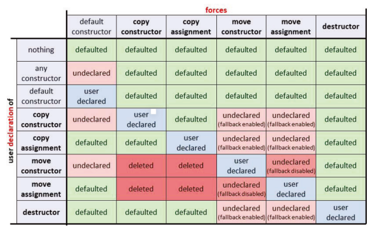

# C++ 移动语义

移动语义是现代 C++ 的重要特征之一。

## 移动语义的基本特征

### 移动语义的力量

#### 动机

移动的本质是偷取 **临时对象(未命名对象，返回值)** 或者 **明确说明（`std::move`）不再需要值的对象** 的堆内存或者资源。

移动语义允许对对象的复制进行优化，它可以隐式使用 (用于未命名的临时对象或局部返回
值)，也可以显式使用 (通过 std::move())。

在移动语义出现之前，这些对象只能复制，导致没必要的耗时.

最常见的两种可以从移动语义收益的对象：`std::string` 和 `std::vector`。

> 这意味着返回字符串向量，并将其赋值给现有向量不再有性能问题。我们可以像使用整型一样使用字符串向量，从而获得更好的性能。这样，大部分情况下可以直接使用返回值了，不再需要别扭的输出参数了（输出参数大部分情况下性能还是更优，但差距不大，考虑可读性，可以优先选择返回值）。

老版本的 C++ 代码使用具有移动语义的 C++11 编译器重新编译，无需修改代码，即可获得 10% 到 40% 的提速(取决于现有代码的难易程度)。

> 获得优化的原因使：编译器会自动完成临时对象和返回值的移动；如果需要进一步优化，需要在代码中合适的地方使用 `std::move`

#### 移动的实现

一个对象的移动，是通过所属类的移动构造函数或者移动赋值函数实现的

> `std::string` 和 `std::vector` 等标准库类已经实现了

> std::move() 表示不再需要这个值，它将对象标记为可移动的。标记为 std::move() 的对象不会 (部分地) 销毁 (析构函数仍然会调用)。

移动的 C++ 标准库的对象仍然是有效的对象，但其值为未定义。

#### 复制是一种应急方式

如果类没有实现这些移动函数，也会降级使用复制构造函数或者复制赋值函数，因此能做到向后兼容性

#### const 对象的移动语义

不能移动用 const 声明的对象

const 对象的 std::move() 没起作用

> const 对象不允许修改，自然也不允许被窃取内容，即不能移动

!> 因此，从 C++11 开始，用 const 返回值就不再是好的方式了

!> 如果按值 (而不是按引用) 返回，不要将返回值声明为 const。仅在声明引用或者指针返回类型时使用 const

### 移动语义的核心

#### 右值引用

> 右值引用使用 && 声明，没有 const。

根据语义，右值引用只能引用**没有名称的临时对象**，或**使用 std::move() 的对象**

与成功初始化返回值引用一样，引用将返回值的生命周期延长到引用的生命周期结束

> 普通的 const 左值引用已经具有此行为

如果编译器自动检测到从生命周期结束的对象中获取值，将自动切换到移动语义:

- 传递一个临时对象的值，该对象将在语句执行后自动撤销。
- 传递一个使用 std::move() 的非 const 对象。

可以在通过 `std::move()` 传递命名对象后使用，但通常不这样做。推荐的编程方式是不在 `std::move()` 后面使用对象

#### std::move

std::move() 对应的是右值引用类型的 static_cast。这允许我们将命名对象传递给右值引用。

> `std::move(obj)` 等同于 `static_cast<decltype(obj)&&>(obj)`

std::move() 标记的对象也可以通过 const 左值引用，传递给接受实参但不接受非 const 左值引用的函数。

> std::move 声明在 `<utility>` 头文件中，但在编译时通常不包含这个头文件，因为几乎所有的头文件都包含了 `<utility>`

#### 移动的对象

C++ 标准库保证移动的对象处于有效但未定义的状态。您仍然可以(重新) 使用它们，只要您不对它们的价值做任何期望。

> 对象移动后，一般就是成员的值没有了

移动后很多操作都是可以的，比如

- 重新赋值

    ```cpp
        std::vector<std::string> allRows;
        std::string row;
        while (std::getline(std::cin, row)) {   // read next line into row
            allRows.push_back(std::move(row));  // and move it to somewhere
        }
    ```

- 实现交换函数

    ```cpp
    template<typename T>
    void swap(T &a, T &b) {
        T tmp{std::move(a)};
        a = std::move(b);
        b = std::move(tmp);
    };
    ```

通常，已移动的对象是可以销毁的有效对象 (析构函数不应该失败)，重用以获得其他值，并支持类型的所有操作对象，而不需要知道具体值。

#### 通过引用进行重载

引入右值引用后的引用调用方式有：

- const 左值引用

    > 可以接受所有类型实参，可以作为 default 实现
    > 语义上的意思是只传递实参的读访问权。这个参数就是我们所说的 `in 参数`。

- 左值引用

    > 只接受可修改的命名对象
    > 语义上的意思是让传递的参数具有读/写访问权限。参数就是`输出或输入/输出参数`。

- 右值引用

    > 可接受没有名称的临时对象和用 std::move() 标记的非 const 对象
    > 语义上的意思是给对传递的参数的写访问权来窃取值。它是一个 in 参数，附加的约束是**调用者不再需要这个值**。

- const 右值引用

    > 可接受没有名称的临时对象和用 std::move() 标记的 const 或非 const 对象
    > const 右值引用是可能的，但针对它们的实现通常没有意义。

#### 按值传递

标记为 std::move() 的对象也可以传递给**按值接受参数**的函数。在这种情况下，移动语义用于初始化参数，这可以使按值调用非常高效。

> 按值接受参数比按右值引用接受参数多一次移动，但是比较通用，不用重载多个引用

### 类中的移动语义

#### 普通类中移动语义

!> 移动语义不可传递。

> 这是必要的，如果要传递移动语义，就不能使用两次传递了移动语义的对象。

用户声明复制构造函数、复制赋值操作符或析构函数将禁用类中对移动语义的自动支持。这不会影响派生类中的支持

> 因此没有特定的需要，就不要实现或声明析构函数

这也意味着默认情况下，多态基类禁用了移动语义。但是对于派生类的成员，移动语义仍然会自动生成 (如果派生类没有显式声明特殊的成员函数)

自动生成的移动操作在以下情况可能会有问题:

- 对成员变量有限制
-   - 值有限制
    - 值相互依赖
- 使用了引用语义的成员 (指针，智能指针，…)
- 对象没有默认构造

#### 实现复制/移动函数

对于每个类，移动构造函数和移动赋值操作符都是自动生成的 (除非没有办法这样做)。

手动实现移动构造函数和移动赋值操作符时，通常都应该有 `noexcept` 声明

> 在 vector 扩容的时候需要 noexcept 证明可以通过移动来扩容，而不用害怕失败的移动打破一致性状态而只能使用复制


#### 特殊成员函数的规则



> 五个特殊成员函数，只要**声明（包括自定义，=default, =delete）**其它任何一个，都会阻止移动语义的自动支持

!> 由此可见，用 `=default` 声明一个特殊成员函数与根本不声明它是不同的

用户声明一个移动构造函数或移动赋值操作符将禁用类中对复制语义的自动支持，将得到的是只移动类型 (除非这些特殊的移动成员函数删除)。

> 永远不要 `=delete` 特殊的移动成员函数.如果想要同时禁用复制和移动，删除复制的特殊成员函数就足够了。

> 如果某个类型的移动语义不可用或已被删除，则这不会影响具有此类型成员的类的移动语义的生成。

如果没有特定的需要，不要声明析构函数。从多态基类派生的类也一样，没有特殊需要，不要声明析构函数

支持移动操作但不支持复制操作的类是有意义的。可以使用这种只移动类型传递资源的所有权或句柄，而无需共享或复制

#### 三五法则

- C++11 之前，这条原则称为“3 法则”: 要么声明全部三种 (复制构造函数、赋值操作符和析构函数)，要么一个都不声明。

- 从 C++11 开始，该规则就变成了“5 法则”，通常的表述方式是: 要么声明所有 5 种 (复制构造函数、移动构造函数、复制赋值操作符、移动赋值操作符和析构函数)，要么一个都不声明。

> 这里的声明指：实现 or `=default` or `=delete`

更多地把三五发展作为一个指导方针，当其中一个特殊成员函数是用户声明的时候，仔细考虑这 5 个特殊成员函数，通过它们之间的关系来定义即可。

比如为了只启用复制语义，应该声明默认复制特殊成员函数，这样移动特殊成员函数自然不会生成，无需刻意删除

### 如何从移动语义中获益

#### 避免命名对象

```cpp
foo (MyType{ 42 , "hello" } ) ;
```

使用无名称的临时对象会自动运用移动语义。

#### 避免不必要的 std::move()

按值返回局部对象会自动使用移动语义，如果使用 `std::move()` 显示声明，反而会导致返回值优化（RVO）失效

> RVO 优化：允许返回对象作为返回值使用

```cpp
std::string foo() {
    std::string s;
    //...
    return std::move(s);
}
```

!> 因此，如果按值返回局部对象时，不要使用 `std::move()`

在某些应用程序中，返回语句中的 `std::move()` 是合适的。一个是移出成员的值，另一个是返回带有移动语义的参数。**即返回非局部对象**

#### 用移动语义初始化成员

一般通过传值或者引用给构造函数来初始化成员，主要以下三种方式

1. 传值给构造函数，成员的初始化在可移动场景需要两次移动，在不可移动场景，需要一次复制，一次移动

2. 可以定义通用的 const 左值引用，但是无法利用移动语义

3. 为了能运用移动语义与复制，重载至少两种定义(const 左值引用，右值引用)，如果有多个成员，重载的个数是笛卡尔积。

根据经验，2 的性能往往比较差，而虽然 1 比 3 多了一次移动，但由于移动代价不高，二者的性能差异不大

结合性能和简洁性考虑，**初始化成员应该优先使用传值+移动的方式**

以上讨论的特殊情况是**创建并初始化一个新值**

**对于 setter 的场景，最佳方法是通过 const 左值引用和赋值来获取新值**，而不使用 std::move()。

传值，会导致产生临时形参，需要多一次内存分配
传右值引用，可能会导致容量收缩，导致后续的操作需要重新分配内存

#### 类中使用移动语义

基类需要声明 virtual 析构函数，因此移动特殊成员函数被禁用了，需要显式声明，但是只声明移动函数，复制函数也会被禁止，因此还需要显式声明复制函数。

另外，为了避免多态体系中移动导致的切片问题，应该禁用在多态类层次结构中使用赋值操作符，因此移动赋值函数和赋值赋值函数应该设置为 delete

对于派生类，通常不需要声明特殊的成员函数。特别是，不需要再次声明虚析构函数 (除非必须实现)。再次声明析构函数 (无论是否是虚函数) 将禁用派生类成员 (这里是 vector) 对移动语义的支持:


### 引用的重载

### 已移动状态

### 值的种类

## 泛型代码中的移动语义

## C++ 标准库中的移动语义