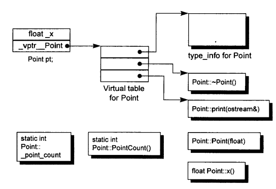

# C++ 对象模型

C++ 对象模型包含两个部分：

1. 语言中直接支持面向对象程序设计的部分
2. 对于各种支持的底层实现机制

> 主要关注第 2 部分

## 关于对象

在 C 语言中, “数据”和“处理数据的操作（函数）”是分开来声明的，也就是说，语言本身并没有支持“数据和函数”之间的关联性，我们把这种程序方法称为**过程性的（procedural）**

同样的逻辑，在 C++ 中，可以把数据和函数放在一起，组成 “**抽象数据类型（ADT）**” 来实现；

更进一步可以引入**继承**机制来实现面向对象；

更进一步还可以引入**模板**来实现参数化。

> C++ 支持四种编程风格：过程性、ADT、面向对象、模板

C++ 的编程风格更加的具有表达性，使用上更容易。

引入的这些封装布局成本也未必会增加。

C++ 在布局以及存取时间上主要的额外负担是由 virtual 机制引入的，包括 `virtual function` 机制 和 `virtual base class` 机制。

另外，还有一些**多重继承**下的额外负担，发生在 “一个 derived class 和其第二或后继 base class 的转换”之间。

除此之外，C++ 程序并不会比 C 慢

C++ 对象模型：

- `Nostatic data members` 被配置于每个 class object 之内
- `static data members` 被存放在所有的 class object 之外
- `static/nostatic funcion members` 被放在所有的 class object 之外
- `virtual functions` 通过 `vptr -> vtbl` 来实现

```c++
class Point {
public:
    Point(float xval);
    virtual ~Point();

    float x() const;
    static int PointCount();

protected:
    virtual ostream& print(ostream &os) const;

    float _x;
    static int _point_count;
}
```

对应的对象模型：




## 构造函数语意学


## Data 语意学

## Function 语意学

## 构造、析构、拷贝 语意学

## 执行期语意学

## 站在对象模型的尖端

## Reference

- [深度探索C++对象模型](https://book.douban.com/subject/1091086/)