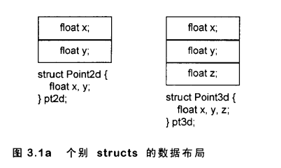
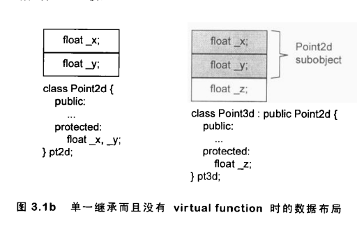
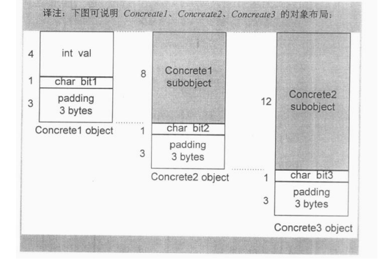
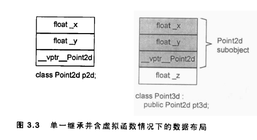
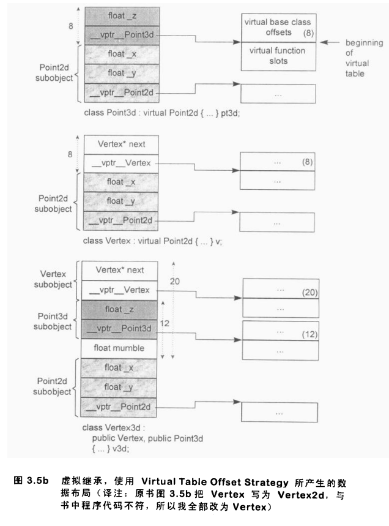
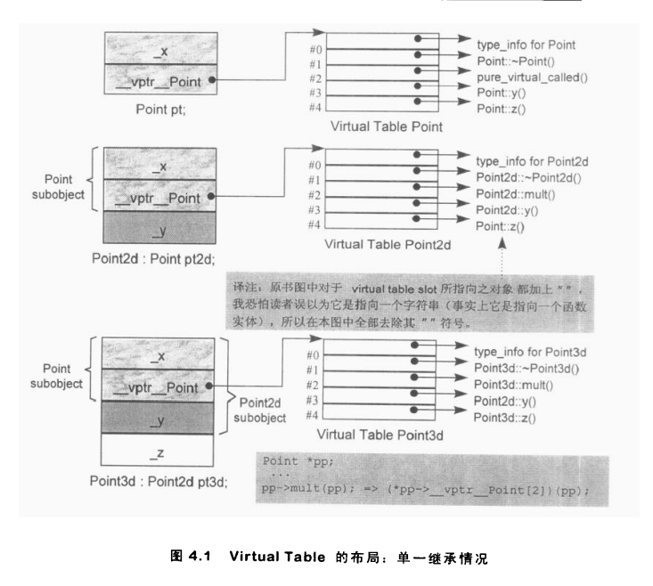
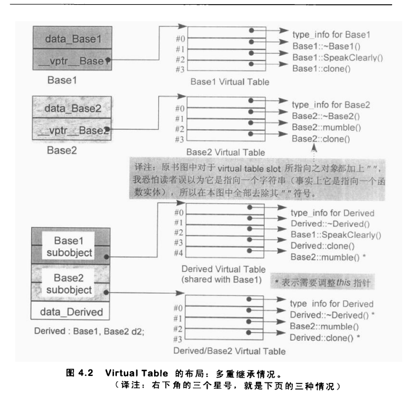
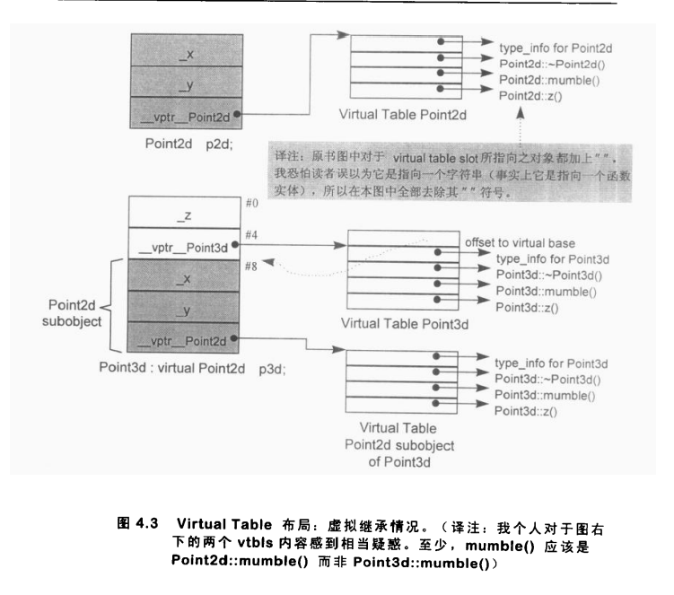
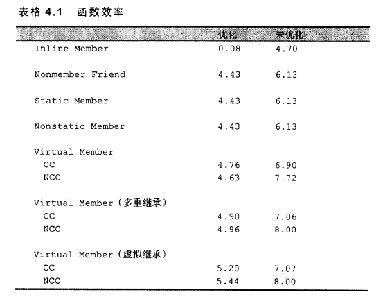
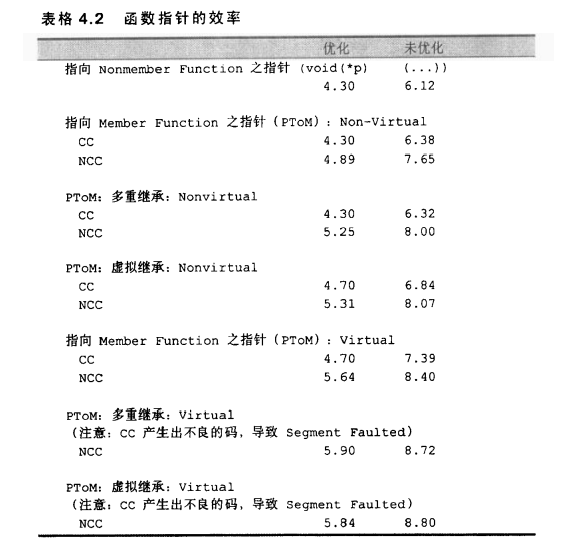

# C++ 对象模型

C++ 对象模型包含两个部分：

1. 语言中直接支持面向对象程序设计的部分
2. 对于各种支持的底层实现机制

> 主要关注第 2 部分

## 关于对象

在 C 语言中, “数据”和“处理数据的操作（函数）”是分开来声明的，也就是说，语言本身并没有支持“数据和函数”之间的关联性，我们把这种程序方法称为**过程性的（procedural）**

同样的逻辑，在 C++ 中，可以把数据和函数放在一起，组成 “**抽象数据类型（ADT）**” 来实现；

更进一步可以引入**继承**机制来实现面向对象；

更进一步还可以引入**模板**来实现参数化。

> C++ 支持四种编程风格：过程性、ADT、面向对象、模板

C++ 的编程风格更加的具有表达性，使用上更容易。

引入的这些封装布局成本也未必会增加。

C++ 在布局以及存取时间上主要的额外负担是由 virtual 机制引入的，包括 `virtual function` 机制 和 `virtual base class` 机制。

另外，还有一些**多重继承**下的额外负担，发生在 “一个 derived class 和其第二或后继 base class 的转换”之间。

除此之外，C++ 程序并不会比 C 慢

C++ 对象模型：

- `Nostatic data members` 被配置于每个 class object 之内
- `static data members` 被存放在所有的 class object 之外
- `static/nostatic funcion members` 被放在所有的 class object 之外
- `virtual functions` 通过 `vptr -> vtbl` 来实现

```cpp
class Point {
public:
    Point(float xval);
    virtual ~Point();

    float x() const;
    static int PointCount();

protected:
    virtual ostream& print(ostream &os) const;

    float _x;
    static int _point_count;
}
```

对应的对象模型：


## 构造函数语意学

关于 C++，最常听到的一个抱怨就是，编译器背着程序员做了太多事情。

Conversion 运算符就是最常被引用的例子。

比如给 `cin` 定义一个 `operator int()`，那么 `cin << intVal` 就能编译通过，变成了位运算

> 这里是故意写错输入符

事实上关键词 `explicit` 就是为了能够制止 “单一参数的 constructor” 被当作一个 conversion 运算符

### Default Constructor 的建构操作

如果一个类没有显式定义 constructor，那么 Default constructor 在需要的时候被编译器产生出来

> 这个需要指的是编译器的需要，而不是程序的需要，程序的需要由程序员保证

> 不需要的时候，不会合成 Default Constructor

!> C++ 新手一般有两个常见的误解：1. 任何 class 没有定义默认构造器，都会被合成出一个；2. 编译器合成的默认构造器会明确设定每个 data member 的默认值

这个编译器的需要主要有四种情况：

1. member class object 带有 default constructor

    > 合成的默认构造器会调用该 member 的默认构造函数
    
    > 即使已经定义了构造器，如果构造器中没有调用该 member 的构造器，编译器扩展已存在的构造器，在用户代码之前安插一些码，先调用该 member 的构造器

    > 如果多个 member 需要初始化，会按声明的次序一次调用其构造器

2. base class 带有 default constructor

    > 和 member class object 类似 

3. 存在 virtual function

    对于 virtual function 有两个扩张操作会在编译期间发生
    - 一个 virtual function table （vtbl）会被编译器产生出来，内放 class 的 virtual functions 地址
    - 在每个 class object 中，一个额外的 pointer member （vptr）会被编译器合成，内含相关的 class vtbl 的地址

    为了让这个机制生效，编译器必须为每个派生类对象的 vptr 设定初值，放置适当的 vtbl 地址。对于 class 定义的每个构造器，编译器会安插一些码来做这个事

4. 存在 virtual Base Class

    对于 virtual Base Class 只能有一份实体，因此往往需要用指针指向这份实体，这个指针编译器需要在构造器中安插代码来初始化


以上四种情况合成的默认构造器，被 C++ 标准称为 `implicit nontrivial default constructor`(隐式的有用的默认构造器)。

至于没有存在那四种情况而又没有声明任何 constructor 的 class，C++ 标准说它拥有的是 `implicit trivial default constructor`（隐式的无用的默认构造器），**实际上这种构造器并不会被合成出来**。

> 同样 trivial 的析构函数、拷贝函数都不会被产生和调用，没有拷贝函数会采用位拷贝的方式。


### Copy Constructor 的建构操作

和默认构造器一样，拷贝构造和拷贝赋值也不是一定会被生成的，得看编译器需不需要。

没有显式定义拷贝赋值，同时不存在特殊情况，拷贝构造和拷贝赋值都不会被自动生成，而是采用 Bitwise Copy（位拷贝）

> 位拷贝性能比拷贝构造和拷贝赋值要好

无法使用 bitwise copy 的四种特殊情况：

1. member class object 拥有拷贝构造器（无论是定义的还是合成的）
2. base class 拥有拷贝构造器（无论是定义的还是合成的）
3. 内含 virtual function

    > 可能存在对象裁剪，不能通过 bitwise copy 复制原对象的 vptr，而是应该设置新对象 class 的 vptr 值

4. 有 virtual base classes

### 程序转化语意学

#### 明确的初始化操作

```cpp
X x0;

void foo_bar() {
    X x1(x0);
    X x2 = x0;
    X x3 = X(x0);
}
```

会被编译器转换成两个阶段：1. 先定义；2.调用构造器

> **定义**是指**占用内存**的行为

```cpp
void foo_bar() {
    X x1;
    X x2;
    X x3;

    x1.X::X(x0);
    x2.X::X(x0);
    x2.X::X(x0);
}
```

#### 参数的初始化

```cpp
void foo(X x0);

X xx;
//...
foo(xx);
```

转化成

```cpp
// 修改参数为引用类型
void foo(X& x0);

X xx;
// ...
// 定义形参
X __temp0;
// 通过实参构造
__temp0.X::X(xx);
// 调用函数
foo(__temp0)
// 析构形参
__temp0.X::~X();
```

#### 返回值的初始化

```cpp
X bar() {
    X xx;
    //...
    return xx;
}

X xx = bar();

bar().memfunc();
```

转化成：

```cpp
void bar(X& __result) {
    X xx;
    xx.X::X();

    //...

    // 赋值给结果
    _result.X::XX(xx);

    return;
}

X xx;
bar(xx);

X __temp0;
(bar(__temp0), __temp0).memfunc();
```

在使用者层面做优化：

```cpp
X bar(const T &y, const T &z) {
    X xx;
    //... 以 y 和 z 处理xx；
    return xx;
}
```

可以优化为：

```cpp
X bar(const T &y, const T &z) {
    return X(y, z)
}
```

这样转换后，可以减少一个局部变量

```cpp
void bar(X &__result, const T &y, const T&z) {
    __result.X::X(y, z);
    return;
}
```

在编译器层面做优化（即 NRVO）：

转换成：

```cpp
void bar(X &__result) {
    __result.X::X();
    //...
    return;
}
```

!> NRVO 在 return 语句不是函数中的第一层级时可能不生效，这时只能从代码上模仿


### 成员们的初始化队伍

设定 class members 的初值，要么通过成员初始化列表，要么就是在构造函数内

必须使用成员初始化列表的场景:

1. 初始化一个 reference member
2. 初始化一个 const member
3. 调用一个 base class 的 constructor，而它拥有一组参数
4. 调用一个 member class 的 constructor，而它拥有一组参数

base class， member class 的 constructor 如果没有成员初始化列表中调用，编译器也会安插代码在构造器中用户代码的前面调用。因此如果在构造器中通过代码初始化，估计会调用两次 base class 或者 member class 的构造器

```cpp
class Word {
    String _name;
    int _cnt;
public:
    Word() {
        _name = 0;
        _cnt = 0;
    }
}
```

上面的写法不仅会调用两次 String 的构造器，还会产生临时对象

编译器转化后的代码：

```cpp
Word::Word(/* this pointer */) {
    // 编译器生成
    _name.String::String();

    // 产生临时对象
    String temp = String(0);
    // 拷贝
    _name.String::operator=(temp);
    // 销毁临时对象
    temp.String::~String();

    _cnt = 0;
}
```

因为这个原因，很多开发者坚持所有 member 初始化操作必须在成员初始化列表中完成，即使是一个行为良好的 member 如上面的 `_cnt`

成员初始化列表存在一个次序的坑，会导致意想不到的 bug。

编译器会对成员初始化列表重新排序，按照 member 的声明次序，而不是初始化列表中的定义顺序；然后根据声明次序安插代码到 constructor 体内，并置于任何 explicit user code 之前

> 当成员初始化列表中某个 member 依赖于另一个 member 时，要特别注意次序的问题

```cpp
class X {
    int i;
    int j;
public:
    // 存在次序问题
    X(int val): j(val), i(j) {}
}
```

正确的写法

```cpp
class X {
    int i;
    int j;
public:
    // 存在次序问题
    X(int val): j(val) {
        i = j;
    }
}
```

> 另外，在成员初始化列表中使用成员函数也要特别注意，成员函数可能会依赖其它成员变量，也会出现次序的问题。建议少在成员初始化列表中调用成员函数

## Data 语意学

### Data Member 的绑定

```cpp
extern float x;
class Point3d {
public:
    float X() const { return x; }
private:
    float x, y, z;
};
```

对于现代 C++ 编译器，Point3d::X() 返回的是成员变量 x，而不是外部的 x。

> 早期的 C++ 编译器不是这样，会返回外部的 x；这也导致了以前出现了两种防御性程序设计风格（对于现代编译器没有必要了）：
> 1. 把所有 data member 放在 class 声明开始处
> 2. 把所有的 inline functions, 不管大小都放在 class 声明之外

现代编译器对 member functions 本身的分析，会直到整个 class 的声明都出现了才开始。因此，在一个 inline member function 躯体之内的一个 data member 绑定操作，会在整个 class 声明完成之后才发生。

然而，对于 member function 的 argument list 和返回值还是会在第一次扫描时就被会绑定。

```cpp
typedef int length;

class Point3d {
public:
    // length 被绑定为 global
    // _val 被绑定为成员变量
    void mumble(length val) { _val = val; }
    length mumble() { return _val};
private:
    typedef float length;
    length _val;
};
```

!> 仍需坚持的防御性程序风格：始终把 "nested type 声明" 放在 class 的起始处

### Data Member 的布局

nonstatic data members 在 class data member 在 class object 中的排列顺序将和其被声明的顺序一样，任何中间介入的 static data member 都不会被放进对象布局之中

其实C++ 标准只是要求，在同一个 access section 中的 members 的排序只需符号“较晚出现的 members 在 class object 转给你有较高的地址”这一条件即可；对于不同 access section 中的 members 可以自由排列。

但是当前大多数编译器都在忽视 access section，直接依照声明的次序来。

### Data Member 的存取

每个 static data member 只有一个实体，存放在程序的 data segment 之中。每次程序读写 static member，就会被内部转换为对该唯一 extern 实体的直接操作.

```cpp
// origin.chunkSize == 250
Point3d::chunkSize == 250;
// pt->chunkSize == 250
Point3d::chunkSize == 250;
```

> static data member 的存取不受任何继承方式的影响，都会转换成定义该 static data member 的 `类::member` 的方式

> 不同的类的 static data member 的名称在 data segment 中可能会冲突，所有编译器一般会通过 name mangling 来给各个 static data member 生成独一无二的名称（比如加上类名等）

对 nonstatic data member 的存取，编译器需要把 class object 的起始地址加上 data member 的偏移量

``cpp
origin._y = 0.0;

// 转换成
&origin + (&Point3d::_y - 1)
``

> -1 的原因是编译器为了能区分出“一个指向 data member 的指针，指向 class 的第一个 member” 和 “一个指向 data member 的指针，没有指向任何 member” 这两种情况，就把 data member offset 加上 1。这样在求 data member 的真实地址的时候，就得 -1

在用指针或者引用存取虚拟继承得到的 nonstatic member 时，必须延迟至执行期，经由一个额外的间接层才能实现，因此速度也比较慢。

> 通过类型变量存取虚拟继承得到的 nonstatic member 不需要，offset 在编译期就可以知道。

### 继承与 Data Member

在大部分编译器上，派生类对象的内存区域中 base class members 总是先出现，但属于 virtual base class 除外

一般而言，具体继承（相对于虚拟继承）并不会添加空间或存取时间上的额外负担。

> 就是说具体继承的性能并不比 C 的 struct 差。空间大小基本一致，存取的成员函数可以通过 inline 优化





多级继承：



加上多态：

多态主要是得额外考虑 vptr 的位置。

一般面向对象语言都是放在头部的，但是考虑到对 C struct 的兼容，大部分 c++ 编译器把 vptr 放在尾端



多重继承：

对于一个多重派生对象，将其地址指定给第一个 base class的指针，情况和单一继承相同，因为二者都指向相同的起始地址。需付出的成本只有地址的指定操作而已。至于第二个或后继 base class 的地址指定操作，则需要将地址修改过：加上（或减去，如果 downcast）介于中间的 base class subobjects 大小。

```cpp
Vertex3d v3d;
Vertex *pv = &v3d;
```

需要这样的内部转化：

```cpp
Vertex *pv = (Vertex*)(((char*)&v3d) + sizeof(Point3d));
```

> 存取后继 base class 也不需要付出额外的成本，member 的位置编译时就固定了，只是一个简单的 offset 运算，和单一继承一样简单


虚拟继承：

两种布局方式：

通过指针的方式：

缺点：每个对象都得背负这个 virtual base class 指针，空间成本高


offset的方式



> 无论使用哪种实现方式，都需要执行期经过中间层才能获取 virtual base class 的起始地址，效率较低

### 对象成员的效率

除了虚拟继承，无论是聚合、封装、继承下，存取对象存取并不会导致效率损耗。

> 前提是开启编译器的优化

### 指向 Data Member 的指针

```cpp
float Point3d:*p1 = 0;
float Point3d:*p2 = &Point3d::x;
```

取址 nostatic data member 得到的是在 class object 中的偏移量 + 1

> +1 是为了保留 offset=0 代表没有指向任何的 data member

取址 static data member 得到的是真实的地址

## Function 语意学

### Member 的各种调用方式

#### Nonstatic Member Functions

C++ 的设计准则之一就是： nonstatic member function 至少必须和一般的 nonmember function 有相同的效率

编译器内部会将 “member 函数实体” 转换为对等的 “nonmember 函数实体”

转化步骤：

1. 改写函数的 signature 安插一个额外的参数，即 this 指针。如果该 member function 是 const，则生成的 this 指针是个指向 const 对象的指针，即 `const T *this`
2. 将函数体内每个“对 nonstatic data member 的存取操作”改成经由 this 指针来存取
3. 将 member function 重新写成一个外部函数，对函数名称进行“mangling”处理，使它在程序中称为独一无二的词汇。现在这个函数已经被转换好了，而其每一个调用操作也都必须转换。例如：`obj.fun();` 变成了 `fun__7Point3dFv(&obj);`

名称的特殊处理：Name mangling

一般而言，member 的名称会加上 class 名称；

由于 function 存在重载的可能，member function 还会加上参数列表

比如 `void Point::x(float newX);` 会被转换成 `void Point::x__5PointFf(float newx)` (5 代表类名的长度，F 代表 Function)

> 由于重载的存在，nonmember function 也会被 name mangling（加上参数列表），可以通过声明 `extern "C"`, 压抑 nonmber function 的 mangling

#### Virtual Member Function

如果 `Point3d::normalize()` 是一个 virtual member function，那么以下的调用：

```cpp
ptr->normalize();
```

会被转化为:

```cpp
(* ptr->vptr[1])(ptr);
```

但是对于以下调用

```cpp
obj.normalize();
```

不需要通过 vptr 来调用，“经由一个 class object 调用一个 virtual function”，这种操作被编译器按 nonstatic member function一样加以决议：

```cpp
normalize__7Point3dFv(&obj);
```

#### Static Member Function

如果 `Point3d::normalize()` 是一个 virtual member function，以下两个调用：

```cpp
obj.normalize();
ptr->normalize();
```

会被转换成:

```cpp
// SF 代表 Static Function
normalize__7Point3dSFv();
normalize__7Point3dSFv();
```

> 和 nonstatic member function 相比，不会添加 this 参数

在 C++ 引入 static member functions 之前，调用不需要 this 参数的 member function，会经常见到以下的写法

```cpp
((Point3d*)0)->normalize();
```

如果取一个 static member function 的地址，获得的将是其在内存中的位置，也就是真实的地址。

由于 static member function 没有 this 指针，所以其地址的类型并不是一个 “指向 class member function 的指针”，而是一个“nonmember 函数指针”。也就是说：

```cpp
&Point3d::normalize();
```

得到的指针类型是 `void (*)()`, 而不是 `void (Point3d::*)()`


### Virtual Member Function 的布局

virtual member function 的布局方案：





派生类对象传给后继 base class 指针时，需要调整指针的值为后继 base class 子对象的起始地址。即

```cpp
Base2 *pbase2 = new Derived;
```

转化为

```cpp
Derived *temp = new Derived;
Base2 *pbase2 = temp ? temp + sizeof(Base1): 0;
```

> 有 n 个 base clase 的 derived class 至多会有 n 个 virtual table

对于后继 base class 指针调用析构函数时，传入的 this 指针代表的地址要转成派生类的初始地址，主要有两种实现方案：

1. vtbl 中不仅仅存储函数地址，还存储 this 的 offset。这种做法的缺点是 vtbl 每个 slot 的空间都需要增大

    即 `(*pbase2->vptr[1](pbase2))` 改变为 `(*pbase2->vptr[1].faddr)(pbase2 + pbase2->vptr[1].offset)`

2. 后继 base class 的 vtbl 的析构函数 slot 指向一段 chunk 代码，这段 chunk 代码会先调整好 this 的值，然后调用派生类的析构函数



### 函数的效能



### 指向 Member Function 的指针

取一个 nonstatic member function 地址，如果是 nonvirtual 得到的结果是它在内存中真正的地址；如果是 virtual 得到的结果只是 vtbl 中的索引值。

```cpp
float (Point::*pmf)() = &Point::z;
Point *ptr = new Point3d;
(ptr->*pmf)();
```

如果是 virtual，最后一行会被转化成： `(* ptr->vptr[(int)pmf])(ptr)`;

但是对于 pmf 这个指针既可以接受 nonvirtual member function 的取址也可以接受 virtual member function 的取址，到底是哪个，编译期并不知道。

因此一般会定义以下的结构作为指向 member function 指针类型的结构

```cpp
struct __mptr {
    // this 指针的 offset
    int delta;
    // vtbl 索引值
    int index;
    union {
        // 真实地址
        ptrtofunc faddr;
        // 后继 base class 或者 virtual base class 的 vptr 位置
        int v_offset;
    }
}
```

对于单一继承并存在 virtual function 的情况，`(ptr->*pmf)();` 会转化成

```cpp
(pmf.index < 0>)
    ? // no-virtual invocation
    (*pmf.faddr)(ptr)
    : // virtual invocation
    (* ptr->vptr[pmf.index](ptr));
```

对于多重继承并存在 virtual function 的情况，会转化为:

```cpp
pmf.index < 0
    ? (*pmf.faddr)(ptr + pmf.delta)
    : (*ptr->__vptr_Point[pmf.index].faddr)(ptr + ptr->__vptr_Point[pmf.index].delta)
```




### inline Function

关键词 `inline`(或 class declaration 中的 member function 或 friend function 的定义)只是一项请求。

编译器会通过计算函数内的 assignments、function calls、virtual function calls 等操作的次数，每个表达式种类有一个权重，inline 函数的复杂度就以这些操作的总和来决定是否真正 inline。

> 判断标准大概是如果函数体的执行损耗远大于函数调用和返回机制的损耗，则不 inline。即 inline 会带来较明显的性能提升（百分比），才会 inline

处理一个 inline 函数有两个阶段：

1. 计算函数复杂度，以及其建构，判断是否可以 inline
2. 真正的 inline 函数时在调用的地方进行扩展操作的。这会带来参数的求值操作以及临时性对象的管理。

一般而言，面对“会带来副作用的实际参数”，通常需要引入临时性对象。

```cpp
inline int min(int i , int j) {
    return i < j ? i : j;
}

void main() {
    int minVal;
    int val1 = 1024;
    int val2 = 2040;

    minVal = min(val1, val2);
    minVal = min(1024, 2048);
    minVal = min(foo(), bar() + 1);
}
```

inline 后，最后三句会转化为:

```cpp
minVal = val1 < val2 ? val1 : val2;
// 常量表达式，编译期就可以计算好
minVal = 1024;
// 参数存在副作用，引入临时性队形
int t1;
int t2;
minVal = (t1 = foo()), (t2 = bar() + 1), t1 < t2 ? t1 : t2;
```

如果加入局部变量:

```cpp
inline int min(int i , int j) {
    int minval = i < j ? i : j;
    return minval;
}

void main() {
    int minVal;
    int val1 = 1024;
    int val2 = 2040;

    minVal = min(val1, val2);
}
```

会转化为：

```cpp
// 将 inline 函数的局部变量除以 “mangling” 操作
int __min_lv_minval;
minval = (__min_lv_minval = val1 < val2 ? val1 : val2), __min_lv_minval
```

参数带有副作用，或是以一个单一表达式做多重调用，或是在 inline 函数中有多个局部变量，都会产生临时性对象。

如果 inline 函数中调用了这样一个多临时性对象的 inline 函数，可能会使外面这个表面上看起来平凡的 inline 却因其连锁复杂度而没办法扩展开来。

## 构造、析构、拷贝 语意学

不要把 virtual destructor 声明为 pure

一般而言，把所有的成员函数都声明为 virtual function，然后再靠编译器的优化操作把非必要的 virtual invocation 去除，并不是好的设计观念。

> virtual 调用会阻止 inline 扩展

一个 virtual function 如果是 const，会导致其派生类 overrided 时也不能修改派生类中的 data member，限制太大，这种情况一般建议不适用 const。

### 无继承情况下的对象构造

```cpp
typedef struct
{
    float x, y, z;
} Point;

Point global;

Point foobar()
{
    Point local;
    Point *heap = new Point;
    *heap = local;
    // ... stuff
    delete heap;
    return local;
}
```

C++ 中的 global 对象会被初始化

local 对象由于其 constructor 和 destructor 都是 trivial 的，并不会被产生和调用，因此是未初始化的，使用其值会有问题。

指针对象也就是会被转换为对 new 运算符的调用(`Point *heap = __new(sizeof(Point));`)，也不会调用 constructor;
delete 也会被转换为 `__delete(head);`,也不会调用 destructor

### 继承体系下的对象构造

在继承的情况下，如果有 virtual function，会产生额外的负担：

- 每个 class object 多负担一个 vptr
- 定义的 constructor 被附加了一些码，以便将 vptr 初始化
- 拷贝函数也不能是 trivial 的了，即无法使用位拷贝

编译器对 contructor 的扩充操作：

```cpp
constructor() {
    // 调用 virtual base class 的构造器，如果在成员初始化列表中有传参，也要把参数传过去
    // 调用所有 base class 的构造器，按声明顺序来，成员初始化列表若有参则传参
    // 初始化 vptr(s)
    // 对初始化列表中的 data member 或者有默认构造器的 data member，按声明顺序进行初始化，有参传参
    // 用户写在构造器中的代码最后执行
}
```

> 由于 base class 的构造器执行早于 vptr 的初始化，所以在 base class 中调用 virtual function，访问到的是 base class 中的那个。
> 为了避免歧义，建议在 base class 中通过 `Base::fun()` 的方式明确调用本 class 的方法


对于析构函数的扩充操作，基本是和构造函数的执行顺序倒着来

## 执行期语意学

### 对象的构造和析构

对于对象的构造和析构，编译器会自动插入相应的调用构造和析构函数的码。而且析构函数的调用码会安插到每个离开点。

对于全局对象: 

C++ 程序中的所有的 global objects 都在编译时期被放置到程序的 data segment 中，如果明确指定给它一个常量表达式的值，编译时期 object 就会被设置该值，否则就是 0。至于非常量表达式的值以及构造函数，则是在程序启动时才会实施。

那么程序启动和退出的时候如何知道所有的 global object 进行初始化或者析构呢？

最简单的方式是各个 object files，编译时把文件中所有 global objects 的初始化放到 `__sti()` 函数，析构放到 ` __std()`, 链接时通过 nm 查询各个 object files 找到这两个函数，在合成的 __main 和 exit 函数中调用

对于局部静态对象：

局部静态对象也是放置到程序的 data segment 中，但是它的初始化是在第一调用时。会额外使用一个标识（也放在 data segment 中）来表示这个对象是否已经初始化，这样来保证只要初始化一次。

局部静态对象的析构也是在程序退出的时候，而且要保证析构的顺序和初始化的顺序相反。

> 可以通过保持一个执行期链表来记录初始化的顺序，以便实现按反顺序析构

对象数组：

对于内建类型的数组定义，只需配置足够的内存即可。

对于有定义默认构造函数的 class object 数组，还是逐个进行初始化。为了初始化方便，编译器定义了相应的函数

```cpp
void * vec_new(
    void *array,        // 数组起始地址
    size_t elem_size,   // 每个 class object 的大小
    int elem_count,     // 数组中的元素数目
    void (*constructor)(void*),
    void (*destructor)(void*, char)
)

Point knots[10];

vec_new(&knots, sizeof(Point), 10, &Point::Point, 0)
```

对于已经设置了初值的元素，vec_new 不再必要

```cpp
Point knots[10] = {
    Point(),
    Point(1.0, 1.0, 0.5),
    -1.0
}
```

会转化为

```cpp
Point* knots = (Point*)__new(10 * sizeof(Point));

Point::Point(&knots[0]);
Point::Point(&knots[1], 1.0, 1.0, 0.5);
Point::Point(&knots[2], -1.0, 0.0, 0.0);

vec_new(&knots+3， sizeof(Point), 7, &Point::Point, 0);
```

同样的，还有 `vec_delete`

```cpp
void * vec_delete(
    void *array,        // 数组起始地址
    size_t elem_size,   // 每个 class object 的大小
    int elem_count,     // 数组中的元素数目
    void (*destructor)(void*, char)
)
```

### new 和 delete 运算符

new 运算符其实由两个步骤完成

```cpp
Point3d *origin = new Point3d;
delete origin;
```

会被转化为

```cpp
Point3d *origin;
if (origin = __new(sizeof(Point3d))) {
    origin = Point3d::Point3d(origin);
}

if (origin != 0) {
    __delete(origin);
}
```

new 运算符实际上总是以标准的 C `malloc()` 完成。delete 运算符以 C `free()` 完成

对于数组的 delete，需要知道数组的大小，有两种实现方案，`vec_new` 返回内存区块配置一个额外的 word 放置，用一个全局的结构存放指针和大小。

另外，最好避免以一个 base class 指针指向一个 derived class objects 组成的数组。

### 临时性对象

临时性对象的被摧毁，应该是对完整表达式求值过程中的最后一个步骤。该完整表达式造成临时对象的产生。

凡含有表达式执行结果的临时性对象，应该存留到 object 的初始化操作完成为止。

如果一个临时性对象被绑定于一个 reference，对象将残留，直到 reference 的生命结束

## 站在对象模型的尖端

### Template

只有使用的 member functions 才会被实体化。

所有与类型有关的检验，如果牵涉到 template 参数，都必须延迟到真正的具现操作发生，才得为之。

### 异常处理

当一个 exception 发生是，编译系统必须完成以下事情：

1. 检验发生 throw 操作的函数
2. 决定 throw 操作是否发生在 try 区段中
3. 若是，编译系统必须把 exception type 拿来和每个 catch 子句比较
4. 如果比较吻合，流程控制应该交给 catch 子句中
5. 如果 throw 的发生并不在 try 区段中，或没有一个catch 子句吻合，那么系统必须（a）摧毁所有active local objects，（b）从堆栈中将当前的函数“unwind”掉，（c）进行到程序堆栈中的下一个函数中去，然后重复上述步骤 2~5

每个函数会产生一个 exception 表格，它描述与函数相关的各区域、任何必要的善后码（cleanup code，被local class object destructors 调用），以及 catch 子句的位置（如果某个区域是在 try 区段中）

当一个 exception 被丢出时，exception object 会被产生出来并通常放置在相同形式的 exception 数据堆栈中。从 throw 端传染给 catch 子句的是 exception object 的地址、类型描述器，已经可能会有的 exception object 描述器。

> 异常处理机制很影响 C++ 的性能。

### 执行期类型识别

正是由于异常的出现，编译器必须提供某种查询 exception objects 的方法，以知道其实际类型，这直接导致了 RTTI 的出现。

除此以外，保证安全 downcast（向下转型）也是 RTTI 的重要使用场景，

不过这种情况只能使用于多态类（有 vtbl 的）

安全 downcast 需要知道指针所指派生类的类型信息，为了减少负担，这种类型信息一般放在 vtbl 中，这样就能复用 vptr 了，对每个 class object 不会有额外的负担，但是这样也限制了安全 downcast 只能用于有 vptr 的多态类。

如果 downcast 是安全的，这个运算符会传回适当转型过的指针。如果 downcast 不是安全的，这个运算符会传回 0

```cpp
typedef type *ptype;
typedef fct *pfct;

simplify_conv_op(ptype pt)
{
    if (pfct pf = dynamic_cast<pfct>(pt)) {
        //... process pf
    }
    else {
        ...
    }
}
```

> 当然 `dynamic_cast` 的性能是比不上的 `static_cast` 的，但是比较安全

downcast 也可以用于 reference，但是不安全时不能返回 0 给 reference，因此不安全时会抛出异常 `bad_cast exception`

对于 reference 更好的做法是使用 `typeid`

```cpp
simplify_conv_op(const type rt)
{
    if (typeid(rt) = typeid(fct)) {
        fct &rf = static_cast<fct&>(rt);
        //...
    }
    else {
        ...
    }
}
```

typeif 运算符返回一个 const reference,类型为 `type_info`

虽然 RTTI 只适用于多态类，但是通过 `typeid` 也可以获取其它类型的 type_info 对象，只是这时候的 type_info object 是静态取得的，而非执行期取得。一般的实现策略是在需要时才产生 type_info object，而非程序一开头就产生。


## Reference

- [深度探索C++对象模型](https://book.douban.com/subject/1091086/)