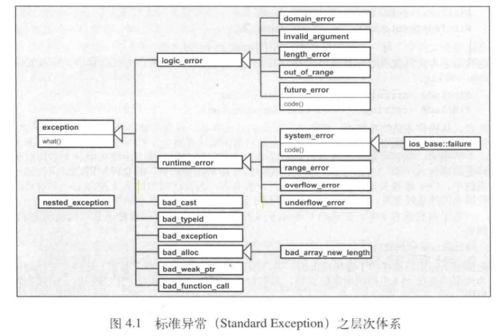
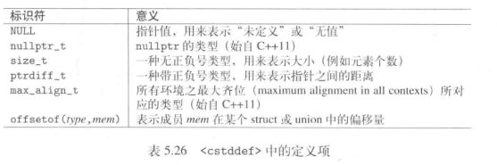
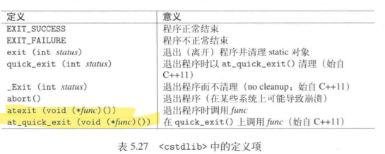
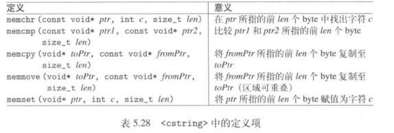
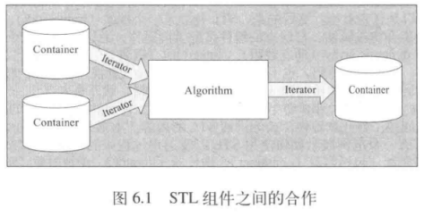
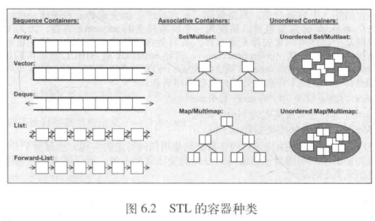

# C++ 标准库

## 标准库简介

1. C++98 是第一份 C++ 标准规格
2. C++03 是对 C++98 bug 的修正
3. TR1（Technical Report on C++ Libray Extensions） 内含大幅度的标准库扩充，位于 namespace std::tr1 内
4. C++11 是第二份 C++ 标准

从 C++11 开始每 3 年发布一次新标准

> C++11 对 C++ 98 的向后兼容性仅适用于源码，不保证二进制兼容

C++ 标准的源头各种各样，也导致标准库中不同组件的设计思想不一样。比如 `String` 被设计为一个安全而便利的组件；而 STL 被设计为“将不同的数据结构与算法结合起来，产生最佳效能”，并不便利也不安全。

## 标准库的基本概念

### 命令空间 std

和 class 不同，namespace 具有扩展开放性，可发生于任何源码上。

C++ 标准库中的所有标识符都被定义于一个名为 `std` 的 namespace 内（或者子 namespace 内）。

使用标准库标识符的三种选择

- 直接指定标识符. `std::ostream`
- 使用 using declaration. `using std::ostream;`
- 使用 using directive. `using namespace std;` 这种方式容易导致意外的名称冲突，应该避免使用

### 头文件

C++ 标准库的头文件是没有后缀名的

> 真实文件系统中的头文件是否有扩展名由编译器决定

```cpp
#include <iostream>
#include <string>
```

这种写法也适用于 C 标准头文件，但必须采用前缀字符 c

```cpp
#include <cstdlib> // was: <stdlib.h>
#include <string> // was: <string.h>
```

在这些头文件中，每个标识符都被声明于 namespace std。

### Error 和 Exception 的处理

C++ 标准库不同组件对于错误处理差异很大，例如 string class，支持具体的差错处理；而 STL 效率重于安全，因此几乎不校验逻辑差错。



逻辑错误通常可以避免

运行期异常则是由一个位于程序作用域之外的原因触发，例如资源不足。

异常类的头文件

```cpp
#include <exception>    // for classes exception an bad_exception
#include <stdexcept>    // for most logic and runtime error classes
#include <system_error> // for system errors(since c++11)
#include <new>          // for out-of-memory exceptions
#include <ios>          // for I/O exceptions
#include <future>       // for errors with async() and futures(since c++11)
#include <typeinfo>     // for bad_cast and bad_typeid
```

所有标准异常都提供 `what()`,某些异常类还提供了 `code()`

### 可调用对象

Callable Object 可以是

- 一个函数
- 一个指向成员函数的指针（第一个实参是类对象的引用或者指针）
- 一个函数对象（该对象拥有 `operator()`）
- 一个 lambda，严格来说它是一种函数对象

如果想声明 callable object，一般可使用 class `std::function<>`

### 并发与多线程

C++ 11 开始

- 具备了这样的内存模型：当修改“被不同的两个线程使用的”两个不同对象时，它们彼此独立
- 引入了一个新的关键字 `thread_local`，用来定义 “线程特定”的变量和对象

STL 容器提供的并发保证：

- 并发的只读方法是允许的
- 对标准stream（`std::cin/std::cout/std::cerr`）进行格式化输入和输出的并发处理是可能的。

### 分配器

C++ 标准库定义了一个 default allocator 如下：

```cpp
namespace std {
    template <typename T>
    class allocator;
}
```

绝大多数程序都是用 default allocator

## 通用工具

### Pair 和 Tuple

#### Pair

[文档](https://en.cppreference.com/w/cpp/utility/pair)

struct pair 定义于 `<utility>`

```cpp
namespace std {
    template<typename T1, typename T2>
    struct pair {
        T1 first;
        T2 second;
    }
}
```

标准库中关联容器(`map/unordered_map`)就是使用 pair 来管理其以 key/value pair 形式存在的元素。任何函数如果需返回两个 value，也需要用到 pair，例如 `minmax()`

获取元素

```cpp
typedef std::pair<int, float> IntFloatPair;
IntFloatPair p(42, 3.14);

std::get<0>(p)  // 等价于 p.first
std::get<1>(p)  // 等价于 p.second

std::tuple_size<IntFloatPair>::value // 2 ，获取元素个数
std::tuple_element<0, IntFloatPair>::type // int，获取元素类型
```

构造 pair

```cpp
// 构造器
std::pair<int, float>(42, 3.14)
// 便捷方法，推导出 <int,double>
std::make_pair(42, 3.14)
```

Template 函数 `make_pair()` 使你无需写出类型就能生成一个 pair 对象。同时结合 auto 使用虽然很方便，但是推导出来的类型可能并不明确。

在作为实参时，还可以用初值列

```cpp
void f(std::pair<int, const char*>);
void g(std::pair<int, std::string>);
...

f(std::make_pair(42, "empty"));
g(std::make_pair(42, "chair")); // type conversions

f({42, "empty"});
g({42, "chairs"}); 
```

`make_pair()` 的参数支持移动语义，同时结合 `ref()/cref()`（定义于 `<functional>`） 还支持引用语义

```cpp
int i = 0;
auto p = std::make_pair(std::ref(i), std::ref(i)); // pair<int&, int&>
++pfirst;
++psecond;
assert(i == 2);
```

还可以使用 `std::tie()` 进行对象解构

```cpp
std::tie(std::ignore, c) = p; // extract second value into c(ignore first one)
```

#### Tuple

[文档](https://en.cppreference.com/w/cpp/utility/tuple)

定义于 `<tuple>`

```cpp
namespace std {
    template< class... Types >
    class tuple;
}
```

和 pair 一样，tuple 可以通过构造函数和 `make_tuple()` 模板方法构建，使用 `std::get()` 获取元素

```cpp
tuple<int, float, string> t1(41, 6.3, "nico");

cout << get<0>(t1) << " ";
cout << get<1>(t1) << " ";

auto t2 = make_tuple(22, 44, "nico");

get<1>(t1) = get<1>(t2);
```

`std::get<i>()` 传入的索引值必须在编译器可知

tuple 的元素类型可以是 reference

```cpp
string s;
tuple<string&> t(s);

get<0>(t) = "hello";
```

`make_tuple()` 默认是值传递，如果要传入引用类型，需要使用 `std::ref()`

```cpp
std::string s;

auto y = std::make_tuple(ref(s)); // tuple<string&>
std::get<0>(y) = "my value" // modifies s
```

运用 reference 搭配 `make_tuple()`，可以提取 tuple 的元素值

```cpp
std::tuple<int, float, std::string> t(77, 1.1, "more light");
int i;
float f;
std::string s;

std::make_tuple(std::ref(i), std::ref(f), std::ref(s)) = t;
```

为了简化使用，标准库提供了 `std::tie()`，它可以建立一个内含 reference 的 tuple，使用 `tie()` 后的简化写法

```cpp
std::tuple<int, float, std::string> t(77, 1.1, "more light");
int i;
float f;
std::string s;

std::tie(i, f, s) = t;
```

如果想忽略某个元素，可以使用 `std::ignore`

```cpp
std::tie(i, f, std::ignore) = t;
```

为了避免单一值被隐式转换成“带有一个元素”的 tuple， tuple “接受不定个数的实参” 的构造器被声明为 `explicit`

tuple 另外的辅助函数，主要是为了支持泛型编程

- `tuple_size<tupletype>::value` 可获取元素个数
- `tuple_element<idx, tupletype>::type` 可取得第 idx 个元素的类型（也就是 `get()` 返回值的类型）
- `tuple_cat()` 可将多个 tuple 串接成一个 tuple

#### tuple 的输入输出

大量运用了模板元编程中的迭代，然后使用偏特化版本用来终结递归调用。

```cpp
#include <tuple>
#include <iostream>

template<int IDX, int MAX, typename... Args>
struct PRINT_TUPLE {
    static void print(std::ostream& strm, const std::tuple<Args...>& t) {
        strm << std::get<IDX>(t) << (IDX+1==MAX ? "" : ",");
        PRINT_TUPLE<IDX+1,MAX,Args...>::print(strm, t);
    }
}

template<int MAX, typename... Args>
struct PRINT_TUPLE<MAX, MAX, Args> {
    static void print(std::ostream& strm, const std::tuple<Args...>& t) {
    }
}


template<typename... Args>
std::ostream& operator << (std::ostream& strm, const std::tuple<Args...>& t)
{
    strm << "[";
    PRINT_TUPLE<0， sizeof...(Args), Args...>::print(strm, t);
    return strm << "]";
}

```

#### tuple 和 pair 转换

可以拿一个 pair 作为初值，初始化一个双元素 tuple，也可以将一个 pair 赋值给一个双元素 tuple。

### 智能指针

定义于 `<memory>` 内

智能指针可以解决 dangling pointer（空悬指针） 和 resource leak（资源泄露问题）

#### shared_ptr

shared_ptr 的初始化

```cpp
shared_ptr<string> pNico(new string("nico"));
// 统一初始化
shared_ptr<string> pNico{new string("nico")};
// 便捷函数
shared_ptr<string> pNico = make_shared<string>("nico");
```

也可以先声明 shared_ptr, 然后对它赋值一个 new pointer。然而不可以使用 assignment 操作符，必须改用 `reset()`

```cpp
shared_ptr<string> pNico; // nullptr
pNico = new string("nico"); // ERROR
pNico.reset(new string("nico")); // OK
```

可以使用 `use_count()` 方法得到当前所有者数量

最后一个 shared_ptr 在析构函数中默认使用 delete 清理资源，也可以声明自定义的 deleter

```cpp
shared_ptr<string> pNico(new string("nico"),
                            [](string *p) {
                                count << "delete " << *p << endl;
                                delete p;
                            })
```

shared_ptr 默认的 delete 遇到 Array 会有问题

```cpp
std::shared_ptr<int> p(new int[10]); // ERROR，but compiles，内存泄漏
std::shared_ptr<int[]> p(new int[10]); // ERROR: does not compile，类型不一致
// 正确用法
std::shared_ptr<int> p(new int[10], [](int *p) { delete[] p; }); // 自定义 deleter
std::shared_ptr<int> p(new int[10], std::default_delete<int[]>()); // 直接使用为 unique_ptr 提供的辅助函数
// unique_ptr 允许传递数组的元素类型作为 template 实参
std::unique_ptr<int[]> p(new int[10]); // OK
// unique_ptr 也可以用自定义 deleter，不可以要求明确 template 实参
std::unique_ptr<int, void(*)(int*)> p(new int[10], [](int *p) { delete[] p; });
```

shared_ptr 不提供 `operator[]`，所以无法使用下标运算符。至于 unqiue_ptr，它有一个针对 array 的偏特化，提供 `operator[]`。shared_ptr 要使用下标运算符得先使用 `get()`。

```cpp
p.get()[i] = i * 42;
```

shared pointer 也很容易误用：当使用原始指针创建 shared pointer，可能会出现多个所有者 group，析构时会导致 double free 的问题

```cpp
int *p = new int;
shared_ptr<int> sp1(p);
shared_ptr<int> sp2(p);
```

shared_pointer 并非线程安全，所以在多个线程中以 shared pointer 指向同一个对象，必须使用诸如锁等技术解决数据竞争问题。

#### weak_ptr

weak_ptr 允许 “共享但不拥有对象”

不能够使用操作符 `*` 和 `->` 访问 weak_ptr 指向的对象。而是必须另外建立一个 shared_pointer。

总的来说，weak_ptr 只提供了小量操作，只够用来创建、复制、赋值 weak pointer，以及转换为一个 shared pointer，或检查自己是否指向某对象。

调用 `lock()` 方法转换为 shared pointer，如果对象已过期，则返回的 shared pointer 为 nullptr，即等价于

```cpp
expired() ? shared_ptr<T>() : shared_ptr<T>(*this)
```

确认指向对象存活的方法：

- `expired() == true`：效率较好
- `use_count() == 0`: 效率不是很好
- `new shared_ptr<T>(weak_ptr_var)`：不存在则抛出 bad_weak_ptr 异常

#### unique_ptr

unique_ptr 是 “其所指向对象” 的唯一拥有者。

```cpp
// 初始化
std::unique_ptr<std::string> up(new int);
// 置空的两种写法
up = nullptr;
up.reset()
// 获取拥有的对象并放弃拥有权
int *p = up.release();
// 判断不为空的三种写法
if (up) {}
if (up != nullptr) {}
if (up.get() != nullptr) {}
```

shared_ptr 需要额外的内存存放计数器，unique_ptr 无需额外的开销，它消费的内存应该和 native pointer 相同

### 数值的极值

数值类型的极值与平台相关。C++ 标准库借由 template numberic_limits （`<limits>`）提供这些极值，用以取代 C 语言采用的预处理器常量(`<climits>` 和 `<cfloat>`)。

```cpp
numberic_limits<short>::max();
numberic_limits<short>::min();
numberic_limits<int>::max();
numberic_limits<int>::min();
```

### Type Trait

[文档](https://en.cppreference.com/w/cpp/meta)

[模板元编程常用技巧](https://github.com/zyuchuan/unique_cpp/blob/master/ch01_cpp_metaprogramming.md)

C++ 标准库中几乎每样东西都以 template 为根基。为此，标准库提供了 template 通用工具，协助应用程序开发人员和程序库作者。

所谓 type trait，提供一种用来处理 type 属性的办法。它是个 template，可在编译期根据一或多个 template 实参（通常也是 type）产出一个 type 或 value。

> type trait 是泛型代码的基石

定义于 `<type_traits>`

type trait 的几种用途

- 类型判断(Type Predicate)

    产出 `std::true_type` 或 `std::false_type`，其 value 成员会产出 true 或 false。
    常见的有 `is_integral<T>` `is_pointer<T>`.
    这些 trait 中的大部分（但非全部）都是单参式，也就是说它们使用一个 template 实参

- 检验类型关系(Type Relation)

    也是产出 `std::true_type` 或  `std::false_type`，其 value 成员会产出 true 或 false。
    常见的有 `is_same<T1, T2>` `is_base_of<T,D>` `is_convertible<T, T2>`

- 修改类型修饰符(Type Modifier)

    返回值的 type 成员是修改后的类型。
    常见的有 `remove_cv<T>` `add_const<T>`

- 查询特殊属性
    
    `rank<T>`: Array 类型的维度（或 0）

- 检查类型关系
- 更复杂的类型变换 

    `decay<T>`: 转换为值类型
    `enable_if<B,T=void>`: 当 B 为 true 时会产出 type T，为 false 时没有 type 类型，该 template 不匹配，匹配下一个 template


### Reference Wrapper

声明于 `<functional>`

`std::reference_wrapper<>` 主要用来 “喂” reference 给 function template，后者原本以 by value 方式接受参数。对于一个给定类型 T，这个 class 提供 `ref()` 用以隐式转换为 `T&`，一个 `cref()` 用以隐式转换为 `const T&`，这往往允许 function template 得以操作 reference 而不需要另写特化版本。

例如

```cpp
template <typename T>
void foo(T val);

// T 变成 int&
int x;
foo(std::ref(x));

// T 编程 const int&
foo(std::cref(x));
```

这个特性被 C++ 标准库运用于各个地方

- 结合 `make_pair()` `make_template` 创建 `pair<>` `tuple<>` of refrences
- Binder 用此特性于是能够绑定（bind）reference
- Thread 用此特性于是能够以 by reference 形式传递实参

class reference_wrapper 使你得以使用 reference 作为最高级对象，例如作为 array 或 STL 容器的元素类型

```cpp
std::vector<MyClass&> coll;             //Error
std::vector<std::reference_wrapper<MyClass>> coll;  // OK
```

### Function Type Wrapper

声明于 `<functional>`

`std::function<>` 允许你把可调用对象（function、member function、function object 和 lambda）当作最高级对象

### 辅助函数

#### 两值互换（Swapping）

函数 `swap()` 用来交换两对象的值。定义于 `<utility>`：


```cpp
namespace std {
    template <typename T>
    inline void swap(T &a, T &b) noexcept(is_nothrow_move_constuctible<T>::value && is_nothrow_move_assignable<T>::value) {
        T tmp(std::move(a));
        a = std::move(b);
        b = std::move(tmp);
    }
}

std::swap(x, y);
```

只有当参数类型提供了 move 或 copy 语义，上述调用才有可能成功。

`swap()` 的最大优势在于，通过模板特化或函数重载，可以为更复杂的类型提供特殊实现版本；这些特殊实现有可能交换内部成员，而非对象赋值，这无疑大大节省了时间。

```cpp
class MyContainer {
private:
    int *elems;
    int numElems;
public:
    ...
    
    void swap(MyContainer &x) {
        std::swap(elems, x.elems);
        std::swap(numElems, x.numElems);
    }
}

inline void swap(MyContainer &c1, MyContainer &c2) noexcept(c1.swap(c2)) {
    c1.swap(c2);
}
```

调用 `swap()` 而非直接交换数值，会带来大量的效能提升。自定义的类型，如果能够带来效能改善，你就应该义不容辞地为它提供 `swap()` 特化版本。

#### 增补的 “比较操作符”

在 `<utility>` 中有四个 function template 分别定义了 `!=` `>` `<=` `>=` 四个比较操作符。它们都是利用操作符 `==` `<` 完成。

```cpp
namespace std {
    namespace rel_ops {
        template <typenmae T>
        inline bool operator!=(const T &x, const T &y) {
            return !(x == y);
        }
        template <typenmae T>
        inline bool operator>(const T &x, const T &y) {
            return y < x;
        }
        template <typenmae T>
        inline bool operator<=(const T &x, const T &y) {
            return !(y < x);
        }
        template <typenmae T>
        inline bool operator>=(const T &x, const T &y) {
            return !(x < y);
        }
    }
}
```

只需定义好 `<` 和 `==` 操作符就可以使用它们。只要写上 `using namespace std::rel_ops`, 上述四个操作符就自动获得了定义。

### Class ratio<> 的编译期分数运算

[文档](https://en.cppreference.com/w/cpp/numeric/ratio)

定义于 `<ratio>`

```cpp
namespace std {
    template <intmax_t N, intmax_t D = 1>
    class ratio {
    public:
        typedef ratio<num, den> type;
        static constexpr intmax_t num = N;
        static constexpr intmax_t den = ;
    }
}
```

```cpp
typedef ratio<5, 3> FiveThirds;
assert(FiveThirds::num == 5)
assert(FiveThirds::den == 3)
```

编译期运算

```cpp
// 获得 std::ratio<13,21>
std::ratio_add<std::ratio<2, 7>, std::ratio<2,6>>::type
```

### Clock 和 Timer

[文档](https://en.cppreference.com/w/cpp/chrono)

C 和 POSIX 提供的系统时间接口，允许从秒转换至毫秒，再至微妙，最终至纳秒，问题是每次转换就需要一个新接口。

基于这个原因，C++11 开始提供一个精度中立的程序库，定义于 `<chrono>`

### 头文件 `<cstddef>` `<cstdlib>` `<cstring>`

定义了一些常用的常量、宏、类型和函数







## 标准模块库

STL（standard template library，标准模板库）是 C++ 标准库的核心。


### STL 组件

三大组件：容器、迭代器、算法

STL 的基本观念就是将数据和操作分离。数据由**容器类**加以管理，操作则由可定制的**算法**定义之。迭代器在两者之间充当黏合剂，使任何算法都可以和任何容器交互运作。



STL 的一个根本特性是，所有组件都可以针对任何类型（type）运作。通过泛型编程实现。

STL 甚至提供更泛化的组件。借由特定的适配器（adapter）和函数对象（function object），你可以补充、约束或定制算法以满足特别需求。

### 容器



容器可分为三类

- 序列式容器（array，vector，deque，list）
- 关联式容器（set，multiset，map，multimap）
- 无序容器（unordered_set、unordered_multiset、unordered_map 和 unordered_multimap）

> STL 容器只提供具备良好时间效率的成员函数。不会提供性能差的函数，避免程序员调用。

#### 序列式容器

##### Vector

头文件 `<vector>`

`push_back()` 为容器添加新元素，所有序列式容器都提供这个成员函数。

`size()` 成员函数返回容器元素的个数

可以通过下标操作符，访问 vector 内的某个元素

##### Deque

头文件 `<deque>`

`push_front()` 成员函数会将元素安插于集合前端。

##### Array

头文件 `<array>`

```cpp
array<string, 5> coll = {"hello", "world"};
```

##### List

STL 提供了两个不同的 list 容器: `list<>` 和 `forward_list<>`

头文件 `<list>` `<forward_list>`

List 的优势是：在任何位置上执行安插和删除动作都非常迅速。

在 C++11 之前，必须使用迭代器来访问 list 的所有元素。C++ 11 后可以使用 For Range 语法


#### 关联式容器

不能直接改动元素的 value，因为那会破坏元素的自动排序。

所有关联式容器通常都由二叉树实现。

#### 无序容器

无序容器常以 hash table 实现出来，内部结构是一个 “由 linked list 组成” 的 array。

所有这些无序容器的 class 都有若干可有可无的 template 实参，用来指明 hash 函数和等效准则，该准则被用来寻找某给定值，以便判断是否发生重复。默认的等效准则是操作符 ==。

无法修改元素的 key，也就是其 first 成员。

map 和 unordered map 提供了下标操作符。

和寻常 array 的下表操作符不太一样：

- 其索引不是整数；
- 它接受一个新索引并以此建立和安插一个新元素，该元素以该索引为 key。

从 C++ 11 开始，也可以使用 `at()` 访问元素的 value，如果没有，会导致一个 out_of_range 异常

由于 unordered map 的操作属于“摊提式常量”复杂度，map 提供的是 “对数复杂度”，所以通常优先使用 unordered map，除非需要排序。

####  其它容器

- std::string
- C-Style Array

    > C++ 程序不再需要直接使用 C-style array。Vector 和 array 提供了 C-style array 的所有特性，并具备更安全更方便的接口

#### 容器适配器

容器适配器都是根据基本容器实现而成。提供一定限度的接口，用以应付特殊需求。

- Stack
- Queue
- Prioprity queue

### 迭代器

需要这样的概念：以一个对象表现出容器元素的位置。这就是迭代器。

range-based for 循环其实就是此概念的一个便捷接口，也就是说，其内部使用迭代器对象迭代（遍历）所有元素。


迭代器的操作:

- Operator *：返回当前位置上的元素值
- Operator ++：令迭代器前进至下一元素
- Operators == 和 != : 判断两个迭代器是否指向同一位置
- Operator =：对迭代器赋值

从容器类获取迭代器：

- begin()
- end()

begin() 和 end() 形成了一个半开区间

> 半开区间对空区间不必采取特殊处理方法，空区间 begin() 就等于 end()

任何容器都定义有两种迭代器类型

- container::iterator 以读写模式遍历元素
- container::const_iterator 以只读模式遍历元素。

自 C++11 起容器提供 cbegin() 和 cend()，它们返回一个类型为 cont::const_iterator 的对象。


#### 迭代器的种类

除了基本操作，迭代器还有其它能力。这些能力取决于容器的内部结构。STL 总是只提供效率比较出色的操作，因此如果容器允许随机访问（例如vector或deque），它们的迭代器也必定能进行随机操作。

根据能力的不同，迭代器被划分为五种不同类别

- 前向迭代器(Forward iterator)

    支持: ++

    容器：forward_list

- 双向迭代器(Bidirectional iterator)

    支持: ++ , --

    容器：list、set、multiset、map 和 multimap 

- 随机访问迭代器(Random-access iterator)

    支持: ++ , -- , += , -=

    容器：vector、deque、array、string

- 输入型迭代器(Input iterator)

    向前迭代能够读取/处理 value
    代表：Input stream 迭代器

- 输出型迭代器(Output iterator)

    向前迭代时能够涂写 value
    代表：Inserter 和 output stream 迭代器

为了写出尽可能与容器类型无关的泛型代码，你最好不要使用随机访问迭代器的特有操作。

> 只有随机访问迭代器才支持 operator <

### 算法

[文档](https://en.cppreference.com/w/cpp/algorithm)

为了处理容器内的元素，STL 提供了一些标准算法，包括查找、排序、拷贝、重新排序、修改、数值运算等基本而普遍的算法。

算法并非容器类的成员函数，而是一种搭配迭代器使用的全局函数。这么做有一个重要优势：所有算法只需实现一份，就可以对所有容器运作。

> 算法所用的是泛型函数编程思维

算法的头文件 `<algorithm>`

```cpp
// 查找某个值
auto pos3 = find(coll.begin(), coll.end(), 3);
// 反转区间
reverse(pos3, coll.end())

// 算法结合可调用对象
find_if(coll.beigin(), coll.end(), [] (int i) { return i == 25 || i == 35; })
```

所有算法处理的都是半开区间（half-open range）—— 包括起始元素的位置但不包括末尾元素的位置。传统的数学表示方法是: [begin, end)

半开区间的优点主要是可免除对空集做特殊处理。

有多个算法需要同时处理多重空间。通常你必须设定第一个区间的起点和终点，至于其他区间，只需设定起点即可，终点通常可由第一区间的元素数量推导出来。

```cpp
if (equal(coll1.beigin(), coll1.end(), coll2.begin())) {
    ...
}
```

如果某个算法用来处理多重区间，那么当你调用它时，务必确保第二（以及其它）区间所拥有的元素个数至少和第一区间内的元素个数相同。


### 迭代器之适配器（Iterator Adapter）

迭代器（Iterator）是一个纯抽象概念：任何东西，只要其行为类似迭代器，它就是一个迭代器。因此，你可以撰写一些类具备迭代器接口，但有着各不相同的行为。C++标准库提供了数个预定义的特殊迭代器，即所谓的迭代器适配器。

#### Insert Iterator

[文档](https://en.cppreference.com/w/cpp/iterator/inserter)

使用它可以解决算法的“目标空间不足”问题，它会促使目标区间的大小按需要增长。

Insert iterator 内部将接口做了新的定义：

- 如果你对某个元素赋值，会引发“对其所属集合的 insert 动作”。
- 单步前进不会做任何事情（noop）

有三种预定义的 insert interator

- `back_inserter(container)`: 使用 push_back(val) 在容器尾端安插元素
- `front_inserter(container)`: 使用 push_front() 在容器前端安插元素
- `inserter(container, pos)`: 使用 insert(pos, val) 在 pos 位置安插元素

#### Stream Iterator

[文档](https://en.cppreference.com/w/cpp/iterator/istream_iterator)

Stream Iterator 被用来读写 stream

常见的有 

- `istream_iterator`: 通过 operator>> 读取数据
- `ostream_iterator`: 通过 operator<< 赋值

```cpp
copy(istream_iterator<string>(cin), istream_iterator<string>(), back_inserter(coll));

sort(coll.begin(), coll.end())

unique_copy(coll.cbegin(), coll.cend(), ostream_iterator<string>(cout, "\n"));
```

#### Reverse Iterator

[文档](https://en.cppreference.com/w/cpp/iterator/reverse_iterator)

Reverse Iterator 会造成算法逆向操作，其内部将对递增操作符的调用转换为对递减操作符的调用，反之亦然。

所有提供双向或随机访问迭代器的容器（也就是 forward_list 之外的所有序列式容器和所有关联式容器）都可以通过它们的成员函数 `rbegin()` 和 `rend()` 产生一个反向迭代器。

```cpp
// print all element in reverse order
copy(coll.crbegin(), coll.crend(), ostream_iterator<int>(cout, " "));
```

#### Move Iterator

[文档](https://en.cppreference.com/w/cpp/iterator/move_iterator)

### 更易型算法（Manipulating Algorithm）

指会移除、重排、修改元素的算法

#### 移除元素

算法 remove() 自某个区间删除元素，但是其并没有改变集合中元素的数量。cend() 返回的还是当初那个终点，size() 返回的还是当初的大小。

事实上这个算法返回了一个新终点。你可以利用该终点获取新区间、缩减后的容器大小，或是获得被删除元素的个数。

```cpp
auto end = remove(coll.begin(), coll.end(), 3);

// print resulting elements of the collection
copy(coll.begin(), end, ostream_iterator<int>(cout, " "));

// print number of removed elements
cout << distance(end, coll.end()) << endl;

// remove "removed" elements
coll.erase(end, coll.end());
```

如果需要以单一的语句删除元素，可以这么做

```cpp
coll.erase(remove(coll.begin(), coll.end(), 3), coll.end());
```

通常并无必要删除那些“已被移除”的元素，以逻辑终点取代容器的实际终点，通常就足以应对现实情况。

#### 更易关联和无序容器

在关联式容器身上无法运用移除型算法。

在这类容器中删除元素，调用它们的成员函数 `erase()`。

#### 算法 vs 成员函数。

容器本身提供的成员函数往往性能更优。

### 以函数作为算法的实参

```cpp
void print(int elem)
{
    cout << elem << ' ';
}

for_each(coll.cbegin(), coll.cend(), print);
cout << endl;

// 判断式
find_if(coll.cbegin(), coll.cend(), isPrime);

// 双参判断式
sort(coll.begin(), coll.end());

// lambda
std::transform(coll.begin(), coll.end(), coll.begin(), [](double d){ return d*d*d; });
```

### 函数对象

[文档](https://en.cppreference.com/w/cpp/utility/functional)

标准库提供了很多预定义的函数对象 `less<>` `greater<>`, 头文件是 `<functional>`

#### binder

[文档](https://en.cppreference.com/w/cpp/utility/functional)

可以使用特殊的 function adapter，或所谓 binder，将预定义的函数对象和其它数值结合为一体

```cpp
transform(coll1.cbegin(), coll1.end(), back_inserter(coll2), bind(multiplies<int>, _1, 10));

// binder 组合体, x>50&&x<=80
bind(logical_and<bool>(), bind(greater_equal<int>, _1, 50), bind(less_equal<int>(), _ 1, 80));
```

> 占位符的命名空间: std::placeholders

### 容器内的元素

STL 容器元素必须满足的基本要求

- 元素必须可复制或可移动
- 元素必须可被赋值运算符移动或者赋值
- 元素必须可被一个析构函数销毁

此外，下面的条件也应当获得满足

- 对序列式容器而言，元素的 default 构造函数必须可用
- 对于某些操作，必须定义操作符 == 以执行相等测试
- 在关联式容器中，元素必须定义出适用于排序准则的操作
- 无序容器应该为元素提供一个 hash 函数

STL 只支持 value 语义，不支持 reference 语义

如果要用 reference 语义，有三个方法

- pointer
- smart pointer
- std::ref()


### 扩展 STL

STL 被设计为一个框架，可以向任何放心扩展

#### 整合更多的 Type

迭代器、容器、算法都遵循泛型编程原则：

- 凡是行为像容器的东西，它就是个容器
- 凡是行为像迭代器的东西，它就是个迭代器

当你有个像容器的 class，就可以借由提供相应的接口（begin()、end()等）把它整合到 STL 框架中。如果无法为 class 添加成员，还可以提供一个 wrapper classer，由它提供相应的迭代器。

#### 派生自STL Type

基于效率考虑，所有 STL class 都不带 virtual 函数。

如果要为容器添加新行为，应该定义一个新 class，其内使用 STL class 或以 private 方式继承 STL class。

## References

- [C++ 标准库第二版](https://book.douban.com/subject/26419721/)