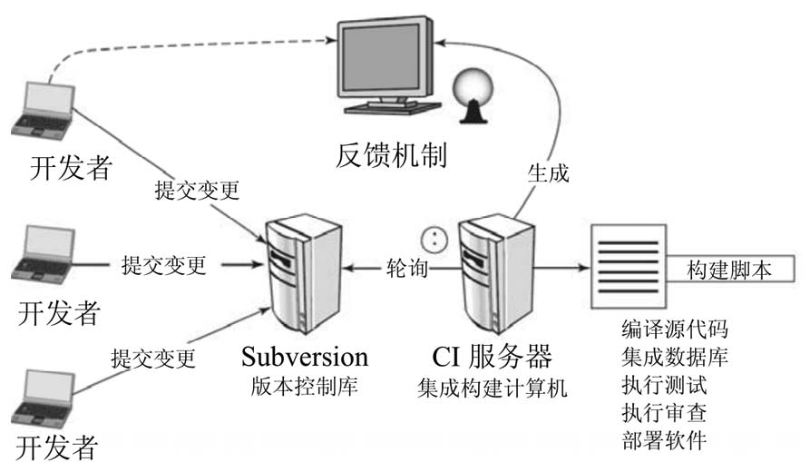
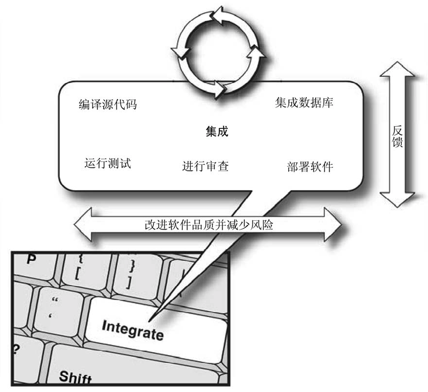

# 持续集成（CI）

## 面临的问题

传统的软件开发周期，往往到后期才进行集成，大量的问题（代码、构建、测试、部署、环境等）在集成的时候才暴露，同时由于距离发布时间不多，只能加班加点来解决问题，很多问题也只能采用妥协的办法解决，最后发布时对软件的质量也无法保证。

## 持续集成的定义

持续集成: 一项软件开发实践，其中团队的成员经常集成他们的工作，通常每个人每天至少集成一次——这导致每天会集成多次。每次集成是通过自动化的构建（包括测试）进行的，目的是尽快地检查集成错误。许多团队发现这样做能够减少大量的集成问题，让团队能够更快地开发一致的软件

持续: 每次代码变更时自动触发集成

构建: 编译、测试、审查和部署软件的一组活动

> 持续集成 = 持续的自动化的构建 + 反馈

## 持续集成的价值

### 减少风险

- 没有可部署的软件

    利用 CI 系统可以随时一键构建可部署的软件

- 很晚才发现缺陷

    每次变更都执行开发者测试，尽早发现新引入的缺陷

- 缺少项目可见性

    持续构建，得到持续的反馈，随时了解项目的健康情况，并持续生成最新的API文档和UML设计图（Doxygen），随时了解最新设计

- 低品质的软件

    持续测试保证缺陷率，持续审查保证编码规范、耦合度（JDepend）、代码重复率、圈复杂度满足要求

### 减少重复过程

CI 的基础就是 `自动化的构建`

> 构建的活动往往包含编译、测试、审查、部署等，而自动化的构建是通过执行一条命令完成这些活动

自动化构建的优秀实践

- 构建脚本做到不依赖 IDE
- 构建过程用到的所有软件资产（源文件、库文件、第三方库、配置文件、数据文件、构建脚本等）都集中放在版本控制库
- 创建一致的目录结构
- 让构建快速失败
- 针对所有环境构建（通过入参变量区分环境）
- 使用专门的集成构建服务器
- 使用 CI 服务器
- 构建要足够快（不能超过 10 分钟）

优化构建性能

- 增强集成构建服务器性能
- 构建活动尽量并行化
- 优化开发者测试性能
- 优化软件审查性能: 减少冗余审查，缩小审查范围，减少重复审查
- 分阶段构建: 持续执行轻量级构建（测试只做单元测试，只执行必要的审查），定时执行重量级构建
- 拆分成多个独立构建的组件

构建触发机制

- 手动触发
- 定期执行
- 轮询变更
- 事件驱动

## 如何做持续集成

### 坚持优秀实践

- 经常提交代码
- 不要提交无法构建的代码
- 立即修复无法集成的构建
- 编写自动化的开发者测试
- 必须通过所有的测试和审查
- 执行私有构建
- 避免签出无法构建的代码。

### 持续数据库集成

把 SQL 脚本放入版本控制系统中，SQL 脚本发生变更时，持续进行数据库集成

数据库集成活动

- 审查数据库脚本规范
- 执行数据库脚本
- 生成 ER 图和数据字典（可以放在定时的重量级构建中生成）

工具

- 数据库脚本管理工具: `Liquibase`

    > 让数据库脚本可重复执行（同一环境只执行未执行过的脚本），实现增量更新数据库，也可重建数据库

### 持续测试

> 源代码的可靠性取决于测试的覆盖率，测试的价值取决于它们执行的评率

在系统工程中有个定义，系统可靠性是构成系统的每个组件的可靠性的乘积

根据这个定义，可以类比出每个组件的可靠性是构成组件的每个对象的可靠性的乘积

因此要提高系统的可靠性，得先提高最底层对象的可靠性

对应的，持续测试的活动主要有

- 自动化单元测试：验证类的行为

    > 单元测试只验证当前测试类的行为，如果当前测试类依赖外部对象，可以使用 Mock 来模拟外部对象

- 自动化组件测试：验证系统的各个部分，验证组件之间的交互

    > 组件测试可能就需要有真实的外部依赖，比如真实的数据库。

- 自动化集成测试：验证整个系统对外的接口

    > 集成测试需要完整地运行整个系统

- 自动化功能测试: 模拟用户使用系统的方式来测试系统

    > 相对于集成测试，功能测试主要的区别是要模拟用户使用系统的方式来测试，往往需要使用 Selenium（针对） 这样的工具

自动化测试执行的时机：

- 每次代码变更：单元测试
- 定时执行：组件测试、系统测试、功能测试

测试的推荐实践

- 让测试可重复
- 将测试用例限制为一个断言
- 为新的缺陷编写测试

工具

- 单元测试框架: `JUnit`
- Mock 框架：`Mockito`
- 功能测试框架: `Selenium`(Web 应用程序), `Abbot` （GUI 应用程序）

### 持续审查

代码分析技术主要有

- 人工代码审查
- 结对编程
- 静态代码分析

静态代码分析的优势

- 成本低，可重复运行
- 客观

> 利用工具进行自动化的代码审查能解决 80% 的问题，然后让人来处理 20% 的重要问题

下面讨论下常见的静态代码分析内容

#### 代码复杂度

统计证明，复杂度与缺陷率有正相关关系，即复杂度越高，存在缺陷的概率越高

代码复杂度的测试指标最常见的是圈复杂度（CCN），通过一个方法的执行路径数来衡量复杂度

> 经验法则：测试的个数应该和圈复杂度相等

#### 设计审查

设计审查主要看的是耦合度

耦合度可以分为

- 传入耦合：有多少其它对象依赖我
- 传出耦合：依赖了多少其它对象

传入耦合和传出耦合可以共同组成 `不稳定性` 值(1表示不稳定，0表示稳定)：

> 不稳定性 = 传出耦合/(传出耦合 + 传入耦合)

传入耦合度高的对象会造成破坏，传出耦合度高的对象则会受到破坏

具有高传入耦合的组件应该有大量的相关测试，因为有许多代码依赖于它

#### 编码规范

遵循合理的编码规范，可以减少缺陷率，统一代码风格，提高可读性

#### 代码重复率

重复代码可能导致的问题

- 增加维护成本，因为需要多次发现、报告、分析和修复缺陷

- 不确定是否存在其他缺陷（重复的代码还没有找到）

- 对于额外编写的代码增加了测试成本

#### 代码覆盖率

代码覆盖率测量指标

- 语句覆盖率（最常见）
- 分支覆盖率

#### 审查工具

- 圈复杂度测量工具: JavaNCSS,PMD,Checkstyle
- 耦合度测试工具：JDepend
- 编码规范：PMD，Checkstyle
- 代码重复率: PMD-CPD，Simian

### 持续部署

推荐实践

- 保持干净的服务器环境
- 版本控制系统打 tag
- 部署包打 tag
- 执行所有的测试
- 要有回滚的能力

### 持续反馈

> 反馈是持续集成的输出，没有反馈, CI 不会有任何作用

反馈要在 `正确的时间` 通过 `正确的方式` 将 `正确的信息` 发送给 `正确的人`

## 总结

持续集成让软件开发更加的稳健，更有条理，减少开发风险，让开发者可以更安心地工作。

## 工具

- Doxygen: 生成API文档和UML设计图
