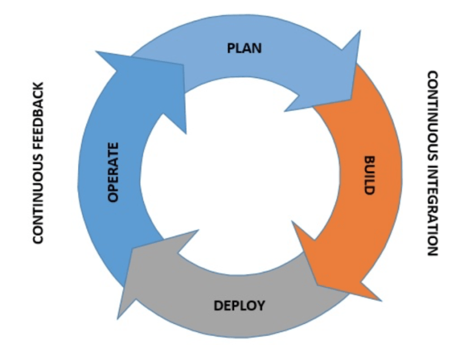

# 研发效能

Devops 是当前最流行的一种产品开发模式

> Devops 最初是为了解决开发(development)和运维运营(operation)之间的矛盾， 是鼓励软件开发和运营团队之间进行交流，协作，集成和自动化的实践。

> 相比之前的瀑布模式

核心是: 

- 短周期迭代

- 流程自动化

## Devops 实践

- 敏捷需求

    > 关键是增量和优先级

- 基础设置即代码(IAC)

    > 用代码描述和维护基础设施，并进行版本管理

- 测试自动化

- 持续集成(CI)

- 持续交互/部署(CD)

- 持续监控

## Devops 常用工具

- 需求管理工具: [Jira](https://www.atlassian.com/software/jira)

- 开发工具

    - 代码版本管理: [Git](https://git-scm.com/)
    - 协同: [Connfuence](https://www.atlassian.com/software/confluence)

- 集成工具

    - 代码检查: [SonarQube](https://www.sonarqube.org/)
    - 持续集成: [Jenkins](https://www.jenkins.io/)

- 交付/部署工具

    - 容器: [Docker](https://www.docker.com/)
    - 配置管理: [Chef](https://www.chef.io/)/[Puppet](https://puppet.com/)/[Ansible](https://www.ansible.com/)
    - IAC: [Terraform](https://www.terraform.io/)

- 监控工具: 

    - 日志监控: [ELK](https://www.elastic.co/cn/what-is/elk-stack)
    - 应用监控: [Prometheus](https://prometheus.io/) + [Grafana](https://grafana.com/grafana/)

## References

- [Devops Overview](https://www.baeldung.com/devops-overview)

