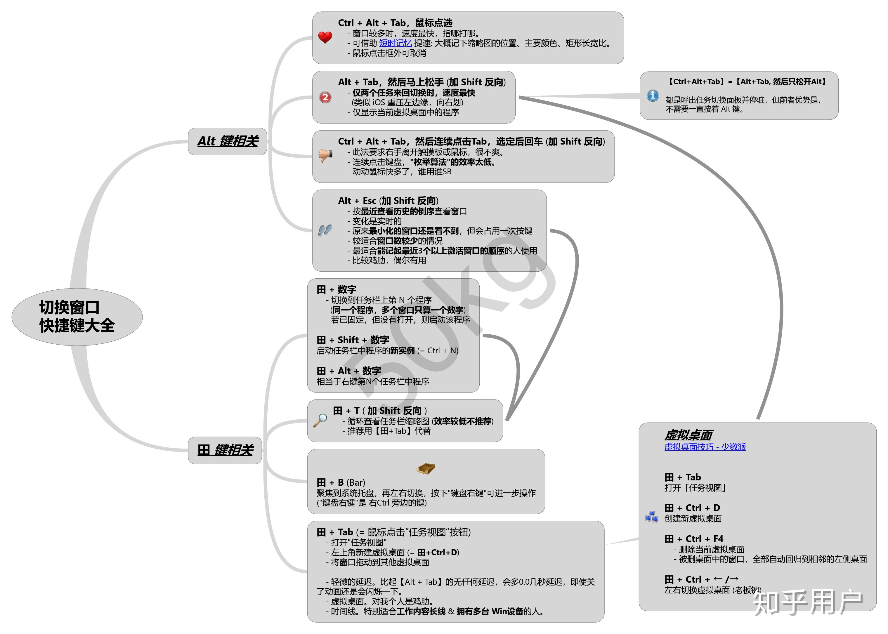

# 效率技巧

## 快捷键粘贴常用文本

粘贴常用账号密码等场景

[QuickTextPaste](https://quicktextpaste.en.softonic.com/)

## windows 快捷键操作窗口

- win + 上下方向键：最大化，还原，最小化
- win + 左右方向键：左右半屏
- win + shift + 左右方向键：多屏场景下左右移动到另一个屏

## windows 快速切换窗口

