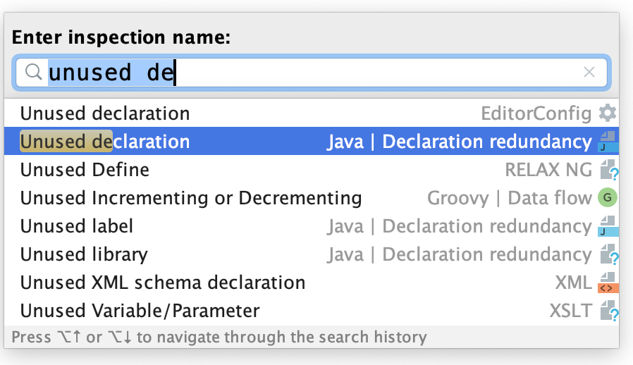
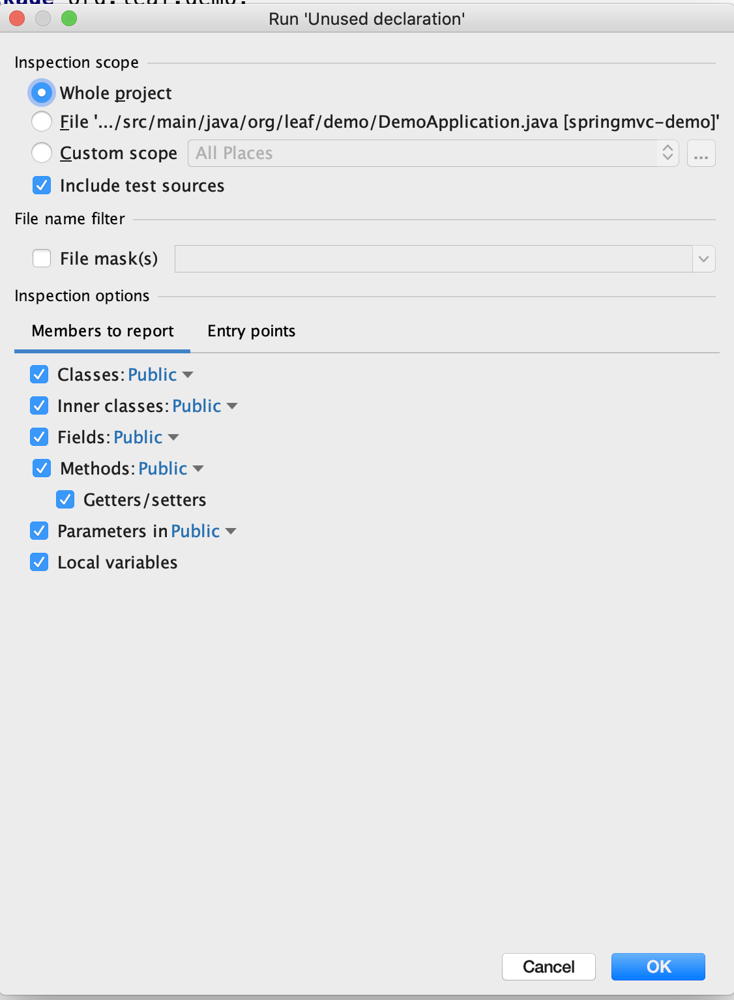
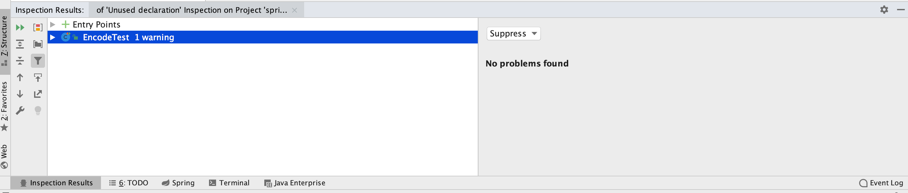
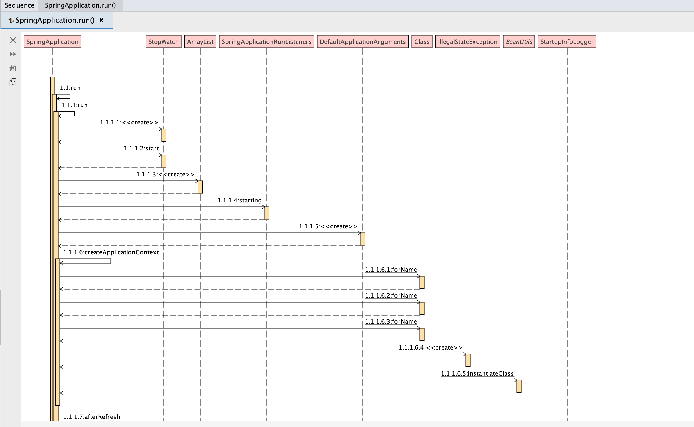

# IDEA

## 常用快捷键

| 操作 | Windows 快捷键 | Mac 快捷键
| :--: | :--: | :--: |
| 重构菜单 | `Ctrl + Shift + Alt + T` | `control + T` |
| Git 菜单 | ``` Alt + ` ``` | `control + V` |
| 格式化 | `Ctrl + Alt + L` |  `command + option + L` |
| 优化 import | `Ctrl + Alt + O` | `control + option + O` |
| 查找类 | `Ctrl + N` | `command + O` |
| 查找文件 | `Ctrl + Shift + N` | `command + shift + O` |
| 查找 Actions | `Ctrl + Shift + A` | `command + shift + A` |
| 查找 ALL | `Shift + Shift` | `shift + shift` |
| 跳转行 | `Ctrl + G` | `command + L` |
| 生成代码 | `Alt + Insert` | `command + N` |
| 类结构 | `Alt + 7` | `command + 7` |
| 类成员查找 | `Ctrl + F12` | `command + F12` |
| 热更新选中的文件 | `Ctrl + Shift + F9` | `command + shift + F9` |
| 跳转到上/下一个方法 | `Alt + Up/Down` | `option + up/down` |
| 跳转到上/下一个光标处 | `Ctrl + Alt + Left/Right` | `command + option + left/right` |
| 完善当前行 | `Ctrl + Shift + Enter` | `command + shift + enter` |
| 快速查看 javadoc | `Ctrl + Q` | `control + J` |
| 查看参数 | `Ctrl + P` | `command + P` |
| 注释 | `Ctrl + /` | `command + /` |
| 扩大/缩小选择范围 | `Ctrl + W` / `Ctrl + Shift + W` | `option + up/down` |
| 显示上下文 | `Alt + Q` | `option + shift + Q` |
| 展示当前可用 Action | `Alt + Enter` | `option + enter` |

## 常用操作

### 查找冗余代码

1. 通过 `command + option + shift + I` 或者头部菜单 `Analyze -> Run Inspection by Name` 打开 `Inspection 搜索框`

2. 输入 `unused declaration`, 选择下图的 `inspection`

    

3. 选择检查的范围和检查的选项

    

4. 查看结果，选择相应的处理方式

    

!> 一些反射、事件驱动之类的代码会被判断为冗余代码，处理的时候要谨慎

## 高效插件

### SequenceDiagram

> IDEA 时序图插件，堪称读源码画时序图的神器



## References

- [IDEA Keyboard](https://resources.jetbrains.com/storage/products/intellij-idea/docs/IntelliJIDEA_ReferenceCard.pdf)