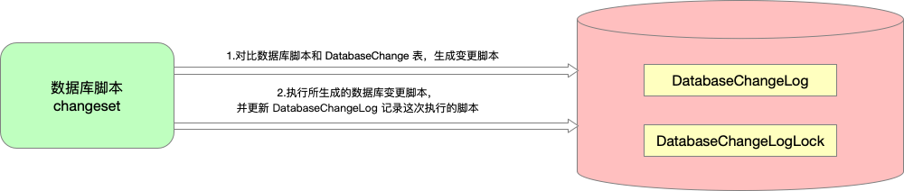
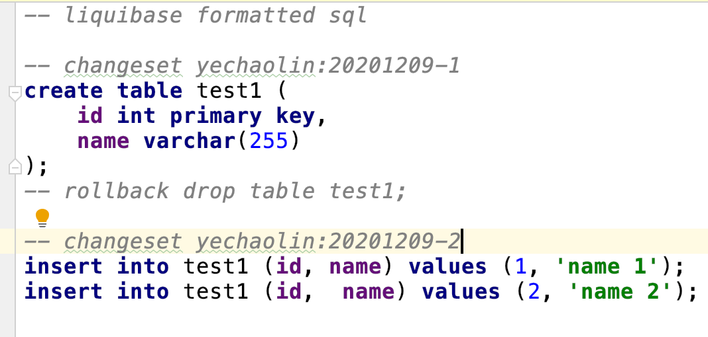
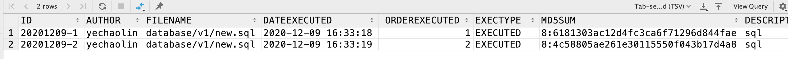
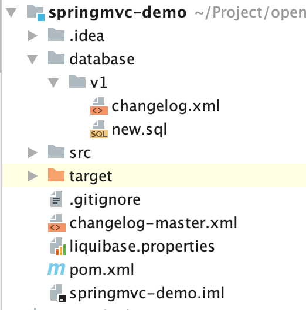
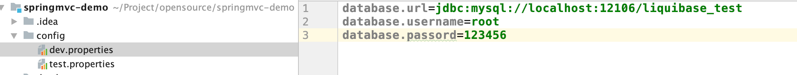

# Liquibase 应用指南

在大部分的开发团队中，源代码都会用 `git` 或者 `svn` 等版本管理工具进行管理，但是对于数据库脚本的管理还是基于人工的方式，步骤繁琐且容易出错

根据 Devops 的理念，重复繁琐的人工步骤应该尽量使用自动化的工具进行替代

而 `Liquibase` 就是一个不错的用来管理数据库脚本的工具

> Liquibase 官方定义: 一个用于跟踪、管理和应用数据库变化的开源的数据库重构工具

## Liquibase 基本原理







一句话总结：`Liquibase 通过在数据库中建个表记录已执行的脚本，通过对比得到增量脚本`

对比理解：

> 运维的同学每个环境用一个小本本记录已执行的脚本，后续升级，对比小本本找出未执行的新脚本，然后执行

## 使用 Liquibase 管理数据库脚本

### 数据库脚本结构化管理

按照 `迭代` -> `表` 的维度来管理数据库脚本

> 该维度分级仅供参考，具体应根据实际情况定义



### 引入 Liquibase

Liquibase 相关 Maven 依赖

```xml
    <dependencies>
        <dependency>
            <groupId>org.liquibase</groupId>
            <artifactId>liquibase-core</artifactId>
            <version>${liquibase.version}</version>
        </dependency>
        <!-- 相关数据库 JDBC Driver 依赖 -->
        <dependency>
            <groupId>mysql</groupId>
            <artifactId>mysql-connector-java</artifactId>
            <version>${mysql.version}</version>
        </dependency>
    </dependencies>
```

Liquibase 相关 Maven 插件

```xml
    <build>
        <plugins>
            <plugin>
                <groupId>org.liquibase</groupId>
                <artifactId>liquibase-maven-plugin</artifactId>
                <version>${liquibase.version}</version>
                <configuration>
                    <changeLogFile>changelog-master.xml</changeLogFile>
                    <propertyFile>liquibase.properties</propertyFile>
                    <promptOnNonLocalDatabase>false</promptOnNonLocalDatabase>
                </configuration>
            </plugin>
        </plugins>
    </build>
```

### Liquibase 配置文件

`liquibase.properties`

```properties
driver: com.mysql.cj.jdbc.Driver
url: ${database.url}
username: ${database.username}
password: ${database.password}
verbose: true
outputFileEncoding: UTF-8
```

数据库连接相关参数 `url`, `username`, `password` 会随着部署环境而变化

可用 Maven 的 Profile 功能进行替换赋值

```xml
    <profiles>
        <profile>
            <id>dev</id>
            <build>
                <filters>
                    <filter>config/dev.properties</filter>
                </filters>
                <resources>
                    <resource>
                        <directory>./</directory>
                        <includes>
                            <include>liquibase.properties</include>
                        </includes>
                        <filtering>true</filtering>
                    </resource>
                </resources>
            </build>
        </profile>
        <profile>
            <id>test</id>
            <build>
                <filters>
                    <filter>config/test.properties</filter>
                </filters>
                <resources>
                    <resource>
                        <directory>./</directory>
                        <includes>
                            <include>liquibase.properties</include>
                        </includes>
                        <filtering>true</filtering>
                    </resource>
                </resources>
            </build>
        </profile>
    </profiles>
```

不同环境的配置文件



另外，还可以在打包时通过命令行指定

```bash
mvn liquibase:updateSQL -Dliquibase.url="jdbc:mysql://localhost:12106/liquibase_test" -Dliquibase.username=root -Dliquibase.password=123456 
```

> 数据库密码的加密: TODO

### 数据库脚本入口文件

`changelog-master.xml`

```xml
<databaseChangeLog
        xmlns="http://www.liquibase.org/xml/ns/dbchangelog"
        xmlns:xsi="http://www.w3.org/2001/XMLSchema-instance"
        xsi:schemaLocation="http://www.liquibase.org/xml/ns/dbchangelog
                      http://www.liquibase.org/xml/ns/dbchangelog/dbchangelog-3.8.xsd">

    <include file="database/v1/changelog.xml"/>

</databaseChangeLog>
```

`database/v1/changelog.xml`

```xml
<databaseChangeLog
        xmlns="http://www.liquibase.org/xml/ns/dbchangelog"
        xmlns:xsi="http://www.w3.org/2001/XMLSchema-instance"
        xsi:schemaLocation="http://www.liquibase.org/xml/ns/dbchangelog
                      http://www.liquibase.org/xml/ns/dbchangelog/dbchangelog-3.8.xsd">

    <include file="new.sql" relativeToChangelogFile="true"/>

</databaseChangeLog>
```

### 数据库脚本添加 Liquibase 注释

```sql
-- liquibase formatted sql

-- changeset yechaolin:20201209-1
create table test1 (
    id int primary key,
    name varchar(255)
);
-- rollback drop table test1;

-- changeset yechaolin:20201209-2
insert into test1 (id, name) values (1, 'name 1');
insert into test1 (id,  name) values (2, 'name 2');
```

注释说明

- 文件第一行要标注 `-- liquibase formatted sql`

- 然后每个 changeset 要有以下注解: `-- changeset ${作者}:${id: 在文件里唯一}`

- id 推荐使用 `时间-递增序列` 的格式, 比如 `20201210-01`

### 运行 Liquibase

```bash
# 执行脚本更新数据库
mvn resources:resources liquibase:update

# 不更新数据库，仅生成增量脚本
mvn resources:resources liquibase:updateSQL
```

备注:

- 测试环境建议使用 `liquibase:update` 结合流水线实现自动化脚本更新

- 生产环境由于无法直接获取密码, 可通过在预生产环境运行 `liquibase:updateSQL` 获取更新脚本

> 如果没有预生产环境，可以单独构建一个和生产环境表结构一致的数据库作为预生产数据库，专门用于生成 Liquibase 增量脚本


## Liquibase 的其它使用场景

- 对比两个环境的数据库，得到差异更新脚本，基于该脚本升级数据库
- 现有数据库结构抽取为 Liquibase 数据库脚本，作为基线脚本被 Liquibase 管理起来，以便于重头新建数据库

## References

- [Liquibase官方文档)](https://docs.liquibase.com/home.html?_ga=2.215443927.1980104440.1607528574-447820166.1607528574)
