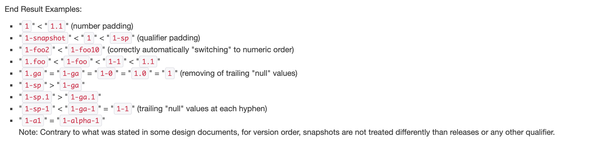

# Maven

## 常用命令

命令语法: `mvn [options] [goal(s)] [phase(s)]`

```bash
# 查看 Effective POM（结合 Supper POM + 所有父 POM + 当前 POM + Profile + 默认插补）
mvn help:effective-pom

# 查看 Effective Settings
mvn help:effective-settings

# 查看 plugin 信息
mvn help:describe -Dplugin=org.apache.maven.plugins:maven-help-plugin

# 查看依赖树
mvn dependency:tree

# 下载源码包
mvn dependency:sources
```

## Maven Build Lifecycle


## Maven 镜像

Maven 官方仓库(`https://repo1.maven.org/maven2/`) 国内访问较慢，建议使用镜像加速

比如阿里云镜像

```xml
    <mirror>   
        <id>alimaven</id>
        <mirrorOf>central</mirrorOf>
        <name>aliyun maven</name>
        <url>http://maven.aliyun.com/nexus/content/groups/public/</url>
    </mirror>
```

## Maven Super POM

Super POM 位置: `$MAVEN_HOME/lib/maven-model-builder-${version}.jar!/org/apache/maven/model/pom-4.0.0.xml`

```xml
<!-- START SNIPPET: superpom -->
<project>
  <modelVersion>4.0.0</modelVersion>

  <repositories>
    <repository>
      <id>central</id>
      <name>Central Repository</name>
      <url>https://repo.maven.apache.org/maven2</url>
      <layout>default</layout>
      <snapshots>
        <enabled>false</enabled>
      </snapshots>
    </repository>
  </repositories>

  <pluginRepositories>
    <pluginRepository>
      <id>central</id>
      <name>Central Repository</name>
      <url>https://repo.maven.apache.org/maven2</url>
      <layout>default</layout>
      <snapshots>
        <enabled>false</enabled>
      </snapshots>
      <releases>
        <updatePolicy>never</updatePolicy>
      </releases>
    </pluginRepository>
  </pluginRepositories>

  <build>
    <directory>${project.basedir}/target</directory>
    <outputDirectory>${project.build.directory}/classes</outputDirectory>
    <finalName>${project.artifactId}-${project.version}</finalName>
    <testOutputDirectory>${project.build.directory}/test-classes</testOutputDirectory>
    <sourceDirectory>${project.basedir}/src/main/java</sourceDirectory>
    <scriptSourceDirectory>${project.basedir}/src/main/scripts</scriptSourceDirectory>
    <testSourceDirectory>${project.basedir}/src/test/java</testSourceDirectory>
    <resources>
      <resource>
        <directory>${project.basedir}/src/main/resources</directory>
      </resource>
    </resources>
    <testResources>
      <testResource>
        <directory>${project.basedir}/src/test/resources</directory>
      </testResource>
    </testResources>
    <pluginManagement>
      <!-- NOTE: These plugins will be removed from future versions of the super POM -->
      <!-- They are kept for the moment as they are very unlikely to conflict with lifecycle mappings (MNG-4453) -->
      <plugins>
        <plugin>
          <artifactId>maven-antrun-plugin</artifactId>
          <version>1.3</version>
        </plugin>
        <plugin>
          <artifactId>maven-assembly-plugin</artifactId>
          <version>2.2-beta-5</version>
        </plugin>
        <plugin>
          <artifactId>maven-dependency-plugin</artifactId>
          <version>2.8</version>
        </plugin>
        <plugin>
          <artifactId>maven-release-plugin</artifactId>
          <version>2.3.2</version>
        </plugin>
      </plugins>
    </pluginManagement>
  </build>

  <reporting>
    <outputDirectory>${project.build.directory}/site</outputDirectory>
  </reporting>

  <profiles>
    <!-- NOTE: The release profile will be removed from future versions of the super POM -->
    <profile>
      <id>release-profile</id>

      <activation>
        <property>
          <name>performRelease</name>
          <value>true</value>
        </property>
      </activation>

      <build>
        <plugins>
          <plugin>
            <inherited>true</inherited>
            <artifactId>maven-source-plugin</artifactId>
            <executions>
              <execution>
                <id>attach-sources</id>
                <goals>
                  <goal>jar</goal>
                </goals>
              </execution>
            </executions>
          </plugin>
          <plugin>
            <inherited>true</inherited>
            <artifactId>maven-javadoc-plugin</artifactId>
            <executions>
              <execution>
                <id>attach-javadocs</id>
                <goals>
                  <goal>jar</goal>
                </goals>
              </execution>
            </executions>
          </plugin>
          <plugin>
            <inherited>true</inherited>
            <artifactId>maven-deploy-plugin</artifactId>
            <configuration>
              <updateReleaseInfo>true</updateReleaseInfo>
            </configuration>
          </plugin>
        </plugins>
      </build>
    </profile>
  </profiles>

</project>
<!-- END SNIPPET: superpom -->
```

## 常用插件

[官方插件文档](http://maven.apache.org/plugins/index.html)

## Maven 版本号规范

[官方文档](https://maven.apache.org/pom.html#Dependency_Version_Requirement_Specification)

### 版本号规范

Maven 版本号采用区间的语法


> 会拉取区间内最新的版本包

### 版本号的大小比较


简而言之，先根据 `-` 分割版本段，去掉每个版本段尾部的 `null` 值，再根据版本段比较两个版本号，短的进行补充 `null` 值



命令行验证版本号的大小

```bash
java -jar ${MAVEN_HOME}/lib/maven-artifact-3.3.9.jar [versions...]
```

## 仓库优先级

仓库查找顺序

- 本地仓库
- `settings.xml` -> `<profile>` -> `<repositories>`
- `pom.xml -> <repositories>` 或者 `settings.xml -> <mirrors>`

## FAQ

### maven 编译后 resources 下某些二进制文件失效

!> 原因: `maven-resources-plugin` 有个 [Filtering](http://maven.apache.org/plugins/maven-resources-plugin/examples/filter.html) 功能，需要把 resources 下的文件用 UTF-8 读取到内存中，进行 Filtering, 这个读取过程会破坏二进制文件（不是 UTF-8 编码）

> 解决方法： 该插件提供了 [Binary Filter](http://maven.apache.org/plugins/maven-resources-plugin/examples/binaries-filtering.html) 方案，通过配置排除对某些二进制文件进行 Filtering

> 默认不对 `jpg`, `jpeg`, `git`, `bmp`, `png` 后缀的文件进行 Filtering，这些文件不需要特殊配置

```xml
<project>
  ...
  <build>
    <plugins>
      <plugin>
        <groupId>org.apache.maven.plugins</groupId>
        <artifactId>maven-resources-plugin</artifactId>
        <version>3.2.0</version>
        <configuration>
          ...
          <nonFilteredFileExtensions>
            <nonFilteredFileExtension>pdf</nonFilteredFileExtension>
            <nonFilteredFileExtension>swf</nonFilteredFileExtension>
          </nonFilteredFileExtensions>
          ...
        </configuration>
      </plugin>
    </plugins>
    ...
  </build>
  ...
</project>
```

### `-Dmaven.test.skip=true` 和 `-DskipTests` 的区别

两者都是用于跳过 `test` 阶段

区别在于 `-DskipTest` 会执行 `testCompile` 阶段，而 `-Dmaven.test.skip` 不会 


## References

- [Maven 构建生命周期](https://maven.apache.org/guides/introduction/introduction-to-the-lifecycle.html)
- [Maven仓库理解和优先级](https://swenfang.github.io/2018/06/03/Maven-Priority/)