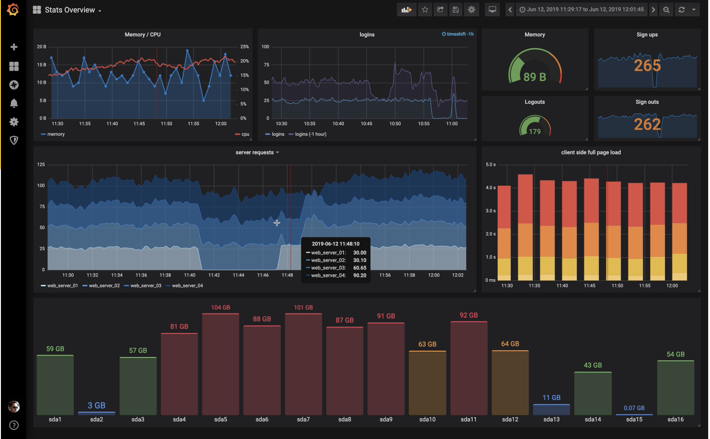

# Prometheus

Prometheus 是一个开源的监控和告警工具包。

Prometheus 的主要特点是：

- 一个多维数据模型，其中包含通过度量名称和键/值对标识 `时间序列数据`

- PromQL，一种灵活的查询语言，可利用此维度

- 不依赖分布式存储； 单服务器节点是自治的

- 时间序列收集通过HTTP上的拉模型进行

- 通过中间网关支持推送时间序列

- 通过服务发现或静态配置发现目标

- 支持多种图形和仪表板

## 优势

- 方案完整，从数据收集、存储、处理、展示、告警一条龙服务

- 支持众多 [Exporter](https://prometheus.io/docs/instrumenting/exporters/)，可以快速搭建数据收集端

## 整体架构

- 各种 Exporter 复制收集数据

- Prometheus server 负责拉取、存储、处理数据，并向 Alertmanager 推送告警

- Alertmanager 处理告警

- Prometheus Web UI, Grafana 或者其他 API clients 通过 PromQL 语言查询数据，用于展示分析

> Prometheus server 采用的是拉取方式，如果 Exporter 想要主动推送数据，需要搭建 Pushgateway 来接受和暂存数据，然后等 Prometheus server 来 Pushgateway 拉取数据

## Metrics

四大指标类型：

- Counter： 自增不减的计数器

- Gauge：可增可减的仪表盘

- Histogram、Summary 分析数据分布情况

> Summary 显示分位数(0.5, 0.9, 0.99)的数据值

> Histogram 显示不同值区间的数据数量

## PromQL

[语法学习](https://yunlzheng.gitbook.io/prometheus-book/parti-prometheus-ji-chu/promql/prometheus-query-language)

## 可视化

`Prometheus Web UI` 界面相对捡漏，展示功能有限，适用于快速验证 `PromQL` 以及临时可视化支持的能力

实际的可视化方案一般都是采用 `Grafana`

Grafana 中的主要概念

- Datasource：拉取数据的源头

- Dashboard：看板

- Panel：图表

> 一个 Dashboard 包含多个 Pannel

对于线上监控来讲，如果我们每个面板都需要自己从零开始，那么就太累了。

事实上，我们用到的许多监控信息都是类似的。

因此 [Grafana 官网 - Dashboard](https://grafana.com/grafana/dashboards) 模块提供了下载 Dashboard 模板的功能

## Docker 体验 Prometheus

[Docker 工程](https://gitee.com/yechaolin/hello-docker/tree/master/prometheus)

[Spring Boot 工程实现 prometheus 监控](https://www.cnblogs.com/chanshuyi/p/06_prometheus_with_springboot_actuator.html)

## 资料

- [Prometheus 快速入门教程](https://www.cnblogs.com/chanshuyi/category/1862951.html)
- [Prometheus 官方文档](https://prometheus.io/docs/introduction/overview/)
- [Prometheus-book](https://yunlzheng.gitbook.io/prometheus-book/)
- [Docker 下体验 Prometheus](https://blog.csdn.net/boling_cavalry/article/details/88367137)
- [Grafana 官方文档](https://grafana.com/docs/)
- [Grafana 图标配置快速入门](https://www.cnblogs.com/chanshuyi/p/03_grafana_chart_quick_start.html)
- [谈谈时间序列数据库](https://blog.csdn.net/gentlezuo/article/details/103038523)
