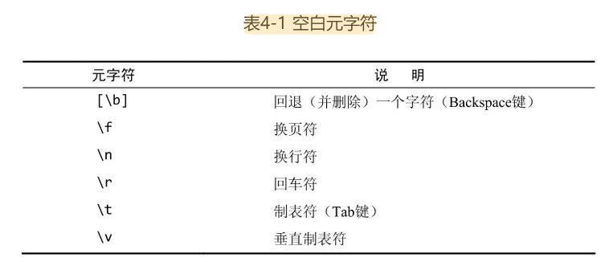
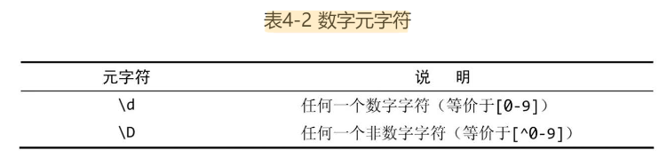
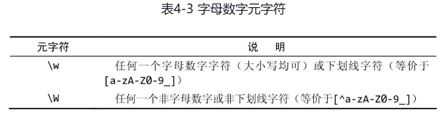
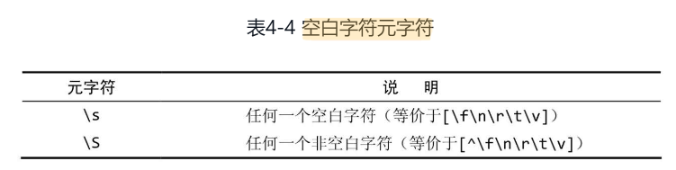
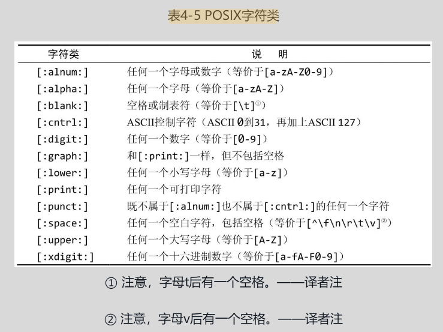

# 正则表达式

## 定义

正则表达式是文本处理方面功能最强大的工具之一。

正则表达式的两种基本用途：**搜索**和**替换**。给定一个正则表达式，它要么匹配一些文本（进行一次搜索）​，要么匹配并替换一些文本（进行一次替换）​。

正则表达式是一些用来匹配和处理文本的字符串。更准确地说，正则表达式语言是内置于其他语言或软件产品里的“迷你”语言。

语法是正则表达式最容易掌握的部分，真正的挑战是学会如何运用那些语法把实际问题分解为一系列正则表达式并最终解决。

在不同的应用程序/语言里，正则表达式的语法和功能往往会有明显（有时也不那么明显）的差异。

> 可以通过关键字 `Regular Expression Tester` 在搜索引擎找到一些 web 版本的正则表达式测试工具来验证不同语言的正则表达式的准确性

在使用正则表达式的时候，你将发现几乎所有的问题都有不止一种解决方案。它们有的比较简单，有的比较快速，有的兼容性更好，有的功能更全。

## 匹配单个字符

### 匹配纯文本

正则表达式可以包含纯文本（甚至可以只包含纯文本）​。当然，像这样使用正则表达式是一种浪费.

#### 多个匹配结果

绝大多数正则表达式引擎的默认行为是只返回第1个匹配结果。

绝大多数正则表达式的实现都提供了一种能够把所有的匹配结果全部找出来的机制（通常返回为一个数组或是其他的专用格式）​。式）​。在JavaScript里，可选的g（意思是“global”​，全局）标志将返回一个包含着所有匹配的结果数组。

#### 大小写问题

正则表达式是区分字母大小写的。

不过，绝大多数正则表达的式实现也支持不区分字母大小写的匹配操作。比如说，JavaScript用户可以用i标志来强制执行一次不区分字母大小写的搜索。

### 匹配任意字符

`.` 字符（英文句号）可以匹配任何一个单个的字符。

> 正则表达式经常被简称为模式，它们其实是一些由字符构成的字符串。这些字符可以是普通字符（纯文本）或元字符（有特殊含义的特殊字符）​。

>  正则表达式可以用来匹配包含着字符串内容的模式。匹配的并不总是整个字符串，而是与某个模式相匹配的字符——即使它们只是整个字符串的一部分

!> `.` 可以匹配任何一个字符，这一说法并非绝对准确。在绝大多数的正则表达式实现里，`.` 只能匹配*除换行符以外*的任何单个字符。

### 匹配特殊字符

为此，你必须在 `.` 的前面加上一个 `\`（反斜杠）字符来对它进行转义。`\` 是一个元字符（metacharacter，表示“这个字符有特殊含义，而不是字符本身含义”​）​。

> 如果需要搜索`\`本身，就必须对`\`字符进行转义；相应的转义序列是两个连续的反斜杠字符`\\`。

## 匹配一组字符

### 匹配多个字符中的某一个

元字符`[`和`]`用来定义一个字符集合，其含义是必须匹配该集合里的字符之一。

!> 验证某个模式能不能获得预期的匹配结果并不困难，但如何验证它不会匹配到你不想要的东西可就没那么简单了。

### 利用字符区间

定义一个字符集合的具体做法有两种：一是把所有的字符都列举出来；二是利用元字符`-`以字符区间的方式给出。

字符区间的首、尾字符可以是ASCII字符表里的任意字符。但在实际工作中，最常用的字符区间还是数字字符区间`0-9`和字母字符区间`a-zA-Z`。

在同一个字符集合里可以给出多个字符区间

> 字符范围使得正则表达式的语法变得非常简明。

### 取非匹配

字符集合可以用元字符`^`来求非；这将把给定的字符集合强行排除在匹配操作以外——除了该字符集合里的字符，其他字符都可以被匹配。

!> `^`的效果将作用于给定字符集合里的所有字符或字符区间，而不是仅限于紧跟在`^`字符后面的那一个字符或字符区间。

## 使用元字符

可以使用简短的元字符和POSIX字符类来简化正则表达式模式。

### 对特殊字符进行转义

元字符是一些在正则表达式里有着特殊含义的字符。因为元字符在正则表达式里有着特殊的含义，所以这些字符就无法用来代表它们本身。比如前面的 `.` 和 `[` `]` `\` 等字符

每个元字符都可以通过给它加上有个反斜杠前缀的办法来转义，如此得到的转义序列将匹配那个字符本身而不是它特殊的元字符含义。

> 在一个完整的正则表达式里，字符`\`的后面永远跟着另一个字符。

### 匹配空白字符

元字符大致可以分为两种：一种是用来匹配文本的（比如`.`）​，另一种是正则表达式的语法所要求的（比如`[`和`]`​）​。

在进行正则表达式搜索的时候，我们经常会遇到需要对原始文本里的非打印空白字符进行匹配的情况，这时可以用元字符来表达空白字符

### 匹配特定的字符类别

用来匹配所有空白字符的类元字符(包括空格键):

> 用来匹配退格字符的[\b]元字符是一个特例：它不在类元字符\s的覆盖范围内，当然也就没有被排除在类元字符\S的覆盖范围外。

#### 匹配十六进制或八进制数值

在正则表达式里，十六进制（逢16进1）数值要用前缀`\x`来给出。比如说，`\x0A`对应于 ASCII 字符 10（换行符）​，其效果等价于`\n`。

在正则表达式里，八进制（逢8进1）数值要用前缀`\0`来给出，数值本身可以是两位或三位数字。比如说，`\011`对应于 ASCII 字符 9（制表符）​，其效果等价于`\t`

### 使用 POSIX 字符类

POSIX字符类是许多（但不是所有）正则表达式实现都支持的一种简写形式。

!> JavaScript不支持在正则表达式里使用POSIX字符类。

这里使用的模式以`[​[`开头、以`]​]`结束（两对方括号）​。这是使用POSIX字符类所必须的。POSIX字符类必须括在`[:`和`:​]`之间，我们使用的POSIX字符类是`[:xdigit:]`​（不是`:xdigit:`）​。外层的`[`和`]`字符用来定义一个字符集合，内层的`[`和`]`字符是POSIX字符类本身的组成部分。

## 重复匹配

## 位置匹配

## 使用子表达式

## 回溯引用：前后一致匹配

## 前后查找

## 嵌入条件