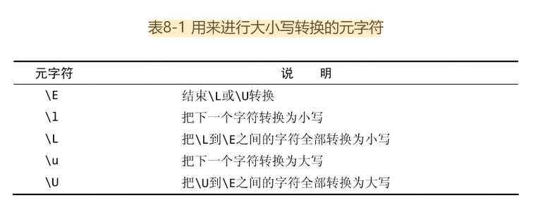
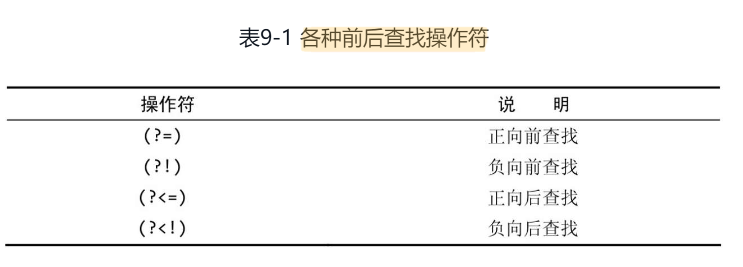

# 正则表达式

## 定义

正则表达式是文本处理方面功能最强大的工具之一。

正则表达式的两种基本用途：**搜索**和**替换**。给定一个正则表达式，它要么匹配一些文本（进行一次搜索）​，要么匹配并替换一些文本（进行一次替换）​。

正则表达式是一些用来匹配和处理文本的字符串。更准确地说，正则表达式语言是内置于其他语言或软件产品里的“迷你”语言。

语法是正则表达式最容易掌握的部分，真正的挑战是学会如何运用那些语法把实际问题分解为一系列正则表达式并最终解决。

在不同的应用程序/语言里，正则表达式的语法和功能往往会有明显（有时也不那么明显）的差异。

> 可以通过关键字 `Regular Expression Tester` 在搜索引擎找到一些 web 版本的正则表达式测试工具来验证不同语言的正则表达式的准确性

在使用正则表达式的时候，你将发现几乎所有的问题都有不止一种解决方案。它们有的比较简单，有的比较快速，有的兼容性更好，有的功能更全。

## 匹配单个字符

### 匹配纯文本

正则表达式可以包含纯文本（甚至可以只包含纯文本）​。当然，像这样使用正则表达式是一种浪费.

#### 多个匹配结果

绝大多数正则表达式引擎的默认行为是只返回第1个匹配结果。

绝大多数正则表达式的实现都提供了一种能够把所有的匹配结果全部找出来的机制（通常返回为一个数组或是其他的专用格式）​。式）​。在JavaScript里，可选的g（意思是“global”​，全局）标志将返回一个包含着所有匹配的结果数组。

#### 大小写问题

正则表达式是区分字母大小写的。

不过，绝大多数正则表达的式实现也支持不区分字母大小写的匹配操作。比如说，JavaScript用户可以用i标志来强制执行一次不区分字母大小写的搜索。

### 匹配任意字符

`.` 字符（英文句号）可以匹配任何一个单个的字符。

> 正则表达式经常被简称为模式，它们其实是一些由字符构成的字符串。这些字符可以是普通字符（纯文本）或元字符（有特殊含义的特殊字符）​。

>  正则表达式可以用来匹配包含着字符串内容的模式。匹配的并不总是整个字符串，而是与某个模式相匹配的字符——即使它们只是整个字符串的一部分

!> `.` 可以匹配任何一个字符，这一说法并非绝对准确。在绝大多数的正则表达式实现里，`.` 只能匹配*除换行符以外*的任何单个字符。

### 匹配特殊字符

为此，你必须在 `.` 的前面加上一个 `\`（反斜杠）字符来对它进行转义。`\` 是一个元字符（metacharacter，表示“这个字符有特殊含义，而不是字符本身含义”​）​。

> 如果需要搜索`\`本身，就必须对`\`字符进行转义；相应的转义序列是两个连续的反斜杠字符`\\`。

## 匹配一组字符

### 匹配多个字符中的某一个

元字符`[`和`]`用来定义一个字符集合，其含义是必须匹配该集合里的字符之一。

!> 验证某个模式能不能获得预期的匹配结果并不困难，但如何验证它不会匹配到你不想要的东西可就没那么简单了。

### 利用字符区间

定义一个字符集合的具体做法有两种：一是把所有的字符都列举出来；二是利用元字符`-`以字符区间的方式给出。

字符区间的首、尾字符可以是ASCII字符表里的任意字符。但在实际工作中，最常用的字符区间还是数字字符区间`0-9`和字母字符区间`a-zA-Z`。

在同一个字符集合里可以给出多个字符区间

> 字符范围使得正则表达式的语法变得非常简明。

### 取非匹配

字符集合可以用元字符`^`来求非；这将把给定的字符集合强行排除在匹配操作以外——除了该字符集合里的字符，其他字符都可以被匹配。

!> `^`的效果将作用于给定字符集合里的所有字符或字符区间，而不是仅限于紧跟在`^`字符后面的那一个字符或字符区间。

## 使用元字符

可以使用简短的元字符和POSIX字符类来简化正则表达式模式。

### 对特殊字符进行转义

元字符是一些在正则表达式里有着特殊含义的字符。因为元字符在正则表达式里有着特殊的含义，所以这些字符就无法用来代表它们本身。比如前面的 `.` 和 `[` `]` `\` 等字符

每个元字符都可以通过给它加上有个反斜杠前缀的办法来转义，如此得到的转义序列将匹配那个字符本身而不是它特殊的元字符含义。

> 在一个完整的正则表达式里，字符`\`的后面永远跟着另一个字符。

### 匹配空白字符

元字符大致可以分为两种：一种是用来匹配文本的（比如`.`）​，另一种是正则表达式的语法所要求的（比如`[`和`]`​）​。

在进行正则表达式搜索的时候，我们经常会遇到需要对原始文本里的非打印空白字符进行匹配的情况，这时可以用元字符来表达空白字符

### 匹配特定的字符类别

用来匹配所有空白字符的类元字符(包括空格键):

> 用来匹配退格字符的[\b]元字符是一个特例：它不在类元字符\s的覆盖范围内，当然也就没有被排除在类元字符\S的覆盖范围外。

#### 匹配十六进制或八进制数值

在正则表达式里，十六进制（逢16进1）数值要用前缀`\x`来给出。比如说，`\x0A`对应于 ASCII 字符 10（换行符）​，其效果等价于`\n`。

在正则表达式里，八进制（逢8进1）数值要用前缀`\0`来给出，数值本身可以是两位或三位数字。比如说，`\011`对应于 ASCII 字符 9（制表符）​，其效果等价于`\t`

### 使用 POSIX 字符类

POSIX字符类是许多（但不是所有）正则表达式实现都支持的一种简写形式。

!> JavaScript不支持在正则表达式里使用POSIX字符类。

这里使用的模式以`[​[`开头、以`]​]`结束（两对方括号）​。这是使用POSIX字符类所必须的。POSIX字符类必须括在`[:`和`:​]`之间，我们使用的POSIX字符类是`[:xdigit:]`​（不是`:xdigit:`）​。外层的`[`和`]`字符用来定义一个字符集合，内层的`[`和`]`字符是POSIX字符类本身的组成部分。

## 重复匹配

在前几章里，已经学习了如何使用各种元字符、字符集合和字符类去匹配单个字符。在这一章里，将学习如何匹配多个连续重复出现的字符或字符集合。

重复匹配元字符：

- `+`: 匹配字符或字符集合的一次或多次重复出现​
- `*`: 匹配字符或字符集合的零次或多次重复出现
- `?`: 匹配字符或字符集合的零次或一次出现

如果需要精确控制重复匹配的数量，可以用

- `{n}`: 精确重复匹配n次
- `{n,}`: 至少重复匹配n次
- `{,m}`: 至多重复匹配m次
- `{n,m}`: 重复匹配n ~ m 次

`*` 和 `+` 是所谓的“贪婪型”元字符，它们在进行匹配时的行为模式是多多益善而不是适可而止的。它们会尽可能地从一段文本的开头一直匹配到这段文本的末尾，而不是从这段文本的开头匹配到碰到第一个匹配时为止。

在不需要这种“贪婪行为”的时候该怎么办？答案是使用这些元字符的“懒惰型”版本

常用的贪婪型元字符和它们的懒惰型版本:

- `*`: `*?`
- `+`: `+?`
- `{n,}`: `{n,}?`

## 位置匹配

正则表达式不仅可以用来匹配任意长度的文本块，还可以用来匹配出现在字符串中特定位置的文本。

使用边界限定符，也就是在正则表达式里用一些特殊的元字符来表明我们想让匹配操作在什么位置（或边界）发生。

### 单词边界

`\b` 用来指定一个单词边界（`\B`刚好相反）​。

`\b` 匹配的是一个这样的位置，这个位置位于一个能够用来构成单词的字符（字母、数字和下划线，也就是与`\w`相匹配的字符）和一个不能用来构成单词的字符（也就是与`\W`相匹配的字符）之间。

如果你想匹配一个完整的单词，就必须在你想要匹配的文本的前后都加上`\b`限定符。

### 字符串边界

`^` 和 `$` 用来指定字符串边界（字符串的开头和字符串的结束）​。

> `^`是几个有着多种用途的元字符之一。只有当它出现在一个字符集合里（被放在`[`和`]`之间）并紧跟在左方括号`[`的后面时，它才能发挥“求非”作用

#### 分行匹配模式

如果与`(?m)`配合使用，`^`和`$`还将匹配在一个换行符处开头或结束的字符串（此时，换行符将被视为一个字符串分隔符）​。

> 在使用时，`(?m)`必须出现在整个模式的最前面

> 有许多正则表达式实现不支持`(?m)`​。

## 使用子表达式

子表达式是一个更大的表达式的一部分；把一个表达式划分为一系列子表达式的目的是为了把那些子表达式当作一个独立元素来使用。子表达式必须用`(`和`)`括起来。

子表达式的常见用途包括：

- 对重复次数元字符的**作用对象**做出精确的设定和控制、
- 对`|`操作符的OR条件做出准确的定义，等等。

> 因为`|`操作符是把位于它左边和右边的两个部分都作为一个整体来看待的，它会把模式`19|20\d{2}`解释为`19`或`20\d{2}`​。

子表达式允许嵌套。事实上，子表达式允许多重嵌套，这种嵌套的层次在理论上没有限制，但在实际工作中还是应该遵循适可而止的原则。

在分析各个子表达式的时候，应该按照先内后外的原则来进行而不是从第一个字符开始一个字符一个字符地去尝试。

## 回溯引用：前后一致匹配

本章将讨论子表达式的另一个重要用途——定义回溯引用（backreference）​。

回溯引用允许正则表达式模式引用前面的匹配结果.

> 回溯引用指的是模式的后半部分引用在前半部分中定义的子表达式

`\1`代表着模式里的第1个子表达式,依次类推

> 回溯引用语法在不同的正则表达式实现里有很大的差异：JavaScript用户需要用`$`来代替`\`; ColdFusion用户在查找和替换操作里都必须使用`\`。

正则表达式更适用于复杂的替换，尤其是需要使用回溯引用的场合

替换操作需要用到两个正则表达式：一个用来给出搜索模式，另一个用来给出匹配文本的替换模式。回溯引用可以跨模式使用，在第一个模式里被匹配的子表达式可以用在第二个模式里。

在对文本进行重新排版的时候，把文本分解成多个子表达式的做法往往非常有用，这可以让我们对文本的排版效果做出更精确的控制。

替换时还可以结合大小写转换元字符使用 

## 前后查找

这样一个模式，它包含的匹配本身并不返回，而是用于确定正确的匹配位置，它并不是匹配结果的一部分。换句话说，你需要进行“前后查找”

 Java、.NET、PHP和Perl都支持向后查找（但有一些限制）, JavaScript和ColdFusion不支持向后查找。

### 向前查找

向前查找指定了一个必须匹配但不在结果中返回的模式。

> 这里的向前指的是在常规模式的右边

向前查找实际就是一个子表达式，而且从格式上看也确实如此。从语法上看，一个向前查找模式其实就是一个以`?=`开头的子表达式，需要匹配的文本跟在`=`的后面。

格式： `normal_pattern(?=some_pattern)`

任何一个子表达式都可以转换为一个向前查找表达式，只要给它加上一个`?=`前缀即可。在同一个搜索模式里可以使用多个向前查找表达式，它们可以出现在模式里的任意位置

> 常见的正则表达式实现都支持向前查找

### 向后查找

> 这里的向前指的是在常规模式的左边

向后查找操作符是 `?<=`

`?<=`与`?=`的具体使用方法大同小异；它必须用在一个子表达式里，而且后跟要匹配的文本。

!> 向前查找模式的长度是可变的，它们可以包含`.`和`+`之类的元字符，所以它们非常灵活。而*向后查找模式只能是固定长度*——这是一条几乎所有的正则表达式实现都遵守的限制。

> 向后查找不一定支持。 常见的，Java、.NET、PHP和Perl都支持向后查找（但有一些限制）, JavaScript和ColdFusion不支持向后查找。

### 对前后查找取非

## 嵌入条件

在正则表达式模式里可以嵌入条件，只有当条件得到（或者没有得到）满足时，相应的表达式才会被执行。

这种条件可以是一个回溯引用（含义是检查该回溯引用是否存在）​，也可以是一个前后查找操作。

> 嵌入条件很少用到

嵌入条件也是作用于表达式，用的是也是 `?` 元字符

结合回溯引用: `(?(1)some_pattern)` 的意思是如果第一个子表达式存在，则匹配 some_pattern ，否则不匹配

> 嵌入了条件的模式看上去往往非常复杂，而这往往意味着调试工作会变得非常困难。如果别无选择，先对整个模式的各组成部分分别进行调试，再把它们拼装到一起，这通常是一种比较好的办法。

结合前后查找： `\d{5}(?(?=-)-\d{4})`的意识是只有当出现 `-` 符号是，才匹配 `-\d{4}`