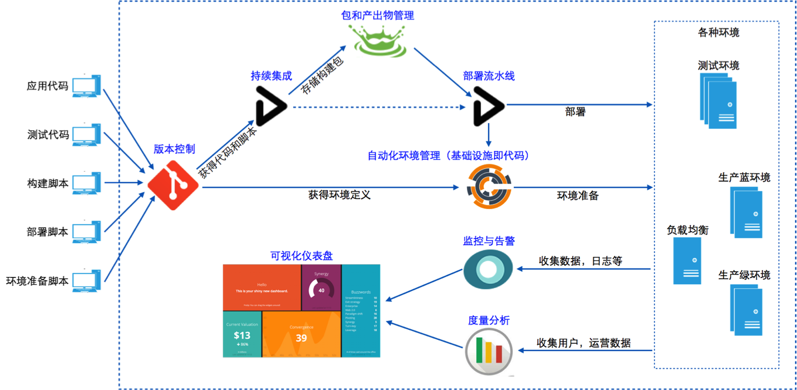

# Infrastructure as Code -- Terraform

`Infrastructure as Code` (基础设施即代码)本质上就是用 DSL 语言描述基础设施环境（服务器、网络等），然后通过 DSL 的脚本构建基础设施。

DSL 脚本放在代码库，从而使基础设施的构建具备版本控制功能。

基础设施即代码的目标是：

- 标准化。以代码来定义环境，实现开发环境、测试环境、生产环境的标准化。

- 自动化。以自动化工具来驱动代码准备环境。包括创建环境、更新环境以及销毁环境。

- 可视化。以监控来可视化环境信息。环境当前状态可视、环境变更历史可视、可追溯。



## Terraform

Terraform 是用于安全有效地构建、更改和版本控制基础设施的工具，即 IAC 工具

Terraform 可以管理现有和流行的服务提供商以及定制的内部解决方案

!> Terraform 本质上主要是提供了 DSL 语言以及一个客户端（类似于 SQL 和 JDBC），然后各云服务提供商实现 Provoider 提供相应功能（类似于各数据库提供的 Driver）

Terraform 的关键特性：

- 基础设施即代码: 基础设施是使用高级配置语法来描述的。这样就可以像对待任何其他代码一样对数据中心的蓝图进行版本控制和处理。此外，基础架构可以共享和重复使用。

- 执行计划：Terraform 有一个“计划”步骤，在其中生成执行计划。执行计划将显示 Terrafrom 在您调用 apply 时将执行的操作。这样可以避免 Terrafrom 操作基础结构时出现任何意外。

- 资源图：Terraform 构建所有资源的图，并并行化所有非依赖的创建和修改。因此，Terraform 尽可能高效地构建基础架构，并且操作员可以洞悉其基础架构中的依赖性

- 变更自动化：复杂的变更集可以以最少的人工干预就可以应用于您的基础架构。使用前面提到的执行计划和资源图，您可以准确地知道 Terraform 将要更改的内容和顺序，从而避免了许多可能的人为错误。

## Terraform DSL

### Resources

`Resources` 是 Terraform 语言中最重要的元素。每个资源块都描述一个或多个基础设施对象，例如虚拟网络，计算实例或更高级别的组件（例如 DNS 记录）

`main.tf`

```tf
# 在 aws 上申请一台服务器实例
# aws_instance 是 AWS 提供的资源，不同 Provider 提供的资源名称不一样
# web 是这个资源实例的 id，其他地方可通过 aws_instance.web.xxx 获取该实例的属性（比如 ip 地址等）
resource "aws_instance" "web" {
  ami           = "ami-a1b2c3d4"
  instance_type = "t2.micro"
}
```

### Input Variables

`Input Variables` 用作 Terraform `Module` 的参数，允许自定义 `Module` 的各个方面而不更改 `Module` 自身的源代码，并允许 `Module` 在不同配置之间共享。

> 同一目录的所有 tf 文件为一个 module

> 可以把 Input Variables 理解为 Module 的输入参数

variable.tf

```tf
variable "image_id" {
  type = string
}

variable "availability_zone_names" {
  type    = list(string)
  default = ["us-west-1a"]
}

variable "docker_ports" {
  type = list(object({
    internal = number
    external = number
    protocol = string
  }))
  default = [
    {
      internal = 8300
      external = 8300
      protocol = "tcp"
    }
  ]
}
```

使用变量

```tf
resource "aws_instance" "example" {
  instance_type = "t2.micro"
  ami           = var.image_id
}
```

传入变量的方法

- 命令行参数

    ```bash
    terraform apply -var="image_id=ami-abc123"
    terraform apply -var='image_id_list=["ami-abc123","ami-def456"]'
    terraform apply -var='image_id_map={"us-east-1":"ami-abc123","us-east-2":"ami-def456"}'
    ```

- 变量定义文件(.tfvars)

    ```bash
    image_id = "ami-abc123"
    availability_zone_names = [
    "us-east-1a",
    "us-west-1c",
    ]
    ```

    Terraform 默认会导入 `terraform.tfvars`  `terraform.tfvars.json` `xxx.auto.tfvars`  `xxx.auto.tfvars.json` 这些变量定义文件

    如果不是这些文件，需要在命令行指定特定的文件

    ```bash
    terraform apply -var-file="testing.tfvars"
    ```

- 环境变量

    命名格式：`TF_VAR_${变量名}`

    ```bash
    export TF_VAR_image_id=ami-abc123

    terraform plan
    ```

- 上层 Module 输入

    > 详见下面的 Module

### Output Values

> 可以理解为 Module 的返回值

用途：

- 子模块可以使用输出将其资源属性的子集提供给父模块

    > 返回子模块 Output Values 的格式: `module.<Module Name>.<Ouput Name>`

- 运行 `terraform apply` 后，根模块可以使用输出在 CLI 输出中打印某些值

- 使用 `remote state` 时，其他配置可以通过 `terraform_remote_state` 数据源访问根模块输出

`outputs.ts`

```tf
output "instance_ip_addr" {
  value = aws_instance.server.private_ip
}
```

### Local Values

> 可以理解为 Module 的局部变量

主要目的是消除重复

```tf
locals {
  service_name = "forum"
  owner        = "Community Team"
}

locals {
  # Ids for multiple sets of EC2 instances, merged together
  instance_ids = concat(aws_instance.blue.*.id, aws_instance.green.*.id)
}

locals {
  # Common tags to be assigned to all resources
  common_tags = {
    Service = local.service_name
    Owner   = local.owner
  }
}
```

引用方法

```tf
resource "aws_instance" "example" {
  # ...

  tags = local.common_tags
}
```

### MOdules

Modules 是用于一起使用的多个资源的容器

> 同一目录下的所有 *.tf 文件为一个 Module

一个 Module 可以引用另一个 Module 作为子 Module

```tf
module "servers" {
  # 子模块地址，可以是本地的相对地址，也可以是 URL 地址
  source = "./app-cluster"

  # 指定子模块的输入参数
  servers = 5
}
```

> Module 之间的引用可以看作一种继承，但建议尽量不要使用层次很深的继承，多用组合模式（二层结构），规划好 Module

### Data Sources

Data Source 通过从数据源资源获取数据，以在其他 Terraform 配置中使用

> 可以类比为查询数据库获取数据

```tf
# Find the latest available AMI that is tagged with Component = web
data "aws_ami" "web" {
  filter {
    name   = "state"
    values = ["available"]
  }

  filter {
    name   = "tag:Component"
    values = ["web"]
  }

  most_recent = true
}

resource "aws_instance" "web" {
  ami           = data.aws_ami.web.id
  instance_type = "t1.micro"
}
```

### Backend Configuration

用于指定一个 `Backend` 记录 Terraform 的当前状态数据

> Terraform apply 构建基础设施后，会将基础设施信息（比如资源 id 等）保存在 Backend，用于后续的 Change 和 Destroy

[官方文档](https://www.terraform.io/docs/configuration/backend.html)

[Backend Types](https://www.terraform.io/docs/backends/types/)

## Terraform CLI

```bash
$ terraform
Usage: terraform [global options] <subcommand> [args]

The available commands for execution are listed below.
The primary workflow commands are given first, followed by
less common or more advanced commands.

Main commands:
  init          Prepare your working directory for other commands
  validate      Check whether the configuration is valid
  plan          Show changes required by the current configuration
  apply         Create or update infrastructure
  destroy       Destroy previously-created infrastructure

All other commands:
  console       Try Terraform expressions at an interactive command prompt
  fmt           Reformat your configuration in the standard style
  force-unlock  Release a stuck lock on the current workspace
  get           Install or upgrade remote Terraform modules
  graph         Generate a Graphviz graph of the steps in an operation
  import        Associate existing infrastructure with a Terraform resource
  login         Obtain and save credentials for a remote host
  logout        Remove locally-stored credentials for a remote host
  output        Show output values from your root module
  providers     Show the providers required for this configuration
  refresh       Update the state to match remote systems
  show          Show the current state or a saved plan
  state         Advanced state management
  taint         Mark a resource instance as not fully functional
  untaint       Remove the 'tainted' state from a resource instance
  version       Show the current Terraform version
  workspace     Workspace management

Global options (use these before the subcommand, if any):
  -chdir=DIR    Switch to a different working directory before executing the
                given subcommand.
  -help         Show this help output, or the help for a specified subcommand.
  -version      An alias for the "version" subcommand.
```

## References

- [解读基础设施即代码](https://insights.thoughtworks.cn/nfrastructure-as-code/)
- [Terraform 官方入门](https://learn.hashicorp.com/tutorials/terraform/infrastructure-as-code)
- [Terraform 官方介绍](https://www.terraform.io/intro/index.html)
- [Terraform 官方文档](https://www.terraform.io/docs/index.html)
- [Terraform CLI](https://www.terraform.io/docs/commands/index.html)
- [Terraform Github](https://github.com/hashicorp/terraform)