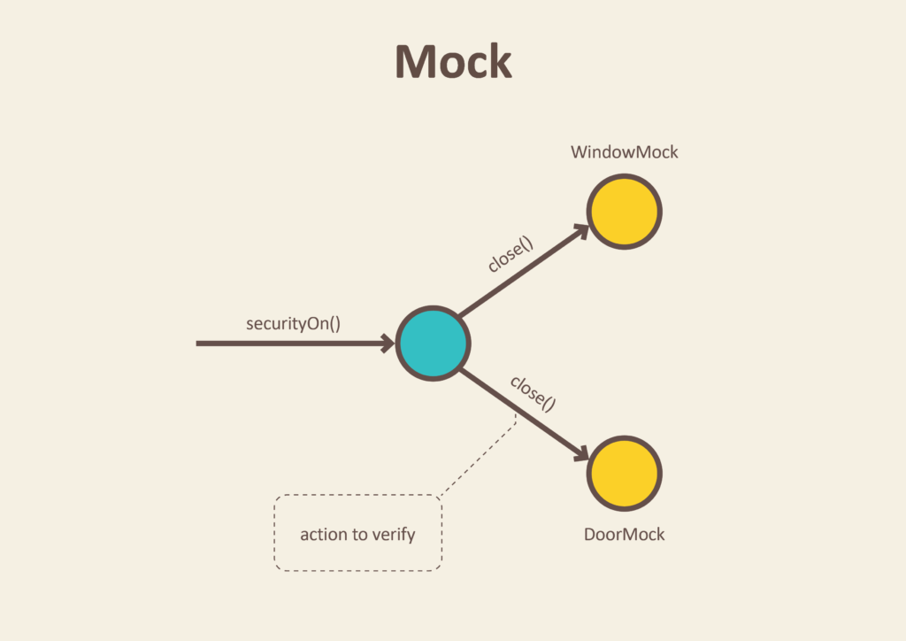

# 单元测试

测试是对系统性能的测试、或者对数据的检查

测试是软件质量的重要保证

> 测试让开发人员可以对开发的软件质量拥有信心

单元测试(Unit Test) 是系统测试的基础，同时也是测试驱动开发（TDD）的基础

单元测试的要求

- 执行速度快
- 不依赖外部对象
- 覆盖主要代码

单元测试结果的检查不应该通过 `打印` 或者 `debug` 来检查，而是使用 `assert` 来检查，这样才能实现自动化

Java 领域流行的单元测试框架有：

- Jtest
- JUnit
- TestNG

其中 `JUnit` 是最为流行的

## JUnit

JUnit 是 Java 领域最流行的单元测试框架。

> JUnit 虽然是为了单元测试而设计，但是也可以结合其它框架进行集成测试、功能测试等各种测试

优点：

- 基于元数据（注解）
- 无侵入性（不需要继承任何类）

这里主要讨论的是 `JUnit4`，`JUnit3` 是有侵入性的

`JUnit4` 相比于 JUnit3 的优势：

- 测试类不再需要继承 `TestCase` 基类
- 不再需要固定 `setUp` `tearDown` 这类方法名，改成使用 `@Before`, `@After` 注解，另外还支持 `@BeforeClass` `@AfterClass` 注解
- 测试方法名不再需要以 `test` 开头，改成使用 `@Test` 注解

注解方法执行顺序


### 断言

`Assert` 类常用断言工具方法

- assertTrue
- assertFlase
- assertNull
- assertNotNull
- assertEquals

    > 如果是 `dobule` 类型，要使用 `assertEquals(double expected, double actual, double delta)` 或者直接使用 BigDecimal 替代

- assertSame

    > 等同于 `=`

- assertNotSame

异常断言是通过 `@Test(expected=<Exception class name>.class)` 注解参数来指定

    ```java
    @Test(expected=RuntimeException.class)
    public void test_exception_condition() {
        throw new RuntimeException();
    }
    ```

- assertThat

    assertThat 是最灵活的断言方式，方法签名如下

    ```
    public static <T> void assertThat(T actual, Matcher<? super T> matcher)
    ```

    > Matcher 是来自于 hamcrest-core 的 `org.hamcrest.Matcher` 类，因此 junit 依赖于 hamcrest-core

### Runner

JUnit4 使用 Runner 来运行测试

Runner 自带的 Runner 主要如下:


使用 @RunWith 注解指定 runner， 如果没有指定，那么JUnit将会使用默认的运行器（JUnit4）

为了能够尽可能快捷地运行测试，JUnit提供了一个façade（org.junit.runner.JUnitCore），它可以运行任何 Runner。JUnit设计这个façade来执行你的测试，并收集测试结果与统计信息。

> facade 是一种设计模式，它为子系统中的一组接口提供了一个统一的接口。façade定义了一个更高级别的接口，使得子系统更易于使用。你可以使用facade来将一些复杂的对象交互简化成一个单独的接口。

### 如何执行 JUnit 测试

JUnit 测试一般是通过 IDE 或者 mvn 命令来执行

当然也可以使用最原始的 main 方法执行

> 三种方式本质上都是调用 JUnitCore 来执行，只是 IDE 会收集结果然后渲染出来

```bash
# 编译
javac -classpath /Users/apple/.m2/repository/junit/junit/4.13.1/junit-4.13.1.jar:/Users/apple/.m2/repository/org/hamcrest/hamcrest-core/1.3/hamcrest-core-1.3.jar org/freedom/AssertTest.java
# 运行 junit 测试
java -cp .:/Users/apple/.m2/repository/junit/junit/4.13.1/junit-4.13.1.jar:/Users/apple/.m2/repository/org/hamcrest/hamcrest-core/1.3/hamcrest-core-1.3.jar org.junit.runner.JUnitCore org.freedom.AssertTest
```

通过 mvn 执行

```bash
# 执行某个测试类
mvn -Dtest=OneTest test

# 执行多个测试类
mvn -Dtest=OneTest,Some*Test test

# 执行某个测试方法
mvn -Dtest=OneTest#testMethod
```

IDE 执行过于简单，略

### 高级特性

- Suite

    JUnit 通过 Suite 的概念将多个测试类分组，可以只执行某个组的测试

- Parameterized

    通过二维数组定义多组输入输出，实现同样测试代码，验证多组输入输出

- Rule

    通过

- Theory

    TODO


### JUnit5

JUnit4 的缺点

- 非模块化
- 只能有一个 Runner
- 

JUnit5 的优势

- 模块化

JUnit4 架构


JUnit5 架构


## Test Double(测试替身)

如果测试的目标对象依赖于其它对象或者外部资源，真实构建这些外部对象会造成单元测试过度复杂，导致性能极大降低，外部资源的变化可能会破坏单元测试的可重复性，那么这些外部对象应该怎么构建呢？

回答是采用 `替身(Double)`

> Double 替身来自于表演行业

测试中的替身分为五种：

### Dummy

Dummy Object 英文直译冒牌货

Dummy 的用途是用来填充目标测试对象中需要的物件。而 Dummy 不会对测试目标造成任何的影响。纯粹的填充物件，让测试程式能够运行

如果测试目标只是需要这样一个对象，而这个对象并不会影响结果，这样一个对象就是 Dummy 对象

### Stub

替身对象的返回影响目标对象的结果, 也就是说替身对象要有合适的返回，这样的替身就是 Stub

当不能或者不想使用依赖对象的真实数据使，使用 Stub 对象返回预置的数据


### Fake

Fake 替身对象会有自己的实现，但是不同于真实的实现，会更加的简单

> Stub 返回的是死数据， Fake 会执行自己的逻辑得到数据返回


### Spy

Spy 用来验证目标对象对其依赖对象造成的效果

### Mock

Mock 是一个能够判断目标是不是有正确使用依赖对象的替身。

Mock 跟 Spy 的最大差别是，Mock 用来验证目标对象的行为，而 Spy 用来验证目标对象对依赖对象状态的改变。

> mock 对象没有 stub 的方法返回的是默认值

> spy 对象没有 stub 的方法会执行原对象的方法，得到原对象方法的返回



## Mockito

Mockito 就是一个创建 Test Double 的开源框架。

### Mockito 原理

简单实现 Mockito 的 mock、when、then

```java
public class Mockito {

    private static Map<Invocation, Object> results = new HashMap<Invocation, Object>();
    private static Invocation lastInvocation;

    public static <T> T mock(Class<T> clazz) {
        Enhancer enhancer = new Enhancer();
        enhancer.setSuperclass(clazz);
        enhancer.setCallback(new MockInterceptor());
        return (T)enhancer.create();
    }

    private static class MockInterceptor implements MethodInterceptor {
        public Object intercept(Object obj, Method method, Object[] args, MethodProxy proxy) throws Throwable {
            Invocation invocation = new Invocation(proxy, method, args, proxy);
            lastInvocation = invocation;
            if (results.containsKey(invocation)) {
                return results.get(invocation);
            }
            return null;
        }
    }

    public static <T> When<T> when(T o) {
        return new When<T>();
    }

    public static class When<T> {
        public void thenReturn(T retObj) {
            results.put(lastInvocation, retObj);
        }
    }
}
```

### Stub

```java
 //You can mock concrete classes, not just interfaces
 LinkedList mockedList = mock(LinkedList.class);

 //stubbing
 when(mockedList.get(0)).thenReturn("first");
 when(mockedList.get(1)).thenThrow(new RuntimeException());

 //following prints "first"
 System.out.println(mockedList.get(0));

 //following throws runtime exception
 System.out.println(mockedList.get(1));

 //following prints "null" because get(999) was not stubbed
 System.out.println(mockedList.get(999));

 //Although it is possible to verify a stubbed invocation, usually it's just redundant
 //If your code cares what get(0) returns, then something else breaks (often even before verify() gets executed).
 //If your code doesn't care what get(0) returns, then it should not be stubbed.
 verify(mockedList).get(0);
```

### Spy

```java
   List list = new LinkedList();
   List spy = spy(list);

   //optionally, you can stub out some methods:
   when(spy.size()).thenReturn(100);

   //using the spy calls *real* methods
   spy.add("one");
   spy.add("two");

   //prints "one" - the first element of a list
   System.out.println(spy.get(0));

   //size() method was stubbed - 100 is printed
   System.out.println(spy.size());

   //optionally, you can verify
   verify(spy).add("one");
   verify(spy).add("two");
```

### Argument matchers

```java
//stubbing using built-in anyInt() argument matcher
 when(mockedList.get(anyInt())).thenReturn("element");

 //stubbing using custom matcher (let's say isValid() returns your own matcher implementation):
 when(mockedList.contains(argThat(isValid()))).thenReturn(true);

 //following prints "element"
 System.out.println(mockedList.get(999));

 //you can also verify using an argument matcher
 verify(mockedList).get(anyInt());

 //argument matchers can also be written as Java 8 Lambdas
 verify(mockedList).add(argThat(someString -> someString.length() > 5));
```

### Answer

```java
 when(mock.someMethod(anyString())).thenAnswer(
     new Answer() {
         public Object answer(InvocationOnMock invocation) {
             Object[] args = invocation.getArguments();
             Object mock = invocation.getMock();
             return "called with arguments: " + Arrays.toString(args);
         }
 });

 //Following prints "called with arguments: [foo]"
 System.out.println(mock.someMethod("foo"));
```

### Capturing arguments 

```java
   ArgumentCaptor<Person> argument = ArgumentCaptor.forClass(Person.class);
   verify(mock).doSomething(argument.capture());
   assertEquals("John", argument.getValue().getName());
```

### Verify

```java
   verify(mock, timeout(100).times(2)).someMethod();
```

### 注解

- `@Captor` simplifies creation of ArgumentCaptor - useful when the argument to capture is a nasty generic class and you want to avoid compiler warnings
- `@Spy` - you can use it instead spy(Object).
- `@Mock` - you can use it instead mock(Object)
- `@InjectMocks` - injects mock or spy fields into tested object automatically.

四种开启注解的方法

- `MockitoAnnotations.openMocks(Object)`
- `MockitoJUnitRunner`

    ```java
    @RunWith(MockitoJunitRunner.class)
    public class TheTest {
        // ...
    }
    ```

- `MockitoRule`

    ```java
    @RunWith(YetAnotherRunner.class)
    public class TheTest {
        @Rule public MockitoRule mockito = MockitoJUnit.rule();
        // ...
    }
    ```

- JUnit5 的 `MockitoExtension`

    ```java
    @MockitoSettings(strictness = Strictness.STRICT_STUBS)
    public class ExampleTest {

        @Mock
        private List<Integer> list;

        @Test
        public void shouldDoSomething() {
            list.add(100);
        }
    }
    ```

### Mocking static methods

```java
 assertEquals("foo", Foo.method());
 try (MockedStatic mocked = mockStatic(Foo.class)) {
 mocked.when(Foo::method).thenReturn("bar");
 assertEquals("bar", Foo.method());
 mocked.verify(Foo::method);
 }
 assertEquals("foo", Foo.method());
```

### Mocking object construction

```java
 assertEquals("foo", new Foo().method());
 try (MockedConstruction mocked = mockConstruction(Foo.class)) {
 Foo foo = new Foo();
 when(foo.method()).thenReturn("bar");
 assertEquals("bar", foo.method());
 verify(foo).method();
 }
 assertEquals("foo", new Foo().method());
```

### BDD 模式

[Mockito BDD 文档](https://javadoc.io/static/org.mockito/mockito-core/4.2.0/org/mockito/BDDMockito.html)

```java
 import static org.mockito.BDDMockito.*;

 Seller seller = mock(Seller.class);
 Shop shop = new Shop(seller);

 public void shouldBuyBread() throws Exception {
   //given
   given(seller.askForBread()).willReturn(new Bread());

   //when
   Goods goods = shop.buyBread();

   //then
   assertThat(goods, containBread());
 }s
```

### FAQ

#### `thenReturn`、`thenThrow` 和 `doReturn`、`doThrow` 的使用场景

使用原则：尽量使用 `thenReturn`、`thenThrow`(可读性好)，无法使用时，才用 `doReturn`、`doThrow`

需要使用 `doReturn`、`doThrow` 的常见场景：

- stub 返回 `void` 的方法: 空返回不能作为 `Mockito.when()` 的参数

    ```java
    doThrow(new RuntimeException()).when(mockedList).clear();

    //following throws RuntimeException:
    mockedList.clear();
    ```
- spy 对象时, `Mockito.when().thenReturn` 会调用原对象的方法，可能导致报异常

    ```java
    List mockedList = spy(ArrayList.class);

    doReturn("Hello").when(mockedList).get(0);

    //following throws RuntimeException:
    assertEquals("Hello", mockedList.get(0))
    ```

## References

- [Mockito 官方文档](https://javadoc.io/doc/org.mockito/mockito-core/latest/org/mockito/Mockito.html)
- [你知道 Junit 是怎么跑的吗？](https://juejin.cn/post/6977171333922684958)
- [JUnit4 文档](https://junit.org/junit4/)
- [Test Doubles — Fakes, Mocks and Stubs.](https://blog.pragmatists.com/test-doubles-fakes-mocks-and-stubs-1a7491dfa3da)


