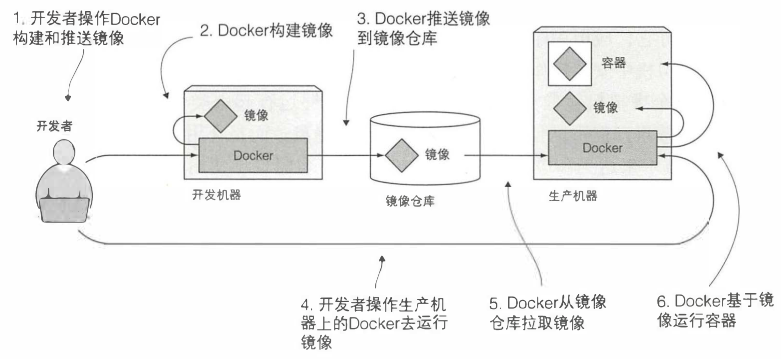
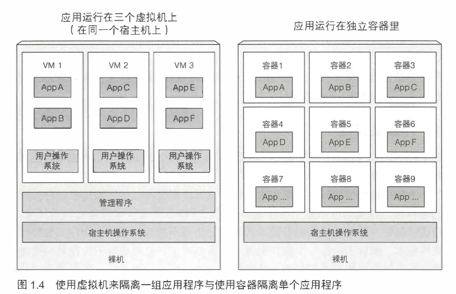
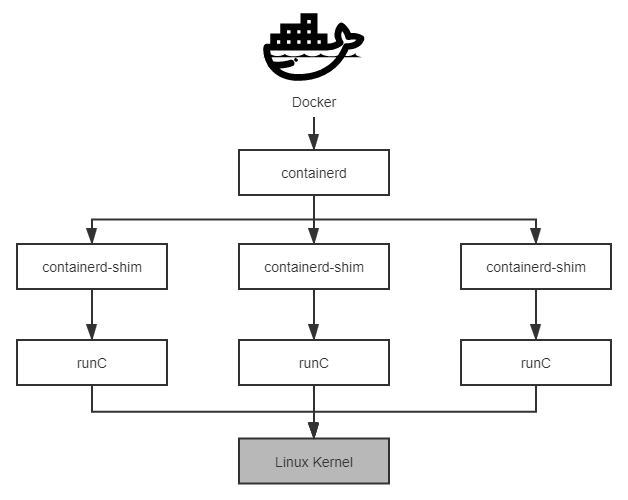

# Docker



## 容器 vs 虚拟机



> vm 的管理程序有两种类型，一种工作在宿主机操作系统上，另一种则直接工作在硬件上

> 容器复用宿主机操作系统的内核，本质上只是个进程，启动容器其实只是启动进程，速度自然比需要启动整个操作系统的 vm 快很多

> 从虚拟化技术来看，vm 属于硬件虚拟化，容器属于操作系统虚拟化

## 容器隔离机制

Linux 内核本身就提供了容器隔离机制 `namespaces` 和 `cgroups`，并且发布了名为 Linux 容器（LinuX Containers，LXC）的系统级虚拟化功能。

`namespaces` 可以隔离各类资源，主要由以下类型

- Mount: 隔离文件系统
- PID: 隔离进程编号
- Network: 隔离网络资源，如网卡、网络栈、IP 地址、端口，等等
- IPC： 隔离进程间通信的渠道
- UTS： 隔离主机的 Hostname、Domain names
- User: 隔离用户和用户组

`cgroups` 可以限制容器可使用的资源容量，可限制的资源主要如下：

- CPU
- 内存
- 网络带宽
- 其他

## Docker 的崛起

虽然 Linux 提供了 LXC 容器，但是它把容器定义为一种封装系统的轻量级虚拟机。

而 Docker 眼中的容器的定义则是一种封装应用的技术手段。

Docker 封装应用而非封装机器的理念贯穿了它的设计、API、界面、文档等多个方面，这让 Docker 赢得了容器战争的胜利

> Docker = LXC + AUFS + Dockerfile 格式规范

Docker 相对于 LXC 的价值在于

- `跨机器的绿色部署`： Docker 定义了一种将应用及其所有的环境依赖都打包到一起的格式， 而 LXC 并没有提供这样的能力
- `以应用为中心的封装`: 理念的差距
- `自动构建`: Docker 提供了开发人员从在容器中构建产品的全部支持
- `多版本支持`: Docker 支持像 Git 一样管理容器的连续版本，进行检查版本间差异、提交或者回滚等操作
- `组件重用`：Docker 允许将任何现有容器作为基础镜像来使用，以此构建出更加专业的镜像。
- `共享`：Docker 拥有公共的镜像仓库，成千上万的 Docker 用户在上面上传了自己的镜像，同时也使用他人上传的镜像。
- `工具生态`：Docker 开放了一套可自动化和自行扩展的接口，在此之上，还有很多工具来扩展其功能，譬如容器编排、管理界面、持续集成等等。

## Docker 架构



`runC` 是 Docker 主导的 `OCI(Open Container Initiative)` 规范中容器运行时 `OCI Runtime` 的首个是实现，这是一个越过 LXC 直接操作namespaces 和 cgroups 的核心模块

`containerd` 负责管理容器执行、分发、监控、网络、构建、日志等功能，内部会为每个容器运行时创建一个 `containerd-shim` 适配进程，默认与 `runC` 搭配工作

`containerd-shim` 负责采集容器日志和容器监控信息

## Docker Registry 镜像站

```json
{
  "registry-mirrors": [
    "https://9cpn8tt6.mirror.aliyuncs.com"
  ]
}
```

## References

- [容器的演进](http://icyfenix.cn/immutable-infrastructure/container/)