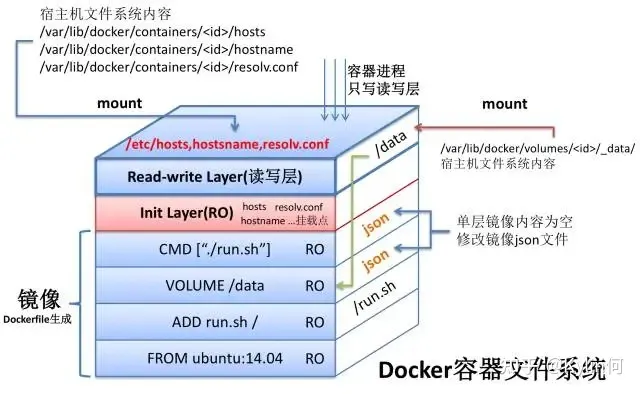
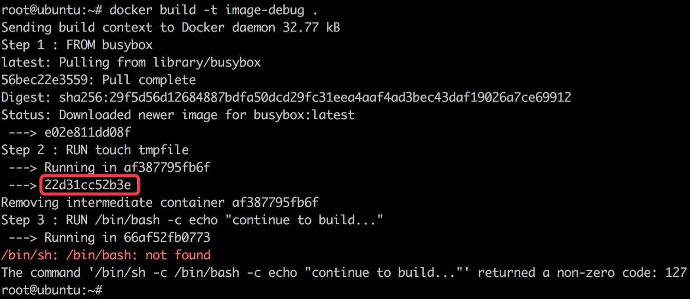
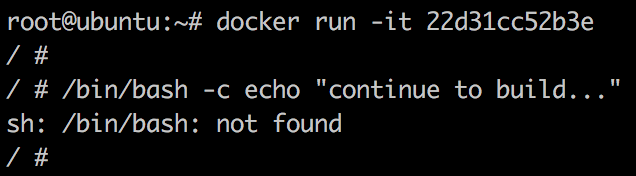

# Docker 镜像构建

两种构建方式：

- `docker commit`
- Dockerfile + `docker build`

> 强烈推荐使用 Dockerfile

## Docker 构建流程理解

Dockerfile 由一系列指令和参数组成。每条指令都是大写字母。Dockerfile中的指令会按顺序从上到下执行，所以应该根据需要合理安排指令的顺序。

!> 每条指令都会创建一个新的镜像层并对镜像进行提交

大体流程:

- Docker 从基础镜像运行一个容器
- 执行一条指令，对容器做出修改
- 执行类似 docker commit 的操作，提交一个新的镜像层
- Docker 再基于刚提交的镜像运行一个新容器
- 执行 Dockerfile 中下一条指令，直到所有指令都执行完毕

## 联合挂载技术

联合挂载技术是一种特殊的文件系统挂载方式，它可以在一个挂载点同时挂载多个文件系统。

联合挂载技术会将挂载点的原目录与被挂载内容进行整合，最终可见的文件系统将会包含整合之后的各层的文件和目录。

实现这种联合挂载技术的文件系统通常被称为联合文件系统（union filesystem），常见的有 UnionFS、aufs 和 OverlayFS 等

Docker 通过联合挂载技术将各层文件系统叠加在一起，最终形成包含了所有底层文件与目录的文件系统，成为 Docker 镜像。镜像按照一定的层次结构叠加而成，一个新的镜像可以基于另一个镜像构建

Docker 容器的文件系统：



Docker 在启动容器时，先挂载镜像的文件系统（只读），然后再其上再挂载两层，这两层分别为 Docker 容器的初始层（Init Layer）与可读写层（Read-Write Layer）。

初始层中大多是初始化容器环境时，与容器相关的环境信息，如容器主机名，主机 hosts 信息以及域名服务文件等。

可读写层开始时没有任何文件和数据，在 Docker 容器运行过程中文件系统发生了变化，会把变化的文件内容写到可读写层，并隐藏只读层的老版本文件，这样的技术称为**写时复制**

!> `docker commit` 可以理解为就是把可读写层创建一个新的镜像

!> 容器启动后，联合文件系统挂载在 `/var/lib/docker/aufs/mnt/<container_id>/` 路径下

## Docker build Context

`Docker client` 在运行 `build` 命令时，会把指定的 `context`（文件或者目录）压缩上传给 `Docker daemon` 进行后续镜像的构建.

```bash
# context 是当前目录
docker build -t newImage:1.0

# 指定某个路径为 context
docker build -t newImage:1.0 /opt/myprogram

# 从 stdin 中读入 Dockerfile，没有 context
docker build - < Dockerfile

# 从 stdin 中读入压缩的 context
docker build - < context.tar.gz
```

> 如果想从 context 中剔除某些文件，可以将这些文件记录到当前目录的 `.dockerignore` 文件中

> Dockerfile 中的指令操作的本地文件要放到 context 中，这样才会上传到 `Docker daemon`，后续的构建才能正常进行

## 镜像内有啥，存哪？

Docker 镜像内容由**镜像层文件内容**和**镜像 json 文件**组成，不论静态内容还是动态信息，Docker 均为将其在 json 文件中更新。

Docker 每一层镜像的 json 文件，都扮演着一个非常重要的角色，其主要的作用如下：

- 记录 Docker 镜像中与容器动态信息相关的内容
- 记录父子 Docker 镜像之间真实的差异关系
- 弥补 Docker 镜像内容的完整性与动态内容的缺失

Docker 镜像的 json 文件可以认为是镜像的元数据信息

我们可以通过命令 `docker history` 命令查看镜像层

> 可以通过这个命令分析镜像的 Dockerfile

Docker 镜像层的内容一般在 Docker 根目录的 aufs 路径下，为 `/var/lib/docker/aufs/diff/`

对于每个镜像层，Docker 都会保持一份相应的 json 文件，json 文件的存储路径为 `/var/lib/docker/graph`

## 镜像构建缓存

为了提高镜像构建的速度，Docker daemon 会缓存构建过程中的中间镜像。

当从一个已在缓存中的基础镜像开始构建新镜像时，会将 Dockerfile 中的下一条指令和基础镜像的所有子镜像做比较，如果有一个子镜像是由相同的指令生成的，则命中缓存，直接使用该镜像，不用在生成一个新的镜像。

在寻找缓存的过程中，`COPY` 和 `ADD` 指令稍有不同，除了对比指令字符串，还要对比容器内的文件内容和 `ADD`、`COPY` 所添加文件内容是否相同。

此外，镜像构建过程中，一旦缓存失效，则后续的指令都将生成新的镜像，而不再使用缓存。

## FAQ

### Dockerfile 调试

从 `docker build` 的输出信息中获取失败的上一步镜像



利用上一步镜像创建容器，在容器中运行失败的命令进行调试



## References

- [Docker 镜像内有啥，存哪？](https://guide.daocloud.io/dcs/docker-9153982.html)