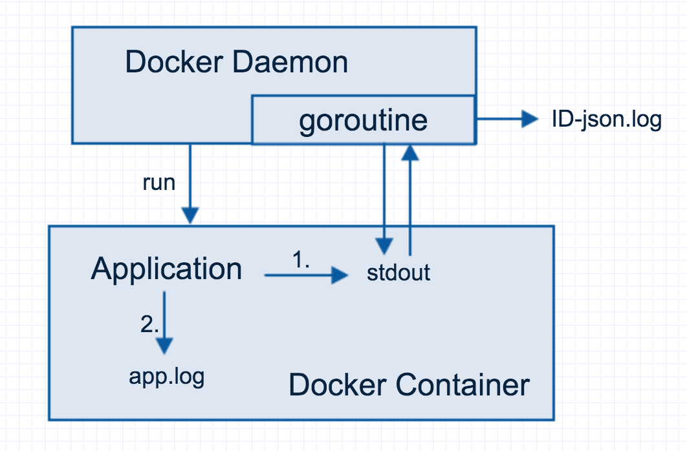

# Docker 容器日志

## Docker 容器应用如何产生日志？

大家可以试想一下，如果没有 Docker，您的应用如何打印日志？普遍情况有以下两种：

1. 向标准输出（stdout）中打印日志；
2. 设置日志文件 app.log （或其它文件名），向此文件中打印日志。

Docker 从诞生伊始，就从未对用户应用做出标准性规范，日志也不例外，从未有过限制。既然如此，Docker 容器应用的日志也不外乎以上两种。

第二种很好理解，依然往容器中某个日志文件打印；然而第一种，应用通过标准输出（stdout）的方式打印日志，该如何呈现给用户？

## Docker 容器应用的日志实现

对于日志文件，Docker 不可能也不应该深入应用内部逻辑，截获并接管日志文件内容，这只会破坏 Docker 的通用性。但是对于 Docker 容器内应用的标准输出，Docker 则是做了工作的。具体实现，可以参考下图：



假设 application 是 Docker 容器内部运行的应用，那么对于应用的第一部分标准输出（stdout）日志，Docker Daemon 在运行这个容器时就会创建一个协程（goroutine），负责标准输出日志。

由于此 goroutine 绑定了整个容器内所有进程的标准输出文件描述符，因此容器内应用的所有标准输出日志，都会被 goroutine 接收。goroutine 接收到容器的标准输出内容时，立即将这部分内容，写入与此容器一一对应的日志文件中，日志文件位于 `/var/lib/docker/containers/<container_id>`，文件名为 `<container_id>-json.log`。

至此，关于容器内应用的所有标准输出日志信息，已经全部被 Docker Daemon 接管，并重定向到与容器一一对应的日志文件中。

## 用户如何查看容器日志

日志总是需要被用户查看的，Docker 则通过 `docker logs`  命令向用户提供日志接口。docker logs  实现原理的本质均基于与容器一一对应的 <container-id>-json.log 

也可以做两个实验检验以上内容：

Experiement 1：通过 Docker 运行一个应用，日志会从标准输出打印日志，然后通过 `docker logs` 查看日志。

Experiement 2：运行一个 Docker 容器，随后 `docker exec` 命令进入这个容器，接着通过 echo、cat 等命令向容器的标准输出中打印内容，最后通过 `docker logs` 查看日志。

实验是检验真理的唯一标准。您会发现，Experiement 1 中，查看日志会有日志；而 Experiement 2 中却找不到 echo、cat 等命令标准输出的日志内容。

Experiement 2 做完，瞬间毁三观，难道以上内容有差错？可以明确告诉您没有，那矛盾如何会存在？

!> `docker logs` 重定向的是容器主进程及其子进程的 `stdout` `stderr`, 但是 `docker exec` 所起的进程并不属于容器主进程的子进程，而是平行进程，只是属于同一 cgroups

## 获取容器内持久化日志

目标：通过标准输出，传递 Docker 容器内部的应用持久化日志文件。

方法：简单重构应用 Dockerfile  的 CMD 指令。

问题假设：原先应用 Dockerfile  的 CMD 指令为 `CMD ["python", "app.py"]` ，应用打印日志的路径为 `/var/log/app.log` 。

具体实现：

第一步：

原先 Dockerfile  所在目录下，创建一个 run.sh  文件，文件内容为：

```bash
#!/bin/bash
tail -F /var/log/app.log &
exec python app.py 
```

第二步：
修改 Dockerfile ，删除原先的 CMD，替换为三个指令。

```docker
ADD run.sh / 
RUN chmod +x run.sh 
CMD ["./run.sh"] 
```

原理剖析：

run.sh  中启动了一个后台进程，使用 tail 命令强制将 /var/log/app.log 的内容传输至标准输出，随后使用 exec 命令将 python app.py  作为容器的主进程运行。

## References

- [docker logs 实现剖析](http://guide.daocloud.io/dcs/docker-logs-9153967.html)
- [docker exec 与容器日志](http://guide.daocloud.io/dcs/docker-exec-9153970.html)
- [Docker 容器日志的那些事儿](http://guide.daocloud.io/dcs/docker-9153973.html)
- [官方文档](https://docs.docker.com/config/containers/logging/)