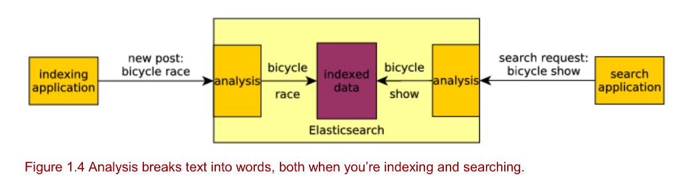
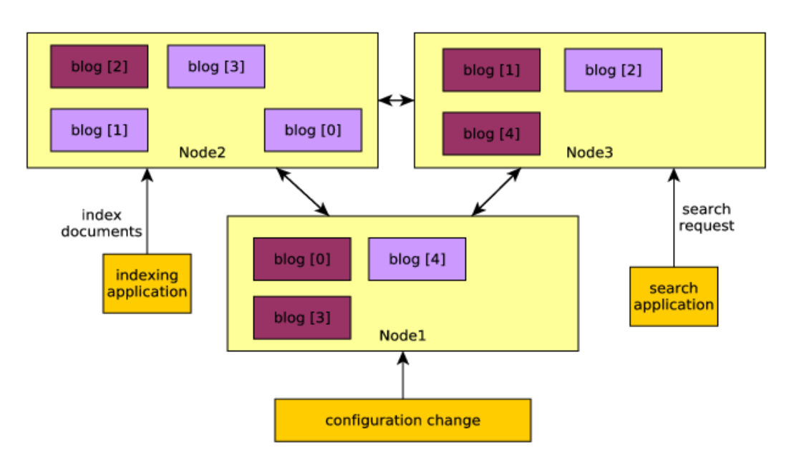
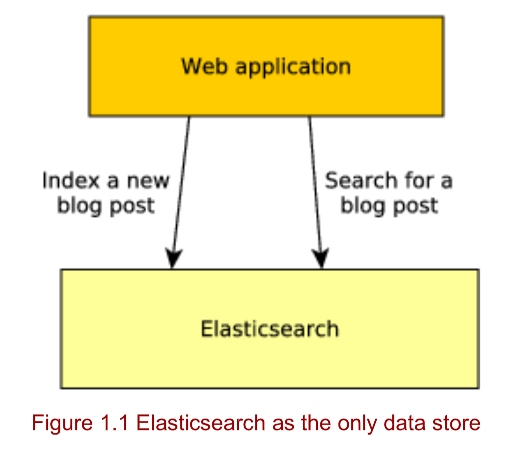
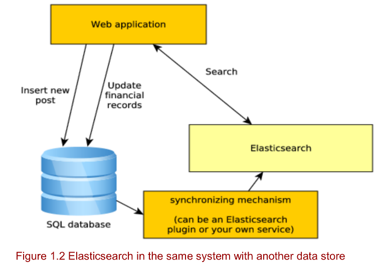
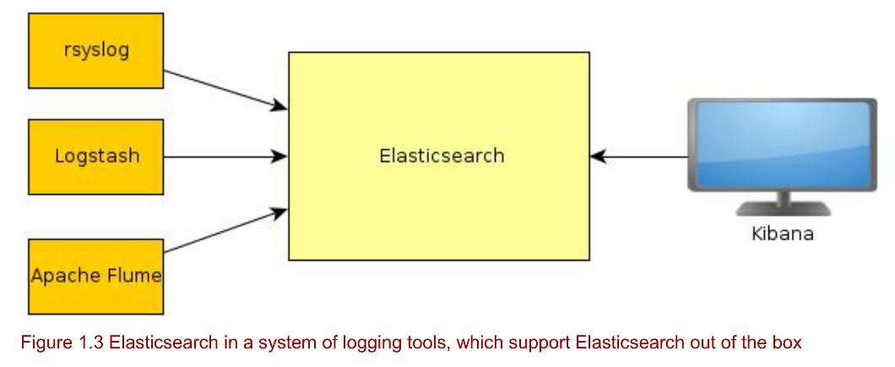

# Elastic Search

## vs Lucene

Elastic Search 基于 Apache Lucene 构建，其主要买点有

- Robust caching
- 提供了 HTTP API。Lucene 本质上是个 Java 库，并不能被其它语言直接使用，ES 提供的 HTTP API 可以给任意语言使用
- Backward-compatibility

> ES 是中间件，很多集群相关的事情都内置处理好了；而 Lucene 只是个库，如果要基于 Lucene 构建搜索能力，还要做大量的工作

## 核心原理

- 分词
- 倒排索引

- 分片(sharding) -- 性能
- 副本(replicas) -- 并发度 + 高可用

## 三种架构模式

1. 

2. 

3. 

## 逻辑布局和物理布局

## 核心概念

### Index

### Mapping Types

[字段类型文档](https://www.elastic.co/guide/en/elasticsearch/reference/8.1/mapping-types.html)

### Document

相关命令

#### Index API

- `PUT /<target>/_doc/<_id>` : 指定 _id 创建 document，如果已存在，则部分更新

- `POST /<target>/_doc/`： 创建 document

- `PUT /<target>/_create/<_id>`: 创建 document， data stream 场景

- `POST /<target>/_create/<_id>`：创建 document，data_stream 场景

> 区别：PUT 是幂等的，POST 是非幂等的

#### Update API

[文档](https://www.elastic.co/guide/en/elasticsearch/reference/8.1/docs-update.html#_detect_noop_updates)
[Script 文档](https://www.elastic.co/guide/en/elasticsearch/reference/7.17/modules-scripting.html)

ES Scripting 演进历史

| 版本 | 使用脚本 |
|: -- :|: -- :|
| < Elasticsearch 1.4 | mvel 脚本 |
| < Elasticsearch 5.0 | Groovy 脚本 |
| >= Elasticsearch 5.0 | painless 脚本 |

`POST /<index>/_update/<_id>`

### Shard

### Replica

## 查询

> `term` 就是不对查询关键字进行分词等处理

## 性能优化

## References

- [通过容器运行ELK](https://elk-docker.readthedocs.io/)
- [ElasticSearch 7.0.0 移除 mapping types](https://www.elastic.co/guide/en/elasticsearch/reference/7.17/removal-of-types.html)
- [ES Index API](https://www.elastic.co/guide/en/elasticsearch/reference/8.1/docs-index_.html)
- [ES Search API](https://www.elastic.co/guide/en/elasticsearch/reference/8.1/search-search.html)
- [Docker 设置 vm.max_map_count 以运行 ES 5 以上版本](https://www.elastic.co/guide/en/elasticsearch/reference/current/docker.html#docker-prod-prerequisites)