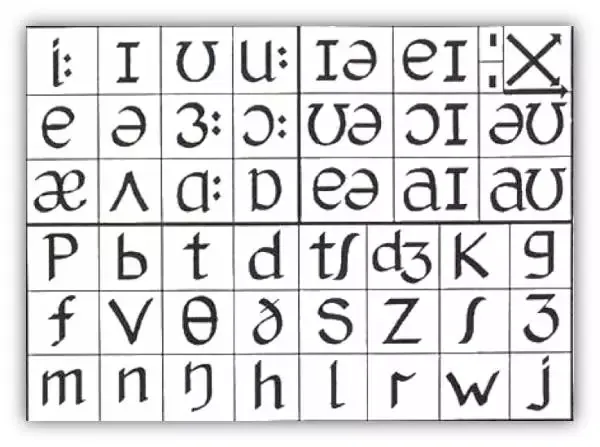
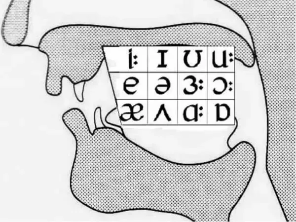
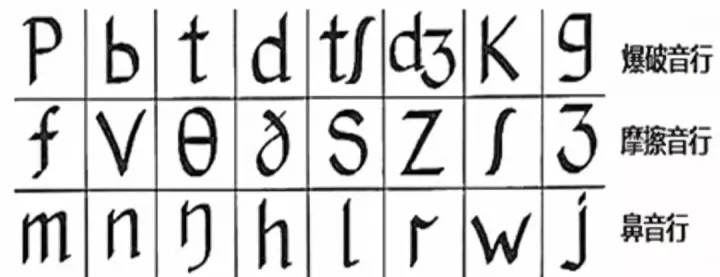

# English

## Underhill 音标表

表中所有音标排列的位置，都是根据发音时口型的位置和变化程度顺序排列的。表中的单元音、双元音和辅音三个音标区域中，每个区域内横排音标从左到右是舌头位置逐渐向口腔后部移动，纵排音标从上至下是口型逐渐增大。如下图单元音和辅音的图解所示：

[元音读法](https://www.bilibili.com/video/BV1e7411h7Zn/)

## References

- [找对英语学习方法的第一本书](https://book.douban.com/subject/11522125/)
- [英语词汇的奥秘](https://book.douban.com/subject/24382812/)
- [薄冰英语语法](https://oldwestenglish.github.io/grammar/#/)