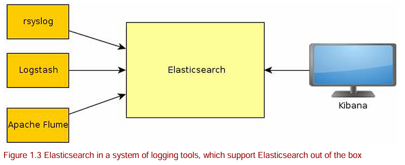

# Elasticsearch in Action

## Introducing Elasticsearch

### Elasticsearch as a search engine

#### Providing quick searches

Elasticsearch 使用 Lucene （一个高性能搜索引擎库）来索引数据。

Lucene 通过倒排索引来索引数据

#### Ensuring relevant results

Elasticsearch 会计算文档的相关度分数，然后根据分数排序返回文档列表

默认使用 TF-IDF（term frequency-inverse document frequency） 算法来计算文档的相关度。

- Term frequency：这个词在这个文档中出现的次数，越高，相关度分数越高
- Inverse document frequency：这个词在其他文档出现越少，相关度分数越高

#### Searching beyond exact matches

- Handling typos： 处理打字错误，可以使用 fuzzy queries 来实现，可以容忍一定编辑距离的打字错误。
- Supporting derivatives：支持衍生词，比如 bicyle 可以匹配到 bicyclist 和 cycling
- Using Statistics: 可以通过 aggregations 做数据分析
- providing suggestion: 使用 前缀、通配符，正则表达式等查询方式支持提供搜索建议。

### Typical setups using Elasticsearch

#### One-stop shop for storing, searching, and statistics


#### Plugin search in a complex system 


#### Use it with existing tools 



### Data structure and interaction

#### Understanding indexing and search functionality 

Elasticsearch 基于 Lucene 构建，额外提供以下能力：

- Robust caching
- HTTP API
- Backward-compatibility

#### Analysis

The default analyzer first breaks text into words by looking for common word separators, such as a space or a comma. Then, it lowercases those words.


#### Structuring your data in Elasticsearch

Unlike a relational database, which stores data in records or rows, Elasticsearch stores data in 
documents.

The difference is that a document is more flexible than a record mainly because, in 
Elasticsearch at least, a document can be hierarchical.

ES 中的 Index 类似于关系数据库中的 table；Document 类似于关系数据库中的 row。

> 老版本 ES 中类似于 table 的是 mapping type，而 index 类似于 database，但是新版本已经去掉 mapping type，因为 mapping type 本质上没有隔离性，同一个 index 的不同 mapping type 的同名字段只能是相同类型，并不同于 table 的概念，有致命缺陷，故已经删除 mapping type 的概念了，index 降级对标 table

### Performance and scaling

#### SCALING, SHARDING, AND PERFORMANCE

A cluster is made up of one or more nodes, where each node is an Elasticsearch process that 
typically runs on a separate server. Elasticsearch is clustered by default。

Elasticsearch divides every index into multiple chunks called shards. By default, each index has five shards. 

Each node can receive all kinds of requests、


Shards can be moved around, allowing you to expand or shrink your cluster at any time.

To increase availability, you can create one or more copies (called replicas) for each of your initial shards (called primaries).Primaries differ from replicas in that they’re the first to receive new documents. Other than that, they’re the same


### Downloading and starting Elasticsearch

[Docker 安装 ElasticSearch](https://www.elastic.co/guide/en/elasticsearch/reference/current/docker.html#_configure_and_start_the_cluster)

## Diving into the functionality

逻辑布局和物理布局


### 逻辑布局：Index and Document

Document 是自包含和层次结构的
Document 是 schema-free 的，可以没有预定义的schema，但和其它文档数据库不同的是，es 的 document 是有schema的，只是这个schema会自动生成，但是自动生成的 schema 可能不是想要的，所以也支持预定义 schema。

Elasticsearch index vs. Lucene index ：An Elasticsearch index is broken down into chunks: shards. A shard is a Lucene index.

Index 的关键配置：refresh_interval(indexd 数据多久可被search)、shard 的数量

### 物理布局：nodes and shards

By default, each index is made up of five primary shards, each with one replica, for a 
total of ten shards.

a shard is a directory of files where Lucene stores the data for your index. A shard is also the 
smallest unit that Elasticsearch moves from node to node. 

A node is an instance of Elasticsearch. Multiple nodes can join the same cluster. With a cluster of multiple nodes, the same data 
can be spread across multiple servers. 

WHAT HAPPENS WHEN YOU INDEX A DOCUMENT?


You can change the number of replicas per shard at any time because replicas can always be created or removed. But you have to decide on the number of shards before creating the index. 

search 在 shards 和 replicas 中请求的过程：


### 索引新数据

[ES Index API](https://www.elastic.co/guide/en/elasticsearch/reference/8.1/docs-index_.html)

- `PUT /<index_name>/_doc/<_id>` : 指定 _id 创建 document，如果已存在，则部分更新

- `POST /<index_name>/_doc/`： 创建 document

> PUT 是幂等的，POST 是非幂等的

使用 curl 创建 document

```bash
curl -XPUT 'localhost:9200/get-together/_doc/1?pretty' -d '{ 
"name": "Elasticsearch Denver", 
"organizer": "Lee" 
}'
```

创建 document 时会自动创建 index，当然也可以手动创建 index

```bash
curl -XPUT 'localhost:9200/get-together?pretty' 
```

查看自动生成的 mapping

```bash
curl localhost:9200/get-together/_mapping?pretty
```

```json
{
  "get-together": {
    "mappings": {
      "properties": {
        "name": {
          "type": "text",
          "fields": {
            "keyword": {
              "type": "keyword",
              "ignore_above": 256
            }
          }
        },
        "organizer": {
          "type": "text",
          "fields": {
            "keyword": {
              "type": "keyword",
              "ignore_above": 256
            }
          }
        }
      }
    }
  }
}
```

### 查询数据

[Search API](https://www.elastic.co/guide/en/elasticsearch/reference/8.1/search-search.html)

```bash
curl "https://localhost:9200/get-together/_search?q=Elasticsearch&pretty"
```

```json
{
  "took" : 7,  // 耗时ms
  "timed_out" : false, // 是否超时
  "_shards" : { // 访问了几个分片
    "total" : 1,
    "successful" : 1,
    "skipped" : 0,
    "failed" : 0
  },
  "hits" : {  
    "total" : { // 命中了几个文档，默认限制10个，可以通过 size 查询参数修改
      "value" : 1,
      "relation" : "eq"
    },
    "max_score" : 0.2876821,
    "hits" : [  // 命中的文档列表
      {
        "_index" : "get-together",
        "_id" : "1",
        "_score" : 0.2876821,
        "_source" : {      // 如果没有指定 fileds，那么就显示 _source
          "name" : "Elasticsearch Denver",
          "organizer" : "Lee"
        }
      }
    ]
  }
}
```

通过强大的 query_string dsl 语法来查询

[query_string 语法](https://www.elastic.co/guide/en/elasticsearch/reference/8.1/query-dsl-query-string-query.html)

```bash
curl -H "Content-Type:application/json" "https://localhost:9200/get-together/_search?pretty" -d '
{ "query": { "query_string": {"query": "name:elasticsearch AND name:san AND name:francisco""}}} '
```
query_string dsl 语法继承于 Lucene.

获取单个文档

```bash
curl 'localhost:9200/get-together/_doc_/1?pretty' 
```

一个文档 index 后需要经过刷新时间后才能被搜索，如果也可以手动刷新

```bash
curl -XPOST 'localhost:9200/get-together/_refresh?pretty'
```

### Elasticsearch 配置

#### Specifying a cluster name in elasticsearch.yml 

[官方文档](https://www.elastic.co/guide/en/elasticsearch/reference/8.1/important-settings.html#cluster-name)

位置：`config/`(压缩包解压)、`/etc/elasticsearch/`(包管理器安装)


> This is the main configuration file where Elasticsearch-specific options go.

By default, new nodes discover existing clusters via multicast—by sending a ping to all hosts listening on a specific multicast address. If a cluster is discovered, the new node joins it only if it has the same cluster name. 

#### Specifying verbose logging via logging.yml

> The logging configuration file is for logging options of log4j, the library that Elasticsearch uses for logging

[官方文档](https://www.elastic.co/guide/en/elasticsearch/reference/8.1/logging.html)

位置：`logs/`(压缩包解压)、`/var/log/elasticsearch/`(包管理器安装)

Elasticsearch log entries are organized in three types of files: 
- Main log (cluster-name.log)— Here you can find general information about what happens when Elasticsearch is running, for example, whether a query failed or a new node joined the cluster. 
- Slow-search log (cluster-name_index_search_slowlog.log)— This is where Elasticsearch logs when a query runs too slow. By default, if a query takes more than half a second, it logs an entry here. 
- Index-slow log (cluster-name_index_indexing_slowlog.log)—This is similar to the slow search log, but, by default, it writes an entry if an indexing operation takes more than half a second. 

#### Adjusting JVM settings 

[官方文档](https://www.elastic.co/guide/en/elasticsearch/reference/8.1/advanced-configuration.html#set-jvm-heap-size)

How much memory to allocate in production?

Start with half of your total RAM as ES_HEAP_SIZE, if you run Elasticsearch only on that server. Try with less if other applications need significant memory. The other half is used by the operating system for caches, which make for faster access to your stored data. 

## Indexing, updating, and deleting data 

### Using mappings to define kinds of documents 

[官方文档](https://www.elastic.co/guide/en/elasticsearch/reference/8.1/mapping.html)

[ElasticSearch 7.0.0 移除 mapping types](https://www.elastic.co/guide/en/elasticsearch/reference/7.17/removal-of-types.html)

The mapping includes all the fields that might appear in documents from that type and tells Elasticsearch how to index the fields 
in a document. 

```
# 查看 mapping
curl localhost:9200/get-together/_mapping?pretty

# 显示声明 mapping
PUT /my-index-000001
{
  "mappings": {
    "properties": {
      "age":    { "type": "integer" },  
      "email":  { "type": "keyword"  }, 
      "name":   { "type": "text"  }     
    }
  }
}
```

When you put a mapping over an existing one, Elasticsearch merges the two. Unfortunately, not all merges work. For example, you can’t change an existing field’s data type, and, in general, you can’t change the way a field is indexed. The only way is to reindex all the data in new-events.

### Core types for defining your own fields in documents 

[官方文档](Core types for defining your own fields in documents )


#### Multi-fields 

If arrays are all about indexing more data with the same settings, multi-fields are about indexing the same data multiple times using different settings. 

[官方文档](https://www.elastic.co/guide/en/elasticsearch/reference/8.1/multi-fields.html)

### Using predefined fields

[官方文档](https://www.elastic.co/guide/en/elasticsearch/reference/8.1/mapping-fields.html)

[_ttl被移除](https://www.elastic.co/guide/en/elasticsearch/reference/8.1/mapping-ttl-field.html)

We’ll divide the predefined fields in the following categories: 
- Control how to store and search your documents— `_source` lets you store the original JSON document as you index it. `_all` indexes all your fields together. 
- Identify your documents—These are special fields containing data about where your document was indexed: `_uid`, `_id`, `_type`, `_index`. 
- Add new properties to your documents—You can index the size of the original JSON with _size. Similarly, you can index the time it was indexed with `_timestamp` and 
make Elasticsearch delete it after a specified amount of time with `_ttl`. 
- Control the shard where your documents are routed to—These are `_routing` and `_parent`. We’ll look at them in chapter 8, where we talk about relationships among documents. 

If you disable _source, you don’t get the original document in the reply. This is typically done when you have a separate data store for your original content. 

```
# 关闭 _source 
PUT my-index-000001
{
  "mappings": {
    "_source": {
      "enabled": false
    }
  }
}
```

Just like _source is storing everything, _all is indexing everything. When you search in _all, Elasticsearch will return a hit regardless of which field matches. This is useful when users are looking for something without knowing where to look for.

### Updating existing documents

when Elasticsearch updates an existing document, it retrieves it and applies changes according to your specifications. It then indexes the resulting document again and deletes the old one. 

[官方文档](https://www.elastic.co/guide/en/elasticsearch/reference/8.1/docs-update.html)

部分更新

```
# 更新 name 字段
POST test/_update/1
{
  "doc": {
    "name": "new_name"
  }
}
```

upsert

```
# doc 模式
POST test/_update/1
{
  "doc": {
    "name": "new_name"
  },
  "doc_as_upsert": true
}

# doc 模式，定制 insert
POST test/_update/1
{
  "doc": {
    "name": "new_name"
  },
  "upsert": {
    "name": "insert name",
    "count": 0
  }
}

# 脚本模式
POST test/_update/1
{
  "script": {
    "source": "ctx._source.counter += params.count",
    "lang": "painless",
    "params": {
      "count": 4
    }
  },
  "upsert": {
    "counter": 1
  }
}
# 脚本模式，同时处理 create 和 update 场景
POST test/_update/1
{
  "scripted_upsert": true,
  "script": {
    "source": """
      if ( ctx.op == 'create' ) {
        ctx._source.counter = params.count
      } else {
        ctx._source.counter += params.count
      }
    """,
    "params": {
      "count": 4
    }
  },
  "upsert": {}
}
```

If you need variables, it’s recommended to define them separately from the script itself under params. That’s because scripts need to be compiled, and once they’re compiled, they get cached.

#### 通过版本实现并发控制

每个文档会有个版本字段，每次更新会增加版本号，如果后台发现更新的版本号小于等于已有版本号，证明该文档已被并发更新，这次更新会直接失败


可以在更新时使用参数 `retry_on_conflict=n` 指定允许冲突的次数

除了 update API，使用 index 文档 API 更新文档时也可以通过指定当前版本来实现并发控制

```
PUT test/_doc/1?version=1
{

    "name": "insert name",
    "count": 0
}
```

### 删除数据

删除单个文档或文档组时，Elasticsearch 只将它们标记为要删除，因此它们不会出现在搜索中，而真正的删除是后台线程处理的。

删除整个 Index 时，主要工作是删除与该索引关联的所有文件，这几乎是立即发生的。

关闭 Index，一个封闭的index 不允许读取或写入操作，并且其数据不会加载到内存中。它类似于从 Elasticsearch 中删除数据，但它保留在磁盘上，并且很容易恢复;打开已关闭的索引。

#### 删除文档

[删除文档官方文档](https://www.elastic.co/guide/en/elasticsearch/reference/8.1/docs-delete.html)

[删除索引官方文档](https://www.elastic.co/guide/en/elasticsearch/reference/8.1/indices-delete-index.html)

[关闭索引官方文档](https://www.elastic.co/guide/en/elasticsearch/reference/8.1/indices-close.html)

```
# 根据ID删除单个文档
DELETE /my-index-000001/_doc/1
# 根据 query 删除多个文档
POST /my-index-000001/_delete_by_query
{
  "query": {
    "match": {
      "user.id": "elkbee"
    }
  }
}

# 删除整个 Index
DELETE /my-index-000001

# 关闭索引
POST /my-index-000001/_close
```

## Search your data

what happens when you perform a search in Elasticsearch. The REST API search request is first sent to the node you choose to connect to, which, in turn, sends the search request to all shards (either primary or replica) for the index or indices being queried. When enough information has been collected from all shards to sort and rank results, only the shards containing the document content that will be returned are asked to return the relevant content.

[Search API 官方文档](https://www.elastic.co/guide/en/elasticsearch/reference/8.1/search-search.html)

大部分参数即可通过 Query Parameter 指定，也可以通过 Request Body 指定

分页查询

```
GET /my-index-000001/_search?from=40&size=20
{
  "query": {
    "term": {
      "user.id": "kimchy"
    }
  }
}
```

指定返回的字段

```
GET /my-index-000001/_search
{
  "query": {
    "term": {
      "user.id": "kimchy"
    }
  },
  "fields": ["name", "description"]
}
```

排序。默认按 `_score` 倒序

```
GET /my-index-000001/_search?sort=created_on:asc,name:desc,_score
{
  "query": {
    "term": {
      "user.id": "kimchy"
    }
  }
}
```

Response 结构

```json
{
  "took": 5,        // Time the request took, in milliseconds
  "timed_out": false,
  "_shards": {      // The number of shards that responded to this request, successfully or unsuccessfully
    "total": 1,
    "successful": 1,
    "skipped": 0,
    "failed": 0
  },
  "hits": {       // 
    "total": {
      "value": 20,                    // Total number of matching results for the search
      "relation": "eq"
    },
    "max_score": 1.3862942,           // Maximum score of all documents for this search
    "hits": [                         // The response contains a hits key that contains a hits array
      {
        "_index": "my-index-000001",  //  Index of the result document
        "_id": "0",                   // The ID of the result document
        "_score": 1.3862942,          // Relevancy score for this result
        "_source": {                  // Source of the document is returned if _source is stored and specified in the fields parameter
          "@timestamp": "2099-11-15T14:12:12",
          "http": {
            "request": {
              "method": "get"
            },
            "response": {
              "status_code": 200,
              "bytes": 1070000
            },
            "version": "1.1"
          },
          "source": {
            "ip": "127.0.0.1"
          },
          "message": "GET /search HTTP/1.1 200 1070000",
          "user": {
            "id": "kimchy"
          }
        }
      },
      // ...
    ]
  }
}
```

### Working with filters


[Query and filter context](https://www.elastic.co/guide/en/elasticsearch/reference/8.1/query-filter-context.html)


filters allow Elasticsearch to generate a bitset for the documents that match, which can be then cached. Some of these bitsets are automatically cached for you by default, when specific filters are used. Other types of filters aren’t automatically cached. 

FILTERS CACHED BY DEFAULT: term, terms, prefix, and range

FILTERS NOT CACHED BY DEFAULT:
- any of the geo filters
- the numeric_range filter
- filters that use custom scripts

To manually specify a filter that should be cached, set the `_cache` option to true when sending the filter

### Working with match and filter queries

[Query DSL](https://www.elastic.co/guide/en/elasticsearch/reference/8.1/query-dsl.html)

Elasticsearch has queries ranging from the more basic, such as the `term` and `prefix` queries, to the more complex, such as the `query_string` and `match_phrase` queries.Elasticsearch also allows you to combine an arbitrary number of queries using the `bool` query
by itself as well as with the `and`, `or`, and `not` filters. And most (although not all!) queries also have a filter equivalent. 

#### Match_all query

[官方文档](https://www.elastic.co/guide/en/elasticsearch/reference/8.1/query-dsl-match-all-query.html)

The most simple query, which matches all documents, giving them all a _score of 1.0.

```
GET /_search
{
    "query": {
        "match_all": {}
    }
}
```

#### Query_string query

[官方文档](https://www.elastic.co/guide/en/elasticsearch/reference/8.1/query-dsl-query-string-query.html)

[query_string syntax](https://www.elastic.co/guide/en/elasticsearch/reference/8.1/query-dsl-query-string-query.html#query-string-syntax)

[lucene query syntax](https://www.lucenetutorial.com/lucene-query-syntax.html)

Returns documents based on a provided query string, using a parser with a strict syntax.

> Because it returns an error for any invalid syntax, we don’t recommend using the `query_string` query for search boxes. If you don’t need to support a query syntax, consider using the `match` query. If you need the features of a query syntax, use the `simple_query_string` query, which is less strict.

a `query_string` search can be performed either from the URL of the request or sent in a request body.

> search api 的请求参数 `q=xx` 就是 query_string

By default, a `query_string` query searches the `_all` field

`query_string` use the entire `Lucene query syntax`, which allows combining searching different terms with Boolean operators like `AND` and `OR`, as well as excluding documents from the results using the minus sign `-` operator. 

例子：

```
name:nosql AND -description:mongodb

(tags:search OR tags:lucene) AND created_on:[1999-01-01 TO 2001-01-01]
```

Although the query_string query is one of the most powerful queries available to you in Elasticsearch, it can sometimes be one of the **hardest to read and easily extend**. 

```
# 复杂的例子
name:search^2 AND (tags:lucene OR tags:"big data"~2) AND -description:analytics AND created_on:[2006-05-01 TO 2007-03-29]
```

Suggested replacements for the query_string query include the `term`, `terms`, `match`, or `multi_match` queries. all of which allow you to search for strings within a field or fields in a document.

#### Term query

[官方文档](https://www.elastic.co/guide/en/elasticsearch/reference/8.1/query-dsl-term-query.html)

Returns documents that contain an exact term in a provided field.

the term being searched for **isn’t analyzed**, it must match a term in the document exactly for the result to be found. 

**Avoid using the term query for text fields**. By default, Elasticsearch changes the values of text fields as part of analysis. This can make finding exact matches for text field values difficult. To search text field values, use the match query instead.

如果要用于 text 字段，至少手动改成小写。

#### Terms query

[官方文档](https://www.elastic.co/guide/en/elasticsearch/reference/8.1/query-dsl-terms-query.html)

Returns documents that contain one or more exact terms in a provided field. The terms query is the same as the term query, except you can search for multiple values.

#### Combining queries

[官方文档](https://www.elastic.co/guide/en/elasticsearch/reference/8.1/compound-queries.html)

##### Bool query

A query that matches documents matching boolean combinations of other queries. The bool query maps to Lucene BooleanQuery. 


- `must` 类似于 `query1 AND query2 AND query3`
- `must_not` 类似于 `NOT query1 AND NOT query2 AND NOT query3`
- `should` 类似于 `query1 OR query2 OR query3`

可以通过 `minimum_should_match` 参数指定 should 至少要匹配的个数

```
POST _search
{
  "query": {
    "bool" : {
      "must" : {
        "term" : { "user.id" : "kimchy" }
      },
      "filter": {
        "term" : { "tags" : "production" }
      },
      "must_not" : {
        "range" : {
          "age" : { "gte" : 10, "lte" : 20 }
        }
      },
      "should" : [
        { "term" : { "tags" : "env1" } },
        { "term" : { "tags" : "deployed" } }
      ],
      "minimum_should_match" : 1,
      "boost" : 1.0
    }
  }
}
```

bool filter

```
POST _search
{
  "query": {
    "filter": {
      "bool" : {
        "must" : {
          "term" : { "user.id" : "kimchy" }
        },
        "must_not" : {
          "range" : {
            "age" : { "gte" : 10, "lte" : 20 }
          }
        },
        "should" : [
          { "term" : { "tags" : "env1" } },
          { "term" : { "tags" : "deployed" } }
        ],
        "minimum_should_match" : 1,
        "boost" : 1.0
      }
    }
  }
}
```

#### Match and multi_match queries

##### Match query

[官方文档](https://www.elastic.co/guide/en/elasticsearch/reference/8.1/query-dsl-match-query.html)

Returns documents that match a provided text, number, date or boolean value. The provided text is `analyzed before matching`.

The match query is **the standard query for performing a full-text search**, including options for fuzzy matching.

The `match` and `multi_match` queries behave similarly to the `term` query, except that they analyze the field being passed in. 

Similar to the term query, the match query is a hash map, containing the field you’d like to search as well as the string you want to search for, which can be either a field, or the special _all field to search all fields at once. 

```
GET /_search
{
  "query": {
    "match": {
      "message": {
        "query": "this is a test"
      }
    }
  }
}
```

By default, the match query uses Boolean behavior and the `or` operator. 

```
GET /_search
{
  "query": {
    "match": {
      "message": {
        "query": "this is a test",
        "operator": "and"
      }
    }
  }
}
```

##### match_phrase query

短语查询在文档中搜索特定短语时很有用，其中一些每个单词的位置之间的回旋余地大小。这个回旋余地称为 `slop` ，它是一个数字表示短语中标记之间的距离。
假设你试图记住聚会小组的名称;你还记得它有“企业”和“伦敦”的字样在其中，但你不记得名字的其余部分。好吧，您可以搜索短语“enterprise london”，将 slop 设置为 2 或 3，而不是默认值 0，以查找包含这句话，而不必确切知道小组的标题：

```
{
  "query": {
    "match_phrase": {
      "message": "enterprise london",
      "slop": 1
    }
  },
  "fields": ["name", "description"]
}
```

##### match_phrase_prefix query

Returns documents that contain the words of a provided text, in the same order as provided. The last term of the provided text is treated as a prefix, matching any words that begin with that term.

```
GET /_search
{
  "query": {
    "match_phrase_prefix": {
      "message": {
        "query": "quick brown f"
      }
    }
  }
}
```

##### multi_match query 

The `multi_match` query builds on the `match` query to allow multi-field queries:

```
GET /_search
{
  "query": {
    "multi_match" : {
      "query":    "this is a test", 
      "fields": [ "subject", "message" ] 
    }
  }
}
```