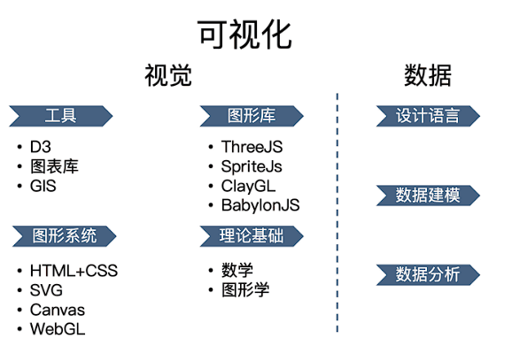
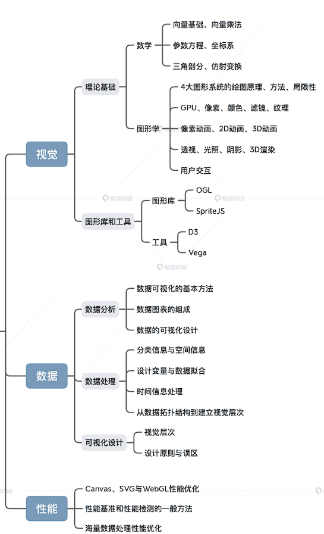
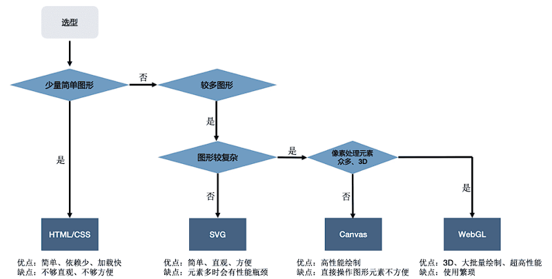
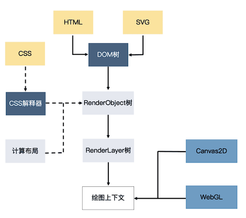

# 数据可视化

> 定义： 可视化是将数据组织成易于为人所理解和认知的结构，然后用图形的方式形象地呈现出来的理论、方法和技术。实现可视化有两个关键要素，一个是数据，另一个是图形。如果要考虑在计算机上呈现，那还要加上交互。

可视化可不只是在绘制图表，图表只是可视化工程师日常工作产出的一部分。可视化更重要的是利用 WebGL 这样的图形系统，来更高效地实现更多有趣的图形。尤其是，当你在写一个可视化的项目，要在大屏上用浏览器渲染数以万计的元素时，也许 WebGL 或者 GPU 就是目前唯一可行的方案。

想要成为一名可视化工程师，我们不能停留在可视化现有的库、框架和工具的使用层面上，必须深入技术栈的底层，充分理解数据，掌握视觉呈现相关的技术和基本原理。打好基础之后，再系统地学习可视化领域的方法论，才能提高解决问题的能力。

可视化知识结构图：

可视化的视觉主要涉及四个部分，分别是理论基础、图形系统、图形库和工具。应该把重点放在理论基础上，因为随着技术的发展，工具会改变，而基础不会。视觉部分的理论基础就是数学和图形学

数据这一块呢，虽然相对比较简单，但是内容也不少。可视化工程师对数据的理解，会随着业务的深入而逐步加深。所以，在数据部分，我们只要理解解决问题的整体构思和方法论，知道如何从一个可视化工程师的角度去理解和运用数据

学习路径图：

## Web 前端和可视化到底有什么区别

首先是技术栈的不同。Web 开发主要以 HTML 来描述结构，以 CSS 来描述表现，以 JavaScript 来描述行为。而可视化则较少涉及 HTML 和 CSS，它更多地要同浏览器的 Canvas、SVG、WebGL 等其他图形 API 打交道。

其次，Web 开发着重于处理普通的文本和多媒体信息，渲染普通的、易于阅读的文本和多媒体内容，而可视化开发则着重于处理结构化数据，渲染各种相对复杂的图表和图形元素。

可视化领域的工具：

- 图表库：专业呈现各种类型图表。绘制大量的图表，比如，柱状图、折线图、饼图，还有一些简单的平面地图等等。常见有`Echarts`,`charlist`,`chart.js`
- 地理库：专业处理地图、地理位置。也叫 GIS 地图库。常见有`Mapbox`,`Leftleft`,`Deck.gl`,`CesiumJS`
- 渲染库：专业处理视觉呈现。绘制其他更灵活的图形、图像或者物理模型。2D 渲染可以选择 `SpriteJS`，3D 渲染可以选择 `ThreeJS`、`BabylonJS` 以及 `SpriteJS3D` 扩展等等
- 数据驱动框架：专注于处理数据的组织形式，而将数据呈现交给更底层的图形系统（DOM、SVG、Canvas）或通用图形库（SpriteJS、ThreeJS）去完成。最常见的就是 `D3.js`

可视化技术选型：

浏览器各类技术的渲染机制对比：

## 指令式绘图系统：如何用 Canvas 绘制层次关系图

Canvas 元素上的 width 和 height 属性不等同于 Canvas 元素的 CSS 样式的属性。这是因为，CSS 属性中的宽高影响 Canvas 在页面上呈现的大小，而 HTML 属性中的宽高则决定了 Canvas 的坐标系。如果我们不设置 Canvas 元素的样式，那么 Canvas 元素的画布宽高就会等于它的样式宽高的像素值

<canvas id='rect' width="512" height="512"></canvas>

