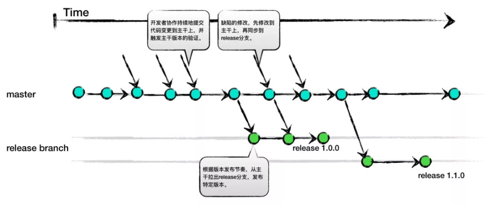

# Git 分支管理策略

Git 主流分支策略有三种：

- Git Flow

- GitHub Flow

- TBD

## Git Flow

Git Flow 是应用最广的 Git 分支管理实践。

分支类型:

- `develop`: 主开发分支，开发人员主要工作的分支

- `release-xx`: 上线分支，用于版本上线的分支，从 develop 分支拉出，上线后合入 master 分支以及 release 分支

- `master`: 主分支，代表生产环境最新代码，不进行构建，不发版本

- `hostfix-xx`: 补丁分支，从 master 分支拉出，上线后合入 master 分支

- `feature-xx`: 功能分支，某个比较大的需要多人协同的功能特性开发可拉取 feature 分支，从 develop 分支拉出，开发完毕后合入 develop 分支

> 个人开发代码基于个人 fork 库的对应分支进行，如果是基于一个仓库开发，就还会存在 `个人分支`

操作流程: 

1. 开发工作在 `develop` 分支上进行，版本上线前一段时间拉出 `release-{version}` 分支，该版本后续的修改及上线的构建部署都是基于 `release-{version}` 分支，而 `develop` 分支则可以开始下一版本的开发

    > 拉出 `release` 分支的时间根据团队具体情况来，主要考虑当前版本代码稳定的时间以及下一版本开发工作开始的时间

2. `release` 分支上线后合入 `master` 分支和 `develop` 分支

    > 可以优化下，`release` 分支只需要合入 `master` 分支，然后通过自动化脚本，`master` 更新后自动合入 `develop` 分支，如果有冲突，则提醒人工解决  
    > 这样子可以避免 `release` 忘记合入 `develop` 分支的场景

    > 关于 `release` 分支的删除时机，不用太急，定时清理老分支即可，比如定时清理超过一年的 `release` 分支

3. 生产环境出现 bug， 从 `master` 分支拉出 `hotfix-{bug}` 分支进行修复，修复上线后，`hotfix` 分支合入 `master` 分支和 `develop` 分支

    > hotfix 分支的合并策略可以和 `release` 一致，只合 `master` 分支，让 `master` 自动合入 `develop`

    > hotfix 的删除策略也可以和 `release` 一致

    > 在团队较小，版本不会重叠的情况下，已发布的版本的 bug 修复，也可以不基于 `hotfix` 分支，而是直接使用 `release` 分支，这样可以简化分支复杂性

4. 出现某个比较大的需要多人协同的功能特性开发，而且这个功能未完成时合入 `develop` 会阻塞其他功能开发，可以拉出 `feature-{feature}` 分支进行协作开发，功能基本完成后合入 `develop` 分支

> 建议 `release` 和 `hotfix` 上线前，将 master 分支合入要上线的分支，避免出现上线后缺失某些生产代码

> 可以根据团队实际情况对 Git Flow 分支管理策略进行调整适配

> Git Flow 的缺点是分支较多、产生冲突的可能性也较大，在实际操作中，可以由由一两个精通 Git 的技术骨干负责除了 develop 分支外的其他分支的拉出、合并、冲突解决，普通成员只需要关注 develop 分支，这样可以在一定程度上减轻 Git Flow 的复杂度

## Github Flow

GitHub Flow —— 以部署为中心的开发模式,通过简单的功能和规则，持续且高速 安全地进行部署。

在实际开发中往往一天之内会实施几十次部署，而支撑这一切的，就是足够简单的开发流程以及完全的自动化。

> 说白了，就是持续发布，这种发布频率在国内很少见

GitHub Flow 特点：

- 令 master 分支时常保持可以部署的状态
- 进行新的作业时要从 master 分支创建新的分支，新分支名称要具有描述性
- 在2新建的本地仓库分支中进行提交
- 在Github 端仓库创建同名分支，定期 push
- 需要帮助、反馈，或者 branch 已经准备 merging 时，创建Pull Request，以Pull Request 进行交流
- 让其他开发者进行审查，确认作业完成后与master分支进行合并（合并的代码一定要测试
- 与 master 分支合并后，立刻部署

使用Github Flow 的前提条件：

- 团队规模最好控制在15-20人之内，具体见 [how-github-works](https://zachholman.com/posts/how-github-works/)
- 部署作业完全自动化。必须自动化，一天之类需要多次部署
- 重视测试, 让测试自动化

## TBD

主线开发方式，在 SVN 中比较流行

Google 和 Facebook 主要就是采用这种分支管理策略

特点总结如下:

- 有且仅有一个开发分支，即主干分支。

- 所有改动都发生在主干分支。

- 发布可以从主干拉发布分支。

- 主干上进行的修复需要根据缺陷的修复策略，确定是否 cherry pick 到对应版本的发布分支。

## 分支策略的选择

三种分支策略的优缺点：

个人建议国内大部分团队都应该采用 Git Flow 分支管理策略，如果觉得分支过多，可以根据实际情况进行精简

至于 Github Flow 和 TBD 要深思熟虑（团队协作成熟度、基础设施成熟度）后，确实适合才使用

## References

- [Git工程开发实践（四）——Git分支管理策略](https://blog.51cto.com/9291927/2173509?source=dra)

- [Git Flow 出处](https://nvie.com/posts/a-successful-git-branching-model/)

- [GitHub Flow](https://guides.github.com/introduction/flow/)

- [如何选择 Git 分支模式？](https://zhuanlan.zhihu.com/p/158463879)