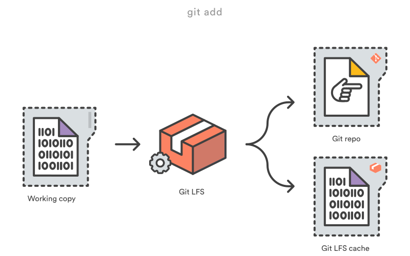

# Git LFS

Git Large File Storage（Git 大文件存储）是 Git 的一个扩展, 用于解决 Git 大文件存储的问题

## 基本原理

Git LFS 通过用小型指针 (pointer) 文件, 来取代仓库中的大文件。仓库中只保存指针文件，真实的大文件保存在另外的存储中。

指针文件内容:

```
version https://git-lfs.github.com/spec/v1
oid sha256:d3d4d00d3a1618dc54ce0735de08dccaf2e7fd13c53f0232bd18c4b75db24a66
size 54893
```

> 远程大文件存储服务器可通过 `git lfs env` 查看

- `add` 大文件时，Git LFS 会生成大文件的指针文件保存在 Git 仓库中，真实的大文件则保存在 Git LFS 的缓存中

    > Git LFS 缓存的存储路径: `.git/lfs/objects/`

    

- `push` 时， Git LFS 会将 Git LFS 缓存的大文件推送到 `大文件存储` 中

    

- `checkout` 指针文件时， Git LFS 会根据指针去 `大文件存储` 中拉取真实的大文件

    

具体原理请阅读 [官方文档](https://github.com/git-lfs/git-lfs/blob/master/docs/spec.md#intercepting-git)

## 基础使用

### 安装

Mac 系统

```bash
brew install git-lfs
```

> Windows 系统可从 [官网](https://github.com/git-lfs/git-lfs/releases/tag/v2.12.1) 下载 Git-LFS 并安装


安装好 Git-LFS 后，运行以下命令启用 Git LFS

```bash
git lfs install
```

该命令的运行时机

- 首次安装后运行

- 在 Git 工程中首次引入 Git LFS 时运行

该命令会做两件事：

- 在 `~/.gitconfig` 添加配置

    ```
    [filter "lfs"]
        required = true
        # clean filter 在文件 add 到仓库时运行
        clean = git-lfs clean -- %f
        # smudge filter 在文件 checkout 到工作目录时运行
        smudge = git-lfs smudge -- %f
        process = git-lfs filter-process
    ```

    > 指定在 `add`, `checkout` 时进行 lfs 处理

- 在当前 Git 工程 `.git/hooks/pre-push` 添加钩子

    ```
    command -v git-lfs >/dev/null 2>&1 || { echo >&2 "\nThis repository is configured for Git LFS but 'git-lfs' was not found on your path. If you no longer wish to use Git LFS, remove this hook by deleting .git/hooks/pre-push.\n"; exit 2; }
    git lfs pre-push "$@"
    ```

    > 指定在 `push` 时进行 lfs 处理

> 卸载命令: `git lfs uninstall`


### Git-LFS 常用操作

-  查看信息

    ```bash
    # 查看 LFS 远程服务器信息，以及本地存储路径
    git lfs env

    # 查看 Git-LFS 管理的文件列表
    git lfs ls-files

    # 查看某个文件的指针文件信息
    git lfs pointer --file=/path/tofile
    ```

- 指定 Git-LFS 服务器

    Git-LFS 的默认远程存储库是 `${remote-url}.git/info/lfs`, 比如

    ```
    Git Remote: https://git-server.com/foo/bar
    LFS Server: https://git-server.com/foo/bar.git/info/lfs

    Git Remote: https://git-server.com/foo/bar.git
    LFS Server: https://git-server.com/foo/bar.git/info/lfs

    Git Remote: git@git-server.com:foo/bar.git
    LFS Server: https://git-server.com/foo/bar.git/info/lfs

    Git Remote: ssh://git-server.com/foo/bar.git
    LFS Server: https://git-server.com/foo/bar.git/info/lfs
    ```

    > 由于 Git-LFS 默认使用 https 协议，如果发现证书校验失败，可以通过 `git config --global http.sslVerify false` 取消校验

    指定自定义的 Git-LFS 远程存储库

    ```bash
    # 指定其它 Git LFS 远程库
    git config lfs.url https://lfs-server.com/foo/bar

    # 指定某个 remote 对应的 Git LFS 远程库
    git config remote.{remote-name}.lfsurl http://lfs-server.com/foo/bar
    ```

    以上的配置方式只适合个人使用，如果要在团队使用，建议配置在 `.lfsconfig` 文件中

    > Git-LFS 默认会读取 `.lfsconfig` 文件中的配置

    ```bash
    git config --file=.lfsconfig lfs.url https://lfs-server.com/foo/bar
    ```

### 其它命令

可通过 `git lfs` 查看全部命令， `git lfs <command> -h` 查看某个命令

```bash
High level commands
--------------------

* git lfs env:
    Display the Git LFS environment.
* git lfs checkout:
    Populate working copy with real content from Git LFS files.
* git lfs dedup:
    De-duplicate Git LFS files.
* git lfs ext:
    Display Git LFS extension details.
* git lfs fetch:
    Download Git LFS files from a remote.
* git lfs fsck:
    Check Git LFS files for consistency.
* git lfs install:
    Install Git LFS configuration.
* git lfs lock:
    Set a file as "locked" on the Git LFS server.
* git lfs locks:
    List currently "locked" files from the Git LFS server.
* git lfs logs:
    Show errors from the Git LFS command.
* git lfs ls-files:
    Show information about Git LFS files in the index and working tree.
* git lfs migrate:
    Migrate history to or from Git LFS
* git lfs prune:
    Delete old Git LFS files from local storage
* git lfs pull:
    Fetch Git LFS changes from the remote & checkout any required working tree
    files.
* git lfs push:
    Push queued large files to the Git LFS endpoint.
* git lfs status:
    Show the status of Git LFS files in the working tree.
* git lfs track:
    View or add Git LFS paths to Git attributes.
* git lfs uninstall:
    Uninstall Git LFS by removing hooks and smudge/clean filter configuration.
* git lfs unlock:
    Remove "locked" setting for a file on the Git LFS server.
* git lfs untrack:
    Remove Git LFS paths from Git Attributes.
* git lfs update:
    Update Git hooks for the current Git repository.
* git lfs version:
    Report the version number.

Low level commands
-------------------

* git lfs clean:
    Git clean filter that converts large files to pointers.
* git lfs filter-process:
    Git process filter that converts between large files and pointers.
* git lfs pointer:
    Build and compare pointers.
* git lfs post-checkout:
    Git post-checkout hook implementation.
* git lfs post-commit:
    Git post-commit hook implementation.
* git lfs post-merge:
    Git post-merge hook implementation.
* git lfs pre-push:
    Git pre-push hook implementation.
* git lfs smudge:
    Git smudge filter that converts pointer in blobs to the actual content.
* git lfs standalone-file:
    Git LFS standalone transfer adapter for file URLs (local paths).

Examples
--------

To get started with Git LFS, the following commands can be used.

 1. Setup Git LFS on your system. You only have to do this once per
    repository per machine:

        git lfs install

 2. Choose the type of files you want to track, for examples all ISO
    images, with git lfs track:

        git lfs track "*.iso"

 3. The above stores this information in gitattributes(5) files, so
    that file need to be added to the repository:

        git add .gitattributes

 3. Commit, push and work with the files normally:

        git add file.iso
        git commit -m "Add disk image"
        git push
```


## References

- [Git-LFS 教程](https://jakciehoo.github.io/2017/03/18/2017-03-18-Git-LFS/)
- [Git LFS 客户端文档](https://github.com/git-lfs/git-lfs/blob/master/docs/spec.md)
- [Git LFS 服务端文档](https://github.com/git-lfs/git-lfs/tree/master/docs/api)
- [Git LFS 指定自定义服务端](https://github.com/git-lfs/git-lfs/blob/master/docs/api/server-discovery.md#custom-configuration)