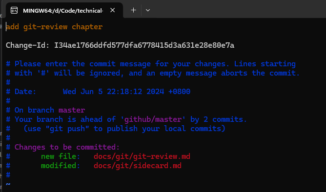

# Git Review

## 简介

`git-review` 是一个用于简化 Git 代码审查过程的工具，特别是在使用 Gerrit 代码审查系统时。它帮助开发者更方便地提交代码更改，并与 Gerrit 系统进行交互。

## 安装

```bash
pip install git-review
```

## 使用

配置 Gerrit 服务器信息，通常是在 Git 仓库的配置文件 `.gitreview` 中定义。

```
[gerrit]
host=review.example.com
port=29418
project=your_project
```

在本地分支上进行更改并提交：

```bash
git add .
git commit -m "Your commit message"
```

使用 git review 命令推送：

```bash
git review
# 如果没有配置 gerrit 服务器信息，可通过 -r 指定要推送的 remote
# 也可以通过 -b 指定推送的分支，默认是 master
git review -r origin -b feature
```

处理反馈：在 Gerrit 上查看代码审查员的反馈。根据反馈进行修改，并使用 --amend 更新提交：

```bash
git add .
git commit --amend
git review
```

## 原理机制

1. 提交的存储位置：

    - git review 命令会将本地的提交推送到 Gerrit 服务器的特定引用下，通常是 `refs/for/` 后面跟着目标分支的名称。例如，如果目标分支是 master，则提交会被推送到 `refs/for/master`。
    - 这并不会直接合并到目标分支，而是创建一个待审查的变更（change）。
    
2. Gerrit 创建变更：

    - Gerrit 服务器接收到推送的提交后，会为每一个提交创建一个变更（change）。每个变更都有一个唯一的变更编号。

    - 变更会显示在 Gerrit 的用户界面上，等待代码审查员进行审查和反馈。

3. 引用和变更的管理：

    - Gerrit 会在后台管理这些引用。提交被推送到 `refs/for/master` 后，Gerrit 会将其保存在内部数据库中，并在 `refs/changes/` 下创建引用。
    - 例如，一个提交可能会在 `refs/changes/34/1234/1` 下，这里的 34 是变更编号的最后两位，1234 是变更编号，1 是修订版本。


## FAQ

### 多个用户 `git-review` 推送 `refs/for/master` 会互相覆盖吗？

不会，提交被推送到 `refs/for/master` 后，Gerrit 就会创建 `refs/changes/xx/xxx/x` 引用，这时就会删掉 `refs/for/master` 引用等待下一个推送

> 只有适配了 git-review 的服务端才会有这个操作，否则只是推送到 `refs/for/master`，并不会创建 change

### 怎么识别第二次 `git-review` 是更新？

每次用户在本地提交更改时，Gerrit 要求提交消息中包含一个唯一的 Change-Id。这通常是由 Gerrit 提供的钩子（hook）自动生成和附加的。

当 `refs/for/master` 临时引用被删除后，Gerrit 依靠提交消息中的 Change-Id 来识别和更新变更。每个变更都有一个唯一的 Change-Id，确保 Gerrit 能够准确识别和关联提交，无论是初次推送还是后续更新。用户在推送更新时，只需确保提交消息包含正确的 Change-Id，Gerrit 就能自动处理并存储新的修订版本。

后续更新通过 `git commit --amend` 会复用上次的 change-id，如图：



### 一个客户端使用 git-review 怎么创建多个 change 同时提交审查呢

使用多个分支提交即可，因为每次 `commit` 的 change-id 不一样，会被识别为不同的change

## 优势

- 简化流程： 自动化推送和代码审查流程，减少手动操作。
- 集成良好： 与 Git 和 Gerrit 紧密集成，方便开发者使用现有工具。
- 提高效率： 快速提交和更新变更，提升团队协作效率。

## 总结

git-review 是一个简化代码审查流程的工具，特别适用于使用 Gerrit 代码审查系统的项目。它通过自动化提交和更新变更，减少手动操作，提升开发和审查效率。

## References

- [命令用法](https://docs.opendev.org/opendev/git-review/latest/usage.html)
- [wiki](https://www.mediawiki.org/wiki/Gerrit/git-review#What_happens_when_you_submit_a_change)
