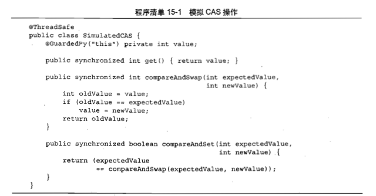

# Java 并发

## 并发的基础知识

### 并发出现的原由

- 提高资源利用率（IO 设备速度远低于 CPU 速度）

- 公平性（多租户）

- 便利性（响应事件等异步模型）

### 多线程的风险

- 共享数据安全性问题

- 线程活跃性问题（死锁、活锁、饥饿）

- 性能问题（线程之间的切换）

### 线程安全性的三大特性

- 原子性

- 可见性

- 有序性

### 同步工具类

- 阻塞队列

- 信号量（Semaphore）、栅栏（Barrier）以及闭锁（CountDownLatch）

## 任务执行

### 任务执行的方式

- 串行

- 显示创建线程（new Thread）

> 每次都创建线程开销大， 线程量过多会消耗过多的资源，可能会导致 OutOfMemoryError

- Executor（将任务的提交和执行分离）

### Executor

#### 任务执行策略

- 在什么线程执行任务

- 任务按照什么顺序执行（FIFO，LIFO，优先级）

- 有多少个任务可以并发

- 在队列中有多少个任务在等待执行

- 如果系统过载需要拒绝任务，应该拒绝哪个任务？如何通知应用程序有任务被拒绝

- 执行一个任务之前和之后，应该进行哪些动作

#### 线程池

Executor 最常见的一种实现: ThreadPoolExecutor

#### Executor 的生命周期

如果停止一个 Executor?

为了解决生命周期的问题，扩展出了 `ExecutorServie` 接口

```java
public interface ExecutorService extends Executor {
    void shutdown();

    List<Runnable> shutdownNow();

    boolean isShutdown();

    boolean isTerminated();

    boolean awaitTermination(long timeout, TimeUnit unit)
        throws InterruptedException;
}
```

#### 延迟任务

ScheduledThreadPoolExecutor

> Timer 有明显的漏洞，基于绝对时间的调度，会受系统时钟的影响；单线程，一个延迟可影响后续的任务；没有异常处理，一个异常会导致后续的任务都无法执行

#### 获取结果

Executor.submit(Callable) 会返回 Future 对象，通过 Future.get() 可以获取到任务结果

CompletionService 将 Executor 和 BlockingQueue 结合起来，可以获取一组任务结果

> Future 可以理解为单个计算的句柄，CompletionServie 则是一组计算的句柄

### 任务、线程、进程的取消与关闭

#### 任务、线程取消

- 布尔值

> 无法取消阻塞中的任务、线程

- 中断

> 中断是实现取消最合理的方式

> Thread.interrupt() 触发中断，任务中可以检查 `Thread.currentThread().isInterrupted()` 或者捕获 `InterruptedException` 异常感知中断，可以关闭相关资源，然后通过 `Thread.currentThread().interrupt()` 或者抛出 `InterruptedException` 重新设置中断标记，让所在线程处理中断

- 通过 Future 来取消

> 对于没有提供中断异常的阻塞，可以通过继承重写 Thread 的 interrupt 方法或者 Future 的 cancel 方法来自定义取消这些阻塞的任务

#### 关闭 ExecutorService

- shutdown 
- shutdownNow 

#### 处理任务中的 RuntimeException

UncaughtExceptionHandler

#### 关闭 JVM 

```java
Rumtime.getRuntime().addShutdownHook(new Thread() {
    public void run() {
        doSomething();
    }
})
```

> 多个 ShutdownHook 的执行顺序是不定的
> kill -9 会直接杀死 JVM 进程，不会触发 ShutdownHook

### 线程池的使用

#### 任务与执行策略之间的隐形耦合

任务依赖于同一线程池的其他任务，可能会出现 `线程饥饿死锁`

异构任务用同一个线程池，可能会出现短任务等待长任务，导致响应时间过长

#### 线程池的大小

计算密集型: `threadNumber = cpuNumber + 1`

> 多一个，以便于页中断时不会浪费 cpu 周期

IO 密集型: `threadNumber = cpuNumber * ( waitTime + computeTime) / computeTime`

> cpu 数量的获取 `Runtime.getRuntime().availableProcessors`

另外的资源限制，连接池、内存等

```java
    public ThreadPoolExecutor(int corePoolSize,
                              int maximumPoolSize,
                              long keepAliveTime,
                              TimeUnit unit,
                              BlockingQueue<Runnable> workQueue) {
        this(corePoolSize, maximumPoolSize, keepAliveTime, unit, workQueue,
             Executors.defaultThreadFactory(), defaultHandler);
    }

    public ThreadPoolExecutor(int corePoolSize,
                              int maximumPoolSize,
                              long keepAliveTime,
                              TimeUnit unit,
                              BlockingQueue<Runnable> workQueue,
                              ThreadFactory threadFactory,
                              RejectedExecutionHandler handler) {
        //...
    }
```

#### 饱和策略

- 拒绝 Abort（抛出异常，默认）
- 抛弃 Discard
- 抛弃最老 DiscardOldest
- 在调用线程执行 CallerRun

#### 线程工厂

自定定义线程的名字等

#### 扩展 ThreadPoolExecutor

三个扩展方法 `beforeExecute`, `afterExecute`, `terminated`

> 比如打日志、测量耗时、统计等等


## GUI

目前成熟的 GUI 工具包都是单线程的

> GUI 场景的对象在多线程环境下很容易出现死锁等问题, 目前还没有成功的多线程 GUI 工具包

单线程的 GUI 工具包要求对 UI 组件对象的修改只能在 UI 线程中进行，耗时的任务可以另起线程运行，其他线程要修改 UI 只能发个事件到 UI 线程的事件队列中

## 活跃性问题

### 死锁

#### 死锁的四个必要条件

- 互斥条件
- 占有和等待条件
- 不可抢占条件
- 环路等待条件

#### 死锁

#### 线程死锁排查

`jstack <pid>` 查看线程快照

### 饥饿

### 活锁

线程没有阻塞，但是无法按下执行

## 同步工具

### 显性锁：ReenterLock vs synchronized

ReenterLock 的优势：

- 不需要是块级结构

- 轮训锁和定时锁

- 可中断的获取动作

- 可设置公平锁

> 优先选择 synchronized，实在不能实现才选 ReenterLock

### 读写锁

以读取操作为主的场景使用

公平的读写锁，等待时间长的获取（可避免写锁的饥饿问题）

常用的读写锁: `ReenterReadWriteLock`

### 条件队列

用于解决依赖于某个状态的并发，比如 `ArrayBlockingQueue` 的 `take` 方法依赖于队列是否有元素，没有元素时要等待有值

可行的其它方法:

- 轮询等待（浪费 CPU 周期）

- sleep 阻塞等待（响应性差）

条件队列的实现: `Object.wait()` `Object.notifyAll` 

> Object.wait() 会放弃持有的锁

> 注意信号丢失问题

> 如果条件队列里的线程等待的条件不宜硬，Object.notify 会很危险

更灵活的条件队列实现： `Lock.newCondition()` `Condition.await()` `Condition.signalAll`

Condition 的优势

- 每个 Lock 可以有多个 Condition

- 可继承 Lock 的公平性

### 同步器

基于锁、条件队列、CAS 可以实现各种同步器

java 提供了 AQS(AbstractQueuedSynchronizer) 基类，以便于同步器的实现

> Semaphore、CountDownLatch、ReenterLock、ReenterReadWriteLock 等同步器都是基于 AQS 实现的

```java
public class Semaphore implements java.io.Serializable {
    /** All mechanics via AbstractQueuedSynchronizer subclass */
    private final Sync sync;

    abstract static class Sync extends AbstractQueuedSynchronizer {
        private static final long serialVersionUID = 1192457210091910933L;

        Sync(int permits) {
            setState(permits);
        }

        final int getPermits() {
            return getState();
        }

        final int nonfairTryAcquireShared(int acquires) {
            for (;;) {
                int available = getState();
                int remaining = available - acquires;
                if (remaining < 0 ||
                    compareAndSetState(available, remaining))
                    return remaining;
            }
        }

        protected final boolean tryReleaseShared(int releases) {
            for (;;) {
                int current = getState();
                int next = current + releases;
                if (next < current) // overflow
                    throw new Error("Maximum permit count exceeded");
                if (compareAndSetState(current, next))
                    return true;
            }
        }
    }

    public void acquire() throws InterruptedException {
        sync.acquireSharedInterruptibly(1);
    }

    public void release() {
        sync.releaseShared(1);
    }
}
```

## 非阻塞同步 - CAS

模拟 CAS



> 现代 CPU 指令一般都会有 CAS 相关指令，三个参数，内存地址、原始值、新值

CAS 实现的标准原子类： `AtomicInteger` `AtomicLong` `AtomicBoolean` `AtomicReferences` 等


## Java 内存模型

### happens-before 关系

- 程序顺序规则：一个线程中的每一个操作，happens-before于该线程中的任意后续操作。

- 监视器锁规则：对一个锁的解锁，happens-before于随后对这个锁的加锁。

- volatile变量规则：对一个volatile域的写，happens-before于任意后续对这个volatile域的读。

- 传递性：如果A happens-before B，且B happens-before C，那么A happens-before C。

- start规则：如果线程A执行操作ThreadB.start()启动线程B，那么A线程的ThreadB.start（）操作happens-before于线程B中的任意操作、

- join规则：如果线程A执行操作ThreadB.join（）并成功返回，那么线程B中的任意操作happens-before于线程A从ThreadB.join()操作成功返回

> 用于检查是否有指令重排序的副作用

## References

- [深入浅出多线程](https://redspider.gitbook.io/concurrent/readme)