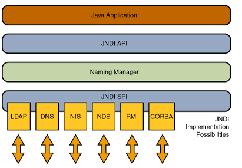

# JNDI

NDI（Java Naming and Directory Interface，Jave命令和目录接口）是一组应用程序接口，目的是方便查找远程或是本地对象。JNDI典型的应用场景是配置数据源，除此之外，JNDI还可以访问现有的目录和服务，例如LDAP、RMI、CORBA、DNS、NDS、NIS




## JNDI 的作用

首先，我们来看看获取数据源的最基本写法

```java
Connection conn=null;
try {
  Class.forName("com.mysql.jdbc.Driver",
                true, Thread.currentThread().getContextClassLoader());
  conn=DriverManager.
    getConnection("jdbc:mysql://MyDBServer?user=qingfeng&password=mingyue");
  ......
  conn.close();
} catch(Exception e) {
  e.printStackTrace();
} finally {
  if(conn!=null) {
    try {
      conn.close();
    } catch(SQLException e) {}
  }
}
```

基于这个写法，如果要修改数据库用户名、密钥甚至是 ip 的话，那么就得修改代码

为了避免因为数据库信息的修改而要修改代码，可以加个中间层来解决，JNDI 就是这样一个中间层

基于 JNDI，代码只需要和一个自定义名称所关联，而这个名称关联的数据源由外部所配置（一般是 J2EE 所配置）

当然，JNDI 的 API 除了封装数据库的变化，其它实现 JNDI SPI 的 provier 也可以使用 JNDI 来使用

## JNDI 注入

在程序通过 JNDI 获取外部远程对象过程中，程序被控制访问恶意的服务地址（例如指向恶意的 RMI 服务地址），并加载和实例化恶意对象时，将会造成 `JNDI注入`。

JNDI 注入利用过程如下：

当客户端程序中调用了 `InitialContext.lookup(url)`，且 url 可被输入控制，指向精心构造好的 RMI 服务地址。恶意的 RMI 服务会向受攻击的客户端返回一个 Reference，用于获取恶意的 Factory 类。当客户端执行 `lookup()` 时，szxz'x会对恶意的 Factory 类进行加载并实例化，通过 `factory.getObjectInstance()` 获取外部远程对象实例。攻击者在 Factory 类文件的构造方法、静态代码块、`getObjectInstance()` 方法等处写入恶意代码，达到远程代码执行的效果

## References

- [JNDI 官方文档](https://docs.oracle.com/javase/tutorial/jndi/overview/index.html)
- [RMI 官方文档](https://docs.oracle.com/javase/tutorial/rmi/overview.html)