# JVM

## 运行时数据区


常见错误：

- OutOfMemoryError
- StackOverflowError

### 栈

```bash
# 设置栈的大小
java -Xss1m
```

### 堆

> 线程共享的 Java 堆中可以划分出多个线程私有的分配缓冲区（Thread Local Allocation Buffer，TLAB)，以提升对象分配时的效率

对象分配的地方，垃圾收集的地方

```bash
# 设置堆的最小值和最大值
java -Xms20m -Xmx30m
```

### 方法区

方法区用于存储 `类型信息`、`常量`、`静态变量`、`即时编译器编译后的代码缓存`等数据

方法区在 JDK7 及以前通过永久代实现，JDK8 起通过元空间(`Metaspace`)实现

> JDK7 起原本存放在永久代的 `字符串常量池` 被移至 Java 堆之中

```bash
# JDK7 永久代设置初始大小和最大值
java -XX:PermSize=6M -XX:MaxPermSize=6M

# JDK8 Metaspace 限制大小，默认只受限于机器内存大小
java -XX:MetaspaceSize=6M -XX:MaxMetaspaceSize=6M
```

### 直接内存

Direct Memory 并不是虚拟机运行时数据区的一部分，主要是给 NIO 使用，大小受限于机器内存大小

## 对象的创建



为新生对象分配内存有两种方式

- 指针碰撞
- 空间链表

> 具体看 GC 有没有整理内存，Serial 和 ParNew 就是使用指针碰撞，CMS 使用空间链表（连续空闲块内部使用指针碰撞）

解决指针碰撞的并发问题

- 同步处理，实际上是CAS
- TLAB，TLAB不需要同步处理，用完了才同步处理

## 垃圾收集

### 哪些对象可以回收？

#### 引用计数算法

> 很难解决对象之间循环引用的问题

#### 可达性分析算法

关键是 GC Roots 的选取, 常见的 GC Roots 主要有 
    - 栈中的本地变量表引用的对象
    - 常量引用的对象
    - 静态变量引用的对象

#### 不可达的对象并不一定被回收


#### 回收方法区

条件苛刻，回收收益不高

### 垃圾收集算法

#### 分代收集理论

1. 弱分代假说：绝大多数对象都是朝生夕灭
2. 强分代假说：熬过越多次垃圾收集过程的对象就越难以消亡

根据这两个假说，大多数垃圾收集器都把堆分为新生代和老年代两块区域，分别使用不同的收集算法

> 分代出现了跨代之间的引用，比如老年代引用新生代

3. 跨代引用假说：跨代引用相对于同代引用来说仅占极少数

根据这一假说，就不用为了少量的跨代引用区去扫描这个老年代，只需要建立一个全局的数据机构（记忆集 RememberedSet），这个结构把老年代划分为若干小块，标识出老年代哪一块内存会存在跨代引用，当发生 Minor GC，只有包含跨代引用的小块内存里的对象才会被加入到 GC Roots 中

> 记忆集的标识主要是通过赋值时的 “写屏障” 来实现的

分代导致的 GC 定义

- 部分收集（Partial GC）
    - 新生代收集（Minor GC/Young GC)
    - 老年代收集（Major GC/Old GC)：目前只有 CMS 会单独收集老年代，一般都是 Full GC
    - 混合收集(Mixed GC)： 收集整个新生代和部分老年代，目前只有 G1 有
- 整堆收集（FullGC）： 收集整个 Java 堆和方法区的垃圾收集 

相关命令:

### 标记-清除算法

适用场景：CMS 的老年代收集

缺点：

- 大量对象需要回收时效率低
- 会导致空间碎片化问题

### 标记-复制算法

适用场景：新生代的收集

新生代划分为 Eden 区、两个 Survivor 区，比例默认是 8:1:1

新对象在 Eden 区分配内存，垃圾回收 Eden 区和其中一个 Survivor 区，存活对象放入另一个 Survivor 区，如果放不下，则直接升入老年代

相关参数

- `-Xmm`: 指定新生代大小
- `-XX:SurvivorRatio`: 指定 suvivor 区比例（ratio=Eden大小/Suvivor大小）
- `-XX:PretenureSizeThreshold`: 直接晋升老年代的对象大小

### 标记-整理算法

特点：适用大量对象存活的场景、没有内存碎片化问题

缺点：整理内存时需要 “Stop The World”

> CMS 大多数情况下使用标记-清除算法，如果内存碎片过多，会采用标记-整理算法收集一次


## Hotspot 垃圾收集算法难点

### 准确式 GC 中的 OopMap 及 Safepoint

[准确式 GC 和 OopMap](https://blog.csdn.net/u014028317/article/details/107435049)

如果能够区分内存上某个位置是整型还是指针的 GC 叫 `准确式 GC`，不能区分的叫 `保守式 GC`

#### 保守式 GC

保守式 GC 的缺点：

- 已死的对象由于有疑似指针(可能是个整型)指向它，无法被回收
- 无法移动对象，会出现大量的内存碎片

无法移动对象的问题，可以通过添加一个中间层 `句柄` 来解决，有个句柄表来保证对象的指针，所有引用先指向句柄，再从句柄表找到实际对象地址，这样移动对象，只需要修改句柄表即可，但是这样引用对象访问效率会降低

#### 半保守式 GC

在栈上不记录类型信息，在对象上记录类型信息，叫做半保守式 GC

为了支持半保守式GC，运行时需要在对象上带有足够的元数据。

如果是JVM的话，这些数据可能在类加载器或者对象模型的模块里计算得到，但不需要JIT编译器的特别支持。

#### 准确式 GC

准确式 GC 就是说给定某个位置上的某块数据，要能知道它的准确类型是什么；GC所关心的含义就是“这块数据是不是指针”。 

判断出一个数据的类型：

1. 让数据自身带上标记（tag）。比如，栈上对每个slot都配对一个字长的tag来说明它的类型
2. 让编译器为每个方法生成特别的扫描代码。很少见
3. 从外部记录下类型信息，存成映射表。

目前三种主流的高性能JVM实现，HotSpot、JRockit和J9都是用的第三种方式。

其中，HotSpot把这样的数据结构叫做 `OopMap`，JRockit里叫做 `livemap`，J9里叫做 `GC map`。

要实现这种功能，需要虚拟机里的解释器和JIT编译器都有相应的支持，由它们来生成足够的元数据提供给GC。 

使用这样的映射表一般有两种方式： 

1. 每次都遍历原始的映射表，循环的一个个偏移量扫描过去；这种用法也叫“解释式”； 
2. 为每个映射表生成一块定制的扫描代码（想像扫描映射表的循环被展开的样子），以后每次要用映射表就直接执行生成的扫描代码；这种用法也叫“编译式”。

> HotSpot是用“解释式”的方式来使用OopMap的，每次都循环变量里面的项来扫描对应的偏移量。

#### OopMap

在HotSpot中，对象的类型信息里有记录自己的OopMap，这个 OopMap 是在类加载过程中计算得到的。

类的 OopMap `记录了在该类型的对象内什么偏移量上是什么类型的数据`。可以理解为一个表格，第一个列是偏移量，第二列是对应的类型

对于栈，OopMap 就是记录栈上每个位置是什么类型，但在代码执行到不同的地方，变量的位置也不一样，因此代码执行到不同的地方时对应的 OopMap 不一样

如果每执行一个指令，都生成当时的 OopMap，效率太低，所以一般会选择代码中的某些位置才生成 OopMap，这些位置叫着 `Safepoint`

这些特定的位置主要在： 
1. 循环的末尾 
2. 方法临返回前 / 调用方法的call指令后 
3. 可能抛异常的位置

准确式 GC 就是等到用户线程都在 `Safepoint` 挂起时，扫描 OopMap 获取 GCRoots 的

> 对于 JNI 本地方法，无法给栈生成 OopMap，一般是通过让 JNI栈 通过句柄表来引用对象，这样扫描句柄表即可
> 由于引用了句柄表，这也是 JNI 本地方法性能不佳的原因之一

### 根节点枚举

可达性分析的根节点枚举需要 Stop the World，所有用户线程必须在 `Safepoint` 生成 OopMap 后挂起

一般是 GC 在全局设置一个 GC 标志位，每个线程到达 `Safepoint` 会检查该标志位，发现 GC 标志位后挂起

> 根节点枚举的耗时不会随着堆的变大而变长

### 并发的可达性分析

可达性分析的标记阶段，会随着堆的变大而变长，如果 Stop the world，会导致停顿时间不可控，所以这个过程一般尽量并发进行

[并发的可达性分析过程及问题](https://www.huaweicloud.com/articles/addaf3aaa40f0d0c22327f2ee51f9b8d.html)

主要的问题是并发标记漏标，导致活对象被误回收的致命问题，

解决方法：

- 增量更新(CMS)
- 原始快照(G1)

## 经典垃圾收集器

### Serial 和 Serial Old 收集器

最基础、最老的一对垃圾收集器，简单粗暴，缺点是停顿时间过长

> 至今，Hotspot 虚拟机客户端模式下的默认新生代收集器依然是 Serial 收集器


### ParNew 收集器

ParNew 收集器本质上是Serial收集器的多线程版本，并没有太多的创新之处

> 在单核机器上，ParNew 并不比 Serial 好，多核 CPU ParNew 才有优势

> 在 JDK 7之前，`ParNew + CMS` 是 JVM 服务端模式首选的收集器


相关参数 

- `-XX:+UseParNewGC`：使用 ParNew 收集器
- `-XX:ParallelGCThreads=xx`: 限制垃圾收集的多线程数

### Parallel Scavenge 收集器

> 新生代收集器

和 ParNew 不一样，Parallel Scavenge 收集器关注的是吞吐量，被称为 `吞吐量有限收集器`

> 吞吐量 = 运行用户代码时间 / (运行用户代码时间 + 运行垃圾收集时间)

相关参数

- `-XX:MaxGCPauseMillis`: 控制垃圾收集最大停顿时间
- `-XX:GCTimeRatio`: 设置吞吐量大小（ratio = 用户代码时间/垃圾收集事假）
- `-XX:+UseAdaptiveSizePolicy`: 不用人工指定新生代大小、SurvivorRatio等等参数，由收集器根据策略动态调整

### Parallel Old 收集器

Parallel Old 是 Parallel Scavenge 收集器的老年代版本

> 在 Parallel Old 出现之前，Parallel Scavenge 由于无法和 CMS 配套，只能会 Serial Old 配置，导致整体性能不佳

> Parallel Old 出现后，Parallel scavenge + Parallel Old 是 JDK9 之前 Hotspot 服务器模式下的默认垃圾收集器 是


### CMS 收集器

> 老年代收集器

CMS（Concurrent Mark Sweep）收集器是一种以获取最短回收停顿时间为目标的收集器，被称为 `并发低停顿收集器`


由于 CMS 收集过程中，用户线程是并发的，如果等老年代空间满了才开始收集，用户线程新创建的对象将无法分配内存，因此需要在老年代使用到一定程度时触发收集

CMS 使用的是标记-清除算法，会导致内存碎片化问题，如果出现一个大对象无法分配内存，就不得不提前触发 Full GC，使用 Serial Old 来整理老年代空间，为了解决这个问题，

相关参数

- `-XX:+UseConcMarkSweepGC`: 指定使用 CMS 收集器
- `-XX:CMSInitiatingOccupancyFraction`: 指定触发 CMS 收集的内存使用阈值
- `-XX:+UseCMSCompactAtFullCollection`: FULL GC 时进行内存整理
- `-XX:CMSFullGCsBeforeCompaction`: 指定执行几次FULL GC后进行内存整理

### Garbage First 收集器

JDK9 后的默认垃圾收集器

G1 把连续的 Java 堆划分为多个相等的 Region，每个 Region 根据需要扮演新生代的 Eden、Survivor 空间，或者老年代空间

大小超过 Region 大小的一半即可判定为大对象，存储大对象的 Region 区域，称为 Humongous 区域

G1 每次只选择回收收益最高的一批 Region，不需要回收整个新生代或者老年代，因此停顿时间是可控的，不会被堆的大小所影响

> 停顿时间不会被堆的大小所影响，这就是 G1 的最大优势

为了解决跨 Region 引用，G1 在每个 Region 都预留了一个记忆集的结构，记录哪些 Region 引用了该 Region

> 每个 Region 都有记忆集，大概占用了堆容量的 10% - 20%，内存占用是 G1 的最大缺点

由于 G1 每次只回收部分的 Region，这就要求回收的速度要高于内存分配的速度，否则就只能 Stop the world 来解决了


相关参数：

- `-XX:G1HeapRegionSize`: 指定 Region 大小
- `-XX:MaxGCPauseMillis`: 指定最大停顿时间


> 从 G1 开始，最先进的垃圾收集器的设计导向都不约而同地变为追求能够应付应用的内存分配速率，而不追求一次把整个Java堆全部清理干净

### 低延迟垃圾收集器

> 衡量垃圾收集器的三项最重要的指标：内存占用、吞吐量和延迟，三者共同构成了一个 `不可能三角`

延迟日益称为最重要的指标

CMS 使用的是标记清除算法，随着内存空间的增多，终将触发严重的 Stop the world 进行内存整理，这个 Stop the world 时间和堆的大小相关

G1 使用的是标记整理算法，局部看来是标记复制算法，在复制的过程中也是需要 Stop the world 的，随着可以通过控制 Region 的数量控制停顿时间

> 也就是说 G1 及之前的垃圾收集器都无法做到内存整理的并发，低延迟垃圾收集器就是要解决内存整理的并发问题

#### Shenandoah 收集器

Shenandoah 采用和 G1 一样的 Region 布局，通过在对象头存储了转发指针，然后读屏障来将访问转移到新对象来实现内存整理的并发

> 有个和句柄一样的缺点，每次对象访问都会带来一次额外的开销，Shenandoah 是目前第一款使用到读屏障的收集器

对于并发整理的时候，用户进程和 GC 进程存在多线程问题，Shenandoah 是通过 CAS 来保证并发是对象的访问正确性的

#### ZGC 收集器

> 号称停顿时间在 10ms 以下

ZGC 也是采用了 Region 布局，但是其中的 Region 不是一样的，会分为大、中、小三类，暂时也没有给 Region 分成新生代、老年代等角色。

对于并发整理，ZGC 巧妙地使用了 64 位指针暂未使用的几个高位来标记当前指针的指向

> 染色指针是一种直接将少量额外信息存储在指针上的技术


通过这些标记位，虚拟机可以直接从指针中看到其引用对象的三色标记状态、是否进入了重分配（即被移动过）、是否只能通过finalize()方法才能被访问到

> G1 和 Shenandoah 是使用一个 1/64 堆大小的 Bitmap 来记录的

> ZGC 使用了多重映射技术，将这些标记位不同的同一指针映射到同一物理内存中

> Shenandoah 通过标记位可以知道是否需要转发指针，然后根据 Region 的转发表访问到复制后的对象，，并同时修正更新引用的值，这样只有第一次访问旧对象会慢，这被称为指针的自愈

> ZGC 在并发标记阶段，并没有像之前的垃圾收集器一样，通过维护记忆集，只扫描标记部分的堆内存，反而是扫描整个堆内存来进行标记，这种选择让 ZGC 在内存占用方面也比较少，但也限制了它能承受的对象分配效率不会太高


