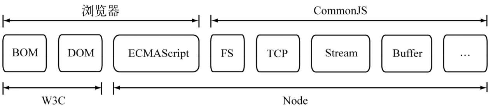
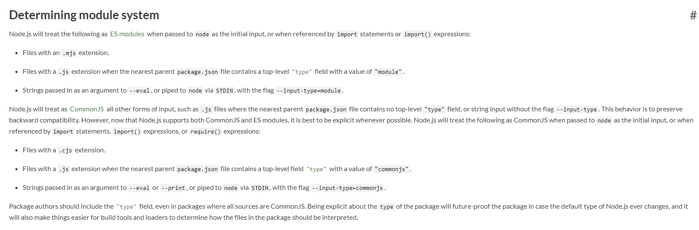

# 模块系统

Web1.0 时代，JavaScript 基本只是做下表单校验这类简单的工作，代码量不大，自然也不怎么需要代码拆分，语言本身也就没考虑到要模块化。

随着 Ajax 引领的 Web2.0 时代到来，前端应用中 JavaScript 要负责的工作剧增，代码量过大开始需要拆分成多个代码文件，这些以文件为单位的模块之间需要交互，构建模块系统是必需的。


## 人为定义的 namespace

最初，这些代码文件通过 `<script>` 标签引入。不同代码文件之前的交互，是通过写入全局变量来实现的。这时也出现了很多著名的 JavaScript 库，比如 JQuery。

根据经验，全局变量很容易出现冲突的情况，为了减少这种问题，著名的库基本都会定义一个全局变量作为 namescape，库的相关功能都挂在这个 namespace 下，用这种人为约定的方式来减少冲突，也算是个人工的简单的模块系统。

但是这种方式只是降低了全局变量冲突的概率，冲突依然会经常出现，人为来约定 namespace 也让沟通成本增加；同时这种方式也无法解决模块依赖的问题

## CommonJS 规范

JavaScript 身为一个图灵完备的语言，能力但被浏览器这个宿主环境所限制，缺乏在其它端（服务端、桌面端、命令行工具等）发展的API和工具库。

CommonJS 的目的就是定义 JavaScript 在其它端需要的相关规范，比如模块系统，标准库(I/O, fs, socker, binary 等)，包管理器等，让 JavaScript 成为一门真正能广泛使用的编程语言。服务端 Node 的相关功能就是对 CommonJS 规范的实现



在我们这一章，主要讨论的 CommonJS 的模块规范

CommonJS 对模块的定义十分简单，主要分为模块引用、模块定义和模块标识 3 个部分

CommonJS 定义每个 JavaScript 文件就是一个模块，每个模块中存在 `require` `module` `exports` 三个全局变量

### 模块定义

CommonJS 使用 `exports` 对象导出当前模块的方法或者变量

```js
// math.js
exports.add = function() {
    var sum = 0, i = 0, args = arguments, l = args.length;
    while (i < l) {
        sum += args[i++];
    }
    return sum;
}
```

在模块中，还存在一个 `module` 对象，它代表模块自身， 而 `exports` 是 `module` 的属性，如果想要修改 `exports` 本身的引用，比如导出个函数，可以给 `module.exports` 赋值

```js
// add.js
module.exports = function() {
    var sum = 0, i = 0, args = arguments, l = args.length;
    while (i < l) {
        sum += args[i++];
    }
    return sum;
}
```

### 模块引用

使用 `require()` 函数引用模块，`require` 函数接受模块标识，然后返回模块的 exports 变量

```js
var math = require('math')
console.log(math.add(1, 1))
```

### 模块标识

模块标识其实就是传递给 `require()` 方法的参数，它必须是符合小驼峰命名的`字符串`，或者以．、.．开头的`相对路径`，或者`绝对路径`。它可以没有文件名后缀 `.js`。

### CommonJS 模块规范的其它规则

> 每个文件模块内是一个私有作用域，定义的变量并不会成为全局变量，完全不必考虑变量污染

> require 方法是个同步方法

> 每个模块只会被加载一次，后续的引用都是直接返回缓存的 exports 对象

### CommonJS 模块规范的实现

著名的 Node 就是按照 CommonJS 的模块规范来实现自己的模块系统的

大概的一个实现原理是：

- 先根据模块标识找到对应的模块文件
- 读取模块文件内容
- New 一个 Module 对象，通过函数封装模块文件内容, 把 require、module、exports 传进去

伪代码：

```js
function Module(id, parent) {
    this.id = id;
    this.exports = {};
}

Module.cache = {}

require(moduleId) {
    if (Module.cache[moduleId]) {
        return Module.cache[moduleId].exports;
    }

    let moduleContent = findModuleContentById(moduleId);

    let depModule = new Module(moduleId, module);

    new Function("requrie", "exports", "module", moduleContent)(require, depModule.exports, depModule)

    Module.cache[moduleId] = depModule;

    return depModule.exports
}
```

## AMD(Asynchronous module definition) 规范

CommonJS 的模块规范主要是针对服务端设计的，显著的特征是 `require()` 方法是个同步方法，在浏览器场景下会导致页面卡顿，并不适用。

因此，浏览器端的模块，不能采用"同步加载"（synchronous），只能采用"异步加载"（asynchronous）。这就是 AMD 规范诞生的背景。

AMD是"Asynchronous Module Definition"的缩写，意思就是"异步模块定义"。它采用异步方式加载模块，模块的加载不影响它后面语句的运行。

### 模块定义

```js
define(id?, dependencies?, factory);
```

模块 id 和依赖是可选的，factory 的内容就是实际代码的内容

```js
define(function() {
    var exports = {}
    exports.add = function() {
        var sum = 0, i = 0, args = arguments, l = args.length;
        while (i < l) {
            sum += args[i++];
        }
        return sum;
    }
    return exports;
})
```

定义模块依赖

```js
define(['dep1', 'dep2'], function(dep1, dep2) {
    return function() {};
})
```

简单的 k-v 对象

```js
define({
    color: "black",
    size: "unisize"
});
```

[ CommonJS 风格](https://requirejs.org/docs/commonjs.html)

```js
define(function(require, exports, module) {
    //Put traditional CommonJS module content here
);
```

### 模块引用

AMD也采用 `require()` 语句加载模块，但是不同于CommonJS，它要求两个参数：

```js
require([module], callback);
```

第一个参数 `[module]`，是一个数组，里面的成员就是要加载的模块；第二个参数 `callback`，则是加载成功之后的回调函数。如果将前面的代码改写成AMD形式，就是下面这样：

```js
require(['math'], function (math) {
　math.add(2, 3);
});
```

### AMD 规范的具体实现 -- RequireJS

使用

```html
<script src="js/require.js" data-main="js/main"></script>
```

`data-main` 属性的作用是，指定入口的主模块。在上例中，就是js目录下面的 main.js，这个文件会第一个被 require.js 加载。

假设 main.js 的内容如下

```js
// main.js
require(['jquery', 'underscore', 'backbone'], function ($, _, Backbone){
　　// some code here
});
```

主模块的依赖模块是 `['jquery', 'underscore', 'backbone']`。默认情况下，require.js 假定这三个模块与 main.js 在同一个目录，文件名分别为jquery.js，underscore.js 和 backbone.js，然后自动加载。

## UMD (Universal Module Definition)

UMD 就是一种 javascript 通用模块定义规范，让你的模块能在 javascript 所有运行环境中发挥作用。

下面是 UMD 模块的写法:

```js
(function(root, factory) {
    if (typeof module === 'object' && typeof module.exports === 'object') {
        console.log('是commonjs模块规范，nodejs环境')
        var depModule = require('./umd-module-depended')
        module.exports = factory(depModule);
    } else if (typeof define === 'function' && define.amd) {
        console.log('是AMD模块规范，如require.js')
        define(['depModule'], factory)
    } else if (typeof define === 'function' && define.cmd) {
        console.log('是CMD模块规范，如sea.js')
        define(function(require, exports, module) {
            var depModule = require('depModule')
            module.exports = factory(depModule)
        })
    } else {
        console.log('没有模块环境，直接挂载在全局对象上')
        root.umdModule = factory(root.depModule);
    }
}(this, function(depModule) {
    console.log('我调用了依赖模块', depModule)
	// ...省略了一些代码，去代码仓库看吧
    return {
        name: '我自己是一个umd模块'
    }
}))
```

## ES 的 module

[ES6(ES2015)](https://tc39.es/ecma262/#sec-modules) 标准中定义了**语言级**的模块系统，此后逐渐发展，现在已经得到了所有主流浏览器和 Node.js 的支持。

这个模块规范可以叫做 JavaScript 模块（module）或者 ES6 module。

和之前的模块规范一样，ES6 module 中一个模块（module）也是一个文件。一个脚本就是一个模块。

模块可以相互加载，并可以使用特殊的指令 `export` 和 `import` 来交换功能，从另一个模块调用一个模块的函数：

- `export` 关键字标记了可以从当前模块外部访问的变量和函数。
- `import` 关键字允许从其他模块导入功能。

- 模块定义

    ```js
    // sayHi.js
    export function sayHi(user) {
    alert(`Hello, ${user}!`);
    }
    ```

- 模块引用

    ```js
    // main.js
    import { sayHi } from './sayHi.js';

    alert(sayHi); // function...
    sayHi('John'); // Hello, John!
    ```

### Node 的 ES6 module

[Node](https://nodejs.org/dist/latest-v16.x/docs/api/esm.html) 从 `v8.5.0` 版本开始支持 ECMASCript modules

Node 同时支持 CommonJS 和 ES module，使用时的区分如下：



> ES 模块文件中 `import` CommonJS 模块时，`module.exports` 导出成 `default `

> CommonJS 模块文件中不支持 `requrie()` ES6 模块，可以使用 `import()` 异步导入

> ES 模块不支持直接导入 JSON 文件（ES 标准中有相应的提案了）

### 浏览器的 ES6 module

#### 基本使用

```html
<!doctype html>
<script type="module">
import {sayHi} from './sayHi.js';

document.body.innerHTML = sayHi('John');
</script>
```

> `<script type="module">` 中定义的变量属于私有作用域

> 模块代码仅在第一次导入时被解析

也可以通过 src 制定入口模块文件

```html
<!doctype html>
<script type="module" src="hello.js"></script>
```

> module脚本是延迟的，效果等同于 defer（不阻塞 HTML 的处理，等 HTML 文档就绪后再按定义的顺序处理）

#### 兼容性

旧时的浏览器不理解 type="module"。未知类型的脚本会被忽略。对此，我们可以使用 nomodule 特性来提供一个后备：

```html
<script type="module">
alert("Runs in modern browsers");
</script>

<script nomodule>
alert("Modern browsers know both type=module and nomodule, so skip this")
alert("Old browsers ignore script with unknown type=module, but execute this.");
</script>
```

#### 现状

在实际开发中，浏览器模块很少被以“原始”形式进行使用。

> 原因是存在不少不支持 module 的存量浏览器，另外浏览器直接引用的 module 有比较多的限制

通常，我们会使用一些构建工具，例如 Webpack，将它们打包在一起，然后部署到生产环境的服务器。

使用打包工具的一个好处是 —— 它们可以更好地控制模块的解析方式，允许我们使用裸模块和更多的功能，例如 CSS/HTML 模块等。

> 打包工具是前端实现工程化的根基之一

构建工具做以下这些事儿：

1. 从一个打算放在 HTML 中的 `<script type="module">` “主”模块开始。
2. 分析它的依赖：它的导入，以及它的导入的导入等。
3. 使用所有模块构建一个文件（或者多个文件，这是可调的），并用打包函数（bundler function）替代原生的 import 调用，以使其正常工作。还支持像 HTML/CSS 模块等“特殊”的模块类型。
4. 在处理过程中，可能会应用其他转换和优化：
    - 删除无法访问的代码。
    - 删除未使用的导出（“tree-shaking”）。
    - 删除特定于开发的像 console 和 debugger 这样的语句。
    - 可以使用 Babel 将前沿的现代的 JavaScript 语法转换为具有类似功能的旧的 JavaScript 语法。
    - 压缩生成的文件（删除空格，用短的名字替换变量等）。

如果我们使用打包工具，那么脚本会被打包进一个单一文件（或者几个文件），在这些脚本中的 `import/export` 语句会被替换成特殊的打包函数（`bundler function`）。因此，最终打包好的脚本中不包含任何 import/export，它也不需要 `type="module"`，我们可以将其放入常规的 `<script>`:

> 也就是说，原生模块也是可以使用的

```html
<!-- 假设我们从诸如 Webpack 这类的打包工具中获得了 "bundle.js" 脚本 -->
<script src="bundle.js"></script>
```

## References

- [ES 模块简介](https://zh.javascript.info/modules-intro)
- [ES6 模块语法](https://es6.ruanyifeng.com/#docs/module)
- [彻底弄懂CommonJS和AMD！](https://www.jianshu.com/p/c5cfc6063344)
- [CommonJS 官网](http://www.commonjs.org/)
- [AMD 官网](https://github.com/amdjs/amdjs-api/blob/master/AMD.md)
- [RequireJS 官网](https://requirejs.org/docs/api.html#jsfiles)
- [可能是最详细的UMD模块入门指南](https://juejin.cn/post/6844903927104667662)