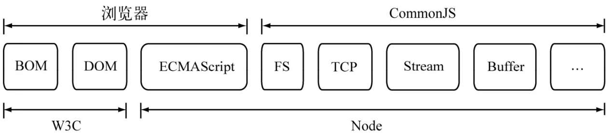
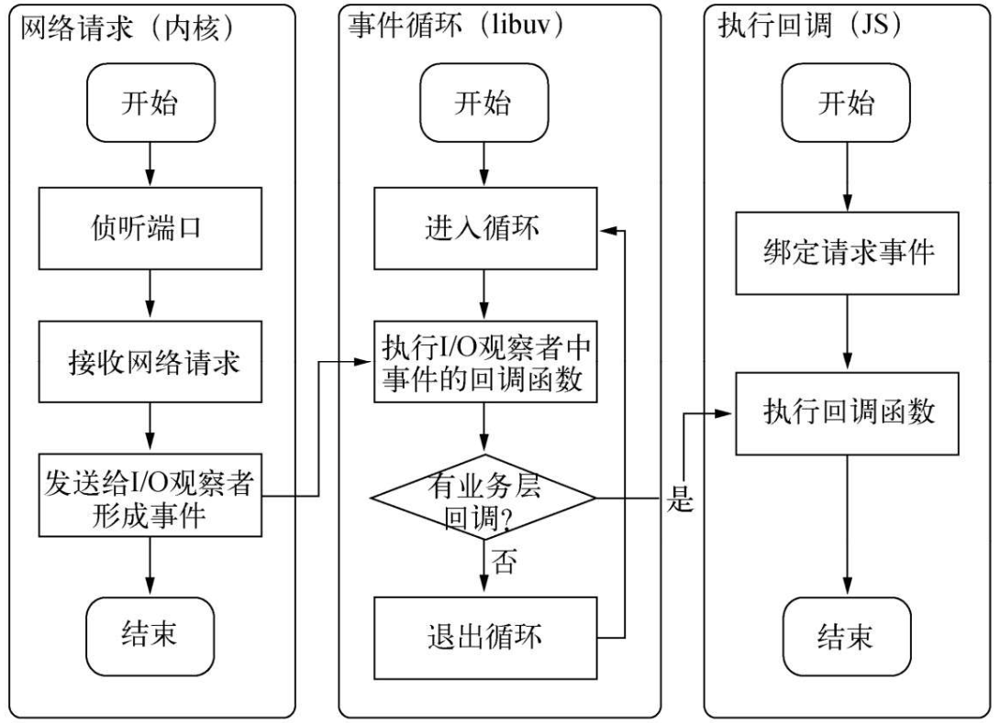

# Node

## Node 简介

Ryan Dahl 最初的目标是写一个基于事件驱动、非阻塞I/O的Web服务器，以达到更高的性能，提供 Apache 等服务器之外的选择。

> 项目的发展超过了他最初单纯开发一个 Web 服务器的想法，变成了构建网络应用的一个基础框架，这样可以在它的基础上构建更多的东西，诸如服务器、客户端、命令行工具等。

考虑到`高性能`、`符合事件驱动`、`没有历史包袱`这3个主要原因，JavaScript 成为了 Node 的实现语言。

Node 就是网络节点的意思，每一个Node进程都构成这个网络应用中的一个节点，这是它名字所含意义的真谛。

> 官方命名就是 Node，但这个名称在很多场景可以会有歧义，所以也常叫做 Node.js

### Node 给 JavaScript 带来的意义

JavaScript作为一门图灵完备的语言，长久以来却限制在浏览器的沙箱中运行，它的能力取决于浏览器中间层提供的支持有多少。

Node 让 JavaScript 可以脱离浏览器而运行，活跃在服务端、客户端、命令行工具等领域。

同时 Node 和 Npm 也推动了前端工程化的进展

### Node vs Chrome 浏览器


除了 HTML、WebKit 和显卡这些 UI 相关技术没有支持外，Node 的结构与 Chrome十分相似。它们都是基于事件驱动的异步架构，浏览器通过事件驱动来服务界面上的交互，Node通过事件驱动来服务I/O

### Node 的特点

Node 相对于传统的后端语言，有以下特点

- 单线程

    > Node 进程只有一个业务线程

- 异步 IO

    > 单线程的设计，也让 Node 的 IO 必然是异步的

- 事件与回调函数的编程方式

    > 继承前端的编程方式

- 跨平台

    > JavaScript 本身是解释型语言，Node 基于 libuv 库封装了平台差异，暴露出统一的 API，以实现 JavaScript 代码的跨平台

    

### Node 的应用场景

- I/O 密集型
- 前后端统一技术栈
- 高并发
- serverless

## 模块机制

Web1.0 时代，JavaScript 主要有两个作用，一个是表单校验，另一个是网页特效，这时前端的 JavaScript 代码量不会很大。

web2.0 时代，大量业务逻辑放到了前端来实现，JavaScript 代码量剧增，代码复用成为重要需求。各种前端库和框架被开发出来，这么库大致经历了工具类库、组件库、前端框架、前端应用的变迁：


在类聚和抽象代码库的过程中，JavaScript 中的一个先天缺陷日益突出：缺少模块机制

JavaScript 代码只能通过全局变量访问其它代码库，为了避免全局变量的冲突，不得不用命名空间等方式人为地约束代码，让模块之间的引用十分的丑陋

为了解决这个问题，社区提出了 CommonJS 规范

### CommonJS

CommonJS 的愿景是让 JavaScript 能够在任何地方运行

CommonJS 规范主要补充了 JavaScript 在服务端的相应规范

> Node 就是对 CommonJS 规范的一个实现



为了能够开发大型应用程序，CommonJS 定义了模块规范以及包管理规范

具体规范可以参考 [CommonJS 规范](./module?id=commonjs-规范)

### Node 的模块实现

Node 解析模块有 3 个步骤：

1. 路径分析
2. 文件定位
3. 编译执行

在 Node 中，模块分为两类：一类是 Node 提供的模块，称为核心模块；另一类是用户编写的模块，称为文件模块。

> 部分核心模块会编译到 Node 的二进制执行文件中，Node 进程启动时，就被直接加载进内存中，这部分模块无需路径分析和文件定位

> Node 会缓存模块解析的结果，即每个模块只会被解析执行一次

模块之间的主要调用关系


#### 路径分析

模块路径标识符类型：

1. 核心模块，如 http、fs、path 等。

2. `.` 或 `..` 开始的相对路径文件模块。

3. 以 `/` 开始的绝对路径文件模块。

4. 非路径形式的文件模块，如自定义的 connect 模块。

    > 其实就是查找 node_modules 目录下的模块，先在当前文件目录下找 node_modules，如果没有从父目录逐级往上找，直到根目录

> 路径分析，就是先找缓存，然后按上面的类型的顺序来找

### 文件定位


### 模块编译

在Node中，每个文件模块都是一个对象，它的定义如下

```js
function Module(id, parent) {
    this.id = id;
    this.exports = {};
    this.parent = parent;
    if (parent && parent.children) {
        parent.children.push(this)
    }

    this.filename = null;
    this.loaded = false;
    this.children = [];
}

Module.cache = {}
```

> Node 文件模块中的 `module` 对象就是这样一个实例

- js 模块文件的编译

    ```js
    require(moduleId) {
        if (Module.cache[moduleId]) {
            return Module.cache[moduleId].exports;
        }

        let moduleContent = findModuleContentById(moduleId);

        let depModule = new Module(moduleId, module);

        new Function("requrie", "exports", "module", "__filename", "__dirname", moduleContent)(require, depModule.exports, depModule. __filename, __dirname)

        Module.cache[moduleId] = depModule;

        return depModule.exports
    }
    ```

- node 模块文件的编译

    实际上，.node 的模块文件并不需要编译，因为它是编写 C/C++ 模块之后编译生成的，所以这里只有加载和执行的过程。在执行的过程中，模块的 exports 对象与 .node 模块产生联系，然后返回给调用者。

- json 模块文件的编译

    Node 利用 fs 模块同步读取 JSON 文件的内容之后，调用 JSON.parse() 方法得到对象，然后将它赋给模块对象的 exports，以供外部调用。

- 其它后缀的模块文件的编译

    默认按 js 模块文件来编译，如果要自定义编译，可以扩展 `Module._extensions` 对象，比如内置的 `.json` 文件的编译方法：

    ```js
    Module._extensions['.json'] = function(module, filename) {
        var content = NativeModule.require('fs').readFileSync(filename, 'utf8');
        try {
            module.exports = JSON.parse(stripBOM(content));
        } catch (err) {
            err.message = filename + ":" + err.message;
            throw err;
        }
    }
    ```

    Module 对象在代码中访问不到，但是 `Module._extensions` 会被赋值给 `require()` 的 `extensions` 属性，所以通过在代码中访问 `require.extensions` 可以知道系统中已有的扩展加载方式

    ```js
    console.log(require.extensions);
    ```

### 兼容 CommonJS Module 和 ES Module

ECMASCript 在语言规范层面定义了模块机制，这是未来的主流，新版本的 Node 同时兼容了 CommonJS Module 和 ES Module 规范，具体选用逻辑如下：


### 包与 npm

Node组织了自身的核心模块，也使得第三方文件模块可以有序地编写和使用。但是在第三方模块中，模块与模块之间仍然是散列在各地的，相互之间不能直接引用。而在模块之外，包和NPM则是将模块联系起来的一种机制。

包的出现，则是在模块的基础上进一步组织JavaScript代码


包实际上是一个存档文件，即一个目录直接打包为．zip或tar.gz格式的文件，安装后解压还原为目录

完全符合CommonJS规范的包目录应该包含如下这些文件

- package.json：包描述文件。
- bin：用于存放可执行二进制文件的目录。
- lib：用于存放JavaScript代码的目录。
- doc：用于存放文档的目录。
- test：用于存放单元测试用例的代码。

包描述文件的定义具体请阅读[文档](https://docs.npmjs.com/cli/v7/configuring-npm/package-json)

CommonJS包规范是理论，NPM是其中的一种实践。NPM 之于 Node，相当于 Maven 之于 Java。NPM 帮助 Node 完成了第三方模块的发布、安装和依赖等

> npm 是目前所有语言各种包管理系统中最活跃的，包数量最多的，可以在上面找到很多有用的工具。npm 也极大促进了前端工程化的进程

npm 的 基本命令

```bash
# 查看 npm 版本
npm -v

# 查看所有命令
npm 

# 安装全局命令；注意不是安装全局依赖，这里安装的包并不能被 requrie；而是根据包描述文件中的bin字段配置，将实际脚本链接到与 Node 可执行文件相同的路径下
npm install -g <package>

# 从npm下载并安装包
npm install <package>

# 安装本地的包
npm install <tarball file>
npm install <tarball url>
npm install <folder>

# 临时指定npm仓库安装
npm install <package> --registry=http://registry.url

# 指定后续的 npm 仓库
npm config set registry http://registry.url

# 初始化包描述文件
npm init

# 注册包仓库账号
npm adduser

# 登录包仓库账号
npm login

# 发布包
npm publish .

# 查看依赖书
npm ls
```

npm 钩子机制详看[文档](https://docs.npmjs.com/cli/v7/using-npm/scripts)

在企业内部一般都搭建 npm 的私仓和镜像站，比如可以通过 [Nexus](https://hub.docker.com/r/sonatype/nexus3) 来搭建

## 异步 IO

### IO 模型

如果只有同步 IO，只能通过多线程或者多进程来实现并发，同时由于创建进程线程和执行期进程线程上下文切换的开销较大，导致进程线程数量不能太多，并发量受限

[Unix 5 种 IO 模型](../netty/?id=_5-%e7%a7%8d-io-%e6%a8%a1%e5%9e%8b)

现实的异步IO实现：

通过让部分线程进行阻塞I/O或者非阻塞I/O加轮询技术来完成数据获取，让一个线程进行计算处理，通过线程之间的通信将I/O得到的数据进行传递，这就轻松实现了异步I/O


> 我们时常提到Node是单线程的，这里的单线程仅仅只是JavaScript执行在单线程中罢了。在Node中，无论是*nix还是Windows平台，内部完成I/O任务的另有线程池。

### Node 的异步 IO

在进程启动时，Node便会创建一个类似于 `while(true)` 的循环，每执行一次循环体的过程我们称为 `Tick`


事件循环、观察者、请求对象、I/O线程池这四者共同构成了Node异步I/O模型的基本要素。


Node Web 服务器事件循环



### 非 IO 的异步 API

- setTimeout

    

- process.nextTick()

    每次调用 `process.nextTick()` 方法，只会将回调函数放入队列中，在下一轮 `Tick` 时取出执行。定时器中采用红黑树的操作时间复杂度为 `O(lg(n))`, `nextTick()` 的时间复杂度为 `O(1)`。相较之下，`process.nextTick()` 更高效。

- setImmediate()

    `setImmediate()` 的实现方式和 `process.nextTick()` 类似，只是优先级没有 `process.nextTick()` 高
    在具体实现上，`process.nextTick()` 的回调函数保存在一个数组中，`setImmediate()` 的结果则是保存在链表中。
    在行为上，`process.nextTick()` 在每轮循环中会将数组中的回调函数全部执行完，而 `setImmediate()` 在每轮循环中执行链表中的一个回调函数

## 异步编程

### 函数式编程

在开始异步编程之前，先得知晓 JavaScript 现今的回调函数和深层嵌套的来龙去脉。在 JavaScript 中，函数（function）作为一等公民，使用上非常自由，无论调用它，或者作为参数，或者作为返回值均可

`高阶函数` 是高阶函数则是可以把函数作为参数，或是将函数作为返回值的函数

`偏函数` 用法是指创建一个调用另外一个部分——参数或变量已经预置的函数——的函数的用法

### 异步编程的优势和难点

- 优势: 高性能

    > Node带来的最大特性莫过于基于事件驱动的非阻塞I/O模型，这是它的灵魂所在

- 难点

    - 异常处理
    - 函数嵌套过深
    - 阻塞代码
    - 多线程编程
    - 异步转同步

### 异步编程常见模式

- 事件发布/订阅模式。

    事件发布/订阅模式自身并无同步和异步调用的问题，但在Node中，emit()调用多半是伴随事件循环而异步触发的，所以我们说事件发布/订阅广泛应用于异步编程。

    利用 Node 的 events 库实现事件机制

    ```js
    var events = require('events')

    function Stream() {
        events.EventEmitter.call(this);
    }

    util.inherits(Stream, events.EventEmitter)
    ```

    使用偏函数实现多个异步后同步

    ```js
    var after = function (times, callback) {
        var count = 0, results = {};
        return function(key, value) {
            results[key] = value;
            count++;
            if (count === times) {
                callback(results);
            }
        }
    }

    var done = after(times, render);
    var emitter = new events.Emitter();
    emitter.on("done", done);

    fs.readFile(template_path, "utf8", function(err, template) {
        emitter.emit('done', 'template', template);
    })

    db.query(sql, function(err, data) {
        emitter.emit('done', 'data', data)
    })

    I10n.get(function(err, resources) {
        emitter.emit('done', 'resources', resources);
    }) 
    ```

- [Promise/Deferred](http://wiki.commonjs.org/wiki/Promises) 模式

    > 从 ES6 开始已经成为语言级别的规范，主流方向

    Promise 相关规范可以查看 [wiki](http://wiki.commonjs.org/wiki/Promises)

    具体使用方法可以参考 [文档](https://developer.mozilla.org/zh-CN/docs/Web/JavaScript/Guide/Using_promises)

    下面针对其中的 [Promise/A](http://wiki.commonjs.org/wiki/Promises/A) 规范，通过 Node 的 events 模块来实现一个 Promise 机制，依次来展示 Promise 大致的实现思路

    ```js
    var Promise = function () {
        EventEmitter.call(this)
    }
    util.inherits(Promise, EventEmitter)

    Promise.prototype.then = function (fullfilledHandler, errorHandler, progressHandler) {
        if (typeof fullfilledHandler === 'function') {
            this.once('success', fullfilledHandler)
        }

        if (typeof errorHandler === 'function') {
            this.once('error', errorHandler);
        }

        if (typeof progressHandler === 'function') {
            this.once('progress', progressHandler)
        }

        return this;
    }

    var Deferred = function () {
        this.state = 'unfullfilled';
        this.promise = new Promise();
    }

    Deferred.prototype.resolve = function (obj) {
        this.state = 'fullfilled';
        this.promise.emit('success', obj)
    }

    Deferred.prototype.reject = function(err) {
        this.state = 'failed';
        this.promise.emit('error', err)
    }

    Deferred.prototype.progress = function(data) {
        this.promise.emit('progress', data)
    } 
    ```

    > `Deferred` 主要是用于内部，用于维护异步模型的状态；Promise 则作用于外部，通过 `then()` 方法暴露给外部以添加自定义逻辑

    > 上述只是 Promsie 的一个实现思路，真实的 ECMAScript Promise 会更加的优雅严谨

    使用 Promise 封装已有的 Emitter 对象

    ```js
    var promisify = function(res) {
        var deferred = new Deferred();
        var result = '';
        res.on("data", function (chunk) {
            result += chunk;
            deferred.progress(chunk);
        })

        res.on("end", function() {
            deferred.resolve(result);
        })

        res.on("error", function(err) {
            deferred.reject(err);
        })

        return defered.promise;
    }
    ```

    支持序列执行的 Promise

    ```js
    var Deferred = function() {
        this.promise = new Promise();
    }

    Deferred.prototype.resolve = function(obj) {
        var promise = this.promise;
        var handler;
        while((handler = promise.queue.shift())) {
            if (handler && handler.fulfilled) {
                var ret == handler.fulfilled(obj);
                if (ret && ret.isPromise) {
                    ret.queue = promise.queue;
                    this.promise = ret
                    return;
                }
            }
        }
    }

    // reject 的实现思路与resolve相同

    var Promise = function() {
        // 队列用于存储待执行的回调函数
        this.queue = []
        this.isPromise = true;
    }

    Promise.prototype.then = function (fulfilledHandler, errorHandler, progressHandler) {
        var handler = {};
        if (typeof fullfilledHandler === 'function') {
            handler.fulfilled = fulfilledHandler;
        }
        // 省略 errorHandler 和 progressHandler 的处理
        this.queue.push(handler);
        return this;
    }
    ```

- 流程控制库

    > Promise 已取得主导地位，这一模块就不多介绍

## 内存控制

由于浏览器页面内存占用一般不多，就算过多，用户也会自行刷新页面，所以在过去很长一段时间内JavaScript开发者很少在开发过程中遇到需要对内存精确控制的场景，也缺乏控制的手段。

随着 Node 的发展，JavaScript 开始用于服务端开发；在服务端场景，内存占用过多或者泄露会严重影响服务的性能和稳定性，是不可接受的。

为此，每个 Node 开发者都应该了解 Node 的内存机制

### V8 的垃圾回收机制与内存限制

V8 是 Node 的执行引擎，其作用可类比于 Java 中的 JVM

Lars Bak 是 V8 的主要领导者，刚好他之前就是在 Sun 担任 HotSpot 团队的技术领导，因此 V8 的垃圾回收机制和 JVM 有很多类似的地方

> 可参考 [JVM](../java/jvm.md) 章节来作类比学习

在 V8 中，所有的 JavaScript 对象都是通过堆来进行分配的

堆内存主要分为新生代和老年代:

- 新生代采用标记复制算法

    > 和 JVM 不一样的是，V8 的新生代没有 Eden，只有 From 和 To 空间。
    
    > 对象在 From 空间分配，垃圾回收把存活的对接从 From 空间复制到 To 空间，同时互换两个空间的角色

- 老年代采用标记清除算法

    > 没有空间分配时再采用标记整理算法清理碎片化空间

    > 为了降低全堆垃圾回收带来的停顿时间，V8 先从标记阶段入手，将原本要一口气停顿完成的动作改为增量标记（incremental marking），也就是拆分为许多小“步进”，每做完一“步进”就让 JavaScript 应用逻辑执行一小会儿

    

    > V8 还引入了延迟清理（lazy sweeping）与增量式整理（incrementalcompaction），让清理与整理动作也变成增量式的。同时还计划引入并行标记与并行清理，进一步利用多核性能降低每次停顿的时间

对象从新生代晋升的条件有以下两个，满足其一即可

- 之前经历过一次回收，
- To 空间的内存占用比超过限制(默认是 25%)。

!> 为了避免过大的堆导致过长的停顿时间，默认情况下，V8 堆内存的最大值在 64 位系统上为 1464 MB（1400 old + 2 * 32 new）,32位系统上则为 732 MB（700 old +  2* 16 new）

相关命令

```bash
# 获取内存信息, rss 为进程的常驻内存部分(其余部分在 swap 或者 filesystem 中), heapTotal 和 heapUsed 对应的是 V8 的堆内存信息
node -e "console.log(process.memoryUsage())"

# 指定新生代和老年代大小,单位为 MB
node --max-old-space-size=1700 --max-new-space-size=1024 test.js

# 开启打印垃圾收集日志
node --trace_gc test.js > gc.log

# 打开性能分析开关，获取垃圾回收性能数据，数据存储在当前目录下的 v8.log 文件中
node --prof test.js
# 使用 Node 源码的 deps/v8/tools 目录下的 linux-tick-processor 分析日志
linux-tick-processor v8.log
```

### 高效使用内存

在正常的 JavaScript 执行中，无法立即回收的内存有 `闭包` 和 `全局变量引用` 这两种情况。由于 V8 的内存限制，要十分小心此类变量是否无限制地增加，因为它会导致老生代中的对象增多。

### 内存泄漏

造成内存泄漏的原因有如下几个。

- 缓存。
- 队列消费不及时。
- 作用域未释放。

内存泄漏排查工具: node-heapdump

### 堆外内存

Node 中的 Buffer 对象不同于其他对象，它不经过 V8 的内存分配机制，所以也不会有堆内存的大小限制。

## Buffer

[官方文档](https://nodejs.org/dist/latest-v16.x/docs/api/buffer.html)

JavaScript 中没有关于二进制字节的类型，这在主要操作字符串的前端问题不大，但是对于 Web 应用，二进制流是很常见的。

为此，Node 引入了 Buffer。

Buffer 是一个像 Array 的对象，但它主要用于操作字节

Buffer是一个典型的 JavaScript 与 C++ 结合的模块，它将性能相关部分用 C++ 实现，将非性能相关的部分用 JavaScript 实现


> Buffer 所占用的内存不是通过V8分配的，属于堆外内存

由于 Buffer 太过常见，Node 在进程启动时就已经加载了它，并将其放在全局对象（global）上。所以在使用 Buffer 时，无须通过 require() 即可直接使用。

### Buffer 内存分配

为了高效地使用申请来的内存，Node采用了 slab 分配机制。slab就是一块申请好的固定大小的内存区域，大小是 8KB，在 JavaScript 层面以它作为单位单元进行内存的分配。

伪代码:

```js
var pool;
function allocPool() {
    pool = new SlowBuffer(Buffer.pollSize);
    pool.used = 0;
}

function Buffer() {
    if (!pool || pool.length - pool.used < this.length>) {
        allocPool();
    }
    this.parent = pool;
    this.offset = pool.used;
    pool.used += this.length;
    if (pool.used & 7) pool.used = (pool.used + 8) & ~7
}
```

如果 slab 剩余的空间不够，将会构造新的 slab，原 slab 中剩余的空间会造成浪费

由于同一个slab可能分配给多个 Buffer 对象使用，只有这些小 Buffer 对象在作用域释放并都可以回收时，slab的8 KB空间才会被回收

如果需要超过8 KB的Buffer对象，将会直接分配一个SlowBuffer对象作为slab单元，这个 slab 单元将会被这个大Buffer对象独占。

```js
this.parent = new SlowBuffer(this.length);
this.offset = 0;
```

### Buffer 的常见用法

字符串和Buffer的互转

```js
var str = "你好世界"
var buf = Buffer.from(str, 'utf-8')
asset buf.toString('utf-8') === str
```

Buffer 的拼接

```js
// 以下是网络请求经典代码
var chunks = []
var size = 0;
res.on('data', function (chunk) {
    chunks.push(chunk)
    size += chunk.length;
})
res.on('end', function() {
    var buf = Buffer.concat(chunks, size);
    var str = buf.toString('utf8')
    console.log(str)
})
```

> 网络请求都是需要先把字符串转成 Buffer 再传送，对于静态内容，可以先转成 Buffer，后续的传送都直接用这个 Buffer，可以避免每次都转换，提高性能

## 网络编程

Node 最初就是为了搭建 web 服务器而生

Node 提供了 net、dgram、http、https 这4个模块，分别用于处理 TCP、UDP、HTTP、HTTPS，适用于服务器端和客户端。

### TCP

[文档](https://nodejs.org/dist/latest-v16.x/docs/api/net.html)

服务端:

```js
var net = require('net')

var server = net.createServer(function(socket) {
    console.log("have a new client connected")

    socket.on('data', function(data) {
        socket.write('你好')
    })

    socket.on('end', function() {
        socket.write('连接断开')
    })

    socket.write('欢迎光临')
})

// 监听接口
server.listen(8124, function() {
    console.log('server bound')
})

// 或者监控 sock 文件
server.listen('/tmp/echo.sock', function() {
    console.log('server bound')
})
```

客户端

```js
var net = require('net')
var client = net.connect({port: 8124}, function() {
    console.log('client connected')
    client.write('world!\n')
})

client.on('data', function(data) {
    console.log(data.toString)
    client.end()
})

client.on('end', function() {
    console.log('client disconnected')
})
```

### UDP

[文档](https://nodejs.org/dist/latest-v16.x/docs/api/dgram.html)

### HTTP

[文档](https://nodejs.org/dist/latest-v16.x/docs/api/http.html)

Node 的 http 模块包含对 HTTP 处理的封装。HTTP服务继承自 TCP 服务器（net模块）

TCP 服务以 `connection` 为单位进行服务，HTTP 服务以 `request` 为单位进行服务。http 模块即是将 `connection` 到 `request` 的过程进行了封装


http 模块将连接所用套接字的读写抽象为 `ServerRequest` 和 `ServerResponse` 对象，它们分别对应请求和响应操作。
在请求产生的过程中，http 模块拿到连接中传来的数据，调用二进制模块 `http_parser` 进行解析，在解析完请求报文的报头后，触发 `request` 事件，调用用户的业务逻辑


服务端

```js
const http = require('http');

// Create a local server to receive data from
const server = http.createServer((req, res) => {
  var buffers = []
  req.on('data', function(trunk){
      buffers.push(trunk);
  }).on('end', function() {
      var buffer = Buffer.concat(buffers);
      // TODO
      res.writeHead(200, { 'Content-Type': 'application/json' });
      res.end(JSON.stringify({
        data: 'success'
      }));
  })
});

server.listen(8000);
```


客户端

```js
const http = require('http');

const postData = JSON.stringify({
  'msg': 'Hello World!'
});

const options = {
  hostname: 'localhost',
  port: 8000,
  path: '/upload',
  method: 'POST',
  headers: {
    'Content-Type': 'application/json',
    'Content-Length': Buffer.byteLength(postData)
  }
};

const req = http.request(options, (res) => {
  console.log(`STATUS: ${res.statusCode}`);
  console.log(`HEADERS: ${JSON.stringify(res.headers)}`);
  res.setEncoding('utf8');
  res.on('data', (chunk) => {
    console.log(`BODY: ${chunk}`);
  });
  res.on('end', () => {
    console.log('No more data in response.');
  });
});

req.on('error', (e) => {
  console.error(`problem with request: ${e.message}`);
});

// Write data to request body
req.write(postData);
req.end();
```

### WebSocket

> 尽管 Node 没有内置 WebSocket 的库，但是社区的 `ws` 模块封装了 WebSocket 的底层实现

```js
const http = require('http');

// Create an HTTP server
const server = http.createServer((req, res) => {
  res.writeHead(200, { 'Content-Type': 'text/plain' });
  res.end('okay');
});
server.on('upgrade', (req, socket, head) => {
  socket.write('HTTP/1.1 101 Web Socket Protocol Handshake\r\n' +
               'Upgrade: WebSocket\r\n' +
               'Connection: Upgrade\r\n' +
               '\r\n');

  var websocket = new WebSocket();
  websocket.setSocket(socket);
  setInterval(function() {
    websocket.send(new Date() + ": test data")
  }, 50)
  wobsocket.send("heloo")
});

// Now that server is running
server.listen(1337);
```

浏览器客户端

```js
var socket = new WebSocket('ws://127.0.0.1:1337/updates')
socket.onopen = function() {
  console.log("connected")
}
socket.onmessage = function (event) {
  console.log(event.data);
}
```

### 网路安全

[TLS/SSL 文档](https://nodejs.org/dist/latest-v16.x/docs/api/tls.html#tlscreateserveroptions-secureconnectionlistener)
[HTTPS 文档](https://nodejs.org/dist/latest-v16.x/docs/api/https.html#httpscreateserveroptions-requestlistener)

## 构建 Web 应用

> npm 社区有上有很多优秀的 Web 框架，比如 [express](https://expressjs.com/), [connect](https://github.com/senchalabs/connect)

Node 提供的 http 模块相对来说比较简单，要完成真实的业务需求，还需要大量的工作。

从一个简单的 http 服务器到一个 Web 应用框架，需要加持以下的能力

- 请求方法的判断
- URL的路径解析
- URL中查询字符串解析
- Cookie的解析
- Basic认证
- 表单数据的解析
- 任意格式文件的上传处理
- Session
- 中间件(Filter)
- CSRF
- 请求体大小限制


其实要实现这些能力并非难事，一切都是从 request 事件展开

```js
var http = require('http');
http.createServer(function (req, res) {
  // request 事件处理回调
  res.writeHead(200, {'Content-Type': 'text/plain'});
  res.end('Hello World\n');
}).listen(1337, '127.0.0.1')
```

接下来看下 Web 框架 Connect 或者 Express 的入口代码

```js
var app = connect();
// var app = express();
// TODO
http.createServer(app).listen(1337);
```

可见，request 事件回调就是一个 Web 框架的封装入口

接下来我们将在 reqeust 中实现 Web 框架的部分能力

### 根据请求方法转发

Node 的 http 模块会解析 http 协议，获取请求方法放置到 req.method 中

```js
function (req, res) {
  switch(req.method) {
    case 'POST':
      update(req, res);
      break;
    case 'DELETE':
      remove(req, res);
      break;
    case 'PUT':
      create(req, res);
      break;
    case 'GET':
    default:
      get(req, res);
  }
}
```

### 查询字符串

```js
var url = require('url')
var querystring = require('querystring')
// 解析成 JSON 对象
req.query = querystring.parse(url.parse(req.url).query);
```

### Cookie

```js
var parseCookie = function(cookie) {
  var cookies = {}
  if (!cookies) {
    return cookies
  }
  var list = cookie.split(';')
  for (var i = 0; i < list.length; i++) {
    var pair = list[i].split('=')
    cookies[pairs[0].trim()] = pair[1];
  }
  return cookies;
}

function (req, res) {
  req.cookies = parseCookie(req.headerss.cookie)
  handle(req, res)
}
```

### 请求体解析

```js
var hasBody = function (req) {
  return 'content-length' in req.headers;
}
var mime = function(req) {
  var str = req.headers['content-type'] || '';
  return str.split(';')[0];
}
function (req, res) {
  if (hasBody(req)) {
    if (mime(req) === 'multipart/form-data') {
      var form = new formidable.IncommingForm();
      form.parse(req, function (err, fields, files)) {
        req.body = fields;
        req.files = files;
        handle(req, res)
      }
    } else {
      var buffers = []
      req.on('data', function(chunk) {
        buffers.push(chunk)
      })
      req.on('end', function(){
        req.rawBody = Buffer.concat(buffers).toString();
        parseBody(req, res)
        handle(req, res)
      })
    }
    
  }
}

var formidable = require('formidable')
function handle(req, res) {
  switch(mime(req)) {
    case 'application/x-www-form-urlencoded':
      req.body = querystring.parse(req.rawBody);
      break;
    case 'application/json':
      req.body = JSON.parse(req.rawBody)
      break;
  }
}
```

### 路由解析

如何根据 URL 做路由映射，这里有两个分支实现。

一种方式是通过 `手工关联映射`，一种是 `自然关联映射`。前者会有一个对应的路由文件来将URL映射到对应的控制器，后者没有这样的文件

- 手动关联映射

  ```js
  var routes = []

  var use = function(path, action) {
    routes.push([path, action])
  }

  function (req, res) {
    var pathname = url.parse(req.url).pathname
    for (var i = 0; i < routes.length; i++) {
      var route = routes[i]
      if (pathname === route[0]) {
        action(req, res);
        return;
      }
    }
    handle404(req, res)
  }
  ```

  > 还可以继续让路由支持正则匹配、路径参数等

- 自然关联映射

  基于约定的方式，用 require() 加载相应路径下的处理函数

### RESFful 与请求方法路由

MVC 模式大行其道了很多年，直到 RESTful 的流行，大家才意识到 URL 也可以设计得很规范，请求方法也能作为逻辑分发的单元。

它的设计哲学主要将服务器端提供的内容实体看作一个资源，并表现在URL上。

REST的设计就是，通过URL设计资源、请求方法定义资源的操作，通过Accept决定资源的表现形式。

> 相比 MVC, RESTful 只是将 HTTP 请求方法也加入了路由的过程，以及在 URL 路径上体现得更资源化。

### 中间件

中间件的行为比较类似 Java 中过滤器（filter）的工作原理，就是在进入具体的业务处理之前，先让过滤器处理

前面的解析步骤都可以抽成中间件

> 加个中间层解决问题

一般中间层是通过尾触发的方式实现

> 当然也有通过外层遍历，约定返回值来决定是否继续往下执行，一般需要定义前置和后置两个方法，两个方法间数据通过 context 对象传递

```js
var middleware = function(req, res, next) {
  // TODO
  next()
}

var routes = {
  all: []
  get: []
  post: []
}

app.use = function (path) {
  var handle;
  if (typeof path === 'string') {
    handle = {
      path: pathRegexp(path),
      stack: Array.prototype.slice.call(arguments, 1)
    }
  } else {
    handle = {
      path: pathRegexp('/')
      stack: Array.prototype.slice.call(arguments, 0)
    }
  }
  routes.all.push(handle)
}

app.use(querystring);
app.use(cookie)
app.use(session)
app.get('/user/:username', getUser);
app.get('/user/:username', authorize, updateUser)

function (req, res) {
  var pathname = url.parse(req.url).pathname
  var method = req.method.toLowerCase();
  var stacks = match(pathname, routes.all)
  stacks.concat = match(pathname, routes[method]);
  if (stacks.length) {
    handle(req, res, stacks);
  } else {
    handle404(req, res);
  }
}

var handle = function(req, res, stack) {
  var next = function() {
    var middleware = stack.shift()
    if (middleware) {
      middleware(req, res, next);
    }
  }
  next();
}
```

中间件要注重性能，避免占用过多的耗时

- 编写高效的中间件
- 合理利用路由，避免不必要的中间件执行

### 页面渲染

使用模板引擎

## 多进程

Node 的特色就是单线程+事件驱动, 它带来的好处是：程序状态是单一的，在没有多线程的情况下没有锁、线程同步问题，操作系统在调度时也因为较少上下文的切换，可以很好地提高CPU的使用率。

但是单线程也有两个很明显的缺点：1. 无法充分利用多核 CPU 的算力，2. 单线程上抛出的异常没有被捕获，将会引起整个进程的崩溃

### 多进程架构

为了能够充分使用多核 CPU，Node 提供了 [child_process](https://nodejs.org/dist/latest-v16.x/docs/api/child_process.html) 模块来创建子进程，实现多进程架构

父子进程采用 IPC 通信，Node 中实现 IPC 通道的是管道（pipe）技术。但此管道非彼管道，在Node中管道是个抽象层面的称呼，具体细节实现由libuv提供，在Windows下由命名管道（named pipe）实现，*nix系统则采用 `Unix Domain Socket` 实现。

父进程在实际创建子进程之前，会创建IPC通道并监听它，然后才真正创建出子进程，并通过环境变量（`NODE_CHANNEL_FD`）告诉子进程这个IPC通道的文件描述符。子进程在启动的过程中，根据文件描述符去连接这个已存在的IPC通道，从而完成父子进程之间的连接

多进程架构 TCP 服务器

```js
// parent.js
var cp = require('child_process')
var child1 = cp.fork('child.js')
var child2 = cp.fork('child.js')

var server = require('net').createServer();
server.listen(1337, function() {
  // IPC 不可以传递对象，这里由框架解析，最后传递的是文件描述符
  child1.send('server', server)
  child2.send('server', server)
  server.close()
})

// child.js
process.on('message', function(m, server) {
  if (m === 'server') {
    server.on('connect', function(socket) {
      socket.end('handled by child, pid is ' + process.pid + '\n')
    })
  }
})
```


多个应用监听相同端口时，文件描述符同一时间只能被某个进程所用。换言之就是网络请求向服务器端发送时，只有一个幸运的进程能够抢到连接，也就是说只有它能为这个请求进行服务。这些进程服务是抢占式的。

### 稳定多进程集群

- 性能问题

- 多个工作进程的存活状态管理。

  > 工作进程监听到进程错误，发送事件给父进程重启新的工作进程，同时等待所有连接断开或者超时后退出进程

- 工作进程的平滑重启。

  > 先启动一个新的工作进程，然后关闭一个老的工作进程

- 配置或者静态数据的动态重新载入

### Cluster 模块

[文档](https://nodejs.org/dist/latest-v16.x/docs/api/cluster.html)

事实上 cluster 模块就是 child_process 和 net 模块的组合应用

cluster 启动时，它会在内部启动 TCP 服务器，在 cluster.fork() 子进程时，将这个 TCP 服务器端 socket 的文件描述符发送给工作进程。

## 单元测试

常见测试框架 [Jest](https://jestjs.io/) 和 [mocha](https://mochajs.org/)

单元测试相关理念可参考 [单元测试章节](/docs/devops/test)


## References

- [Node 文档](https://nodejs.org/dist/latest-v16.x/docs/api/)
- [Node Github](https://github.com/nodejs/node)
- [《深入浅出 Node.js》]()
