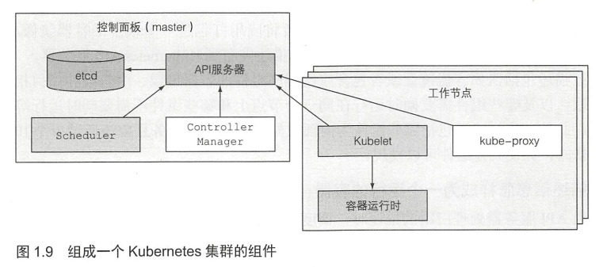

# Kubernetes

[CNCF](https://landscape.cncf.io/?category=remote-procedure-call&grouping=category)

Kubernetes 是容器编排系统，被称为云原生时代的操作系统

如果说以 Docker 为代表的容器引擎将软件的发布流程从分发二进制安装包转变为直接分发虚拟化后的整个运行环境，令应用得以实现跨机器的绿色部署；那以 Kubernetes 为代表的容器编排框架，就是把大型软件系统运行所依赖的集群环境也进行了虚拟化，令集群得以实现跨数据中心的绿色部署，并能够根据实际情况自动扩缩。

> Docker 封装单体应用，Kubernetes 封装分布式系统

> Kubernetes 是微服务时代的必然，可以自动化地完成海量微服务的调度、配置、监控和故障处理等需求

> Kubernetes 抽象了数据中心的基础设施，使得对外保留的只是一个巨大的资源池，不再需要关注底层的服务器



## Pod

Pod 是 k8s 中最小的可部署单元

> 如果说容器封装了进程，那么 Pod 就是封装了进程组

同一个 Pod 中的多个容器会默认共享以下名称空间：

- UTS 名称空间
- 网络名称空间
- IPC 名称空间
- 时间名称空间

### Kubernetes 中 Pod 名称空间共享的实现细节

Pod 内部多个容器共享 UTS、IPC、网络等名称空间是通过一个名为 `Infra Container` 的容器来实现的，这个容器是整个 Pod 中第一个启动的容器，只有几百 KB 大小（代码只有很短的几十行），Pod 中的其他容器都会以 `Infra Container` 作为父容器，UTS、IPC、网络等名称空间实质上都是来自 Infra Container 容器。

如果容器设置为共享 PID 名称空间的话，`Infra Container` 中的进程将作为 `PID 1` 进程，其他容器的进程将以它的子进程的方式存在，此时将由 Infra Container 来负责进程管理（譬如清理僵尸进程）、感知状态和传递状态。

由于 Infra Container 的代码除了注册 SIGINT、SIGTERM、SIGCHLD 等信号的处理器外，就只是一个以 `pause()` 方法为循环体的无限循环，永远处于 Pause 状态，所以也常被称为 `Pause Container`。

## kubectl 常用命令行

语法: `kubectl [command] [TYPE] [NAME] [flags]`

> 为了简化命令行，可以使用别名: `alias k=kubectl`

> [TYPE] 资源类型无需输入全称，可以用前缀或者缩写，能唯一标识就行  
> 比如 `pods` 可以用 `po`，`replicationcontroller` 可以用 `rc`, `services` 可以用 `svc`

```bash
# 查看集群信息
kubectl cluster-info
# 查看所有命名空间的所有资源
kubectl get all -A

# 列出 pod 资源
kubectl get pods -n [namespace]
# 获取 pod 描述信息
kubectl describe pods [pod-name] -n [namespace]
# 获取 pod 的 yaml 格式配置
kubectl get pods [pod-name] -o yaml -n [namespace]
# 查看 pod 运行在那个节点上
kubectl get pods -o wide

# 修改 ReplicationController 的副本数
kubectl scale rc <rc_name> --replicas=<number>

# 创建 service
kubectl expose rc <rc_name> --type=LoadBalancer --port=8080 --name <service_name>
kubectl expose deployment <deployment_name> --type=NodePort --port=8080 --name <service_name>
# 本地转发到 service，然后可以通过 http://localhost:<local_port> 访问相应的服务端口
kubectl port-forward service/<service_name> <local_port>:<service_port>

# 运行一个容器的最简单方法
kubectl run <pod_name> --image=<image>:<tag> --port=8080 --command -- <cmd> <arg1> ...<argN>
# 查看容器日志
kubectl logs [pod-name] -c [container-name] -n [namespace]
# 进入容器
kubectl exec [pod-name] -c [container-name] -it bash -n [namespace]
```

> 涉及指定容器的，如果没有指定，就默认会查询主容器

## 本地配置 Kubernetes 环境

先安装 [minikube](https://minikube.sigs.k8s.io/docs/start/)

启动 K8S 集群: `minikube start`

确认集群是否正常: `kubectl cluster-info`

查看集群资源:

```bash
$ kubectl get all -A
NAMESPACE     NAME                                   READY   STATUS    RESTARTS      AGE
kube-system   pod/coredns-64897985d-5gwrg            1/1     Running   0             14m
kube-system   pod/etcd-minikube                      1/1     Running   1             14m
kube-system   pod/kube-apiserver-minikube            1/1     Running   1             14m
kube-system   pod/kube-controller-manager-minikube   1/1     Running   1             14m
kube-system   pod/kube-proxy-jlhzh                   1/1     Running   0             14m
kube-system   pod/kube-scheduler-minikube            1/1     Running   1             14m
kube-system   pod/storage-provisioner                1/1     Running   1 (14m ago)   14m

NAMESPACE     NAME                 TYPE        CLUSTER-IP   EXTERNAL-IP   PORT(S)                  AGE
default       service/kubernetes   ClusterIP   10.96.0.1    <none>        443/TCP                  14m
kube-system   service/kube-dns     ClusterIP   10.96.0.10   <none>        53/UDP,53/TCP,9153/TCP   14m

NAMESPACE     NAME                        DESIRED   CURRENT   READY   UP-TO-DATE   AVAILABLE   NODE SELECTOR            AGE
kube-system   daemonset.apps/kube-proxy   1         1         1       1            1           kubernetes.io/os=linux   14m

NAMESPACE     NAME                      READY   UP-TO-DATE   AVAILABLE   AGE
kube-system   deployment.apps/coredns   1/1     1            1           14m

NAMESPACE     NAME                                DESIRED   CURRENT   READY   AGE
kube-system   replicaset.apps/coredns-64897985d   1         1         1       14m
```

> 由上可见，K8S 的组件除了 kubelet 外，其它组件本身也是集群中的资源对象，以容器的形式运行

本质上 minikube 是宿主机运行的一个容器，然后这个容器内运行 K8S 集群，集群中运行的容器，也就是容器中的容器了。

登录 minikube 容器: `minikube ssh` 或者 `docker exec -it minikube bash`

访问 dashboard 图形化集群界面: `minikube dashboard`

关闭集群: `minikube stop`

删除所有集群资源: `minikube delete --all`

## References

- [kubectl 官方文档](https://kubernetes.io/docs/reference/kubectl/overview/)
- [容器的崛起](http://icyfenix.cn/immutable-infrastructure/container/history.html)
- [Kubernetes 生产环境安装文档](https://kubernetes.io/zh/docs/setup/production-environment/)
- [Kubernetes 安装工具文档](https://kubernetes.io/zh/docs/tasks/tools/)
