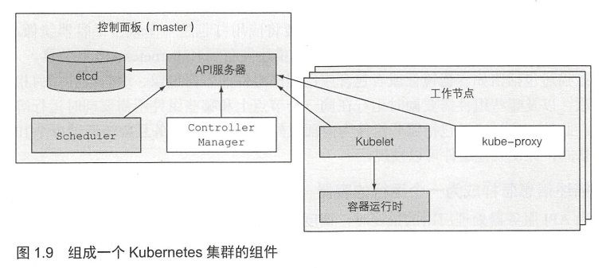
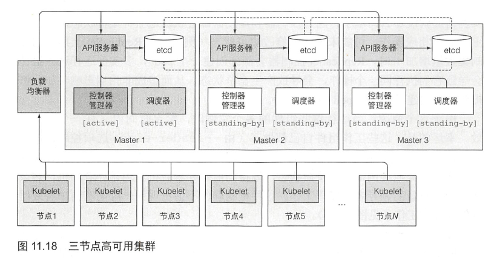
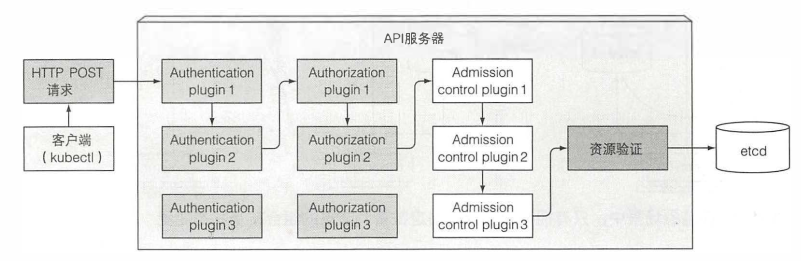
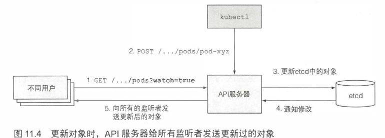
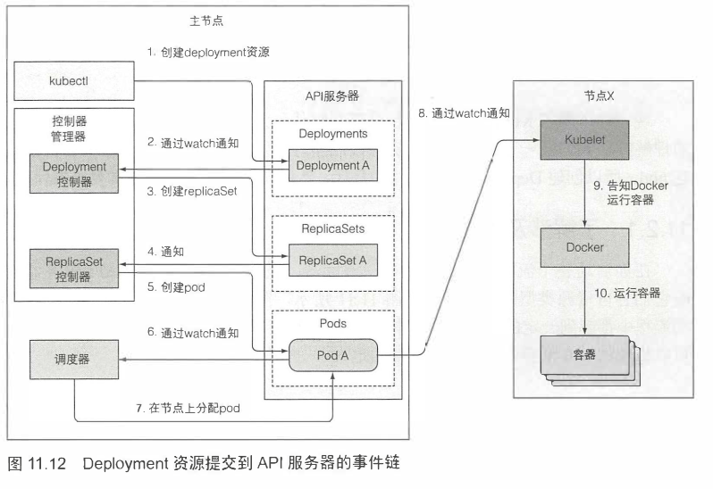

# Kubernetes 架构与原理

[文档](https://kubernetes.io/zh/docs/concepts/architecture/)

## Kubernetes 与容器引擎的调用关系

直至 Kubernetes 1.5 之前，Kubernetes 管理容器的方式都是通过内部的 `DockerManager` 向 Docker Engine 以 `HTTP` 方式发送指令，通过 Docker 来操作镜像的增删改查的:

> `Kubernetes Master → kubelet → DockerManager → Docker Engine → containerd → runC`

2016 年，Kubernetes 1.5 版本开始引入 `容器运行时接口（Container Runtime Interface，CRI）`，这是一个定义容器运行时应该如何接入到 `kubelet` 的规范标准，从此 Kubernetes 内部的 `DockerManager` 就被更为通用的 `KubeGenericRuntimeManager` 所替代，kubelet 与 KubeGenericRuntimeManager 之间通过 `gRPC` 协议通信

> `Kubernetes Master → kubelet → KubeGenericRuntimeManager → DockerShim → Docker Engine → containerd → runC`

2017 年，由 Google、RedHat、Intel、SUSE、IBM 联合发起的 `CRI-O（Container Runtime Interface Orchestrator）`项目发布了, 它完全遵循 CRI 规范进行实现的，而且它可以支持所有符合 `OCI` 运行时标准的容器引擎，默认仍然是与 `runC` 搭配工作的，若要换成 `Clear Containers`、`Kata Containers` 等其他 `OCI` 运行时也完全没有问题

> `Kubernetes Master → kubelet → KubeGenericRuntimeManager → CRI-O→ runC`

2018 年 由 Docker 捐献给 CNCF 的 containerd 发布了 1.1 版本，完美支持了 `CRI` 标准，因此也可以有以下的调用链

> `Kubernetes Master → kubelet → KubeGenericRuntimeManager → containerd → runC`

> 云计算厂商采用的容器运行时普遍都是 `containerd` 了

## Kubernetes 组件

[文档](https://kubernetes.io/zh/docs/concepts/overview/components/)

查看控制面组件状态: `kubectl get cs`

> 除了 kubelet 要负责运行容器所以自身无法以容器的形式运行外，其它组件都是以 Pod 的形式存在

Kubernetes 系统组件间只能通过 API 服务器通信，它们之间不会直接通信。

API 服务器是和 etcd 通信的唯一组件，其它组件不会直接和 etcd 通信，而是通过 API 服务器来修改集群状态

控制面的每个组件可以有多个实例。etcd 和 API 服务器的多个实例可以同时并行工作，但是调度器和控制器管理器只能有一个实例起作用，其它待命

### API 服务器

API 服务器通知客户端资源变更的机制

### 控制器管理器

[文档](https://kubernetes.io/zh/docs/concepts/architecture/controller/)

一个控制器至少追踪一种类型的 Kubernetes 资源。这些 对象 有一个代表期望状态的 spec 字段。 该资源的控制器负责确保其当前状态接近期望状态。

从逻辑上讲，每个控制器都是一个单独的进程， 但是为了降低复杂性，它们都被编译到同一个可执行文件，并在一个进程中运行。

> 编译在一起的是内置的控制器，自定义的控制器，以 Pod 形式独立存在

> 控制器之间不会直接通信，它们甚至不指导其它控制器的存在

常见的控制器有

- Replication 管理器 (ReplicationController 资源的管理器）
- ReplicaSet、 DaemonSet 以及 Job 控制器
- Deployment 控制器
- StatefulSet 控制器
- Node 控制器
- Servic 控制器
- Endpoints 控制器
- Namespace 控制器
- PersistentVolume 控制器
- 其他

## References

- [容器的崛起](http://icyfenix.cn/immutable-infrastructure/container/history.html)
