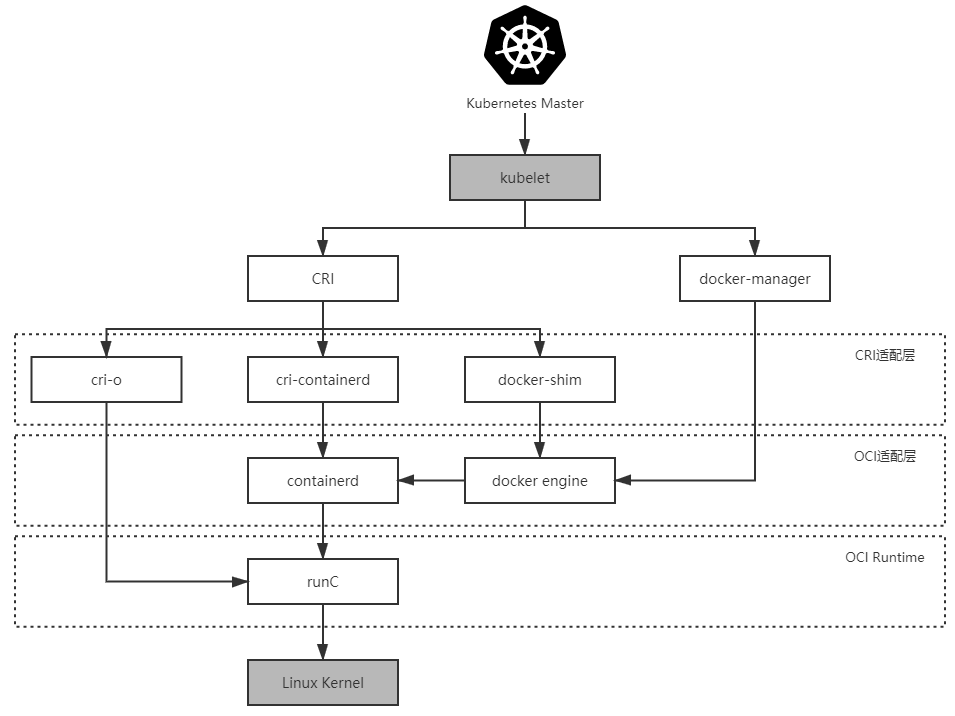

# Kubernetes 架构与原理

## Kubernetes 与容器引擎的调用关系

直至 Kubernetes 1.5 之前，Kubernetes 管理容器的方式都是通过内部的 `DockerManager` 向 Docker Engine 以 `HTTP` 方式发送指令，通过 Docker 来操作镜像的增删改查的:

> `Kubernetes Master → kubelet → DockerManager → Docker Engine → containerd → runC`

2016 年，Kubernetes 1.5 版本开始引入 `容器运行时接口（Container Runtime Interface，CRI）`，这是一个定义容器运行时应该如何接入到 `kubelet` 的规范标准，从此 Kubernetes 内部的 `DockerManager` 就被更为通用的 `KubeGenericRuntimeManager` 所替代，kubelet 与 KubeGenericRuntimeManager 之间通过 `gRPC` 协议通信

> `Kubernetes Master → kubelet → KubeGenericRuntimeManager → DockerShim → Docker Engine → containerd → runC`

2017 年，由 Google、RedHat、Intel、SUSE、IBM 联合发起的 `CRI-O（Container Runtime Interface Orchestrator）`项目发布了, 它完全遵循 CRI 规范进行实现的，而且它可以支持所有符合 `OCI` 运行时标准的容器引擎，默认仍然是与 `runC` 搭配工作的，若要换成 `Clear Containers`、`Kata Containers` 等其他 `OCI` 运行时也完全没有问题

> `Kubernetes Master → kubelet → KubeGenericRuntimeManager → CRI-O→ runC`

2018 年 由 Docker 捐献给 CNCF 的 containerd 发布了 1.1 版本，完美支持了 `CRI` 标准，因此也可以有以下的调用链

> `Kubernetes Master → kubelet → KubeGenericRuntimeManager → containerd → runC`

> 云计算厂商采用的容器运行时普遍都是 `containerd` 了

## References

- [容器的崛起](http://icyfenix.cn/immutable-infrastructure/container/history.html)

