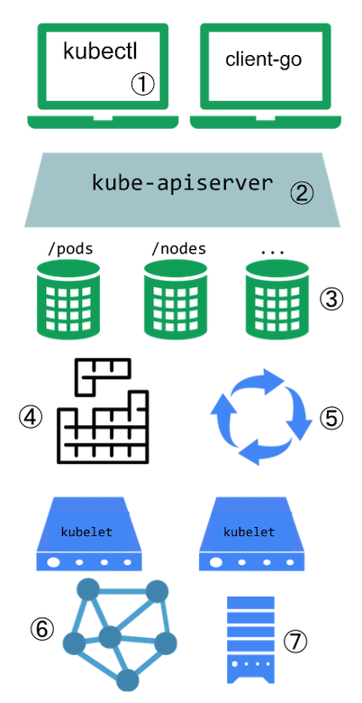
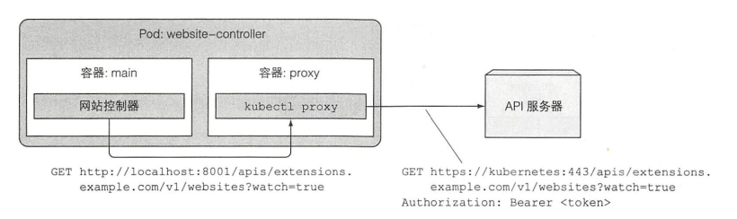
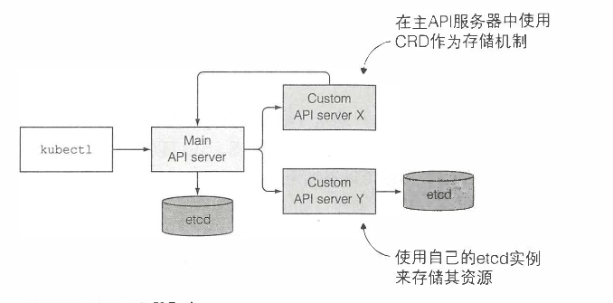
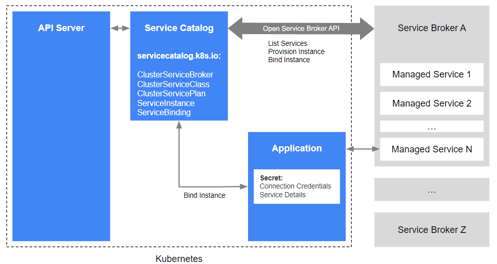

# 扩展 kubernetes

[文档](https://kubernetes.io/zh/docs/concepts/extend-kubernetes/)

## Kubernetes 的扩展点



1.  [kubectl 插件](https://kubernetes.io/zh/docs/tasks/extend-kubectl/kubectl-plugins/)能够扩展 kubectl 程序的行为。 这些插件只会影响到每个用户的本地环境，因此无法用来强制实施整个站点范围的策略。

2. API 服务器首先可以通过插件的方式扩展[访问控制流程](https://kubernetes.io/zh/docs/concepts/security/controlling-access/), 另外可以自定义子 API 服务器，实现对 API 对象的扩展

3. API 资源可以通过[自定义资源 CRD](https://kubernetes.io/zh/docs/concepts/extend-kubernetes/api-extension/custom-resources/) 来扩展

4. [调度器扩展](https://kubernetes.io/zh/docs/concepts/extend-kubernetes/#scheduler-extensions)

5. 自定义控制器常与 CRD 结合使用

6. kubelet 可通过[网络插件](https://kubernetes.io/zh/docs/concepts/extend-kubernetes/#network-plugins)扩展

7. kubelet 可通过[存储插件](https://kubernetes.io/zh/docs/concepts/extend-kubernetes/#storage-plugins)扩展

## 扩展 Kubernetes API 资源

扩展 API 资源主要有两种方式：

- CRD + 定制控制器
- 定制子 API 服务器

### CRD

[文档](https://kubernetes.io/zh/docs/tasks/extend-kubernetes/custom-resources/custom-resource-definitions/)

> 行业有句玩笑话，搞云原生主要就是对 CRD 的 CURD

通过 CustomResourceDefinition 定义新的 API 资源

```yaml
apiVersion: apiextensions.k8s.io/v1
kind: CustomResourceDefinition
metadata:
  # 名字必需与下面的 spec 字段匹配，并且格式为 '<名称的复数形式>.<组名>'
  name: crontabs.stable.example.com
spec:
  # 组名称，用于 REST API: /apis/<组>/<版本>
  group: stable.example.com
  # 列举此 CustomResourceDefinition 所支持的版本
  versions:
    - name: v1
      # 每个版本都可以通过 served 标志来独立启用或禁止
      served: true
      # 其中一个且只有一个版本必需被标记为存储版本
      storage: true
      # 定义校验规则
      schema:
        openAPIV3Schema:
          type: object
          properties:
            spec:
              type: object
              properties:
                cronSpec:
                  type: string
                image:
                  type: string
                replicas:
                  type: integer
  # 可以是 Namespaced 或 Cluster
  scope: Namespaced
  names:
    # 名称的复数形式，用于 URL：/apis/<组>/<版本>/<名称的复数形式>
    plural: crontabs
    # 名称的单数形式，作为命令行使用时和显示时的别名
    singular: crontab
    # kind 通常是单数形式的帕斯卡编码（PascalCased）形式。你的资源清单会使用这一形式。
    kind: CronTab
    # shortNames 允许你在命令行使用较短的字符串来匹配资源
    shortNames:
    - ct
```

创建新 API 对象

```yaml
apiVersion: "stable.example.com/v1"
kind: CronTab
metadata:
  name: my-new-cron-object
spec:
  cronSpec: "* * * * */5"
  image: my-awesome-cron-image
```

定制的 API 对象默认没有任何行为，如果需要加上行为，比如创建对应的 Depolyment，那么就需要[自定义控制器](https://kubernetes.io/zh/docs/concepts/extend-kubernetes/operator/)来处理自定义资源

自定义控制器一般是以 Pod 的形式运行在集群中，它监听自定义资源的变化，然后创建 deployment 和 service 等，以简化应用的部署和定义

[自定义资源控制器的示例](https://github.com/luksa/k8s-website-controller)



### 定制子 API 服务器   

Kubernetes 通过API服务器聚合，可以将自定义 API 服务器与主 Kubernetes API 服务器进行集成。



通常来说，每个 API 服务器会负责存储它们自己的资源。它可以运行自己的 `etcd` 实例（或整个 etcd 集群），也可以通过创建 `CRD` 实例将其资源
存储在核心 API 服务器的 etcd 存储中。

通过 APIService 资源注册新的 API 服务器

```yaml
apiVersion: apiregistration.k8s.io/v1
kind: APIService
metadata:
  name: <注释对象名称>
spec:
  group: <扩展 Apiserver 的 API 组名>
  version: <扩展 Apiserver 的 API 版本>
  groupPriorityMinimum: <APIService 对应组的优先级, 参考 API 文档>
  versionPriority: <版本在组中的优先排序, 参考 API 文档>
  service:
    namespace: <拓展 Apiserver 服务的名字空间>
    name: <拓展 Apiserver 服务的名称>
  caBundle: <PEM 编码的 CA 证书，用于对 Webhook 服务器的证书签名>
```

## 服务目录

[文档](https://kubernetes.io/zh/docs/concepts/extend-kubernetes/service-catalog/)

服务目录（Service Catalog）本身就是一个定制的子 API 服务器，它的作用是让 Kubernetes 集群中运行的应用易于使用外部托管的的软件服务，例如云供应商提供的数据仓库服务。

> 这个中间层的作用主要是便于外部服务的使用，监测等

架构:



## References

- [自定义资源控制器的示例](https://github.com/luksa/k8s-website-controller)