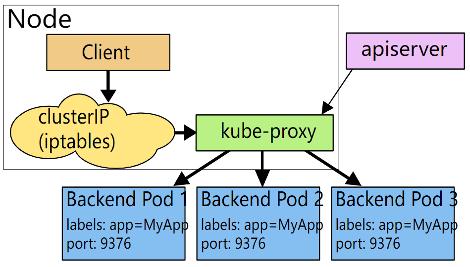
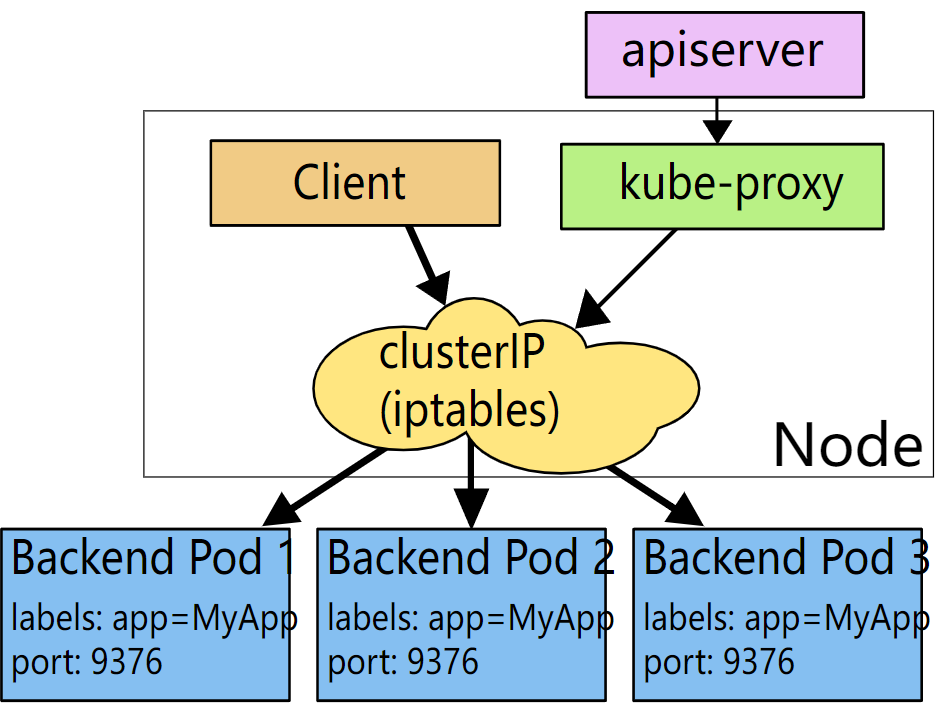
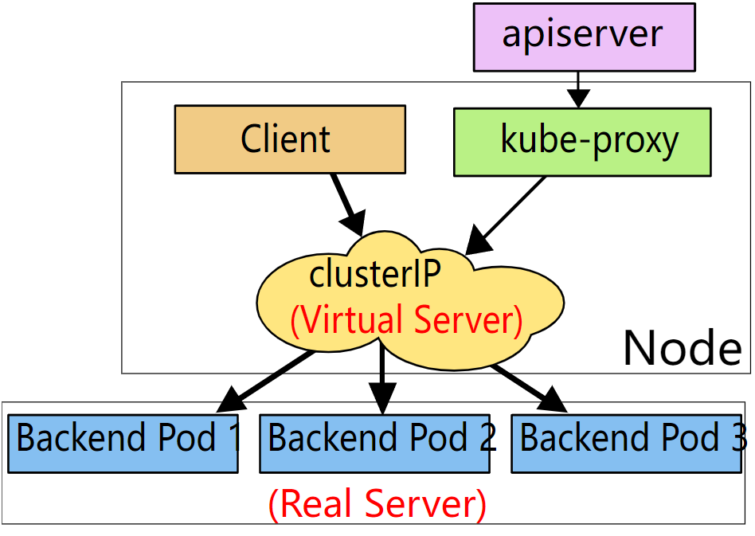
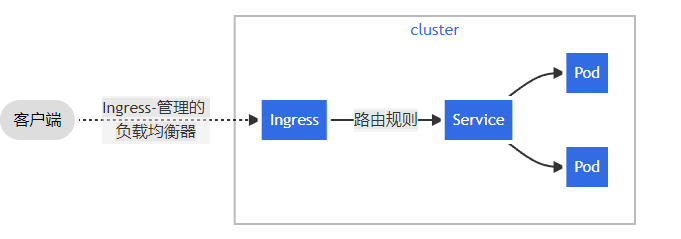

# Pod 的通信与负载均衡

[文档](https://kubernetes.io/zh/docs/concepts/services-networking/)

Pod 的通信存在几种形式：

- 同一个 Pod 内容器间的通信

    > 同一个 Pod 内的容器默认属于同一个网络命名空间，可以直接通过本地回路（`loopback`） 通信

- 同一节点上 Pod 间的通信
- 同一集群中不同节点上 Pod 间的通信

    > 不同 pod 之间的通信是由具体的网络设施来实现, kubernetes 的规范是 **节点上的 Pod 可以不通过 NAT 和其他任何节点上的 Pod 通信**

- Pod 与外部应用间的通信

    > 可以通过 Service 暴露，也可以自定义实现

[容器网路与生态](http://icyfenix.cn/immutable-infrastructure/network/cni.html#%E7%BD%91%E7%BB%9C%E6%8F%92%E4%BB%B6%E7%94%9F%E6%80%81)

## Service

Kubernetes 为每个 Pod 提供了唯一的 IP 地址，但是 Pod 是非永久性资源， 如果你使用 Deployment 来运行你的应用程序，则它可以动态创建和销毁 Pod，这样每次更新后的，Deployment 管理的 Pod 的 IP 地址会变。那么应该如何访问这样一组 Pod 呢？

Service 资源可以为一组 pod（通过标签选择） 提供单一不变的接入点的地址。

Service 有四种类型：

- `ClusterIP`: 通过集群的内部 IP 暴露服务，选择该值时服务只能够在集群内部访问。 这也是默认的 ServiceType。

    > 只能内部访问，不支持外部访问

    > 本质上，Service 是通过 `kube-proxy` 在集群中所有节点插入 [iptables](/docs/linux/firewall?id=iptables) 转发规则，将 <service_ip>: <service_port> 的请求转发到对应的 <pod_id>:<pod_port>

    !> iptables 的转发规则是根据 `<service_ip>:<service_port>` 转发的，只根据 `<service_ip>` 是无法转发的，因此 `ping <service_ip>` 是不通的

- `NodePort`: 通过每个节点上的 IP 和静态端口（NodePort）暴露服务, 通过请求 <集群任一节点 IP>:<NodePort>，你可以从集群的外部访问一个 NodePort 服务。

    > 端口数量有限，这种方式并不优雅

- `LoadBalancer`: 使用云提供商的负载均衡器向外部暴露服务。 外部负载均衡器可以将流量路由到自动创建的 NodePort 服务和 ClusterIP 服务上。

    > 需要基础设施支持

- `ExternalName`: 映射外部服务，用来包装外部服务

    > 内部访问外部服务，通过这个中间层，如果外部服务地址变化，只需要修改 Service 对象就行

    > 只能映射域名，不能映射 IP，如果要映射 IP，可以使用下面的 Headless Service

- `None`: Headless Service

    > 不会创建 iptables 规则

    > 主要用途是 DNS 会返回关联  Endpoint 的 ip 列表


示例 yaml 定义

```yaml
apiVersion: v1
kind: Service
metadata:
  name: my-service
spec:
  type: ClusterIP
  selector:
    app: MyApp
  ports:
    - protocol: TCP
      port: 80
      targetPort: 8080
    - protocol: TCP
      port: 443
      targetPort: 8443
```

相关命令:

```bash
# 根据 deployments 的 pod 选择器创建服务
kubectl expose depolyment <deployment_name> --port=80 --target-port=8080 --protocol=TCP --name=<service_name>
```

Service 对象本身并不会存储 Pod IP 列表，而且通过创建 `Endpoint` 资源来维护

如果 Service 中没有 `selector` 配置，则不会自动创建 `Endpoint`, 可以手动创建一个名称和 Service 一样的 Endpoint

Endpoint 示例 yaml 定义

```yaml
apiVersion: v1
kind: Endpoints
metadata:
  name: my-service
subsets:
  - addresses:
      - ip: 192.0.2.42
    ports:
      - port: 9376
```

## Service 代理模式

- userspace 代理模式

    kube-proxy 对于每个 Service，都在本地 Node 上监听一个对应的端口（随机选择），同时 iptables 规则把 ClusterIP 的请求转发到该端口，
    这样请求就到了 kube-proxy 中，kube-proxy 再进行转发

    > 缺点: 多了一层 kube-proxy，涉及内核态和用户态的切换，性能会有损耗

    

- iptables 代理模式

    > Kubernetes Servcie 默认代理模式

    通过 iptables 规则直接将 ClusterIP 的请求负载均衡地转发到对应的 Pod

    [iptables实现负载均衡](https://blog.csdn.net/ksj367043706/article/details/89764546)

    > 缺点: 当某个 Pod 故障时，iptables 规则无法通过重试做故障转移；可以通过 Pod 的 readinessProbe 及时去掉故障的 Pod

    


- IPVS 代理模式

    IPVS 工作在内核态，直接对接 `netfilter`, 相对于 iptables，可以实现更丰富的负载均衡模式；另外 iptables 的负载均衡规则是链表结构，如果 pod 数据较多时，性能较差，而 IPVS 是通过 ipset 来存储，更适合大集群

    


## 服务发现

创建 Service 属于**服务注册**环节，那么客户端要怎么获取 Service 的信息呢？

直接的思路是先创建 Service，然后把获取到的 Service Cluster IP 注入到客户端的配置中，再运行客户端。

Kubernetes 就提供了这样的方式，可以通过**环境变量**来发现服务，变量名是 `<SERVICE_NAME>_HOST` 和 `<SERVICE_NAME>_PORT`

这种方式存在两个缺点

1. 存在顺序依赖，需要在 Service 创建后再创建客户端 Pod；
2. 如果 Service 的 Cluster IP 发生了变化，客户端 Pod 需要销毁然后重新创建才能获取到新的 Service 信息

这个问题本质上就是个硬编码 IP 的问题，最常见的方案就是通过 DNS 来获取 IP

Kubernetes 内置的 kube-dns 组件就是个 DNS，而且是集群中所有 pod 的默认 dns（Kubernetes 通过修改每个容器的 `/etc/resolv.conf` 文件实现）

[文档](https://kubernetes.io/zh/docs/concepts/services-networking/service/#dns)

DNS 中的 Service 域名格式是 `<service-name>.<namespace>`, 如果是访问同一命名空间的服务可以省略 `.<namespace>`

> DNS 只能用来获取 Service Cluster IP，至于 Port 可以通过提前约定的方式来约束

## 通过 Ingress 暴露服务

向外部暴露服务，上面已经提到了 NodePort 和 LoadBalance 类型

这两个类型有个问题，每个 Service 都是不同的 IP 或者端口，这对于外部服务来说并不友好，这时需要一个网关来统一对外的入口

Ingress 就是一个不错的网关资源

Ingress 工作在第七层，可以通过路径进行转发



Ingress 是个 API 资源，但 Kubernetes 默认并没有 Ingress 控制器，所以还需要自行添加 Ingress 控制器，比如[ingress-nginx](https://kubernetes.github.io/ingress-nginx/deploy/)

> ingress-nginx 的大概实现思路是监听 Ingress 资源，创建 nginx pod 和 service，把 Ingress 规则转换成 nginx 规则，然后就可以通过 nginx service 的负载均衡 IP 来访问了


## References

- [Linux 网络虚拟化](http://icyfenix.cn/immutable-infrastructure/network/linux-vnet.html)